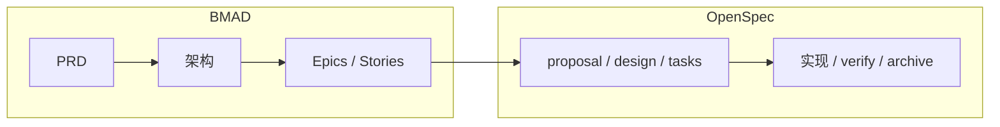
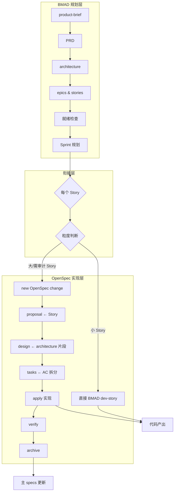

> 前置阅读
> - [BMAD 使用指南](/posts/BMAD%20使用指南%20-%20AI%20驱动敏捷开发框架)
> - [OpenSpec 使用指南](/posts/OpenSpec%20使用指南)

# BMAD 与 OpenSpec 配合使用指南

## 1. 引言：为何需要 BMAD 与 OpenSpec 配合

### 痛点

- **纯 BMAD**：规划到 Story 后，`dev-story` 直接产出代码，实现与 Story 之间缺少细粒度的 proposal、design、tasks，审计粒度粗，难以逐变更追溯。
- **纯 OpenSpec**：擅长单次变更的规格与实现闭环，但缺少 PRD、architecture、Epic/Story 等产品级规划，0-1 或复杂产品时规划和拆分不足。

### 组合价值

将 BMAD 作为**规划层**，OpenSpec 作为**实现层**，形成「产品规划 → Story 拆解 → 变更级规格 → 实现 → 归档」的完整链路。规划有 PRD/架构，实现有 proposal/design/tasks，可追溯、可审计。

### 适用场景

- 多人协作、需要评审与审计
- 产品/平台级项目，既要有 PRD/架构，又要实现可追溯
- 合规或治理要求较高的团队

---

## 2. 两者定位与互补性

| 维度 | BMAD | OpenSpec |
|------|------|----------|
| **定位** | 产品级规划与 Story 拆解 | 变更级规格、实现与归档 |
| **原子单位** | Epic、Story | Change（变更） |
| **产出** | PRD、architecture、epics、project-context | proposal、specs、design、tasks |
| **实现节奏** | Sprint、逐 Story | 按需新建变更、apply、archive |

互补关系：BMAD 不做 per-change 的 proposal/design/tasks；OpenSpec 不做 PRD/架构/Epic。两者在 **Story ↔ Change** 衔接。

---

## 3. 协作链路设计

### 整体流程

### 各阶段产出与依赖

| 阶段 | 产出 | 依赖 |
|------|------|------|
| BMAD 规划 | PRD、architecture、epics、project-context | 想法、需求 |
| 衔接 | Story 列表 | PRD、architecture |
| OpenSpec | proposal、design、tasks | Story、architecture 片段 |
| 实现 | 代码 | tasks |
| 归档 | 主 specs 更新、archive | verify 通过 |

### 决策点

- **何时用 OpenSpec**：Story 较大（多组件、多文件）或需要单独 proposal/design/tasks 审计时。
- **何时直接用 dev-story**：Story 小（1–3 个文件、1–2 小时）时，可跳过 OpenSpec。

---

## 4. 衔接层：Story → OpenSpec Change

### 映射关系

| BMAD Story | OpenSpec 产物 |
|------------|---------------|
| Story 描述 + AC | proposal |
| 相关 architecture 片段 | design |
| AC 拆分出的任务 | tasks |
| Story 涉及的需求变更 | specs delta |

### proposal 如何承接 Story

- 以 Story 描述为主体，说明目标与范围
- 补充 acceptance criteria
- 可选：简要 PRD 背景、所属 Epic 名称

### design 如何从 architecture 抽取

- 只写与本 Story 相关的架构片段（目录、API、数据流等）
- 不复制整份 architecture
- 如有新增或调整，在 design 中明确说明

### tasks 如何从 AC 拆分

- 按 acceptance criteria 拆成可执行任务
- 单任务建议 0.5–2 小时
- 按可交付物拆分，便于验收

---

## 5. 上下文与配置一致性

| 来源 | 作用 | 维护 |
|------|------|------|
| BMAD project-context | dev-story、code-review 加载 | `generate-project-context` 或手动 |
| OpenSpec config.yaml | proposal/design/tasks 生成时注入 | 手动 |

**建议**：以 BMAD 的 project-context 为准，将核心约定（技术栈、目录、编码规范）同步到 `openspec/config.yaml` 的 `context`，保持两套上下文一致。

---

## 6. 实践要点

### Story 粒度判断

| 情况 | 建议 |
|------|------|
| 小 Story（1–3 文件、1–2 小时） | 直接用 BMAD dev-story |
| 大 Story（多组件、多文件、需评审） | 转为 OpenSpec Change |
| 需更新主 spec | 用 OpenSpec（archive 时 delta 合并） |
| 跨 Epic 横切变更 | 用 OpenSpec（以变更为单位更清晰） |

### 对话与命名策略

- 每个 Story 或 OpenSpec Change 建议**新开对话**，避免上下文过长
- OpenSpec 的 change 名可与 Story ID 对应，如 `story-auth-001`，便于追溯

---

## 7. 边界情况与应对

### Scope creep

实现中 scope 扩大：回到 BMAD，更新 PRD 或 Story，再开新 OpenSpec Change，或拆成多个 Change 分别实现。

### 多 Story 合并为一个 Change

若干小 Story 涉及同一组文件时，可合并为一个 OpenSpec Change，在 proposal 中写明对应多个 Story ID。

### 架构在实现中需调整

先更新 BMAD 的 architecture，再在 OpenSpec 的 design 中说明本次变更对架构的修正，保证文档一致。

---

## 8. 纯 BMAD / 纯 OpenSpec / 组合 对比

| 维度 | 纯 BMAD | 纯 OpenSpec | BMAD + OpenSpec |
|------|---------|-------------|-----------------|
| **规划深度** | PRD、架构、Epics 完整 | 无产品级规划，只有 proposal/design | 两者都有 |
| **实现审计** | 粗（Story → 代码） | 细（proposal/design/tasks → 代码） | 细（Story → Change → 代码） |
| **上手成本** | 中 | 低 | 高 |
| **适用** | 产品/平台、需 Sprint 节奏 | 单点变更、快速迭代 | 复杂产品、需审计与追溯 |
| **心智负担** | 一套流程 | 一套流程 | 两套流程，需衔接 |

**取舍**：
- **纯 BMAD**：简单，但实现与 Story 之间审计粒度粗
- **纯 OpenSpec**：轻量，但 0-1 或复杂产品缺少产品级规划
- **组合**：规划严谨、审计细，适合对可追溯性要求高的场景

---

## 9. 总结与建议

### 适用人群

- 多人协作、需要评审与审计
- 产品/平台级项目
- 对实现可追溯性有明确要求

### 起步建议

1. 先按 BMAD 走通一条 Epic（PRD → 架构 → Epics → Stories）
2. 选 1–2 个大 Story 试点 OpenSpec 衔接
3. 确认 project-context 与 config.yaml 的 context 已对齐

### 延伸

社区中有类似 `main-workflow-router` 的思路：根据复杂度自动路由（简单 → OpenSpec，复杂 → BMAD），可作为进阶探索方向。
