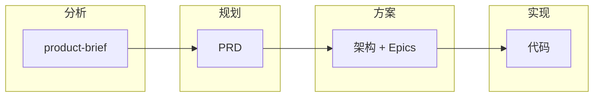
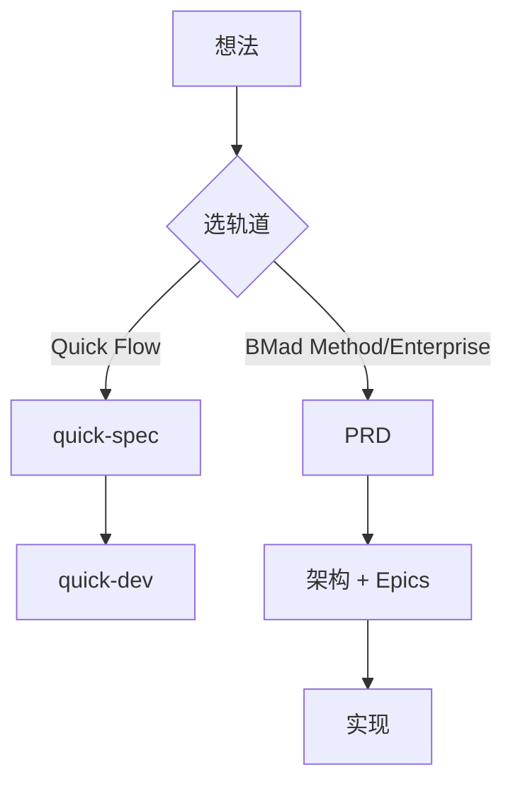

> 参考文档（以官方最新为准）
> 1. [BMAD 官方仓库](https://github.com/bmad-code-org/BMAD-METHOD)
> 2. [BMAD 官方文档](https://docs.bmad-method.org/)
> 3. [Workflow 地图](https://docs.bmad-method.org/reference/workflow-map/)

# BMAD 使用指南

## BMAD 是什么

**BMAD（Build More Architect Dreams）** 是一套 AI 驱动的敏捷开发框架，让 AI 成为**协作伙伴**而不是「替你写代码的黑盒」：通过结构化工作流，从想法到 PRD、架构、Epic、Story，再到代码实现，每个阶段都有明确产出，AI 基于这些产出继续工作。

核心特点：

- **上下文串联**：每阶段产出是下一阶段的输入，AI 不再凭空发挥
- **按规模选路径**：修 bug 用 Quick Flow（2 步）；做产品用 BMad Method（PRD→架构→实现）
- **100% 开源**，支持 Cursor、Claude Code、Codex、GitHub Copilot 等 IDE

---

## 核心概念

| 概念 | 是什么 | 干什么 |
|------|--------|--------|
| **Agent** | 带角色的 AI 化身（PM、架构师、开发、SM 等） | 以该角色回答问题、执行对应 Workflow；`/bmad-agent-bmm-pm` 加载 |
| **Workflow** | 有输入、步骤、产出的结构化流程 | 如 `create-prd` 产出 PRD.md，`dev-story` 产出代码；直接 `/bmad-bmm-create-prd` 触发 |
| **Context** | `project-context.md`，项目「实现宪法」 | 记录技术栈、编码约定；`dev-story`、`code-review` 等会自动加载 |
| **产出物** | 各阶段产生的文档、文件 | product-brief → PRD → architecture → epics/stories → 代码，形成依赖链 |

产出物流转示意：



---

## 整体使用逻辑

### 四阶段

分析（可选）→ 规划（PRD/tech-spec）→ 方案（架构、拆 Story）→ 实现（Sprint、逐 Story 开发）。每阶段产出作为下一阶段输入。

### 三种轨道：选哪一种取决于项目规模

| 轨道 | 适用场景 | 流程 |
|------|----------|------|
| **Quick Flow** | 修 bug、小改动、范围清晰 | quick-spec → quick-dev（跳过 PRD 和架构） |
| **BMad Method** | 产品、平台、复杂功能 | PRD → 架构 → Epics → 实现就绪检查 → Sprint → 逐 Story |
| **Enterprise** | 合规、多租户、大型系统 | 同上 + 安全、DevOps 等 |



---

## 怎么用

### 安装

Node.js ≥ 20，项目根目录执行：

```bash
npx bmad-method install
```

安装后会有 `_bmad/`（配置）和 `_bmad-output/`（产出物）。选择 AI 工具（如 Cursor）、模块（BMM 必选）。缓存旧版可试 `npx bmad-method@latest install`。

### 入口：/bmad-help

不必背流程，直接问 `/bmad-help` 或 `/bmad-help 我有个 SaaS 想法，从哪里开始？`，会按当前项目状态推荐下一步。每个 Workflow 结束时也会自动提示下一步。

### 两种使用方式

#### Quick Flow 是什么

**概念**：跳过 PRD 和架构，只做「快速规格 + 实现」两步。适合范围明确、改动点少、不需要大规划的变更。产出只有 `tech-spec.md`（本质是一个精简的 story 文件），AI 按它直接写代码。

**流程**：`quick-spec` → `quick-dev`

| 步骤 | 命令 | 产出 |
|------|------|------|
| 1 | `/bmad-bmm-quick-spec` | tech-spec.md |
| 2 | `/bmad-bmm-quick-dev` | 代码 |

**实战举例：修一个登录接口的 bug**

> 登录接口在用户名含特殊字符时 500 报错。新对话运行 `/bmad-bmm-quick-spec`，描述：用户输入 `test@user` 时接口抛异常，需在 `AuthService.validate()` 中增加字符转义或白名单校验。产出 tech-spec 后，`/bmad-bmm-quick-dev` 按 spec 改代码，完成修复。

---

#### BMad Method 是什么

**概念**：从需求到实现走完整链路：先写 PRD 定「做什么」，再写架构定「怎么做」，再拆成 Epic 和 Story 逐项实现。每阶段有正式文档，可追溯、可评审，适合产品级、多模块、多人协作的场景。

**流程**：PRD → 架构 → Epics → 实现就绪检查 → Sprint 规划 → 逐 Story 实现（create-story → dev-story → code-review）→ Epic 复盘

| 阶段 | 命令 | 产出 |
|------|------|------|
| 规划 | `/bmad-bmm-create-prd` | PRD.md |
| 方案 | `/bmad-bmm-create-architecture` | architecture.md |
| 拆分 | `/bmad-bmm-create-epics-and-stories` | epics/*.md |
| 检查 | `/bmad-bmm-check-implementation-readiness` | PASS/FAIL |
| 迭代 | `/bmad-bmm-sprint-planning` | sprint-status.yaml |
| 开发 | `/bmad-bmm-create-story` + `/bmad-bmm-dev-story` + `/bmad-bmm-code-review` | 代码 |
| 复盘 | `/bmad-bmm-retrospective` | 经验总结 |


**实战举例：做一个「任务管理 SaaS」MVP**

> 1. `/bmad-bmm-create-prd`：目标用户是个人/小团队，MVP 功能是登录、创建/编辑/删除任务、按标签筛选。2. `/bmad-bmm-create-architecture`：前后端分离，React + Node，REST API，SQLite 本地存储。3. `/bmad-bmm-create-epics-and-stories`：拆成 Epic1 用户认证、Epic2 任务 CRUD、Epic3 标签筛选。4. 实现就绪检查通过后，Sprint 规划选 Epic1，对每个 Story 执行 create-story → dev-story → code-review，Epic 完成后 retrospective。

---

建议：每个 Workflow 开新对话，避免上下文过长。

---

## 场景与流程

### 案例一：现有项目中开发新模块

**场景**：已有 VitePress 博客站，要加一个「赞助者列表」模块，需要新页面、新组件、新数据源，但要沿用现有目录结构、技术栈和样式约定。

**要点**：架构已定（VitePress + Vue 3），需求是增量。需要让 AI 遵循现有项目约定，在既有框架内实现新模块。

**流程**：

1. **先补 project-context**：运行 `/bmad-bmm-generate-project-context`，从现有代码中提取技术栈、目录约定、组件风格，生成 `_bmad-output/project-context.md`。后续 dev-story、code-review 会自动加载。
2. **PRD**：`/bmad-bmm-create-prd`，描述「赞助者列表」模块：展示赞助者、按金额排序、支持展示/隐藏、数据来自 `docs/public/sponsors.json`。
3. **架构（增量）**：`/bmad-bmm-create-architecture`，说明在现有 VitePress 基础上增加 `docs/sponsor.md`、`docs/.vitepress/theme/components/SponsorList.vue`，沿用现有主题和布局。
4. **Epics & Stories**：`/bmad-bmm-create-epics-and-stories`，拆成 Epic1（页面与路由）、Epic2（SponsorList 组件）、Epic3（数据绑定）。
5. **就绪检查** → **Sprint 规划** → 对每个 Story 执行 create-story → dev-story → code-review。
6. Epic 完成后 retrospective。

**注意**：project-context 是「现有项目 + 新模块」场景的核心，否则 AI 容易偏离既有约定。

---

### 案例二：从 0 到 1 搭建新系统

**场景**：做一个全新的「任务管理 SaaS」：新需求、新架构、新代码库，从零开始。

**要点**：无现有约束，需求、技术选型、目录、API 都要从头设计。

**流程**：

1. **（可选）分析**：`/bmad-bmm-create-product-brief` 写产品简报，明确目标用户、差异化、MVP 边界。
2. **PRD**：`/bmad-bmm-create-prd`，定义目标用户（个人/小团队）、核心功能（登录、任务 CRUD、标签筛选、多端同步）、MVP 范围、非目标。
3. **架构**：`/bmad-bmm-create-architecture`，技术选型（React + Node + PostgreSQL）、目录结构、API 设计、鉴权、部署方式。
4. **project-context**：`/bmad-bmm-generate-project-context` 从架构文档生成，或手动创建，锁定技术栈与实现约定。
5. **Epics & Stories**：`/bmad-bmm-create-epics-and-stories`，拆成 Epic1 用户认证、Epic2 任务 CRUD、Epic3 标签筛选、Epic4 多端同步（MVP 可暂不做）。
6. **就绪检查**：`/bmad-bmm-check-implementation-readiness`，确认 PRD、架构、Story 一致。
7. **Sprint 规划**：`/bmad-bmm-sprint-planning`，选择要做的 Epic，生成 sprint-status.yaml。
8. **逐 Story 实现**：每个 Story 新对话，create-story → dev-story → code-review。
9. **Epic 复盘**：Epic 完成后 `/bmad-bmm-retrospective`。

**注意**：0 到 1 时架构阶段最重要，后续实现都依赖它；project-context 可在架构完成后生成，也可与架构同步维护。

---

## 常用命令速查

| 用途 | 命令 |
|------|------|
| 智能引导 | `/bmad-help` |
| 创建 PRD | `/bmad-bmm-create-prd` |
| 创建架构 | `/bmad-bmm-create-architecture` |
| 拆 Epic | `/bmad-bmm-create-epics-and-stories` |
| 实现就绪检查 | `/bmad-bmm-check-implementation-readiness` |
| Sprint 规划 | `/bmad-bmm-sprint-planning` |
| 创建 Story | `/bmad-bmm-create-story` |
| 实现 Story | `/bmad-bmm-dev-story` |
| 代码审查 | `/bmad-bmm-code-review` |
| 生成 project-context | `/bmad-bmm-generate-project-context` |
| Quick Flow 规格 | `/bmad-bmm-quick-spec` |
| Quick Flow 实现 | `/bmad-bmm-quick-dev` |

---

## 扩展与参考

### 官方模块

| 模块 | 代码 | 用途 |
|------|------|------|
| BMad Method | bmm | 核心，34+ workflows（安装时默认选） |
| BMad Builder | bmb | 自定义 Agent、Workflow、模块 |
| Test Architect | tea | 测试策略、ATDD、Playwright、P0–P3 优先级 |
| Game Dev Studio | gds | 游戏开发（Unity、Unreal、Godot） |
| Creative Intelligence Suite | cis | 头脑风暴、设计思维、SCAMPER 等 |

事后追加：`npx bmad-method install --action update --modules bmm,tea`

### 常见问题

- **是否必须做架构？** Quick Flow 可跳过；BMad Method / Enterprise 需要。
- **中途改需求？** 加载 SM Agent，运行 `/bmad-bmm-correct-course`。
- **卸载？** v6 起支持 `npx bmad-method uninstall`。

### 参考链接

- [官方文档](https://docs.bmad-method.org/)
- [GitHub 仓库](https://github.com/bmad-code-org/BMAD-METHOD)
- [Roadmap](https://docs.bmad-method.org/roadmap/)
