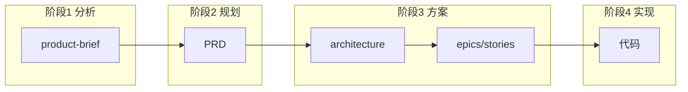
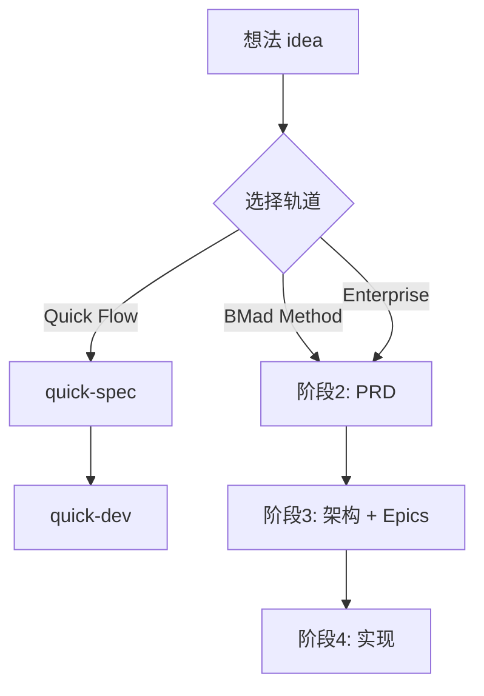

> 参考文档（以官方最新为准）
> 1. [BMAD 官方仓库](https://github.com/bmad-code-org/BMAD-METHOD)
> 2. [BMAD 官方文档](https://docs.bmad-method.org/)
> 3. [Workflow 地图](https://docs.bmad-method.org/reference/workflow-map/)
> 4. [升级至 v6](https://docs.bmad-method.org/how-to/upgrade-to-v6/)（当前为 v6 系列，含 34+ workflows、12+ agents）

# BMAD 使用指南：AI 驱动敏捷开发框架

## 第一部分：基础（Why & What）

### 1. 引言：为什么需要 BMAD

传统 AI 编程工具（如通用 Copilot、ChatGPT）倾向于「替你思考」——你给需求，它给代码。这种模式在简单任务上效率高，但面对复杂项目时，AI 往往缺乏上下文，产出平均化、不一致，难以形成可维护的架构。

**BMAD（Build More Architect Dreams）** 的定位不同：它让 AI 成为**协作伙伴**，通过结构化的工作流引导你完成思考，而不是替代你的判断。BMAD 提供：

- 从点子到上线的完整生命周期支持
- 适配不同规模：从修 bug 到企业级系统
- 100% 开源，无付费墙、无封闭社区

如果你希望用 AI 辅助产品规划、架构设计、迭代实现，而不是「扔需求拿代码」，BMAD 值得一试。

---

### 2. 核心理念

BMAD 建立在四个理念之上。

**人机协作（Human-in-the-loop）**  
AI 负责引导流程、回答问题、执行任务；人负责决策、取舍和方向。两者配合，而不是 AI 单方输出。

**上下文工程（Context-Engineered）**  
每个阶段产生文档（PRD、架构、Epic、Story 等），这些文档成为下一阶段的输入。AI 始终基于「你已写好的东西」继续工作，而不是凭空猜测。

**规模化自适应（Scale-Domain-Adaptive）**  
根据项目复杂度选择不同轨道：小改动用 Quick Flow（仅 tech-spec）；产品级用 BMad Method（PRD + 架构 + UX）；企业级用 Enterprise（加上安全、DevOps 等）。

**自然语言驱动**  
通过斜杠命令（如 `/bmad-help`、`/bmad-bmm-create-prd`）和自然语言描述意图即可驱动整个流程，无需记忆复杂命令。

一句话概括：**BMAD 用结构化的上下文和流程，让 AI 在合适的时候做合适的事，而你把控方向和决策。**

---

## 第二部分：构成单元（What & How）

### 3. Agent（智能体）

**概念**

Agent 是 BMAD 中的「角色化身」——每个 Agent 有固定的职责、领域知识和可用的工作流。例如 PM Agent 负责需求与 PRD，Architect Agent 负责架构，DEV Agent 负责实现。AI 在加载某个 Agent 后，会以该角色的视角回答问题、执行工作流。

与「通用 AI 助手」不同，Agent 是**有边界**的：它知道自己的职责范围，不会越权做其他角色的事。

**实操**

加载 Agent 使用斜杠命令，例如：

```
/bmad-agent-bmm-pm      # 产品经理
/bmad-agent-bmm-architect   # 架构师
/bmad-agent-bmm-dev     # 开发
/bmad-agent-bmm-sm      # Scrum Master
/bmad-agent-bmm-analyst # 分析师
```

加载后，当前对话会以该 Agent 的 persona 运行，你可以直接提问或让它执行该 Agent 可用的工作流。切换 Agent 时，开启新对话并加载新 Agent 即可。

**Party Mode**：可在同一对话中引入多个 Agent 进行协作讨论，适合复杂决策场景。

常见 Agent 速览：

| Agent | 职责 | 典型 Workflow |
|-------|------|---------------|
| PM（John） | 需求、PRD、Epic、Story | create-prd、create-epics-and-stories |
| Architect | 架构、实现就绪检查 | create-architecture、check-implementation-readiness |
| DEV | 实现、Code Review | dev-story、code-review |
| SM（Scrum Master） | Sprint、Story 拆分、回顾 | sprint-planning、create-story、retrospective |
| Analyst | 调研、头脑风暴 | research、brainstorming |
| UX | 用户体验设计 | create-ux-design |

---

### 4. Workflow（工作流）

**概念**

Workflow 是 BMAD 中的**有步骤、有产出的结构化流程**。每个 Workflow 有明确输入、步骤和输出文件。例如 `create-prd` 的输入是产品 brief 或你的描述，产出是 `PRD.md`；`dev-story` 的输入是 story 文件，产出是代码实现。

Workflow 与 Agent 的关系：每个 Workflow 通常由特定 Agent 负责执行，但你可以直接通过斜杠命令触发，无需先加载 Agent。

**实操**

两种触发方式：

1. **直接斜杠命令**：`/bmad-bmm-create-prd` —— 适合知道要跑什么 Workflow 时
2. **先加载 Agent，再从菜单选**：加载 PM Agent 后，在对话中说明要创建 PRD，Agent 会引导你完成

示例：从 idea 到 PRD 的基本流 —— 你描述产品想法，运行 `/bmad-bmm-create-prd`，AI 通过问答产出 PRD；接着运行 `/bmad-bmm-create-architecture` 产出架构文档。

---

### 5. 上下文（Context）

**概念**

`project-context.md` 是项目的「实现宪法」——记录技术栈、编码约定、目录结构等，确保所有 Agent 在实现时遵循同一套规则。没有它，AI 容易各自为政；有了它，PRD、架构、Story 的实现会保持风格一致。

`project-context.md` 会被 `dev-story`、`code-review`、`create-architecture` 等工作流自动加载，作为实现和评审的参考。

**实操**

创建方式有三种：

1. **手动**：在 `_bmad-output/` 下创建 `project-context.md`，写入技术栈和实现规则
2. **架构完成后生成**：运行 `/bmad-bmm-generate-project-context`，从架构文档和代码中提取并生成
3. **已有项目**：同样用 `generate-project-context` 分析现有代码库

典型内容结构：

```markdown
## Technology Stack & Versions
- Node.js 20.x, TypeScript 5.3, React 18.2
- 状态：Zustand（不用 Redux）
- 测试：Vitest、Playwright

## Critical Implementation Rules
- 组件放在 /src/components/，co-locate .test.tsx
- API 调用统一用 apiClient 单例，不用 fetch
- 严格模式，禁止隐式 any
```

---

### 6. 产出物（Artifacts）

**概念**

产出物是各阶段产生的文档和文件，是上下文在阶段间传递的载体：

| 阶段 | 典型产出物 |
|------|------------|
| Analysis | `product-brief.md`、`brainstorming-report.md` |
| Planning | `PRD.md`、`ux-spec.md` |
| Solutioning | `architecture.md`、`epics/*.md`、`story-[slug].md` |
| Implementation | 代码、`sprint-status.yaml` |

每一阶段的产出物会成为下一阶段的输入，形成清晰的依赖链。



**实操**

安装 BMAD 后，产出物默认落在 `_bmad-output/` 下，目录结构类似：

```
your-project/
├── _bmad/                    # BMAD 配置（agents、workflows）
├── _bmad-output/
│   ├── planning-artifacts/
│   │   ├── PRD.md
│   │   ├── architecture.md
│   │   └── epics/
│   ├── implementation-artifacts/
│   │   └── sprint-status.yaml
│   └── project-context.md
└── ...
```

初次使用时，可打开 `_bmad-output/` 查看各阶段产生的文件，建立对流程的直观认识。

---

## 第三部分：整体流程（How）

### 7. 四阶段模型

**概念**

BMAD 将开发拆成四个阶段：

- **Phase 1：Analysis（分析）** —— 可选。探索问题、调研、头脑风暴、写产品简报
- **Phase 2：Planning（规划）** —— 必做。定义要做什么、为谁做，产出 PRD 或 tech-spec
- **Phase 3：Solutioning（方案）** —— BMad Method / Enterprise 必做。设计架构、拆成 Epic 和 Story、做实现就绪检查
- **Phase 4：Implementation（实现）** —— 必做。Sprint 规划、按 Story 实现、Code Review、回顾

每个阶段产出物成为下一阶段的输入，形成有序流水线。

**实操**

在真实项目中的大致对应：

- Analysis：1–2 天，用于新产品/新方向探索
- Planning：2–5 天，取决于 PRD 复杂度
- Solutioning：2–5 天，架构 + 拆 Story + 检查
- Implementation：按 Sprint 迭代，每个 Story 约 0.5–2 天

小型项目可省略 Analysis，直接从 Planning 或 Quick Flow 开始。

---

### 8. 三种规划轨道

**概念**

BMAD 提供三种轨道，按项目复杂度选择：

| 轨道 | 适用场景 | 产出物 |
|------|----------|--------|
| **Quick Flow** | Bug 修复、小功能、范围清晰（1–15 stories） | 仅 tech-spec |
| **BMad Method** | 产品、平台、复杂功能（10–50+ stories） | PRD + 架构 + UX |
| **Enterprise** | 合规、多租户、大型系统（30+ stories） | 上述 + 安全 + DevOps |

选择轨道决定了你要跑哪些阶段、产生哪些文档。

**实操**

选择轨道可按以下思路：

| 场景 | 建议轨道 |
|------|----------|
| 修一个 bug、加一个小配置、改一行文案 | Quick Flow |
| 做一个新功能模块、新页面、新微服务 | BMad Method |
| 做多租户、合规审计、复杂部署、安全评审 | Enterprise |

若不确定，可先用 BMad Method；若项目很小、范围极清晰，再改用 Quick Flow。轨道决定「要不要写 PRD」「要不要写架构」「要不要拆 Epic」。



---

### 9. Workflow 地图

**概念**

Workflow 地图展示了各阶段下可用的 Workflow 及依赖关系：

**Phase 1（Analysis，可选）**  
- `brainstorming`（`/bmad-brainstorming`）— 头脑风暴，产出 brainstorming-report.md（来自 CIS 模块）  
- `research`（`/bmad-bmm-research`）— 市场/技术调研  
- `create-product-brief`（`/bmad-bmm-create-product-brief`）— 产品简报，产出 product-brief.md  

**Phase 2（Planning）**  
- `create-prd` — 产品需求文档，产出 PRD.md  
- `create-ux-design` — UX 设计，产出 ux-spec.md  

**Phase 3（Solutioning）**  
- `create-architecture` — 架构文档（含 ADR），产出 architecture.md  
- `create-epics-and-stories` — 拆 Epic 和 Story  
- `check-implementation-readiness` — 实现前检查（PASS/CONCERNS/FAIL）  

**Phase 4（Implementation）**（注：Phase 4 全自动化正在开发中）  
- `sprint-planning` — 初始化 sprint-status.yaml  
- `create-story` — 从 Epic 生成 story-[slug].md  
- `dev-story` — 实现 Story  
- `code-review` — 代码审查  
- `correct-course` — 处理 mid-sprint 变更  
- `retrospective` — Epic 完成后复盘  
- `automate` — Epic 完成后生成 E2E 测试  

**Quick Flow**  
- `quick-spec` — 快速规格，产出 tech-spec.md  
- `quick-dev` — 按 tech-spec 实现  

典型依赖：PRD → 架构 → Epics & Stories → 实现就绪检查 → Sprint 规划 → 逐 Story 实现。

**实操**

BMad Method 从 0 到 1 的推荐路径（概念图）：


每个 Phase 4 的 Workflow 建议在**新对话**中运行，以保持上下文干净。

---

## 第四部分：实战（Do）

### 10. 环境与安装

**概念**

BMAD 以 npm 包形式提供，通过 CLI 安装到项目中，会生成 `_bmad/` 和 `_bmad-output/`，并与 Cursor、Claude Code、Codex、GitHub Copilot、CodeBuddy 等 AI IDE 集成（通过 skills / prompts）。

**实操**

环境要求：Node.js ≥ 20。

```bash
# 在项目根目录执行
npx bmad-method install
```

> 若因缓存拿到旧版本，可尝试 `npx bmad-method@latest install`。

安装过程会提示：

- 选择 AI 工具（如 Cursor、Claude Code）
- 选择模块（BMM 必选，其余按需）
- 是否使用英文/中文输出

安装完成后，确认目录：

```bash
ls -la _bmad/ _bmad-output/
```

应看到 `_bmad/` 下有 agents、workflows 等，`_bmad-output/` 安装后最初为空。

**非交互式安装**（CI/CD 或脚本）：

```bash
npx bmad-method install \
  --directory /path/to/project \
  --modules bmm \
  --tools cursor \
  --yes
```

---

### 11. 入口：/bmad-help

**概念**

`/bmad-help` 是 BMAD 的智能入口：根据当前项目状态（是否已有 PRD、架构、Story 等）推荐下一步该做什么。你不必记忆 Workflow 顺序，问它即可。

**实操**

两种用法：

1. **直接询问**：`/bmad-help` —— 根据 `_bmad-output/` 下现有文件判断当前阶段，给出下一步建议  
2. **带上下文**：`/bmad-help 我有个 SaaS 想法，功能都想好了，从哪里开始？` —— 会结合你的描述给出路径  

示例回复（简化）：

> 你还没有 PRD，建议先运行 `/bmad-bmm-create-prd`。完成后运行 `/bmad-bmm-create-architecture`，然后 `/bmad-bmm-create-epics-and-stories`。

每个 Workflow 结束时，BMAD 也会自动提示下一步，相当于内置了 `/bmad-help` 的逻辑。

**注意**：`/bmad-help` 会扫描项目文件，因此需在安装 BMAD 的项目目录下运行，并确保 `_bmad-output/` 存在。

---

### 12. 从 0 到 1 的实战路径

**概念**

两条主要路径：

- **Quick Flow**：适合小范围、明确的改动，跳过 PRD 和架构
- **BMad Method**：适合产品级功能，完整走 PRD → 架构 → Epics & Stories → 实现

**实操**

**Quick Flow 路径：**

1. 运行 `/bmad-bmm-quick-spec`，描述你要做的改动
2. 产出 `tech-spec.md`
3. 运行 `/bmad-bmm-quick-dev`，按 tech-spec 实现

**BMad Method 路径：**

1. （可选）`/bmad-bmm-create-product-brief` → `product-brief.md`
2. `/bmad-bmm-create-prd` → `PRD.md`
3. `/bmad-bmm-create-architecture` → `architecture.md`
4. `/bmad-bmm-create-epics-and-stories` → `epics/` 下的 Story 文件
5. `/bmad-bmm-check-implementation-readiness` → 通过则进入实现
6. `/bmad-bmm-sprint-planning` → `sprint-status.yaml`
7. 对每个 Story 循环：`/bmad-bmm-create-story` → `/bmad-bmm-dev-story` → `/bmad-bmm-code-review`
8. Epic 完成后 `/bmad-bmm-retrospective`

建议：每个 Workflow 在新对话中运行，避免上下文混杂。

**完整示例（BMad Method）**：假设你要做一个「任务管理 SaaS 的 MVP」：

1. 新对话，`/bmad-bmm-create-prd` —— 描述用户、核心功能、MVP 范围，产出 PRD.md  
2. 新对话，`/bmad-bmm-create-architecture` —— 技术选型、目录结构、API 设计，产出 architecture.md  
3. 新对话，`/bmad-bmm-create-epics-and-stories` —— 拆成 Epic1（用户认证）、Epic2（任务 CRUD）等，产出 epics/*.md  
4. 新对话，`/bmad-bmm-check-implementation-readiness` —— 检查 PRD/架构/Story 是否一致  
5. 新对话，`/bmad-bmm-sprint-planning` —— 选择要做的 Epic，生成 sprint-status.yaml  
6. 对每个 Story：新对话，`/bmad-bmm-create-story` 生成 story 文件 → 新对话，`/bmad-bmm-dev-story` 实现 → 新对话，`/bmad-bmm-code-review` 审查  
7. Epic 完成后，`/bmad-bmm-retrospective` 复盘  

---

### 13. 常用命令速查

**概念**

Agent 与 Workflow 有对应关系：PM 负责 prd、epics-and-stories；Architect 负责 create-architecture、check-implementation-readiness；SM 负责 sprint-planning、create-story、retrospective；DEV 负责 dev-story、code-review。

**实操**

| 阶段/用途 | 命令 | 说明 |
|-----------|------|------|
| 智能引导 | `/bmad-help` | 根据状态推荐下一步 |
| Planning | `/bmad-bmm-create-prd` | 创建 PRD |
| Solutioning | `/bmad-bmm-create-architecture` | 创建架构 |
| Solutioning | `/bmad-bmm-create-epics-and-stories` | 拆 Epic 和 Story |
| Solutioning | `/bmad-bmm-check-implementation-readiness` | 实现就绪检查 |
| Implementation | `/bmad-bmm-sprint-planning` | 初始化 Sprint |
| Implementation | `/bmad-bmm-create-story` | 从 Epic 生成 Story 文件 |
| Implementation | `/bmad-bmm-dev-story` | 实现 Story |
| Implementation | `/bmad-bmm-code-review` | 代码审查 |
| Context | `/bmad-bmm-generate-project-context` | 生成 project-context（Analyst 负责） |
| Quick Flow | `/bmad-bmm-quick-spec` | 快速规格 |
| Quick Flow | `/bmad-bmm-quick-dev` | 按规格实现 |

Agent 加载命令：

```
/bmad-agent-bmm-pm
/bmad-agent-bmm-architect
/bmad-agent-bmm-dev
/bmad-agent-bmm-sm
/bmad-agent-bmm-analyst
/bmad-agent-bmm-ux
```

---

## 第五部分：扩展（Extend）

### 14. 官方模块

**概念**

BMAD 以模块化扩展，核心是 BMM（BMad Method），其余模块针对特定领域：

| 模块 | 代码 | 用途 |
|------|------|------|
| BMad Method | bmm | 核心，34+ Workflows |
| BMad Builder | bmb | 自定义 Agent 和 Workflow |
| Test Architect | tea | 测试策略、自动化、ATDD |
| Game Dev Studio | gds | 游戏开发（Unity、Unreal、Godot） |
| Creative Intelligence Suite | cis | 头脑风暴、设计思维、创新 |

**实操**

安装时选择模块，或事后追加：

```bash
npx bmad-method install --action update --modules bmm,tea
```

若做游戏，可加 `gds`；若做早期创意探索，可加 `cis`。

**模块能力速览**：

- **BMB（BMad Builder）**：创建自定义 Agent、Workflow、模块，支持 YAML 配置和 npm 发布  
- **TEA（Test Architect）**：P0–P3 测试优先级、ATDD、自动化、Playwright、MCP 集成  
- **GDS（Game Dev Studio）**：Unity、Unreal、Godot，GDD 生成、21+ 游戏类型支持  
- **CIS（Creative Intelligence Suite）**：SCAMPER、逆向头脑风暴、设计思维、创新策略  

---

### 15. 自定义与配置

**概念**

`project-context.md` 是主要自定义入口，用于注入技术栈和实现规则。BMAD 也支持非交互式安装参数，便于 CI/CD 和团队统一环境。

**实操**

**project-context 编写建议**：优先写「AI 容易忽略的约定」——非标准目录、特殊命名、禁止的模式等。通用实践（如用 TypeScript、写单元测试）可简要带过。

**何时更新 project-context**：发现 Agent 行为不符合预期时；实现中形成新约定时；架构变更时。可手动编辑或重新运行 `generate-project-context`。

**非交互式安装常用参数**：

```bash
npx bmad-method install \
  --directory /path/to/project \
  --modules bmm \
  --tools cursor \
  --output-folder _bmad-output \
  --yes
```

与 Cursor 集成：安装时选择 Cursor，BMAD 会写入 Cursor 可识别的 skills/prompts；与 Claude Code 集成同理。

---

## 第六部分：进阶与总结

### 16. 常见问题与最佳实践

**概念**

常见疑问包括：是否一定要做架构？中途改需求怎么办？什么时候该开新对话？

**实操**

**是否一定要做架构？**  
Quick Flow 可跳过；BMad Method 和 Enterprise 需要。架构让实现有据可依，避免 AI 各自发挥。

**中途改需求？**  
加载 SM Agent，运行 `/bmad-bmm-correct-course`，按提示调整计划或重新规划。

**何时开新对话？**  
建议每个 Workflow 开新对话，尤其是 create-prd、create-architecture、dev-story 等。避免上下文过长导致混乱。

**卸载**：v6 起支持 `npx bmad-method uninstall`，可按需移除 BMAD 组件。

**最佳实践**：先用 `/bmad-help` 确认下一步；规划阶段多花时间，实现阶段按 Story 小步迭代；定期更新 `project-context.md` 以反映最新约定。

---

### 17. 总结与延伸

**概念**

BMAD 适合：需要从需求到实现全链路 AI 辅助、希望保持架构一致性和可追溯性的项目。不适合：极简单的一次性脚本、完全不需要规划的临时任务。

**实操**

- 文档：https://docs.bmad-method.org/
- 社区：Discord、GitHub Discussions
- 仓库：https://github.com/bmad-code-org/BMAD-METHOD
- Roadmap：https://docs.bmad-method.org/roadmap/

后续可关注：Universal Skills Architecture、Phase 1–3 优化、Dev Loop Automation 等方向。

---

## 总结

BMAD 通过 **Agent + Workflow + Context + Artifacts** 构成一套 AI 驱动开发体系，用**四阶段**和**三轨道**适应不同项目规模，从 0 到 1 有清晰的 Quick Flow 和 BMad Method 路径。建议先安装、跑一遍 `/bmad-help`，再选一个小任务走通 Quick Flow，再尝试 BMad Method 的完整流程。
