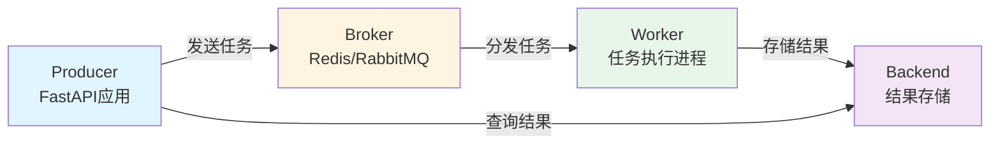
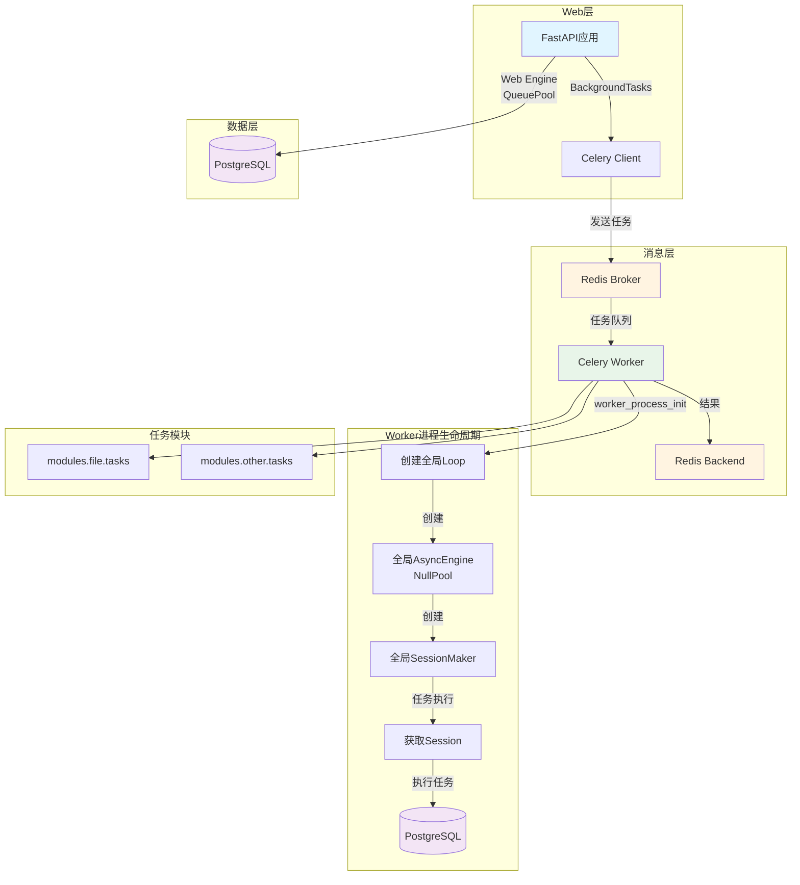
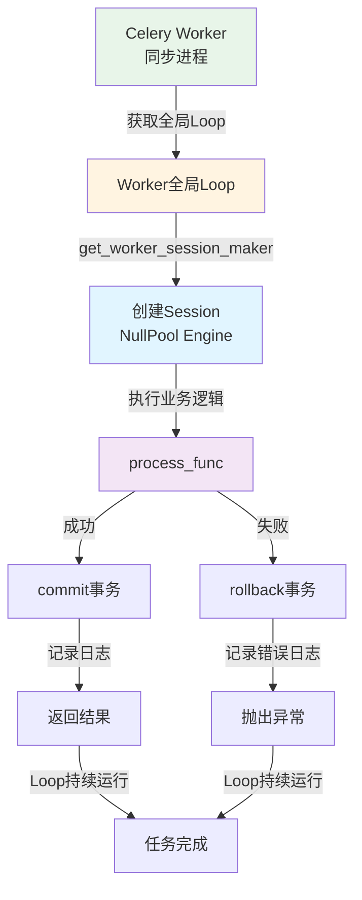
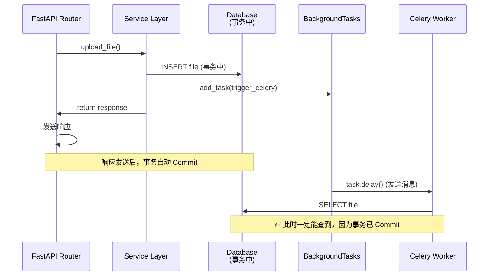
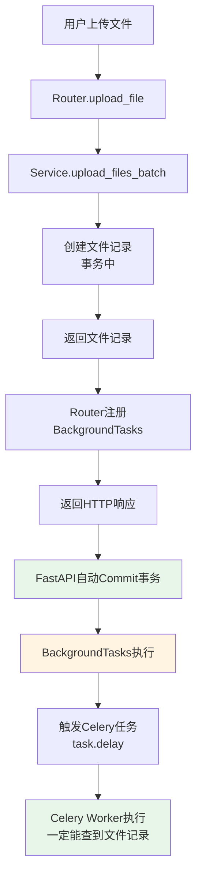
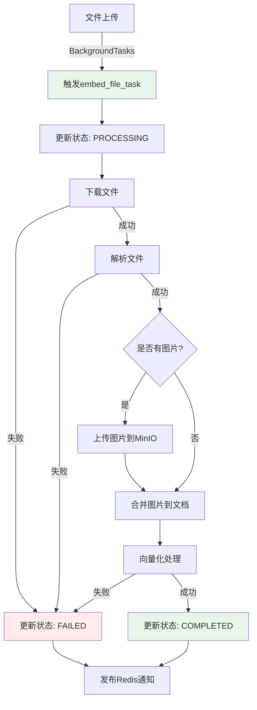

# Celery 异步任务队列完整指南

> 基于官方文档和实际项目经验，提供 Celery 异步任务队列的完整实战指南。包含 FastAPI 集成、数据库连接管理、异步任务编写、常见问题解决方案和性能优化建议。专注于生产环境最佳实践。

## 目录

- [简介与快速开始](#简介与快速开始)
- [FastAPI + Celery 集成架构](#fastapi--celery-集成架构)
- [Worker 生命周期与资源管理](#worker-生命周期与资源管理)
- [异步任务编写最佳实践](#异步任务编写最佳实践)
- [任务触发与事务可见性](#任务触发与事务可见性)
- [任务监控与可观测性](#任务监控与可观测性)
- [常见问题与避坑指南](#常见问题与避坑指南)
- [性能优化与生产部署](#性能优化与生产部署)
- [实战案例：文件向量化任务](#实战案例文件向量化任务)
- [参考资源](#参考资源)

---

## 简介与快速开始

### 什么是 Celery？

**Celery** 是一个分布式任务队列系统，用于处理大量异步任务和定时任务。

**核心优势**：
- ✅ **异步执行**：将耗时操作从 Web 请求中分离，提升用户体验
- ✅ **分布式**：支持多个 Worker 进程并行处理任务
- ✅ **可靠性**：任务持久化存储，失败自动重试
- ✅ **可扩展**：支持任务优先级、路由、限流等高级特性

### 为什么需要异步任务队列？

在 Web 应用中，有些操作不适合在 HTTP 请求中同步执行：

| 操作类型 | 特点 | 是否适合异步 |
|---------|------|-------------|
| **文件上传** | 通常很快（秒级） | ❌ 同步即可 |
| **文件向量化** | 耗时（分钟级），CPU/IO 密集 | ✅ 必须异步 |
| **发送邮件** | 依赖外部服务，可能失败 | ✅ 应该异步 |
| **数据分析** | 非常耗时（小时级） | ✅ 必须异步 |
| **定时任务** | 按计划执行，与请求无关 | ✅ 必须异步 |

**使用场景**：
- 长时间运行的任务（文件处理、数据分析）
- 需要重试的操作（发送邮件、调用第三方 API）
- 定时任务（数据同步、报告生成）
- 批量处理（批量导入、批量导出）

### Celery 核心组件

Celery 采用生产者-消费者模式，包含三个核心组件：



#### 1. Broker（消息代理）

**作用**：存储待执行的任务队列。

**常用选择**：
- **Redis**（推荐）：简单、快速、功能丰富
- **RabbitMQ**：功能强大，适合复杂场景
- **Amazon SQS**：云原生方案

#### 2. Backend（结果后端）

**作用**：存储任务执行结果。

**常用选择**：
- **Redis**（推荐）：简单、快速
- **PostgreSQL**：持久化存储，适合重要结果
- **RPC**：不存储结果，只返回引用

#### 3. Worker（工作者进程）

**作用**：执行任务的进程。

**启动方式**：
```bash
# 启动 Worker
celery -A myapp.celery_app worker --loglevel=info

# 后台运行（生产环境）
celery -A myapp.celery_app worker --loglevel=info --detach
```

### 快速开始：最小示例

#### 1. 安装依赖

```bash
pip install celery redis
```

#### 2. 创建 Celery 应用

```python
# myapp/celery_app.py
from celery import Celery

celery_app = Celery(
    "myapp",
    broker="redis://localhost:6379/0",
    backend="redis://localhost:6379/0",
)

celery_app.conf.update(
    task_serializer="json",
    accept_content=["json"],
    result_serializer="json",
    timezone="UTC",
    enable_utc=True,
)
```

#### 3. 定义任务

```python
# myapp/tasks.py
from myapp.celery_app import celery_app

@celery_app.task(name="add_numbers")
def add(x, y):
    return x + y
```

#### 4. 调用任务

```python
# myapp/main.py
from myapp.tasks import add

# 异步调用（立即返回）
result = add.delay(4, 4)

# 获取结果（阻塞等待）
print(result.get())  # 8
```

---

## FastAPI + Celery 集成架构

### 架构设计原则

**核心原则**：
1. **关注点分离**：Web 请求处理与任务执行分离
2. **依赖注入**：通过依赖注入管理资源（Session、Service）
3. **配置集中化**：Celery 配置统一管理
4. **任务模块化**：按业务模块组织任务文件
5. **Worker 生命周期管理**：在 Worker 进程级别管理 Event Loop 和数据库连接

### 整体架构图



### 项目结构设计

```
backend/
├── core/
│   └── celery.py              # Celery 应用配置 + Worker 生命周期管理
├── shared/
│   └── utils/
│       └── celery_utils.py    # 任务执行包装器
├── modules/
│   └── file/
│       ├── tasks.py           # 文件相关任务
│       └── routers.py         # Router（使用 BackgroundTasks）
└── db/
    └── connection.py          # 数据库连接（仅 Web Engine）
```

### Celery 配置管理

#### 完整配置示例

```python
# core/celery.py
import asyncio
from celery import Celery, signals
from sqlalchemy.ext.asyncio import AsyncEngine, async_sessionmaker, AsyncSession, create_async_engine
from sqlalchemy.pool import NullPool

from core.config import settings
from core.logging import get_logger

logger = get_logger(__name__)

# 任务模块列表（自动发现）
TASK_MODULES = [
    "modules.file.tasks",
]

# 创建 Celery 应用
celery_app = Celery(
    "ifa",
    broker=f"redis://{settings.redis_host}:{settings.redis_port}/{settings.redis_db}",
    backend=f"redis://{settings.redis_host}:{settings.redis_port}/{settings.redis_db}",
    include=TASK_MODULES,
)

# Celery 配置
celery_app.conf.update(
    task_serializer="json",
    accept_content=["json"],
    result_serializer="json",
    timezone="UTC",
    enable_utc=True,
    task_track_started=True,
    task_time_limit=3600,
    task_soft_time_limit=3300,
    worker_prefetch_multiplier=1,
    worker_max_tasks_per_child=1000,
)

# Worker 进程级全局资源
_worker_event_loop: asyncio.AbstractEventLoop | None = None
_worker_async_engine: AsyncEngine | None = None
_worker_session_maker: async_sessionmaker[AsyncSession] | None = None


def get_worker_loop() -> asyncio.AbstractEventLoop:
    """获取 Worker 进程的全局 Event Loop"""
    if _worker_event_loop is None:
        raise RuntimeError("Worker Event Loop 未初始化")
    return _worker_event_loop


def get_worker_session_maker() -> async_sessionmaker[AsyncSession]:
    """获取 Worker 进程的全局 SessionMaker"""
    if _worker_session_maker is None:
        raise RuntimeError("Worker SessionMaker 未初始化")
    return _worker_session_maker


@signals.worker_process_init.connect
def init_worker_process(**kwargs):
    """Worker 子进程初始化：创建全局 Loop 和 Engine"""
    global _worker_event_loop, _worker_async_engine, _worker_session_maker
    
    # 1. 创建全局 Event Loop
    _worker_event_loop = asyncio.new_event_loop()
    asyncio.set_event_loop(_worker_event_loop)
    
    # 2. 在该 Loop 的上下文中创建 AsyncEngine
    async def _create_engine():
        return create_async_engine(
            settings.database_url,
            poolclass=NullPool,  # 关键：不使用连接池
            echo=settings.debug,
            future=True,
        )
    
    _worker_async_engine = _worker_event_loop.run_until_complete(_create_engine())
    
    # 3. 创建全局 SessionMaker
    _worker_session_maker = async_sessionmaker(
        _worker_async_engine,
        class_=AsyncSession,
        expire_on_commit=False,
        autocommit=False,
        autoflush=False,
    )


@signals.worker_process_shutdown.connect
def shutdown_worker_process(**kwargs):
    """Worker 子进程关闭：清理资源"""
    global _worker_event_loop, _worker_async_engine, _worker_session_maker
    
    if _worker_async_engine:
        _worker_event_loop.run_until_complete(_worker_async_engine.dispose())
        _worker_async_engine = None
    
    if _worker_event_loop and not _worker_event_loop.is_closed():
        _worker_event_loop.close()
        _worker_event_loop = None
    
    _worker_session_maker = None
```

---

## Worker 生命周期与资源管理

### 核心问题：为什么不能使用 `asyncio.run()`？

**常见错误做法**：

```python
# ❌ 错误：在任务中反复使用 asyncio.run()
@celery_app.task
def my_task():
    return asyncio.run(async_function())  # 每次都创建新 Loop
```

**问题根源**：

1. **`asyncio.run()` 的设计初衷**：用于**命令行脚本**（运行一次就退出）
2. **Celery Worker 的本质**：**长驻服务进程**（启动后持续接收任务）
3. **生命周期冲突**：
   - `asyncio.run()` 每次都会：创建 Loop → 运行 → 销毁 Loop
   - 在长驻服务中反复调用等于"反复启动和关闭整个异步系统"
   - `AsyncEngine` 绑定到某个 Loop，Loop 销毁后 Engine 无法在新 Loop 中使用

**正确做法**：在 Worker 进程级别维护一个**全局的 Event Loop**。

### Worker 生命周期管理

```mermaid
sequenceDiagram
    participant Main as 主进程
    participant Worker as Worker子进程
    participant Loop as Event Loop
    participant Engine as AsyncEngine
    
    Main->>Worker: fork子进程
    Worker->>Loop: worker_process_init信号
    Loop->>Loop: 创建全局Event Loop
    Loop->>Engine: 创建AsyncEngine（绑定Loop）
    Engine->>Loop: 创建SessionMaker
    
    Note over Worker,Loop: Worker进程运行中
    
    Worker->>Loop: 任务1执行
    Loop->>Engine: 获取Session
    Engine->>Loop: 执行异步代码
    Loop->>Engine: 归还Session
    
    Worker->>Loop: 任务2执行（复用同一个Loop）
    Loop->>Engine: 获取Session
    
    Note over Worker,Loop: Worker进程关闭
    Worker->>Engine: worker_process_shutdown信号
    Engine->>Engine: dispose()释放连接
    Engine->>Loop: 关闭Loop
```

### 数据库连接管理策略

**架构要点**：

1. **Web 服务**：使用 `QueuePool`（连接池），因为 Loop 持久存在
2. **Celery Worker**：使用 `NullPool`（无连接池），因为每个任务独立连接更安全

```python
# db/connection.py
# Web 服务专用 Engine（带连接池）
engine: AsyncEngine = create_async_engine(
    settings.database_url,
    pool_size=settings.db_pool_size,
    max_overflow=settings.db_max_overflow,
    # ... 其他配置
)

# Celery Worker 的 Engine 在 core.celery 中管理（Worker 进程级别）
```

**为什么 Celery Worker 使用 NullPool？**

- ✅ **可靠性优先**：避免连接在不同 Loop 间共享导致的错误
- ✅ **性能影响可忽略**：连接开销（10-50ms）相比任务时长（秒级到分钟级）占比 < 1%
- ✅ **简化架构**：不需要维护连接池状态

---

## 异步任务编写最佳实践

### 任务函数设计原则

#### 1. 单一职责原则

每个任务应该只做一件事，避免在一个任务中处理多个不相关的操作。

```python
# ❌ 错误：职责混乱
@celery_app.task
def process_file_and_send_email(file_id):
    process_file(file_id)
    send_email(...)

# ✅ 正确：职责分离
@celery_app.task
def process_file(file_id):
    process_file_logic(file_id)

@celery_app.task
def send_notification_email(file_id):
    send_email(...)
```

#### 2. 幂等性设计

任务应该支持重复执行而不产生副作用。

```python
# ✅ 幂等性设计
@celery_app.task
def update_file_status(file_id, status):
    file = get_file(file_id)
    if file.status == status:
        return {"skipped": True}
    
    file.status = status
    save_file(file)
    return {"updated": True}
```

#### 3. 参数传递限制

**可序列化类型**：
- 基本类型：`int`, `str`, `float`, `bool`
- 容器类型：`list`, `dict`, `tuple`

**最佳实践**：
```python
# ✅ 推荐：传递 ID，在任务中查询
@celery_app.task
def process_file(file_id: str):
    file = get_file(file_id)
    # 处理文件

# ❌ 不推荐：传递复杂对象
@celery_app.task
def process_file(file_obj: File):  # 对象序列化可能失败
    pass
```

### 异步任务执行包装器

在 FastAPI + Celery 场景中，任务通常需要访问数据库。我们提供一个通用的包装器 `run_async_task`：



**包装器实现**：

```python
# shared/utils/celery_utils.py
from typing import Callable, Any, Awaitable
from sqlalchemy.ext.asyncio import AsyncSession
from core.logging import get_logger
from core.celery import get_worker_loop, get_worker_session_maker

logger = get_logger(__name__)


def run_async_task(
    task_id: str,
    task_name: str,
    process_func: Callable[[AsyncSession], Awaitable[Any]]
) -> Any:
    """
    在 Worker 全局 Loop 上运行异步任务的通用包装器
    
    架构要点：
    1. 使用 Worker 进程的全局 Event Loop（不创建新 Loop）
    2. 从全局 SessionMaker 获取 Session
    3. 统一记录任务开始、完成和错误日志
    """
    loop = get_worker_loop()
    session_maker = get_worker_session_maker()
    
    async def _async_wrapper():
        logger.info(f"{task_name}_started", task_id=task_id)
        
        async with session_maker() as session:
            try:
                result = await process_func(session)
                await session.commit()
                logger.info(f"{task_name}_completed", task_id=task_id)
                return result
            except Exception as e:
                await session.rollback()
                logger.error(
                    f"{task_name}_failed",
                    task_id=task_id,
                    error=str(e),
                    exc_info=True
                )
                raise
    
    # 使用全局 Loop 执行异步代码（而非 asyncio.run()）
    return loop.run_until_complete(_async_wrapper())
```

**使用方式**：

```python
@celery_app.task(bind=True, name="file.embed_file")
def embed_file_task(self: Task, file_id: str) -> dict:
    """文件向量化任务"""
    
    async def process(session: AsyncSession) -> dict:
        # 业务逻辑
        file = await get_file(session, file_id)
        result = await process_file(session, file)
        return result
    
    return run_async_task(
        task_id=self.request.id,
        task_name="file_embedding",
        process_func=process
    )
```

### 任务重试机制

#### 自动重试

```python
from celery import Task
from celery.exceptions import Retry

@celery_app.task(bind=True, autoretry_for=(ConnectionError,), max_retries=3)
def fetch_data_task(self: Task, url: str):
    try:
        response = requests.get(url)
        return response.json()
    except ConnectionError as exc:
        # 指数退避重试
        raise self.retry(exc=exc, countdown=2 ** self.request.retries)
```

#### 手动重试

```python
@celery_app.task(bind=True, max_retries=3)
def process_task(self: Task, data: dict):
    try:
        result = do_work(data)
        return result
    except TransientError as exc:
        if self.request.retries < self.max_retries:
            raise self.retry(exc=exc, countdown=60)
        raise
```

---

## 任务触发与事务可见性

### 核心问题：Race Condition

**问题现象**：

```python
# ❌ 错误做法：在 Service 层直接触发任务
async def upload_file(...) -> FileResponse:
    # 1. 创建文件记录（在事务中）
    created = await self.repository.create(instance)
    
    # 2. 立即触发 Celery 任务
    task = embed_file_task.delay(str(created.id))
    
    # 3. 返回响应（此时事务还未 Commit）
    return FileResponse.model_validate(created)
# FastAPI 自动 Commit（在响应发送后）
```

**问题根源**：

1. **事务可见性**：未提交（Commit）的事务数据，对于其他会话（如 Celery Worker 的新连接）是**不可见**的
2. **时序问题**：
   - 主线程：创建记录 → 触发任务 → **尚未 Commit**
   - Celery Worker：接收到任务 → 立即执行 → 查询数据库 → **找不到记录**（因为事务未提交）
   - 结果：`ValueError: 文件记录不存在`

**时序图**：



### 解决方案：FastAPI BackgroundTasks

**核心思路**：利用 FastAPI `BackgroundTasks` 的"响应后执行"特性，确保在数据库事务 Commit 后再触发任务。

**架构流程**：



**实现方式**：

```python
# modules/file/routers.py
from fastapi import BackgroundTasks

async def trigger_file_embedding_background(file_id: UUID) -> None:
    """后台任务：触发文件向量化（在事务 Commit 后执行）"""
    from modules.file.tasks import embed_file_task
    from db.connection import AsyncSessionLocal
    from modules.file.repositories import FileRepository
    from shared.enums import EmbeddingStage
    
    # 1. 触发 Celery 任务
    task = embed_file_task.delay(str(file_id))
    task_id = task.id
    
    # 2. 更新数据库状态（使用独立的 Session，因为原事务已结束）
    async with AsyncSessionLocal() as session:
        repo = FileRepository(session)
        await repo.update_embedding_status(
            file_id=file_id,
            embedding_status=EmbeddingStage.PENDING,
            embedding_task_id=task_id,
        )
        await session.commit()
    
    # 3. 发布 Redis 消息（可选）


@router.post("/upload")
async def upload_file(
    files: list[UploadFile],
    background_tasks: BackgroundTasks,  # 注入 BackgroundTasks
    service: FileService = Depends(get_file_service),
):
    # 1. Service 层创建文件（在事务中）
    result = await service.upload_files_batch(files=files, ...)
    
    # 2. 注册后台任务（在响应后、事务 Commit 后执行）
    for file_response in result:
        background_tasks.add_task(
            trigger_file_embedding_background,
            file_id=file_response.id,
        )
    
    # 3. 返回响应（此时任务还没执行，等 commit 后再执行）
    return success_response(data=result)
```

**为什么这样做是正确的？**

1. **时序保证**：BackgroundTasks 在响应发送**之后**执行，此时事务已 Commit
2. **数据可见性**：Worker 查询数据库时，数据一定已经存在
3. **架构清晰**：Service 层只负责业务逻辑，任务触发职责在 Router 层

---

## 任务监控与可观测性

### 日志记录策略

#### 统一日志格式

使用结构化日志，便于后续分析和监控：

```python
logger.info(
    "task_started",
    task_id=task_id,
    file_id=file_id,
    timestamp=datetime.utcnow().isoformat(),
)

logger.error(
    "task_failed",
    task_id=task_id,
    error=str(e),
    exc_info=True,  # 包含完整堆栈
)
```

**注意**：`run_async_task` 包装器已自动记录任务开始、完成和失败的日志，无需在业务代码中重复记录。

### Redis 消息通知集成

#### 实时状态通知

在任务执行过程中发布状态更新，实现前端实时显示：

```python
# 任务执行过程中发布状态更新
async def update_status_and_notify(
    session: AsyncSession,
    file_id: UUID,
    status: str,
    redis_service: RedisService,
):
    # 1. 更新数据库
    await update_status(session, file_id, status)
    await session.flush()
    
    # 2. 发布 Redis 消息（错误容错）
    try:
        await redis_service.publish(
            "file:notifications",
            {
                "type": "file_embedding_status",
                "file_id": str(file_id),
                "status": status,
                "timestamp": datetime.utcnow().isoformat(),
            },
            raise_on_error=False,
        )
    except Exception as e:
        logger.warning("redis_message_failed", error=str(e))
```

**前端订阅**（使用 SSE 或 WebSocket）：

```javascript
const eventSource = new EventSource('/api/stream/file-status');
eventSource.onmessage = (event) => {
    const data = JSON.parse(event.data);
    updateUI(data);
};
```

---

## 常见问题与避坑指南

### 问题 1：RuntimeError - "got Future attached to a different loop"

**错误信息**：
```
RuntimeError: Task <Task pending> got Future <Future pending> 
attached to a different loop
```

**原因**：
- 使用了 `asyncio.run()` 为每个任务创建新 Loop
- 全局 `AsyncEngine` 绑定到某个旧 Loop，在新 Loop 中无法使用

**解决方案**：
- ✅ 使用 `worker_process_init` 信号在 Worker 进程级别创建全局 Loop
- ✅ 使用 `loop.run_until_complete()` 而非 `asyncio.run()`

### 问题 2：ValueError - "文件记录不存在"（Race Condition）

**错误信息**：
```
ValueError: 文件记录不存在: {file_id}
```

**原因**：
- 在事务提交前触发了 Celery 任务
- Worker 查询数据库时，事务还未提交，数据不可见

**解决方案**：
- ✅ 使用 FastAPI `BackgroundTasks` 在响应后（事务 Commit 后）触发任务
- ✅ Service 层不触发任务，职责上移到 Router 层

### 问题 3：任务序列化错误（PickleError）

**错误信息**：
```
pickle.PicklingError: Can't pickle <class 'function'>
```

**原因**：
- 传递了不可序列化的对象（如函数、类实例）

**解决方案**：
```python
# ❌ 错误：传递复杂对象
@celery_app.task
def process(file_obj: File):
    pass

# ✅ 正确：传递 ID
@celery_app.task
def process(file_id: str):
    file = get_file(file_id)
    pass
```

### 问题 4：任务超时处理

**配置超时**：
```python
celery_app.conf.update(
    task_time_limit=3600,      # 硬超时（秒）
    task_soft_time_limit=3300, # 软超时（秒）
)
```

**优雅处理超时**：
```python
from celery.exceptions import SoftTimeLimitExceeded

@celery_app.task(bind=True, soft_time_limit=300)
def my_task(self: Task, data: dict):
    try:
        return do_work(data)
    except SoftTimeLimitExceeded:
        cleanup()  # 执行清理操作
        raise  # 重新抛出，触发硬超时
```

---

## 性能优化与生产部署

### Worker 并发配置

#### 进程池模式（prefork）

```bash
# 启动 4 个 Worker 进程
celery -A myapp.celery_app worker --concurrency=4 --pool=prefork
```

**适用场景**：
- CPU 密集型任务
- 需要充分利用多核 CPU

### Docker 部署最佳实践

#### docker-compose.yml

```yaml
version: '3.8'

services:
  celery-worker:
    build: .
    command: celery -A myapp.celery_app worker --loglevel=info --concurrency=4
    environment:
      - REDIS_HOST=redis
      - DATABASE_URL=postgresql+asyncpg://...
    depends_on:
      - redis
      - postgres
    volumes:
      - ./logs:/app/logs
```

### 监控与告警

#### Flower（Celery 监控工具）

```bash
# 安装
pip install flower

# 启动
celery -A myapp.celery_app flower
```

**访问**：`http://localhost:5555`

---

## 实战案例：文件向量化任务

### 业务场景

- **输入**：上传的文件（PDF、Word、Markdown 等）
- **处理**：文件解析 → 文本分片 → 向量化 → 存储到向量数据库
- **输出**：向量化状态（Pending → Processing → Completed/Failed）

### 任务流程图



### 完整代码示例

#### 1. Router 层（任务触发）

```python
# modules/file/routers.py
from fastapi import BackgroundTasks

async def trigger_file_embedding_background(file_id: UUID) -> None:
    """后台任务：触发文件向量化（在事务 Commit 后执行）"""
    from modules.file.tasks import embed_file_task
    from db.connection import AsyncSessionLocal
    from modules.file.repositories import FileRepository
    from shared.enums import EmbeddingStage
    
    try:
        # 触发 Celery 任务
        task = embed_file_task.delay(str(file_id))
        task_id = task.id
        
        # 更新数据库状态（使用独立的 Session）
        async with AsyncSessionLocal() as session:
            repo = FileRepository(session)
            await repo.update_embedding_status(
                file_id=file_id,
                embedding_status=EmbeddingStage.PENDING,
                embedding_task_id=task_id,
            )
            await session.commit()
    except Exception as e:
        logger.error("background_embedding_trigger_failed", file_id=str(file_id), error=str(e))


@router.post("/upload")
async def upload_file(
    files: list[UploadFile],
    background_tasks: BackgroundTasks,
    service: FileService = Depends(get_file_service),
):
    # 1. Service 层创建文件（在事务中）
    result = await service.upload_files_batch(files=files, ...)
    
    # 2. 注册后台任务（在响应后、事务 Commit 后执行）
    for file_response in result:
        background_tasks.add_task(
            trigger_file_embedding_background,
            file_id=file_response.id,
        )
    
    return success_response(data=result)
```

#### 2. 任务定义

```python
# modules/file/tasks.py
@celery_app.task(bind=True, name="file.embed_file")
def embed_file_task(self: Task, file_id: str) -> dict:
    """文件向量化任务"""
    
    async def process(session: AsyncSession) -> dict:
        f_uuid = UUID(file_id)
        file_repository = FileRepository(session)
        file_service = FileService(repository=file_repository, ...)
        
        # 1. 更新状态：PENDING → PROCESSING
        await file_repository.update_embedding_status(
            file_id=f_uuid,
            embedding_status=EmbeddingStage.PROCESSING,
            embedding_task_id=self.request.id,
        )
        await session.commit()
        
        # 2. 下载文件
        file_data, filename, mime_type = await file_service.download_file(f_uuid)
        
        # 3. 解析文件
        parser = FileParser()
        parse_result = await parser.parse(file_data=file_data, mime_type=mime_type)
        
        # 4. 向量化
        rag_service = RAGService()
        result = await rag_service.embed(
            entity_id=f_uuid,
            documents=parse_result.documents,
            table_name="file_vectors",
        )
        
        # 5. 更新状态：PROCESSING → COMPLETED
        await file_repository.update_embedding_status(
            file_id=f_uuid,
            embedding_status=EmbeddingStage.COMPLETED,
        )
        await session.commit()
        
        return {"chunks_count": result.chunks_count}
    
    return run_async_task(
        task_id=self.request.id,
        task_name="file_embedding",
        process_func=process
    )
```

### 关键设计要点

1. **状态管理**：清晰的状态流转（PENDING → PROCESSING → COMPLETED/FAILED），每个关键步骤及时更新
2. **错误处理**：每个步骤都有独立的错误处理，失败时立即更新状态并发布通知
3. **实时通知**：通过 Redis 发布状态更新，前端实时显示进度
4. **资源管理**：使用 `run_async_task` 包装器确保 Session 正确关闭
5. **事务控制**：中间状态使用 `flush()` 立即提交，最终状态使用 `commit()` 完成事务
6. **任务触发**：使用 `BackgroundTasks` 确保在事务 Commit 后触发，避免 Race Condition

---

## 参考资源

### 官方文档

- [Celery 官方文档](https://docs.celeryq.dev/)
- [Celery Signals](https://docs.celeryq.dev/en/stable/userguide/signals.html#worker-process-init)
- [SQLAlchemy AsyncEngine](https://docs.sqlalchemy.org/en/20/orm/extensions/asyncio.html)
- [FastAPI BackgroundTasks](https://fastapi.tiangolo.com/tutorial/background-tasks/)

### 相关指南

- [FastAPI 项目工程化结构设计指南](./FastAPI%20项目工程化结构设计指南.md)
- [LangChain PGVectorStore 完整指南](./LangChain%20PGVectorStore%20完整指南.md)

### 社区资源

- [Celery GitHub](https://github.com/celery/celery)
- [Celery Flower (监控工具)](https://flower.readthedocs.io/)
