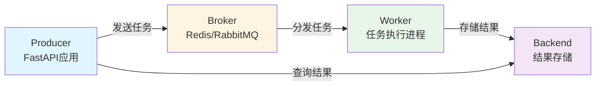
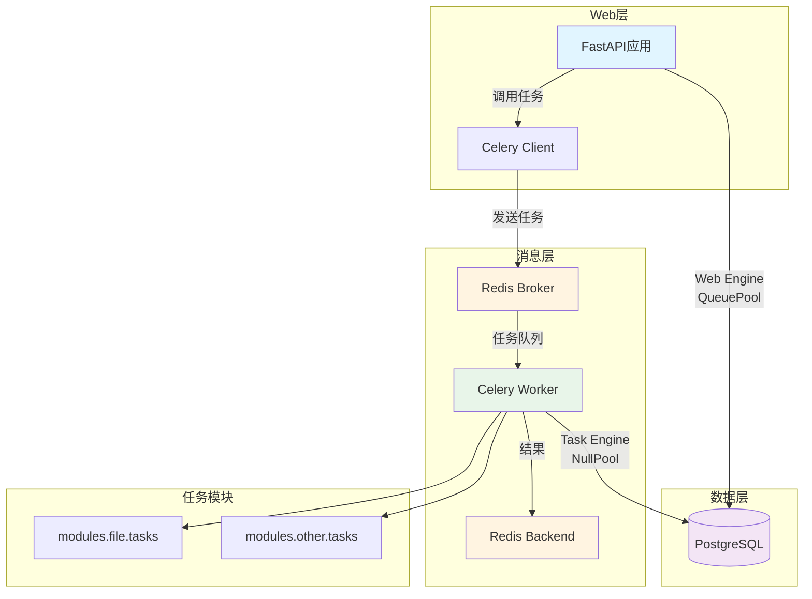
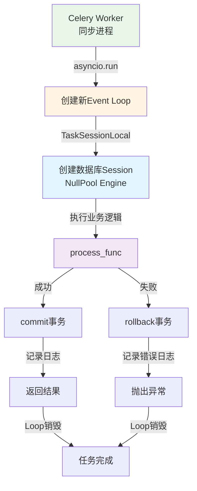
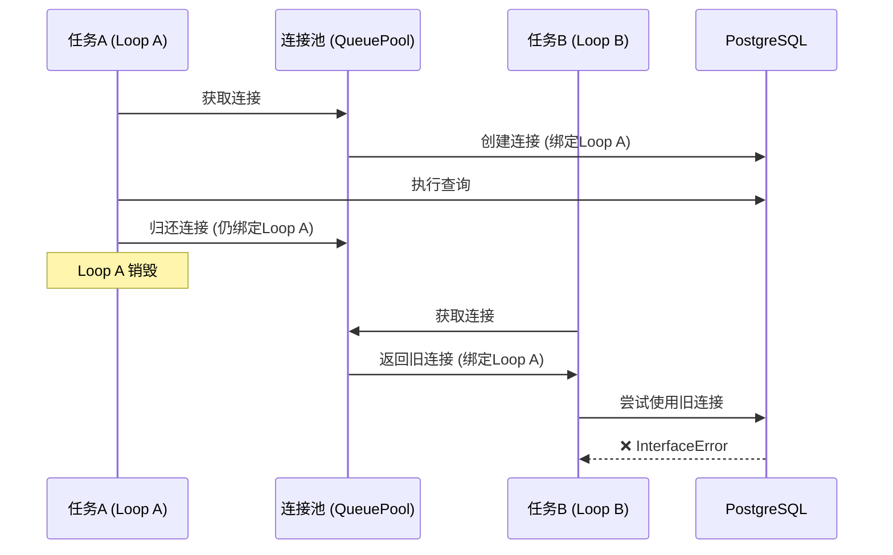
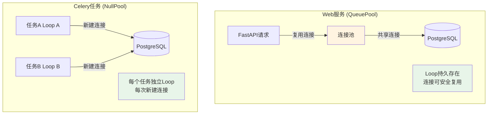
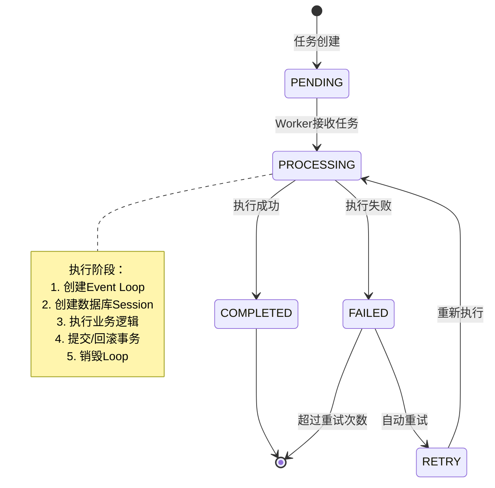
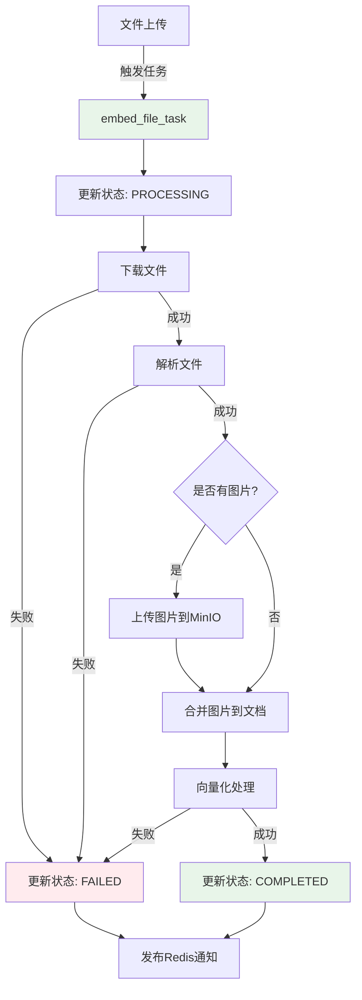

# Celery 异步任务队列完整指南

> 基于官方文档和实际项目经验，提供 Celery 异步任务队列的完整实战指南。包含 FastAPI 集成、数据库连接管理、异步任务编写、常见问题解决方案和性能优化建议。专注于生产环境最佳实践。

## 目录

- [简介与快速开始](#简介与快速开始)
- [FastAPI + Celery 集成架构](#fastapi--celery-集成架构)
- [异步任务编写最佳实践](#异步任务编写最佳实践)
- [异步环境下的数据库连接管理](#异步环境下的数据库连接管理)
- [任务执行与生命周期管理](#任务执行与生命周期管理)
- [任务监控与可观测性](#任务监控与可观测性)
- [常见问题与避坑指南](#常见问题与避坑指南)
- [性能优化与生产部署](#性能优化与生产部署)
- [实战案例：文件向量化任务](#实战案例文件向量化任务)
- [参考资源](#参考资源)

---

## 简介与快速开始

### 什么是 Celery？

**Celery** 是一个分布式任务队列系统，用于处理大量异步任务和定时任务。

**核心优势**：
- ✅ **异步执行**：将耗时操作从 Web 请求中分离，提升用户体验
- ✅ **分布式**：支持多个 Worker 进程并行处理任务
- ✅ **可靠性**：任务持久化存储，失败自动重试
- ✅ **可扩展**：支持任务优先级、路由、限流等高级特性

### 为什么需要异步任务队列？

在 Web 应用中，有些操作不适合在 HTTP 请求中同步执行：

| 操作类型 | 特点 | 是否适合异步 |
|---------|------|-------------|
| **文件上传** | 通常很快（秒级） | ❌ 同步即可 |
| **文件向量化** | 耗时（分钟级），CPU/IO 密集 | ✅ 必须异步 |
| **发送邮件** | 依赖外部服务，可能失败 | ✅ 应该异步 |
| **数据分析** | 非常耗时（小时级） | ✅ 必须异步 |
| **定时任务** | 按计划执行，与请求无关 | ✅ 必须异步 |

**使用场景**：
- 长时间运行的任务（文件处理、数据分析）
- 需要重试的操作（发送邮件、调用第三方 API）
- 定时任务（数据同步、报告生成）
- 批量处理（批量导入、批量导出）

### Celery 核心组件

Celery 采用生产者-消费者模式，包含三个核心组件：



#### 1. Broker（消息代理）

**作用**：存储待执行的任务队列。

**常用选择**：
- **Redis**（推荐）：简单、快速、功能丰富
- **RabbitMQ**：功能强大，适合复杂场景
- **Amazon SQS**：云原生方案

**配置示例**：
```python
from celery import Celery

celery_app = Celery(
    "myapp",
    broker="redis://localhost:6379/0",
)
```

#### 2. Backend（结果后端）

**作用**：存储任务执行结果。

**常用选择**：
- **Redis**（推荐）：简单、快速
- **PostgreSQL**：持久化存储，适合重要结果
- **RPC**：不存储结果，只返回引用

**配置示例**：
```python
celery_app = Celery(
    "myapp",
    broker="redis://localhost:6379/0",
    backend="redis://localhost:6379/0",  # 结果后端
)
```

#### 3. Worker（工作者进程）

**作用**：执行任务的进程。

**启动方式**：
```bash
# 启动 Worker
celery -A myapp.celery_app worker --loglevel=info

# 后台运行（生产环境）
celery -A myapp.celery_app worker --loglevel=info --detach
```

### 快速开始：最小示例

#### 1. 安装依赖

```bash
pip install celery redis
```

#### 2. 创建 Celery 应用

```python
# myapp/celery_app.py
from celery import Celery

celery_app = Celery(
    "myapp",
    broker="redis://localhost:6379/0",
    backend="redis://localhost:6379/0",
)

celery_app.conf.update(
    task_serializer="json",
    accept_content=["json"],
    result_serializer="json",
    timezone="UTC",
    enable_utc=True,
)
```

#### 3. 定义任务

```python
# myapp/tasks.py
from myapp.celery_app import celery_app

@celery_app.task(name="add_numbers")
def add(x, y):
    return x + y
```

#### 4. 调用任务

```python
# myapp/main.py
from myapp.tasks import add

# 异步调用（立即返回）
result = add.delay(4, 4)

# 获取结果（阻塞等待）
print(result.get())  # 8
```

---

## FastAPI + Celery 集成架构

### 架构设计原则

**核心原则**：
1. **关注点分离**：Web 请求处理与任务执行分离
2. **依赖注入**：通过依赖注入管理资源（Session、Service）
3. **配置集中化**：Celery 配置统一管理
4. **任务模块化**：按业务模块组织任务文件

### 整体架构图



### 项目结构设计

```
backend/
├── core/
│   └── celery.py              # Celery 应用配置
├── shared/
│   └── utils/
│       └── celery_utils.py    # 任务执行包装器
├── modules/
│   └── file/
│       └── tasks.py           # 文件相关任务
└── db/
    └── connection.py          # 数据库连接（Web + Task）
```

### Celery 配置管理

#### 完整配置示例

```python
# core/celery.py
from celery import Celery
from core.config import settings

# 任务模块列表（自动发现）
TASK_MODULES = [
    "modules.file.tasks",
    # 其他模块的任务
]

# 创建 Celery 应用
celery_app = Celery(
    "ifa",
    broker=f"redis://{settings.redis_host}:{settings.redis_port}/{settings.redis_db}",
    backend=f"redis://{settings.redis_host}:{settings.redis_port}/{settings.redis_db}",
    include=TASK_MODULES,
)

# Celery 配置
celery_app.conf.update(
    # 序列化
    task_serializer="json",
    accept_content=["json"],
    result_serializer="json",
    
    # 时区
    timezone="UTC",
    enable_utc=True,
    
    # 任务追踪
    task_track_started=True,      # 追踪任务开始
    
    # 超时配置
    task_time_limit=3600,         # 硬超时（1小时）
    task_soft_time_limit=3300,    # 软超时（55分钟）
    
    # Worker 配置
    worker_prefetch_multiplier=1,      # 每个 worker 预取任务数
    worker_max_tasks_per_child=1000,   # 每个 worker 子进程最大任务数（防止内存泄露）
)
```

#### 配置说明

| 配置项 | 说明 | 推荐值 |
|-------|------|--------|
| `task_track_started` | 追踪任务开始状态 | `True` |
| `task_time_limit` | 硬超时时间（秒） | 根据任务类型调整 |
| `task_soft_time_limit` | 软超时时间（秒） | `task_time_limit * 0.9` |
| `worker_prefetch_multiplier` | 预取任务数 | `1`（公平调度） |
| `worker_max_tasks_per_child` | 子进程最大任务数 | `1000`（防止内存泄露） |

---

## 异步任务编写最佳实践

### 任务函数设计原则

#### 1. 单一职责原则

每个任务应该只做一件事，避免在一个任务中处理多个不相关的操作。

```python
# ❌ 错误：职责混乱
@celery_app.task
def process_file_and_send_email(file_id):
    # 处理文件
    process_file(file_id)
    # 发送邮件
    send_email(...)

# ✅ 正确：职责分离
@celery_app.task
def process_file(file_id):
    process_file_logic(file_id)

@celery_app.task
def send_notification_email(file_id):
    send_email(...)
```

#### 2. 幂等性设计

任务应该支持重复执行而不产生副作用。

```python
# ✅ 幂等性设计
@celery_app.task
def update_file_status(file_id, status):
    # 检查当前状态，避免重复操作
    file = get_file(file_id)
    if file.status == status:
        return {"skipped": True}
    
    file.status = status
    save_file(file)
    return {"updated": True}
```

#### 3. 参数传递限制

**可序列化类型**：
- 基本类型：`int`, `str`, `float`, `bool`
- 容器类型：`list`, `dict`, `tuple`
- 复杂对象：需要使用 `pickle` 序列化（不推荐）

**最佳实践**：
```python
# ✅ 推荐：传递 ID，在任务中查询
@celery_app.task
def process_file(file_id: str):
    file = get_file(file_id)
    # 处理文件

# ❌ 不推荐：传递复杂对象
@celery_app.task
def process_file(file_obj: File):  # 对象序列化可能失败
    pass
```

### 异步任务执行包装器

在 FastAPI + Celery 场景中，任务通常需要访问数据库。我们提供一个通用的包装器 `run_async_task`，它解决了三个核心问题：



**包装器实现**：

```python
# shared/utils/celery_utils.py
import asyncio
from typing import Callable, Any, Awaitable
from sqlalchemy.ext.asyncio import AsyncSession

from core.logging import get_logger
from db.connection import TaskSessionLocal

logger = get_logger(__name__)


def run_async_task(
    task_id: str,
    task_name: str,
    process_func: Callable[[AsyncSession], Awaitable[Any]]
) -> Any:
    """
    运行异步 Celery 任务的通用包装器
    
    职责：
    1. 创建 asyncio 事件循环（每个任务独立 Loop）
    2. 管理数据库 Session (commit/rollback)
    3. 统一记录任务开始、完成和错误日志
    
    Args:
        task_id: Celery 任务 ID
        task_name: 任务名称（用于日志）
        process_func: 具体的业务逻辑函数，接收 session 参数
    """
    async def _wrapper():
        logger.info(f"{task_name}_started", task_id=task_id)
        
        # 使用 TaskSessionLocal（NullPool），确保每个任务使用独立的连接
        async with TaskSessionLocal() as session:
            try:
                result = await process_func(session)
                await session.commit()
                
                logger.info(f"{task_name}_completed", task_id=task_id)
                return result
            except Exception as e:
                await session.rollback()
                logger.error(
                    f"{task_name}_failed",
                    task_id=task_id,
                    error=str(e),
                    exc_info=True
                )
                raise

    return asyncio.run(_wrapper())
```

**使用方式**：
```python
@celery_app.task(bind=True, name="file.embed_file")
def embed_file_task(self: Task, file_id: str) -> dict:
    """文件向量化任务"""
    
    async def process(session: AsyncSession) -> dict:
        # 业务逻辑
        file = await get_file(session, file_id)
        result = await process_file(session, file)
        return result
    
    return run_async_task(
        task_id=self.request.id,
        task_name="file_embedding",
        process_func=process
    )
```

### 任务重试机制

#### 自动重试

```python
from celery import Task
from celery.exceptions import Retry

@celery_app.task(bind=True, autoretry_for=(ConnectionError,), max_retries=3)
def fetch_data_task(self: Task, url: str):
    try:
        response = requests.get(url)
        return response.json()
    except ConnectionError as exc:
        # 指数退避重试
        raise self.retry(exc=exc, countdown=2 ** self.request.retries)
```

#### 手动重试

```python
@celery_app.task(bind=True, max_retries=3)
def process_task(self: Task, data: dict):
    try:
        result = do_work(data)
        return result
    except TransientError as exc:
        # 手动重试
        if self.request.retries < self.max_retries:
            raise self.retry(exc=exc, countdown=60)
        raise  # 超过重试次数，抛出异常
```

---

## 异步环境下的数据库连接管理

### 问题根源：Event Loop 生命周期与连接池的冲突

这是 **Celery + FastAPI + SQLAlchemy Async** 中最常见且最隐蔽的问题。

#### 问题现象

```python
# 错误信息
sqlalchemy.exc.InterfaceError: 
    (sqlalchemy.dialects.postgresql.asyncpg.InterfaceError) 
    <class 'asyncpg.exceptions._base.InterfaceError'>: 
    cannot perform operation: another operation is in progress
```

#### 问题分析

**核心矛盾**：
1. **Celery 任务**：使用 `asyncio.run()` 为每个任务创建**新的 Event Loop**，任务结束 Loop 销毁
2. **SQLAlchemy 连接池**：默认使用 `QueuePool`，会**缓存并复用**数据库连接
3. **冲突点**：
   - 任务 A（Loop A）创建连接，用完还回池子（连接绑定到 Loop A）
   - 任务 A 结束，Loop A 销毁
   - 任务 B（Loop B）从池子拿到**绑定到 Loop A 的旧连接**
   - 任务 B 在 Loop B 中使用旧连接 → **InterfaceError**

**问题示意图**：



**为什么 `pgvector` 没有这个问题？**

`pgvector` 只是 PostgreSQL 的一个扩展（数据类型），它本身不涉及连接管理。问题的根源在于：
- **数据库驱动层**（`asyncpg`）：检测到连接状态异常
- **连接池策略**（`QueuePool`）：在错误的场景下复用了连接

### 解决方案：NullPool vs QueuePool

#### 方案对比

| 方案 | 连接复用 | 适用场景 | 优缺点 |
|-----|---------|---------|--------|
| **QueuePool** | ✅ 是 | Web 服务（Loop 持久） | ✅ 高性能<br>❌ 不适合短生命周期 Loop |
| **NullPool** | ❌ 否 | Celery 任务（Loop 短暂） | ✅ 安全稳定<br>❌ 每次新建连接（开销可忽略） |

**架构对比图**：



#### 架构设计：分离 Web Engine 和 Task Engine

```python
# db/connection.py
from sqlalchemy.pool import NullPool

# 1. Web 服务专用 Engine（带连接池）
engine: AsyncEngine = create_async_engine(
    settings.database_url,
    pool_size=settings.db_pool_size,
    max_overflow=settings.db_max_overflow,
    pool_timeout=settings.db_pool_timeout,
    pool_recycle=settings.db_pool_recycle,
    echo=settings.debug,
    future=True,
)

# 2. Celery 任务专用 Engine（无连接池）
task_engine: AsyncEngine = create_async_engine(
    settings.database_url,
    poolclass=NullPool,  # 关键：不使用连接池
    echo=settings.debug,
    future=True,
)

# 3. 创建对应的 Session 工厂
AsyncSessionLocal = async_sessionmaker(engine, ...)      # Web 使用
TaskSessionLocal = async_sessionmaker(task_engine, ...)  # Task 使用
```

#### 为什么 NullPool 性能影响可忽略？

- **任务特点**：Celery 任务通常是**长时间运行**（秒级到分钟级）
- **连接开销**：PostgreSQL 建立连接的开销通常只有 **10-50ms**
- **成本占比**：连接开销占比不到 **1%**，完全可忽略

**结论**：在 Celery 任务中，**可靠性 > 性能**。`NullPool` 是正确且优雅的选择。

---

## 任务执行与生命周期管理

### 任务生命周期流程图



### 任务包装器设计要点

`run_async_task` 包装器解决了三个核心问题：

1. **Loop 生命周期管理**：`asyncio.run()` 为每个任务创建独立的 Event Loop
2. **Session 生命周期管理**：使用 Context Manager 确保 Session 正确关闭
3. **事务一致性保障**：自动处理 commit/rollback，保证数据一致性

**为什么需要 `asyncio.run()`？**

- Celery Worker 默认运行在**同步进程**中
- 任务需要使用 `async/await`，必须创建 Event Loop
- `asyncio.run()` 确保每个任务有独立的 Loop 环境

**Context Manager 的好处**：
- 即使任务异常崩溃，Session 也能正确关闭
- 连接正确释放（对 `NullPool` 很重要）

**设计考虑**：
- 提供最后的安全网：即使业务代码中有未捕获的异常，也能保证数据一致性
- 支持中间提交：业务代码可以手动 `flush()` 或 `commit()`，包装器不会冲突

### 错误处理策略

#### 任务级别的错误处理

```python
@celery_app.task(bind=True)
def my_task(self: Task, data: dict):
    try:
        result = process(data)
        return {"status": "success", "result": result}
    except BusinessException as e:
        # 业务异常：记录日志，返回失败状态
        logger.error("task_failed", error=str(e))
        return {"status": "failed", "error": str(e)}
    except Exception as e:
        # 系统异常：重新抛出，触发 Celery 重试机制
        raise
```

#### 状态管理最佳实践

任务状态应在关键节点及时更新，使用 `flush()` 立即提交中间状态，`commit()` 提交最终状态：

```python
@celery_app.task(bind=True)
def embed_file_task(self: Task, file_id: str):
    async def process(session: AsyncSession):
        # 1. 更新状态：PENDING → PROCESSING
        await update_status(session, file_id, "PROCESSING")
        await session.flush()  # 立即提交状态
        
        # 2. 执行业务逻辑
        result = await do_work(session, file_id)
        
        # 3. 更新状态：PROCESSING → COMPLETED
        await update_status(session, file_id, "COMPLETED")
        
        return result
    
    return run_async_task(
        task_id=self.request.id,
        task_name="file_embedding",
        process_func=process
    )
```

---

## 任务监控与可观测性

### 日志记录策略

#### 统一日志格式

使用结构化日志，便于后续分析和监控：

```python
# 使用结构化日志
logger.info(
    "task_started",
    task_id=task_id,
    file_id=file_id,
    timestamp=datetime.utcnow().isoformat(),
)

logger.error(
    "task_failed",
    task_id=task_id,
    error=str(e),
    exc_info=True,  # 包含完整堆栈
)
```

**注意**：`run_async_task` 包装器已自动记录任务开始、完成和失败的日志，无需在业务代码中重复记录。

### Redis 消息通知集成

#### 实时状态通知

在任务执行过程中发布状态更新，实现前端实时显示：

```python
# 任务执行过程中发布状态更新
async def update_status_and_notify(
    session: AsyncSession,
    file_id: UUID,
    status: str,
    redis_service: RedisService,
):
    # 1. 更新数据库
    await update_status(session, file_id, status)
    await session.flush()
    
    # 2. 发布 Redis 消息（错误容错）
    try:
        await redis_service.publish(
            "file:notifications",
            {
                "type": "file_embedding_status",
                "file_id": str(file_id),
                "status": status,
                "timestamp": datetime.utcnow().isoformat(),
            },
            raise_on_error=False,
        )
    except Exception as e:
        # 消息发布失败不影响任务执行
        logger.warning("redis_message_failed", error=str(e))
```

**前端订阅**（使用 SSE 或 WebSocket）：
```javascript
// 使用 SSE 订阅 Redis 频道
const eventSource = new EventSource('/api/stream/file-status');
eventSource.onmessage = (event) => {
    const data = JSON.parse(event.data);
    updateUI(data);
};
```

**注意**：Redis 消息发布失败不应影响任务执行，应使用 `raise_on_error=False` 或 try-except 包裹。

### 任务执行时间统计

可以在 `run_async_task` 包装器中添加执行时间统计，或使用 Celery 的内置监控功能（如 Flower）来追踪任务执行时间。

---

## 常见问题与避坑指南

### 问题 1：数据库连接冲突（InterfaceError）

**错误信息**：
```
sqlalchemy.exc.InterfaceError: 
    cannot perform operation: another operation is in progress
```

**原因**：
- Celery 任务使用 `asyncio.run()` 创建新 Loop
- SQLAlchemy 连接池复用了绑定到旧 Loop 的连接

**解决方案**：
- ✅ 使用 `NullPool` 为 Celery 任务创建独立的 Engine
- ✅ 使用 `TaskSessionLocal` 而非 `AsyncSessionLocal`

**详细说明**：参见 [异步环境下的数据库连接管理](#异步环境下的数据库连接管理) 章节

### 问题 2：任务序列化错误（PickleError）

**错误信息**：
```
pickle.PicklingError: Can't pickle <class 'function'>
```

**原因**：
- 传递了不可序列化的对象（如函数、类实例）

**解决方案**：
```python
# ❌ 错误：传递复杂对象
@celery_app.task
def process(file_obj: File):
    pass

# ✅ 正确：传递 ID
@celery_app.task
def process(file_id: str):
    file = get_file(file_id)
    pass
```

### 问题 3：资源泄露与连接池耗尽

**错误信息**：
```
sqlalchemy.exc.TimeoutError: QueuePool limit of size X overflow Y reached
```

**原因**：
- Session 未正确关闭
- 长时间运行的任务占用连接

**解决方案**：
```python
# ✅ 使用 Context Manager 确保关闭
async with TaskSessionLocal() as session:
    # 业务逻辑
    pass  # 自动关闭

# ✅ 长时间任务：定期 commit 和 flush
async def long_running_task(session: AsyncSession):
    for i in range(1000):
        await do_work(session, i)
        if i % 100 == 0:
            await session.commit()  # 定期提交，释放资源
```

### 问题 4：任务超时处理

**配置超时**：
```python
celery_app.conf.update(
    task_time_limit=3600,      # 硬超时（秒）
    task_soft_time_limit=3300, # 软超时（秒）
)
```

**任务级别的超时**：
```python
@celery_app.task(bind=True, time_limit=3600, soft_time_limit=3300)
def my_task(self: Task, data: dict):
    # 任务逻辑
    pass
```

**优雅处理超时**：
```python
from celery.exceptions import SoftTimeLimitExceeded

@celery_app.task(bind=True, soft_time_limit=300)
def my_task(self: Task, data: dict):
    try:
        return do_work(data)
    except SoftTimeLimitExceeded:
        # 软超时：执行清理操作
        cleanup()
        raise  # 重新抛出，触发硬超时
```

### 问题 5：Worker 进程管理问题

**配置**：
```python
celery_app.conf.update(
    worker_max_tasks_per_child=1000,  # 防止内存泄露
)
```

**监控 Worker 健康**：
```bash
# 查看 Worker 状态
celery -A myapp.celery_app inspect active

# 查看 Worker 统计
celery -A myapp.celery_app inspect stats
```

---

## 性能优化与生产部署

### Worker 并发配置

#### 进程池模式（prefork）

```bash
# 启动 4 个 Worker 进程
celery -A myapp.celery_app worker --concurrency=4 --pool=prefork
```

**适用场景**：
- CPU 密集型任务
- 需要充分利用多核 CPU

#### 协程模式（solo/gevent）

```bash
# 使用协程模式（适合 IO 密集型）
celery -A myapp.celery_app worker --pool=solo --concurrency=1000
```

**适用场景**：
- IO 密集型任务（网络请求、数据库查询）
- 高并发场景

**注意**：协程模式与 `asyncio.run()` 冲突，需要使用同步代码或特殊的异步集成方案。

### 任务优先级与队列路由

#### 定义多个队列

```python
celery_app.conf.update(
    task_routes={
        "tasks.high_priority": {"queue": "high_priority"},
        "tasks.low_priority": {"queue": "low_priority"},
    },
)
```

#### 启动不同优先级的 Worker

```bash
# 高优先级队列
celery -A myapp.celery_app worker -Q high_priority -c 4

# 低优先级队列
celery -A myapp.celery_app worker -Q low_priority -c 2
```

### Docker 部署最佳实践

#### Dockerfile

```dockerfile
FROM python:3.11-slim

WORKDIR /app

# 安装依赖
COPY requirements.txt .
RUN pip install --no-cache-dir -r requirements.txt

# 复制代码
COPY . .

# 启动 Celery Worker
CMD ["celery", "-A", "myapp.celery_app", "worker", "--loglevel=info"]
```

#### docker-compose.yml

```yaml
version: '3.8'

services:
  celery-worker:
    build: .
    command: celery -A myapp.celery_app worker --loglevel=info --concurrency=4
    environment:
      - REDIS_HOST=redis
      - DATABASE_URL=postgresql+asyncpg://...
    depends_on:
      - redis
      - postgres
    volumes:
      - ./logs:/app/logs
```

### 监控与告警

#### Flower（Celery 监控工具）

```bash
# 安装
pip install flower

# 启动
celery -A myapp.celery_app flower
```

**访问**：`http://localhost:5555`

#### 集成 Prometheus

```python
# 安装
pip install celery-prometheus-exporter

# 使用
from celery_prometheus_exporter import PrometheusMonitor

app = Celery(...)
app.conf.update(
    worker_send_task_events=True,
)
PrometheusMonitor(app).start()
```

---

## 实战案例：文件向量化任务

### 业务场景

- **输入**：上传的文件（PDF、Word、Markdown 等）
- **处理**：文件解析 → 文本分片 → 向量化 → 存储到向量数据库
- **输出**：向量化状态（Pending → Processing → Completed/Failed）

### 任务流程图



### 完整代码示例

#### 1. 任务定义

```python
# modules/file/tasks.py
from celery import Task
from datetime import datetime
from uuid import UUID
from sqlalchemy.ext.asyncio import AsyncSession

from core.celery import celery_app
from core.config import settings
from core.logging import get_logger
from modules.file.repositories import FileRepository
from modules.file.services import FileService
from shared.enums import EmbeddingStage
from shared.cache import get_redis_service
from shared.utils.celery_utils import run_async_task
from shared.rag.services import RAGService
from shared.storage import get_minio_service
from shared.utils.file_parsers import FileParser
from shared.utils.image_utils import upload_images_for_documents
from shared.utils.document_utils import merge_images_to_documents

logger = get_logger(__name__)
NOTIFICATION_CHANNEL = "file:notifications"

@celery_app.task(bind=True, name="file.embed_file")
def embed_file_task(self: Task, file_id: str) -> dict:
    """文件向量化任务"""
    
    async def process(session: AsyncSession) -> dict:
        f_uuid = UUID(file_id)
        file_repository = FileRepository(session)
        
        # 初始化服务
        file_service = FileService(
            repository=file_repository,
            minio_service=get_minio_service()
        )
        rag_service = RAGService()
        minio_service = get_minio_service()
        
        # 状态更新函数
        async def update_embedding_status(
            status: EmbeddingStage,
            error: str | None = None,
        ):
            """更新向量化状态并发布 Redis 消息"""
            embedded_at = datetime.utcnow() if status == EmbeddingStage.COMPLETED else None
            
            try:
                await file_repository.update_embedding_status(
                    file_id=f_uuid,
                    embedding_status=status,
                    embedding_error=error,
                    embedded_at=embedded_at,
                )
                await session.flush()  # 立即提交状态
            except Exception as e:
                await session.rollback()
                logger.error("failed_to_update_embedding_status", error=str(e))
                raise
            
            # 发布 Redis 消息（错误容错）
            try:
                redis_service = get_redis_service()
                await redis_service.publish(
                    NOTIFICATION_CHANNEL,
                    {
                        "type": "file_embedding_status",
                        "file_id": str(f_uuid),
                        "status": status.value,
                        "task_id": self.request.id,
                    },
                    raise_on_error=False,
                )
            except Exception as e:
                logger.warning("redis_message_failed", error=str(e))
        
        # 1. 更新状态：PENDING → PROCESSING
        try:
            await file_repository.update_embedding_status(
                file_id=f_uuid,
                embedding_status=EmbeddingStage.PROCESSING,
                embedding_task_id=self.request.id,
            )
            await session.commit()
        except Exception as e:
            await session.rollback()
            logger.error("failed_to_update_initial_status", error=str(e))
        
        # 2. 下载文件
        try:
            file_data, filename, mime_type = await file_service.download_file(f_uuid)
        except Exception as e:
            await update_embedding_status(EmbeddingStage.FAILED, error=f"文件下载失败: {str(e)}")
            await session.commit()
            raise
        
        # 3. 解析文件
        try:
            parser = FileParser()
            parse_result = await parser.parse(
                file_data=file_data,
                mime_type=mime_type,
                metadata={"file_id": str(f_uuid)},
            )
        except Exception as e:
            await update_embedding_status(EmbeddingStage.FAILED, error=f"文件解析失败: {str(e)}")
            await session.commit()
            raise
        
        # 4. 上传图片（如果有）
        image_path_map: dict[int, list[dict]] = {}
        if parse_result.images and minio_service:
            try:
                image_path_map = await upload_images_for_documents(
                    parse_result.images,
                    f_uuid,
                    minio_service,
                )
            except Exception as e:
                logger.warning("images_upload_failed", error=str(e))
        
        # 5. 合并图片到文档
        processed_documents = merge_images_to_documents(
            parse_result.documents,
            image_path_map,
        )
        
        # 6. 向量化
        try:
            result = await rag_service.embed(
                entity_id=f_uuid,
                documents=processed_documents,
                table_name="file_vectors",
                chunk_strategy="fixed",
                chunk_size=1000,
                chunk_overlap=200,
            )
            
            # 7. 更新状态：PROCESSING → COMPLETED
            await update_embedding_status(EmbeddingStage.COMPLETED)
            await session.commit()
            
            return {
                "chunks_count": result.chunks_count,
                "images_count": len(parse_result.images),
                "images_uploaded_count": sum(len(paths) for paths in image_path_map.values()),
            }
        except Exception as e:
            await update_embedding_status(EmbeddingStage.FAILED, error=str(e))
            await session.commit()
            raise
    
    return run_async_task(
        task_id=self.request.id,
        task_name="file_embedding",
        process_func=process
    )
```

#### 2. 任务触发

在 FastAPI 服务中触发任务：

```python
# modules/file/services.py
from modules.file.tasks import embed_file_task

async def upload_file(...) -> FileResponse:
    # 创建文件记录
    created = await self.repository.create(instance)
    
    # 触发向量化任务（异步调用，立即返回）
    task = embed_file_task.delay(str(created.id))
    
    # 更新状态为 PENDING，记录任务ID
    await self.repository.update_embedding_status(
        file_id=created.id,
        embedding_status=EmbeddingStage.PENDING,
        embedding_task_id=task.id,
    )
    
    return FileResponse.model_validate(created)
```

**关键点**：
- `delay()` 方法异步调用任务，立即返回，不阻塞请求
- 保存 `task.id` 便于后续查询任务状态
- 状态更新应在任务触发后立即执行，确保前端能获取到初始状态

### 关键设计要点

1. **状态管理**：清晰的状态流转（PENDING → PROCESSING → COMPLETED/FAILED），每个关键步骤及时更新
2. **错误处理**：每个步骤都有独立的错误处理，失败时立即更新状态并发布通知
3. **实时通知**：通过 Redis 发布状态更新，前端实时显示进度
4. **资源管理**：使用 `run_async_task` 包装器确保 Session 正确关闭，使用 `NullPool` 避免连接冲突
5. **事务控制**：中间状态使用 `flush()` 立即提交，最终状态使用 `commit()` 完成事务

---

## 参考资源

### 官方文档

- [Celery 官方文档](https://docs.celeryproject.org/)
- [Celery Best Practices](https://docs.celeryproject.org/en/stable/userguide/tasks.html#best-practices)
- [SQLAlchemy AsyncEngine](https://docs.sqlalchemy.org/en/20/orm/extensions/asyncio.html)

### 相关指南

- [FastAPI 项目工程化结构设计指南](./FastAPI%20项目工程化结构设计指南.md)
- [LangChain PGVectorStore 完整指南](./LangChain%20PGVectorStore%20完整指南.md)

### 社区资源

- [Celery GitHub](https://github.com/celery/celery)
- [Celery Flower (监控工具)](https://flower.readthedocs.io/)

---

**文档版本**：v1.0  
**最后更新**：2026-01-19  
**基于项目**：IFA (Intelligent Financial Analysis)

