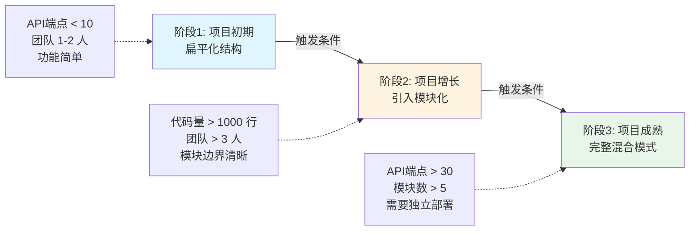
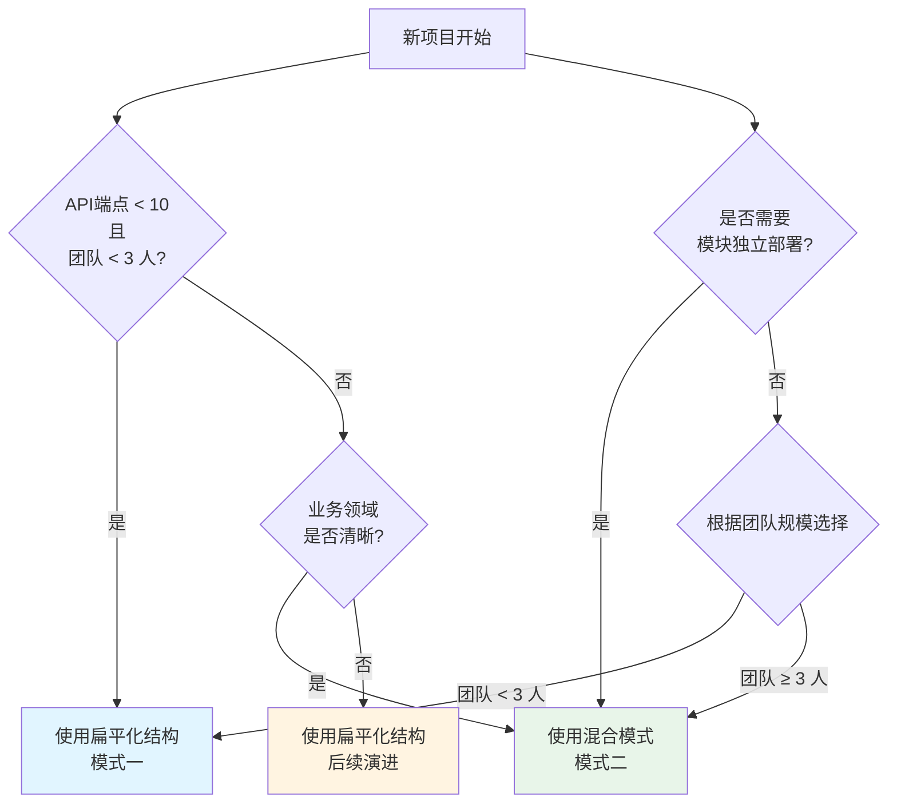
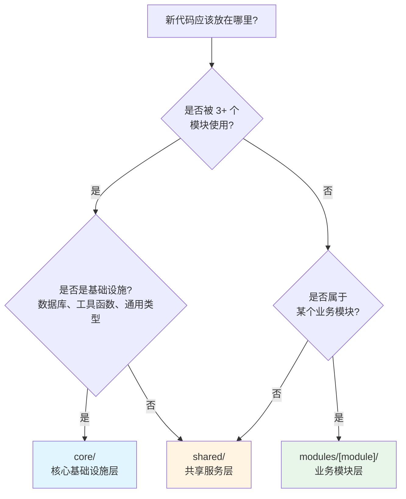
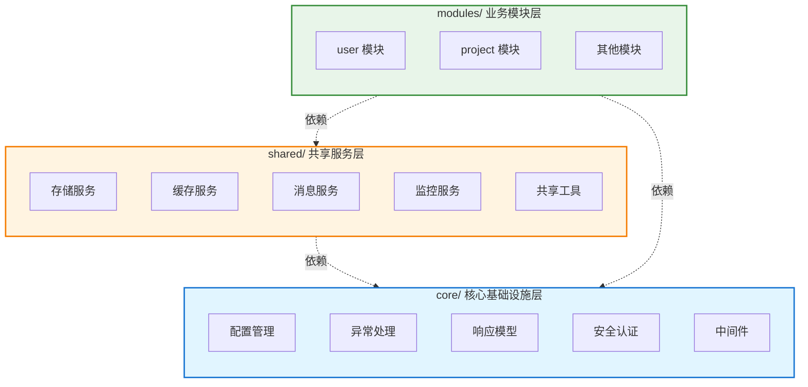
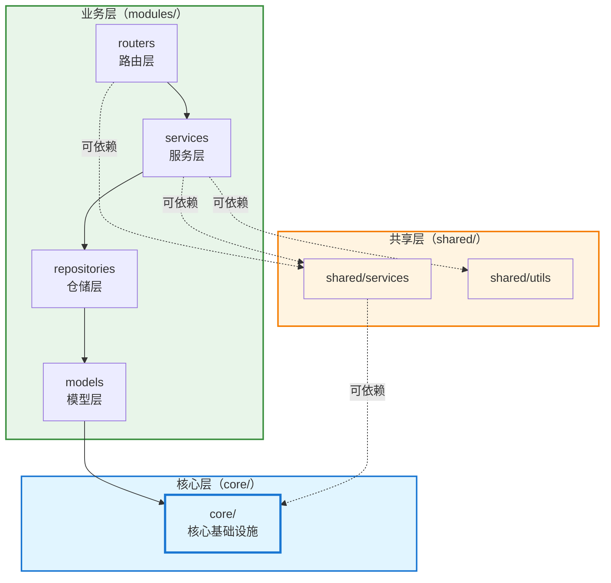
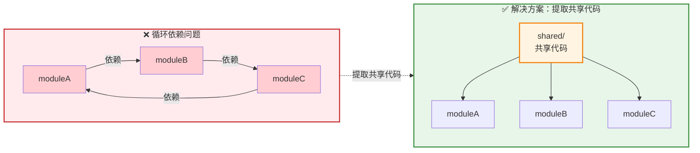
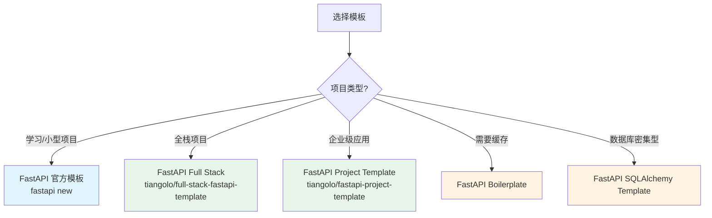

> 本文基于实际 FastAPI 项目经验，从工程化角度分析后端项目结构设计，提取通用的、解耦的架构模式，帮助开发者构建可维护、可扩展、可测试的后端项目。

## 一、工程化结构设计原则

### 1.1 核心设计理念

#### 关注点分离（Separation of Concerns）
将不同职责的代码分离到不同的目录和文件中，确保每个模块只关注自己的核心功能。

**实践要点：**
- API 路由层独立于业务逻辑层
- 数据访问层（Repository）与业务逻辑层（Service）分离
- 配置管理集中化，避免散落各处
- 异常处理统一管理，与业务逻辑分离

#### 单一职责原则（Single Responsibility Principle）
每个文件、每个目录都应该有明确的单一职责。

**示例：**
- `routers.py` 只负责定义 API 路由和处理 HTTP 请求
- `services.py` 只负责业务逻辑处理
- `repositories.py` 只负责数据访问操作
- `models.py` 只定义数据模型

#### 模块化与解耦
通过模块化设计降低代码间的耦合度，提高代码的可复用性和可测试性。

**关键实践：**
- 使用依赖注入（Dependency Injection）实现松耦合
- 通过接口和抽象类定义模块间的契约
- 避免模块间的直接依赖，通过共享服务层通信
- 使用仓储模式（Repository Pattern）抽象数据访问

#### 可维护性与可扩展性
结构设计应该便于后续的维护和扩展。

**设计考虑：**
- 新功能应该能够轻松添加到现有结构中
- 修改某个模块不应该影响其他模块
- 代码结构清晰，新成员能够快速理解
- 支持水平扩展和垂直扩展

#### 类型安全与开发体验
充分利用 Python 的类型提示（Type Hints）和 Pydantic，提升开发效率和代码质量。

**实践建议：**
- 为所有 API 请求和响应定义 Pydantic 模型
- 使用类型提示增强代码可读性
- 利用 IDE 的类型检查提升开发体验
- 使用 mypy 进行静态类型检查

### 1.2 目录组织原则

#### 两种核心设计模式

根据项目规模和复杂度，可以抽象出两种结构形态：**扁平化结构（按技术层次）** 和 **混合模式（功能领域 + 技术层次）**。  
本指南**默认推荐混合模式**作为中大型、长期维护项目的标准结构，扁平化结构主要用于项目早期或教学对比，是向混合模式演进的起点，而不是最终目标结构。

##### 模式一：扁平化结构（按技术层次划分）

> 说明：本模式适合小型/早期项目用于快速起步或教学示例，在项目进入多人协作或业务复杂度提升后，应尽快演进到混合模式结构。

**完整目录结构：**
```
backend/
├── main.py                 # 应用入口
├── config.py              # 配置管理
├── pyproject.toml         # 项目配置和依赖（使用 uv 管理）
├── uv.lock                # 锁定的依赖版本（使用 uv 生成）
│
├── app/
│   ├── __init__.py
│   │
│   ├── api/               # API 路由层
│   │   ├── __init__.py
│   │   ├── router.py      # 路由统一注册
│   │   ├── users.py       # 用户路由
│   │   ├── projects.py    # 项目路由
│   │   └── [module].py    # 其他模块路由
│   │
│   ├── core/              # 核心基础设施层
│   │   ├── __init__.py
│   │   ├── config.py      # 配置管理
│   │   ├── exceptions.py  # 异常定义
│   │   ├── handlers.py    # 异常处理器
│   │   ├── response.py    # 响应模型
│   │   ├── security/       # 安全认证
│   │   │   ├── dependencies.py
│   │   │   └── jwt_handler.py
│   │   └── middleware/     # 中间件
│   │
│   ├── db/                # 数据库层
│   │   ├── __init__.py
│   │   ├── base.py        # 基础模型类
│   │   ├── connection.py  # 数据库连接
│   │   ├── models/        # 数据模型
│   │   │   ├── user.py
│   │   │   └── project.py
│   │   └── repositories/  # 仓储层
│   │       ├── user.py
│   │       └── project.py
│   │
│   ├── schemas/           # Pydantic 模式层
│   │   ├── __init__.py
│   │   ├── common/        # 通用模式
│   │   │   ├── response.py
│   │   │   └── pagination.py
│   │   └── modules/       # 业务模块模式
│   │       ├── user/
│   │       │   ├── requests.py
│   │       │   └── responses.py
│   │       └── [module]/
│   │
│   ├── services/          # 业务逻辑层
│   │   ├── __init__.py
│   │   ├── user_service.py
│   │   ├── project_service.py
│   │   └── [module]_service.py
│   │
│   └── utils/             # 工具函数层
│       ├── __init__.py
│       ├── format.py
│       └── validation.py
│
├── tests/                 # 测试目录
│   ├── __init__.py
│   ├── conftest.py
│   └── test_*.py
│
└── scripts/               # 脚本目录
    └── migrations/        # 数据库迁移
```

**特点：**
- ✅ **认知负担低**：按技术类型分类，直观易懂
- ✅ **路径短**：`app/services/user_service.py`，导入路径简洁
- ✅ **共享代码集中**：通用服务、工具函数天然集中，便于复用
- ✅ **适合小型项目**：结构简单，上手快，开发效率高

**适用场景：**
- 项目初期（< 10 个 API 端点）
- 小型项目（1-2 人团队）
- 功能相对简单，模块边界不清晰
- 快速原型开发

**局限性：**
- ❌ 文件定位困难：`services/` 下文件多时难以快速定位
- ❌ 模块边界模糊：用户相关代码分散在多个目录
- ❌ 并行协作冲突：多人修改同一模块时容易冲突
- ❌ 模块拆分困难：相关代码分散，难以独立拆分

综合来看，扁平化结构更适合作为**向混合模式演进之前的过渡形态**，而不是中大型项目的长期目标结构。

##### 模式二：混合模式（功能领域 + 技术层次）

**完整目录结构：**
```
backend/
├── main.py                 # 应用入口
├── config.py              # 配置管理
├── pyproject.toml         # 项目配置
│
├── app/
│   ├── __init__.py
│   │
│   ├── core/              # 核心基础设施层（技术层次）
│   │   ├── __init__.py
│   │   ├── config.py      # 配置管理
│   │   ├── exceptions/    # 异常定义
│   │   │   ├── __init__.py
│   │   │   ├── base.py
│   │   │   └── handlers.py
│   │   ├── response.py    # 响应模型
│   │   ├── schemas.py     # 通用模式
│   │   ├── security/      # 安全认证
│   │   │   ├── dependencies.py
│   │   │   └── jwt_handler.py
│   │   └── middleware/    # 中间件
│   │
│   ├── db/                # 数据库层（技术层次）
│   │   ├── __init__.py
│   │   ├── base.py        # 基础模型类
│   │   ├── connection.py  # 数据库连接
│   │   └── repositories/  # 基础仓储类
│   │       └── base.py
│   │
│   ├── shared/            # 共享服务层（跨模块）
│   │   ├── __init__.py
│   │   ├── storage/       # 存储服务
│   │   │   └── minio_service.py
│   │   ├── cache/         # 缓存服务
│   │   ├── messaging/     # 消息服务
│   │   └── utils/         # 共享工具函数
│   │
│   ├── modules/           # 业务模块层（功能领域）
│   │   ├── __init__.py
│   │   │
│   │   ├── user/          # 用户模块
│   │   │   ├── __init__.py
│   │   │   ├── models.py      # 模块数据模型
│   │   │   ├── schemas.py     # 模块 Pydantic 模式
│   │   │   ├── repositories.py # 模块仓储
│   │   │   ├── services.py    # 模块服务
│   │   │   ├── routers.py     # 模块路由
│   │   │   └── dependencies.py # 模块依赖
│   │   │
│   │   ├── project/       # 项目模块
│   │   │   ├── __init__.py
│   │   │   ├── models.py
│   │   │   ├── schemas.py
│   │   │   ├── repositories.py
│   │   │   ├── services.py
│   │   │   ├── routers.py
│   │   │   └── dependencies.py
│   │   │
│   │   └── [module]/      # 其他业务模块
│   │
│   └── api/               # API 统一注册层
│       ├── __init__.py
│       └── router.py      # 路由统一注册
│
├── tests/                 # 测试目录
│   ├── __init__.py
│   ├── conftest.py
│   └── modules/           # 按模块组织测试
│       ├── user/
│       └── project/
│
└── scripts/               # 脚本目录
    └── migrations/        # 数据库迁移
```

**特点：**
- ✅ **模块边界清晰**：相关代码集中，易于理解业务逻辑
- ✅ **支持并行协作**：不同模块可并行开发，减少冲突
- ✅ **便于模块拆分**：模块自包含，可独立部署
- ✅ **可扩展性强**：新模块按相同结构添加，结构清晰

**适用场景：**
- 中大型项目（> 10 个 API 端点）
- 多人团队协作（3+ 人）
- 业务领域清晰，模块边界明确
- 需要模块独立部署或复用

**局限性：**
- ❌ 认知负担增加：需要理解"共享 vs 模块特定"的划分
- ❌ 路径变长：`app/modules/user/services.py`
- ❌ 可能重复：模块间可能有相似代码
- ❌ 决策成本：需要判断代码放在共享层还是模块内

#### 渐进式演进路径

项目结构应该随着项目发展而演进，而不是一开始就采用最复杂的结构：



**阶段 1：项目初期（扁平化结构）**
- **适用条件**：API 端点 < 10，团队规模 1-2 人，功能相对简单
- **结构**：扁平化结构（模式一），按技术层次组织

**阶段 2：项目增长（引入模块化）**
- **触发条件**：某个功能代码量 > 1000 行，团队规模 > 3 人，出现明显的业务模块边界
- **结构**：开始模块化，共享代码仍在全局目录，业务代码按模块组织

**阶段 3：项目成熟（完整混合模式）**
- **触发条件**：API 端点 > 30，模块数 > 5，需要模块独立部署
- **结构**：完整混合模式（模式二），core/shared/modules 三层结构

#### 决策树：如何选择设计模式？



#### 代码放置决策树



#### 最佳实践建议

1. **不要过度设计**：项目初期保持简单，使用扁平化结构
2. **及时重构**：当结构成为瓶颈时（文件难以定位、协作冲突增多），及时调整
3. **保持一致性**：一旦选择某种结构，全项目保持一致
4. **文档先行**：为结构划分建立清晰的文档和规范，特别是"共享 vs 模块特定"的划分标准

#### 约定优于配置
建立清晰的命名和结构约定，减少配置和决策成本。

**约定示例：**
- 所有路由文件以 `routers.py` 命名
- 所有服务文件以 `services.py` 命名
- 所有仓储文件以 `repositories.py` 命名
- 统一使用 `__init__.py` 作为模块入口

#### 一致性原则
在整个项目中保持结构、命名、编码风格的一致性。

**一致性体现在：**
- 目录结构模式一致
- 文件命名规范一致
- 代码组织方式一致
- 导入导出方式一致

## 二、标准目录结构设计

### 2.1 根目录结构

```
backend/
├── app/                    # 应用主目录
├── tests/                  # 测试目录
├── scripts/               # 脚本目录
├── docs/                  # 文档目录
├── .env                   # 环境变量配置
├── .env.example           # 环境变量示例
├── .gitignore             # Git 忽略配置
├── pyproject.toml         # 项目配置和依赖（使用 uv 管理）
├── uv.lock                # 锁定的依赖版本（使用 uv 生成）
├── Dockerfile             # 容器化配置
├── docker-compose.yml     # Docker Compose 配置
├── README.md              # 项目文档
└── main.py                # 应用入口文件
```

### 2.2 app/ 核心目录架构

#### 2.2.1 入口与配置层

**职责：** 应用的启动入口和全局配置

**文件说明：**

- `main.py` - 应用入口文件
  - 创建 FastAPI 应用实例
  - 注册中间件、异常处理器
  - 注册路由
  - 配置生命周期管理

- `config.py` - 配置管理
  - 基于 Pydantic Settings 的环境变量管理
  - 类型安全的配置类
  - 配置验证和默认值

#### 2.2.2 API 路由层（Routers）

**职责：** 定义 API 端点，处理 HTTP 请求和响应

**设计原则：**
- 路由只负责接收请求和返回响应
- 业务逻辑委托给服务层处理
- 使用依赖注入获取服务和数据库会话
- 统一使用响应模型格式化输出

**目录结构：**
```
api/
├── __init__.py
└── router.py              # API 路由统一注册器
```

**设计要点：**
- `router.py` 负责聚合所有业务模块的路由
- 使用 `APIRouter` 组织路由
- 统一路由前缀和标签
- 延迟导入模块，避免循环依赖

#### 2.2.3 核心基础设施层（Core）

**职责：** 提供应用的核心基础设施功能

**目录结构：**
```
core/
├── __init__.py
├── config.py              # 配置管理（如果不在根目录）
├── exceptions/            # 异常定义
│   ├── __init__.py
│   ├── base.py           # 基础异常类
│   ├── handlers.py       # 全局异常处理器
│   └── [module]_error.py # 模块特定异常
├── response.py            # 响应模型和工具函数
├── schemas.py             # 通用 Pydantic 模式
├── security/              # 安全认证
│   ├── __init__.py
│   ├── dependencies.py   # 认证依赖注入
│   ├── jwt_handler.py    # JWT 处理
│   └── schemas.py        # 安全相关模式
├── middleware/            # 中间件
│   └── [middleware].py
└── policies/              # 策略模式
    └── [policy].py
```

**设计要点：**
- `exceptions/` 目录统一管理所有异常定义
- `handlers.py` 注册全局异常处理器
- `response.py` 提供统一的响应格式
- `security/` 目录封装认证和授权逻辑

#### 2.2.4 数据库层（Database）

**职责：** 管理数据库连接、模型定义和数据访问

**目录结构：**
```
db/
├── __init__.py
├── base.py                # SQLAlchemy 基础模型类
├── connection.py          # 数据库连接和会话管理
├── models/                # 数据模型（如果使用扁平化结构）
│   ├── __init__.py
│   ├── user.py
│   └── project.py
└── repositories/          # 基础仓储类（如果使用混合模式）
    └── base.py            # 基础仓储抽象类
```

**设计要点：**
- `base.py` 定义 SQLAlchemy 基础模型类
- `connection.py` 管理数据库连接池和会话工厂
- 使用异步 SQLAlchemy（AsyncSession）
- 仓储模式抽象数据访问逻辑

#### 2.2.5 业务模块层（Modules）

**职责：** 实现具体的业务功能

**设计原则：**
- 按业务领域划分模块
- 每个模块包含完整的分层结构
- 模块间通过共享服务层通信
- 避免模块间的直接依赖

**目录结构（完整模块）：**
```
modules/
├── __init__.py
│
├── user/                  # 用户模块
│   ├── __init__.py
│   ├── models.py          # 数据模型
│   ├── schemas.py         # Pydantic 模式（请求/响应）
│   ├── repositories.py    # 数据访问层
│   ├── services.py        # 业务逻辑层
│   ├── routers.py         # API 路由层
│   └── dependencies.py    # 模块依赖注入
│
└── [module]/              # 其他业务模块
```

**设计要点：**
- 每个模块包含完整的分层结构
- `models.py` 定义 SQLAlchemy 数据模型
- `schemas.py` 定义 Pydantic 请求/响应模式
- `repositories.py` 封装数据访问操作
- `services.py` 实现业务逻辑
- `routers.py` 定义 API 端点
- `dependencies.py` 提供模块特定的依赖注入

#### 2.2.6 共享服务层（Shared）

**职责：** 提供跨模块共享的服务和工具

**目录结构：**
```
shared/
├── __init__.py
├── storage/               # 存储服务
│   ├── __init__.py
│   └── minio_service.py   # MinIO 对象存储服务
├── cache/                 # 缓存服务
│   └── redis_service.py
├── messaging/             # 消息服务
│   └── rabbitmq_service.py
├── monitoring/            # 监控服务
│   └── logging_service.py
└── utils/                 # 共享工具函数
    ├── format.py
    └── validation.py
```

**设计要点：**
- 跨模块使用的服务放在 `shared/` 目录
- 按服务类型组织子目录
- 提供统一的接口和依赖注入

#### 2.2.7 工具函数层（Utils）

**职责：** 提供纯函数工具，不依赖业务逻辑

**设计原则：**
- 纯函数，无副作用
- 按功能分类组织
- 充分使用类型提示
- 编写单元测试

**目录结构：**
```
utils/
├── __init__.py
├── format.py              # 格式化工具（日期、数字等）
├── validation.py          # 验证工具（邮箱、手机号等）
├── encryption.py          # 加密工具
└── [category].py          # 其他类别工具
```

**设计要点：**
- 纯函数，不依赖数据库或外部服务
- 按功能分类组织，便于查找和使用
- 使用类型提示，确保类型安全

## 三、模块化设计模式

### 3.1 混合模式详解（推荐用于中大型项目）

混合模式是结合技术层次和功能领域的最佳实践，通过 `core/`、`shared/`、`modules/` 三层结构实现清晰的职责划分。

#### 三层结构说明



**1. core/ - 核心基础设施层**
- **职责**：纯技术基础设施，不包含任何业务逻辑
- **内容**：配置管理、异常处理、响应模型、安全认证、中间件
- **特点**：被所有模块依赖，但不依赖任何业务模块
- **判断标准**：是否与业务无关，是否被所有模块使用

**2. shared/ - 共享服务层**
- **职责**：跨模块共享的服务和工具
- **内容**：存储服务、缓存服务、消息服务、监控服务、共享工具函数
- **特点**：包含业务逻辑，但被多个模块使用
- **判断标准**：是否被 3+ 个模块使用，是否包含业务逻辑

**3. modules/ - 业务模块层**
- **职责**：特定业务领域的完整实现
- **内容**：模块特定的模型、模式、仓储、服务、路由
- **特点**：模块自包含，可独立开发和部署
- **判断标准**：是否只属于某个业务领域

#### 完整混合模式结构示例

```
app/
├── core/                   # 核心基础设施
│   ├── config.py          # 配置管理
│   ├── exceptions/        # 异常定义和处理
│   │   ├── base.py
│   │   └── handlers.py
│   ├── response.py        # 响应模型
│   ├── schemas.py         # 通用模式
│   ├── security/          # 安全认证
│   │   ├── dependencies.py
│   │   └── jwt_handler.py
│   └── middleware/        # 中间件
│
├── db/                    # 数据库层
│   ├── base.py           # 基础模型类
│   ├── connection.py     # 数据库连接
│   └── repositories/     # 基础仓储类
│       └── base.py
│
├── shared/                # 共享服务
│   ├── storage/          # 存储服务
│   ├── cache/            # 缓存服务
│   ├── messaging/        # 消息服务
│   └── utils/            # 共享工具
│
├── modules/               # 业务模块
│   ├── user/             # 用户模块
│   │   ├── models.py
│   │   ├── schemas.py
│   │   ├── repositories.py
│   │   ├── services.py
│   │   ├── routers.py
│   │   └── dependencies.py
│   │
│   └── project/          # 项目模块
│       ├── models.py
│       ├── schemas.py
│       ├── repositories.py
│       ├── services.py
│       ├── routers.py
│       └── dependencies.py
│
└── api/                   # API 统一注册
    └── router.py
```

#### 划分标准详解

**core/ 的判断标准：**
- ✅ 配置管理（环境变量、应用配置）
- ✅ 异常定义和全局异常处理器
- ✅ 统一响应模型和工具函数
- ✅ 安全认证和授权逻辑
- ✅ 中间件（日志、CORS 等）
- ❌ 不包含任何业务逻辑
- ❌ 不依赖任何业务模块

**shared/ 的判断标准：**
- ✅ 被 3+ 个模块使用的服务（存储、缓存、消息等）
- ✅ 跨模块的工具函数
- ✅ 共享的监控和日志服务
- ❌ 只被 1-2 个模块使用的代码（应放在模块内）

**modules/ 的判断标准：**
- ✅ 只属于某个业务领域的代码
- ✅ 模块特定的模型、服务、路由
- ✅ 模块可能独立部署或复用
- ❌ 被多个模块使用的代码（应放在 shared/）

### 3.2 功能模块划分策略

#### 按业务领域划分（Domain-Driven）
以业务领域为核心，将相关的功能组织在一起。

**适用场景：**
- 中大型项目
- 业务领域清晰
- 团队按领域分工

**示例：**
```
modules/
├── user-management/    # 用户管理领域
├── project-management/ # 项目管理领域
└── workflow/           # 工作流领域
```

#### 按功能特性划分（Feature-Based）
以功能特性为核心，将实现某个完整功能的所有代码组织在一起。

**适用场景：**
- 功能边界清晰
- 功能相对独立
- 便于功能模块的复用

**示例：**
```
modules/
├── authentication/     # 认证功能
├── file-upload/        # 文件上传功能
└── data-export/        # 数据导出功能
```

### 3.3 模块内部结构

#### 完整模块结构（适用于大型模块）

**目录结构：**
```
modules/user/
├── __init__.py
├── models.py          # 数据模型（SQLAlchemy）
├── schemas.py         # Pydantic 模式（请求/响应）
├── repositories.py    # 数据访问层
├── services.py        # 业务逻辑层
├── routers.py         # API 路由层
└── dependencies.py    # 依赖注入
```

**特点：**
- 模块完全自包含
- 便于模块独立开发和测试
- 便于模块独立部署或复用
- 适合大型模块（代码量 > 1000 行）

#### 简化模块结构（适用于小型模块）

**目录结构：**
```
modules/user/
├── __init__.py
├── models.py
├── schemas.py
├── routers.py         # 路由中直接包含业务逻辑（简单场景）
└── dependencies.py
```

**特点：**
- 结构简单，易于维护
- 共享代码放在 `shared/` 或 `core/`
- 适合小型模块（代码量 < 500 行）

#### 选择建议

**使用完整结构的情况：**
- 模块代码量 > 1000 行
- 模块可能独立部署
- 模块需要独立测试
- 模块可能被其他项目复用

**使用简化结构的情况：**
- 模块代码量 < 500 行
- 模块功能简单
- 共享代码较多，放在 `shared/` 更合适

#### 模块内基础文件职责说明

- **`models.py`**：定义数据库表结构和 ORM 模型，只关心数据结构和关系映射，不包含业务逻辑。
- **`schemas.py`**：定义 Pydantic 模型，用于请求体验证和响应数据序列化，是 API 与内部领域模型之间的数据契约。
- **`repositories.py`**：封装对数据库的具体读写操作，提供类型安全的 CRUD 与查询接口，不处理业务规则。
- **`services.py`**：实现业务用例，协调仓储、其他服务和外部系统，是业务规则的主要承载者。
- **`routers.py`**：定义 HTTP 路由和入参/出参，负责协议层（HTTP ↔ 领域）的转换，不直接访问数据库。
- **`dependencies.py`**：定义依赖注入函数，例如获取 `UserService`、`AsyncSession`、当前用户等，是模块对外暴露的依赖装配入口。
- **`__init__.py`**：可选地聚合模块内对外暴露的主要类型/函数，方便其他模块通过 `app.modules.user` 等路径进行导入。

**示例：最小模块代码结构**
```python
# modules/user/models.py
class User(Base, TimestampMixin):
    __tablename__ = "users"
    id = Column(UUID(as_uuid=True), primary_key=True, default=uuid4)
    email = Column(String, unique=True, nullable=False)

# modules/user/schemas.py
class UserCreate(BaseModel):
    email: EmailStr

class UserResponse(BaseModel):
    id: UUID
    email: EmailStr

# modules/user/repositories.py
class UserRepository(BaseRepository[User]):
    model = User

    async def get_by_email(self, email: str) -> User | None:
        stmt = select(User).where(User.email == email)
        return await self.scalar(stmt)

# modules/user/services.py
class UserService:
    def __init__(self, repo: UserRepository):
        self.repo = repo

    async def create_user(self, data: UserCreate) -> UserResponse:
        if await self.repo.get_by_email(data.email):
            raise UserAlreadyExistsError()
        user = await self.repo.create(User(**data.model_dump()))
        return UserResponse.model_validate(user)

# modules/user/routers.py
router = APIRouter(prefix="/users", tags=["用户管理"])

@router.post("/", response_model=UserResponse)
async def create_user(
    payload: UserCreate,
    service: UserService = Depends(get_user_service),
):
    return await service.create_user(payload)

# modules/user/dependencies.py
def get_user_service(
    db: AsyncSession = Depends(get_async_db),
) -> UserService:
    repo = UserRepository(db)
    return UserService(repo)
```

### 3.4 模块间依赖管理

#### 依赖方向规则



**依赖规则：**
1. **core/** 不依赖任何其他层（最底层）
2. **shared/** 只能依赖 `core/`
3. **modules/** 可以依赖 `core/` 和 `shared/`，但不能依赖其他 `modules/`
4. **routers** 不应该被其他层依赖（最顶层）

#### 避免循环依赖



**问题示例：**
- moduleA 依赖 moduleB
- moduleB 依赖 moduleC
- moduleC 依赖 moduleA（形成循环依赖）

**解决方案：**

**方案 1：提取共享代码到 shared/**
- 将共同依赖的类型或工具提取到 `shared/` 目录
- 各模块从 `shared/` 导入，而不是相互导入

**方案 2：使用依赖注入**
- 通过参数传递依赖，而不是直接导入
- 降低模块间的直接耦合

**方案 3：重新设计模块边界**
- 合并相关模块
- 拆分大模块
- 调整依赖方向

#### 模块间通信

**推荐方式：**
1. **通过 shared/ 的服务**：跨模块服务放在 `shared/` 目录
2. **通过事件总线**：使用消息队列或事件系统
3. **通过数据库**：通过共享数据表进行通信

**避免方式：**
- ❌ 模块间直接导入
- ❌ 模块间直接调用函数
- ❌ 模块间共享状态（应放在 shared/）

## 四、分层架构设计

### 4.1 API 路由层（Routers）

**职责：** 定义 API 端点，处理 HTTP 请求和响应

**设计原则：**
- 路由只负责接收请求和返回响应
- 业务逻辑委托给服务层处理
- 使用依赖注入获取服务和数据库会话
- 统一使用响应模型格式化输出

**目录结构：**
```
modules/user/
└── routers.py            # 用户模块路由
```

**设计要点：**
- 使用 `APIRouter` 组织路由
- 通过 `Depends()` 注入依赖（服务、数据库会话、认证等）
- 使用 Pydantic 模式验证请求数据
- 返回统一的响应格式

### 4.2 服务层（Services）

**职责：** 实现业务逻辑，协调数据访问和外部服务

**设计原则：**
- 服务层包含所有业务逻辑
- 不直接操作数据库，通过仓储层访问
- 处理业务规则和验证
- 管理事务边界

**目录结构：**
```
modules/user/
└── services.py           # 用户业务逻辑
```

**设计要点：**
- 服务类接收数据库会话作为依赖
- 通过仓储层访问数据
- 处理业务规则和验证逻辑
- 可以调用其他服务或共享服务

### 4.3 仓储层（Repositories）

**职责：** 封装数据访问逻辑，提供数据操作的抽象接口

**设计原则：**
- 仓储层只负责数据访问
- 不包含业务逻辑
- 提供通用的 CRUD 操作
- 支持复杂查询

**目录结构：**
```
modules/user/
└── repositories.py       # 用户数据访问
```

**设计要点：**
- 继承基础仓储类（如果使用）
- 封装 SQLAlchemy 查询逻辑
- 提供类型安全的查询方法
- 支持分页和过滤

### 4.4 模型层（Models）

**职责：** 定义数据模型和数据库表结构

**设计原则：**
- 使用 SQLAlchemy ORM 定义模型
- 模型只包含数据结构定义
- 使用关系映射定义表间关系
- 支持模型继承和混入

**目录结构：**
```
modules/user/
└── models.py             # 用户数据模型
```

**设计要点：**
- 继承 `Base` 模型类
- 定义表名和字段
- 使用关系映射（relationship）
- 支持时间戳和软删除

## 五、核心基础设施设计

### 5.1 配置管理（Config）

**职责：** 管理应用配置和环境变量

**设计原则：**
- 使用 Pydantic Settings 管理配置
- 类型安全的配置类
- 支持环境变量和默认值
- 配置验证和转换

**设计要点：**
- 基于 `BaseSettings` 创建配置类
- 使用 `Field` 定义配置项和描述
- 使用验证器验证配置值
- 支持不同环境的配置

### 5.2 异常处理机制

**职责：** 统一管理异常定义和处理

**设计原则：**
- 定义异常层次结构
- 全局异常处理器统一处理
- 提供详细的错误信息
- 支持业务异常和系统异常

**目录结构：**
```
core/exceptions/
├── __init__.py
├── base.py              # 基础异常类
├── handlers.py          # 全局异常处理器
└── [module]_error.py    # 模块特定异常
```

**设计要点：**
- 基础异常类定义通用异常
- 业务异常继承基础异常类
- 全局异常处理器注册到 FastAPI 应用
- 异常自动转换为统一响应格式

### 5.3 响应模型设计

**职责：** 提供统一的 API 响应格式

**设计原则：**
- 统一的响应结构
- 类型安全的响应模型
- 支持成功和错误响应
- 支持分页响应

**设计要点：**
- 使用 Pydantic 定义响应模型
- 提供响应工具函数
- 支持泛型响应模型
- 包含时间戳和状态码

### 5.4 安全认证设计

**职责：** 实现认证和授权功能

**设计原则：**
- 使用依赖注入实现认证
- 支持 JWT 和 OAuth2
- 权限控制通过策略模式
- 提供认证中间件

**目录结构：**
```
core/security/
├── __init__.py
├── dependencies.py       # 认证依赖注入
├── jwt_handler.py        # JWT 处理
└── schemas.py            # 安全相关模式
```

**设计要点：**
- `dependencies.py` 提供认证依赖函数
- `jwt_handler.py` 处理 JWT 生成和验证
- 使用 `Depends()` 注入认证依赖
- 支持角色和权限检查

## 六、数据库设计

### 6.1 连接管理

**职责：** 管理数据库连接和会话，是所有持久化能力的“入口层”。

**设计原则：**
- 使用异步 SQLAlchemy（`AsyncEngine` + `AsyncSession`）以契合 FastAPI 的异步调用链；
- 通过统一的连接池配置（大小、超时、回收时间等）保证性能与稳定性；
- 利用依赖注入控制会话生命周期（请求开始 → 获取 Session → 请求结束自动释放）；
- 提供健康检查，监控数据库可用性。

**设计要点：**
- 在 `db/connection.py` 创建全局异步引擎和 `async_sessionmaker`；
- 提供 `get_async_db()` 作为 FastAPI 依赖，确保同一请求共享一个 `AsyncSession`；
- 以“Session = 工作单元（Unit Of Work）”的观念设计：事务要么在 Service 层一次性提交，要么整体回滚；
- 预留多数据源扩展位（主库、报表库等分别定义 `engine_xxx`、`get_xxx_db()`）；
- 在健康检查接口中执行轻量查询（如 `SELECT 1`）验证连接。

**示例代码：数据库会话依赖模板**
```python
# db/connection.py
engine = create_async_engine(settings.database_url, pool_size=10, max_overflow=20, pool_recycle=3600)
async_session = async_sessionmaker(engine, class_=AsyncSession, expire_on_commit=False)

async def get_async_db() -> AsyncGenerator[AsyncSession, None]:
    async with async_session() as session:
        try:
            yield session
        finally:
            await session.close()
```

### 6.2 模型设计

**职责：** 定义数据模型和表结构，是数据库中的“真相来源（Single Source of Truth）”。

**设计原则：**
- ORM 模型负责持久化结构；Pydantic 模型负责 API 契约，二者分工明确；
- 所有业务模型统一继承 `Base`，复用主键、时间戳、软删除等通用字段/Mixin；
- 使用关系映射（`relationship`、`ForeignKey`）描述实体关联，减少手写 JOIN；
- 通过模型约束（唯一索引、检查约束等）把关键业务规则下沉到数据库层。

**设计要点：**
- 在 `db/base.py` 定义统一 `Base`，集中导出所有模型供迁移工具使用；
- 在各模块 `models.py` 中继承 `Base`，声明字段类型、索引、关系；
- 对需要审计、软删除的实体使用 Mixin 统一注入字段；
- 通过 `__all__` 或包入口聚合模型，方便 `alembic` 自动发现。

**示例代码：模型模板**
```python
# db/base.py
Base = declarative_base()

class TimestampMixin:
    created_at = Column(DateTime, default=func.now())
    updated_at = Column(DateTime, default=func.now(), onupdate=func.now())

# modules/user/models.py
class User(Base, TimestampMixin):
    __tablename__ = "users"

    id = Column(UUID(as_uuid=True), primary_key=True, default=uuid4)
    email = Column(String, unique=True, index=True, nullable=False)
    organization_id = Column(UUID(as_uuid=True), ForeignKey("organizations.id"))
    organization = relationship("Organization", back_populates="users")
```

### 6.3 仓储模式

**职责：** 抽象数据访问逻辑，把“如何查/写”的细节从业务层剥离出来。

**设计原则：**
- 提供基础仓储类，封装通用 CRUD 与分页、排序、过滤等能力；
- 模块仓储继承基础仓储，补充领域特有查询；
- Service 层只调用仓储方法而不直接持有 Session，保持职责单一；
- 使用类型提示，保证查询结果类型清晰，便于重构。

**设计要点：**
- 在 `db/repositories/base.py` 编写 `BaseRepository`，提供 `get() / list() / create()` 等方法；
- 在模块 `repositories.py` 中继承基础仓储，并实现业务特有的查询语义；
- 在 Service 层通过依赖注入获取 Repository，保持易测性；
- 重要查询编写单元测试，确保重构不会破坏 SQL 语义。

**示例代码：仓储 + Service 模板**
```python
# db/repositories/base.py
class BaseRepository(Generic[ModelType]):
    def __init__(self, session: AsyncSession):
        self.session = session

    async def get(self, pk: Any) -> ModelType | None:
        return await self.session.get(self.model, pk)

# modules/user/repositories.py
class UserRepository(BaseRepository[User]):
    model = User

    async def get_by_email(self, email: str) -> User | None:
        stmt = select(User).where(User.email == email)
        result = await self.session.execute(stmt)
        return result.scalars().first()

# modules/user/services.py
class UserService:
    def __init__(self, repo: UserRepository):
        self.repo = repo

    async def create_user(self, data: UserCreate) -> User:
        if await self.repo.get_by_email(data.email):
            raise UserAlreadyExistsError()
        user = User(**data.model_dump())
        self.repo.session.add(user)
        await self.repo.session.commit()
        await self.repo.session.refresh(user)
        return user
```

### 6.4 多数据源设计（Multiple Data Sources）

实际项目往往不仅只有一个数据库，可能需要同时接入多套关系型数据库、对象存储、缓存或搜索引擎。结构上要提前预留扩展能力。

#### 6.4.1 多个关系型数据库

**典型场景：**
- 主业务库 + 报表库；
- 多租户隔离（不同租户使用不同数据库或 schema）；
- 事务库与历史归档库分离。

**设计思路：**
- 为每个数据库创建独立的 `AsyncEngine`、`async_sessionmaker` 和依赖函数：
  ```python
  engine_app = create_async_engine(settings.database_url)
  engine_analytics = create_async_engine(settings.analytics_url)

  async_session_app = async_sessionmaker(engine_app, class_=AsyncSession, expire_on_commit=False)
  async_session_analytics = async_sessionmaker(engine_analytics, class_=AsyncSession, expire_on_commit=False)

  async def get_app_db():
      async with async_session_app() as session:
          yield session

  async def get_analytics_db():
      async with async_session_analytics() as session:
          yield session
  ```
- 可按数据源拆分 Base 和模型：`BaseApp`、`BaseAnalytics`，避免模型混淆；
- Repository 明确标注所依赖的数据源，Service 组合不同 Repository 完成业务；
- 跨库事务采取“单库强一致 + 跨库最终一致”策略（例如借助事件队列同步报表库）。

#### 6.4.2 不同类型数据源（对象存储、缓存、搜索等）

**典型数据源：**
- 对象存储（MinIO/S3）用于文件与大对象；
- 缓存（Redis）用于热点数据、会话、分布式锁；
- 搜索/日志/分析引擎（Elasticsearch、ClickHouse 等）。

**结构落点：**
- 将这些视为“仓储型服务”，统一放在 `shared/` 层（如 `shared/storage/minio_service.py`、`shared/cache/redis_service.py`）；
- Service 通过依赖注入使用这些服务，避免在业务层到处 new 客户端；
- 定义抽象接口（如 `StorageService`、`CacheService`），便于未来替换实现；
- 关系型数据库仍是“真相来源”，缓存/对象存储等作为扩展能力，并通过 Service 层协调写入顺序与一致性策略。

## 七、命名规范与约定

### 7.1 文件命名规范

#### Python 文件
- **路由文件：** `routers.py`
  - 示例：`modules/user/routers.py`
- **服务文件：** `services.py`
  - 示例：`modules/user/services.py`
- **仓储文件：** `repositories.py`
  - 示例：`modules/user/repositories.py`
- **模型文件：** `models.py`
  - 示例：`modules/user/models.py`
- **模式文件：** `schemas.py`
  - 示例：`modules/user/schemas.py`

#### 配置文件
- **规范：** snake_case
- **示例：** `config.py`、`database.py`

### 7.2 目录命名规范

#### 推荐方式
- **小写字母 + 下划线：** `user_management/`、`project_list/`
- **纯小写字母：** `core/`、`db/`、`shared/`

#### 不推荐
- 驼峰命名：`userManagement/`（不符合 Python 规范）
- 大写字母：`UserManagement/`（跨平台兼容性问题）

### 7.3 类和函数命名规范

#### 类命名
- **规范：** PascalCase
- **示例：** `UserService`、`UserRepository`、`UserModel`

#### 函数命名
- **规范：** snake_case
- **示例：** `get_user_by_id`、`create_user`、`update_user`

### 7.4 导入导出规范

#### 统一使用 __init__.py
- 每个目录都应该有一个 `__init__.py` 作为模块入口
- 统一导出目录下的重要内容，简化导入路径
- 例如：`modules/user/__init__.py` 导出该模块的主要类

#### 导入顺序
1. 标准库导入
2. 第三方库导入
3. 本地应用导入

## 八、工程化配置

### 8.1 依赖管理

#### pyproject.toml 配置
- 使用 `pyproject.toml` 管理项目配置和依赖
- 定义项目元数据和依赖版本
- 支持开发依赖和可选依赖

#### 虚拟环境管理
- 使用 `uv` 或 `poetry` 管理虚拟环境
- 锁定依赖版本，确保环境一致性
- 支持多环境配置

> 💡 **推荐使用 uv**：uv 是由 Astral（Ruff 的开发者）开发的极快 Python 包管理器，使用 Rust 编写，比 pip 快 10-100 倍。它集成了包管理、虚拟环境、Python 版本管理、脚本运行等功能，可以替代 pip、pip-tools、pipx、poetry、virtualenv 等多个工具。详细使用指南请参考：[uv Python 包管理器使用指南](https://blog.mapin.net/posts/uv%20Python%20%E5%8C%85%E7%AE%A1%E7%90%86%E5%99%A8%E4%BD%BF%E7%94%A8%E6%8C%87%E5%8D%97)。

### 8.2 环境配置

#### 环境变量管理
- 使用 `.env` 文件管理环境变量
- 提供 `.env.example` 作为模板
- 使用 Pydantic Settings 加载和验证

#### 多环境支持
- 支持开发、测试、生产环境
- 不同环境使用不同配置
- 敏感信息通过环境变量注入

### 8.3 代码质量工具

#### Black（代码格式化）
- 统一代码格式化规则
- 自动格式化代码
- 集成到开发流程

#### isort（导入排序）
- 自动排序导入语句
- 按标准库、第三方、本地应用分组
- 与 Black 配合使用

#### mypy（类型检查）
- 静态类型检查
- 提升代码质量
- 发现潜在错误

#### pylint/flake8（代码检查）
- 代码风格检查
- 发现代码问题
- 提升代码质量

### 8.4 测试配置

#### pytest 配置
- 使用 pytest 作为测试框架
- 配置测试目录和文件命名
- 支持异步测试

#### 测试目录结构
```
tests/
├── __init__.py
├── conftest.py          # pytest 配置和 fixtures
└── modules/             # 按模块组织测试
    ├── user/
    │   ├── test_models.py
    │   ├── test_services.py
    │   └── test_routers.py
    └── project/
```

## 九、最佳实践与建议

### 9.1 目录深度控制

#### 建议不超过 4 层嵌套
**好的结构：**
```
app/
├── modules/
│   └── user/
│       └── services.py  # 3 层
```

**避免过深：**
```
app/
├── features/
│   └── user-management/
│       └── business/
│           └── logic/
│               └── services.py  # 5 层，过深！
```

#### 保持结构扁平化
- 优先考虑扁平化结构
- 只有在确实需要时才增加嵌套层级
- 使用清晰的命名减少对深层嵌套的需求

### 9.2 代码组织原则

#### 就近原则（相关代码放在一起）
将相关的代码放在同一个目录或附近，便于查找和维护。

**示例：**
```
modules/user/
├── models.py
├── schemas.py
├── repositories.py
├── services.py
└── routers.py
```
这些文件都相关，放在一起更合理。

#### 单一数据源（避免重复定义）
同一个数据或类型只在一个地方定义，其他地方通过导入使用。

**避免：**
- 在多个文件中重复定义相同的模型或模式
- 导致维护困难，修改时需要同步多个地方

**推荐：**
- 在 `models.py` 或 `schemas.py` 中统一定义
- 其他地方通过导入使用，确保单一数据源

#### 关注点分离
不同职责的代码应该分离到不同的文件或目录。

**示例：**
- API 路由逻辑 → `routers.py`
- 业务逻辑 → `services.py`
- 数据访问逻辑 → `repositories.py`
- 数据模型 → `models.py`

### 9.3 可维护性提升

#### 清晰的目录结构
- 目录名称应该清晰表达其用途
- 遵循一致的命名规范
- 使用 `README.md` 说明复杂目录的用途

#### 一致的命名规范
在整个项目中保持命名规范的一致性：
- 文件命名规范统一
- 类命名规范统一
- 函数命名规范统一

#### 完善的类型定义
- 为所有函数参数和返回值添加类型提示
- 使用 Pydantic 模型定义 API 请求和响应
- 避免使用 `Any` 类型

#### 适当的注释和文档
- 为复杂逻辑添加注释，说明设计思路和实现细节
- 为公共 API 添加文档字符串（docstring）
- 在关键目录添加 `README.md` 说明，解释目录用途和设计原则

## 十、常见问题与解决方案

### 10.1 循环依赖问题

#### 问题描述
模块 A 依赖模块 B，模块 B 又依赖模块 A，形成循环依赖。

#### 解决方案

**方案 1：提取共享代码到 shared/**
- 将共同依赖的类型或工具提取到 `shared/` 目录
- 各模块从 `shared/` 导入，而不是相互导入

**方案 2：使用依赖注入**
- 通过参数传递依赖，而不是直接导入
- 降低模块间的直接耦合

**方案 3：重新设计模块边界**
- 合并相关模块
- 拆分大模块
- 调整依赖方向

### 10.2 类型定义重复

#### 问题描述
同一个类型在多个地方定义，导致维护困难。

#### 解决方案

**统一类型定义位置：**
- 在 `schemas.py` 中统一定义模块的所有 Pydantic 模式
- 其他地方统一从该文件导入，避免重复定义

**使用类型工具：**
- 使用 Pydantic 的模型继承和组合
- 通过模型组合和推导减少类型定义

### 10.3 模块边界模糊

#### 问题描述
不清楚某个功能应该放在哪个模块，导致代码组织混乱。

#### 解决方案

**明确模块职责：**
- 为每个模块定义清晰的职责范围
- 使用文档说明模块的边界
- 定期审查和重构模块结构

**建立模块规范：**
- 为每个模块创建 `README.md` 文档
- 明确模块的职责范围和不包含的内容
- 说明模块的边界和与其他模块的关系

### 10.4 代码组织混乱

#### 问题描述
随着项目发展，代码组织变得混乱，难以维护。

#### 解决方案

**定期重构：**
- 定期审查目录结构
- 重构不符合规范的代码
- 提取重复代码到公共层

**建立代码审查机制：**
- 在 PR 中检查代码组织
- 使用工具检查目录结构
- 制定代码组织规范文档

**使用工具辅助：**
- 使用 pylint/flake8 检查导入路径
- 使用工具检查循环依赖
- 使用代码分析工具识别问题

## 十一、总结

### 工程化结构设计的核心目标

1. **可维护性**：清晰的目录结构使代码易于理解和修改
2. **可扩展性**：模块化设计便于添加新功能
3. **可测试性**：良好的结构使单元测试和集成测试更容易
4. **团队协作**：统一的规范减少沟通成本，提高开发效率
5. **类型安全**：完善的类型定义提升代码质量和开发体验

### 关键设计原则回顾

1. **关注点分离**：不同职责的代码分离到不同目录
2. **单一职责**：每个文件、每个目录都有明确的单一职责
3. **模块化与解耦**：通过模块化设计降低代码耦合度
4. **约定优于配置**：建立清晰的命名和结构约定
5. **一致性原则**：在整个项目中保持结构、命名的一致性

### 实践建议

1. **渐进式演进**：从扁平化结构开始，根据项目发展逐步演进到混合模式
2. **明确划分标准**：建立清晰的"core/shared/modules"划分标准，减少决策成本
3. **团队共识**：确保团队成员理解并遵循结构规范，特别是代码放置的决策树
4. **定期审查**：定期审查目录结构，及时重构不符合规范的部分
5. **文档维护**：保持文档与代码同步，及时更新结构说明和划分标准

### 设计模式选择总结

| 维度 | 扁平化结构 | 混合模式 |
|------|-----------|---------|
| **适用规模** | 小型项目（< 10 API端点） | 中大型项目（> 10 API端点） |
| **团队规模** | 1-2 人 | 3+ 人 |
| **认知负担** | 低 | 中等 |
| **路径长度** | 短 | 较长 |
| **模块边界** | 模糊 | 清晰 |
| **并行协作** | 容易冲突 | 支持良好 |
| **模块拆分** | 困难 | 容易 |
| **可扩展性** | 中等 | 高 |

**核心原则：**
- **不要过度设计**：项目初期保持简单，使用扁平化结构
- **及时演进**：当结构成为瓶颈时（文件难以定位、协作冲突增多），及时调整
- **保持一致性**：一旦选择某种结构，全项目保持一致
- **文档先行**：为结构划分建立清晰的文档和规范

### 结语

良好的工程化结构是项目成功的基础。虽然初期可能需要一些额外的时间来建立和维护结构，但这些投入会在项目的长期维护中带来巨大的回报。

**关键洞察：**
1. **没有完美的结构，只有适合项目的结构**：根据项目规模、团队规模、业务复杂度选择
2. **结构应该渐进式演进**：从简单开始，随项目发展逐步复杂化
3. **明确的划分标准比复杂的结构更重要**：清晰的决策树能减少团队决策成本

根据项目的实际情况，灵活应用本文档中的原则和建议，构建属于你的工程化项目结构。记住，最好的结构是能够支持团队高效协作、代码易于维护和扩展的结构。

---

## 十二、快速启动模板仓库

以下是一些优秀的 FastAPI 工程化模板仓库，可以直接使用或作为参考：

### 官方模板

#### 1. FastAPI 官方模板
- **创建命令**：`fastapi new my-app`
- **特点**：
  - FastAPI 官方维护，最权威的模板
  - 包含基础项目结构
  - 使用 Pydantic 和 SQLAlchemy
  - 结构简洁，适合快速开始
- **适用场景**：学习、小型项目、快速原型

### 社区优秀模板

#### 2. FastAPI Full Stack
- **GitHub**：`tiangolo/full-stack-fastapi-template`
- **技术栈**：FastAPI + SQLAlchemy + PostgreSQL + Docker
- **特点**：
  - FastAPI 作者维护的完整模板
  - 包含前端（Vue）和后端
  - 完整的认证和授权系统
  - Docker 容器化支持
- **适用场景**：全栈项目快速启动
- **推荐指数**：⭐⭐⭐⭐⭐

#### 3. FastAPI Project Template
- **GitHub**：`tiangolo/fastapi-project-template`
- **技术栈**：FastAPI + SQLAlchemy + PostgreSQL
- **特点**：
  - 官方推荐的项目模板
  - 包含完整的项目结构
  - 支持 Docker 部署
  - 文档完善
- **适用场景**：中大型项目
- **推荐指数**：⭐⭐⭐⭐⭐

#### 4. FastAPI Boilerplate
- **GitHub**：搜索 `fastapi-boilerplate`
- **技术栈**：FastAPI + SQLAlchemy + PostgreSQL + Redis
- **特点**：
  - 企业级项目模板
  - 包含完整的认证系统
  - 支持 Redis 缓存
  - 包含测试配置
- **适用场景**：企业级应用

#### 5. FastAPI SQLAlchemy Template
- **GitHub**：搜索 `fastapi-sqlalchemy-template`
- **技术栈**：FastAPI + SQLAlchemy + PostgreSQL
- **特点**：
  - 专注于 SQLAlchemy 集成
  - 包含仓储模式实现
  - 支持异步数据库操作
- **适用场景**：数据库密集型应用

### 模板选择指南



### 推荐使用方式

1. **学习阶段**：
   - 使用官方模板 `fastapi new`
   - 从零开始理解结构，参考本文档的设计原则

2. **快速开发**：
   - 使用社区成熟模板（如 `fastapi-project-template`）
   - 快速搭建项目，专注于业务开发

3. **自定义需求**：
   - 基于本文档的设计原则
   - 参考模板仓库的结构
   - 根据项目需求自行搭建

### 模板对比表

| 模板名称 | 技术栈 | 适用规模 | 推荐场景 | 维护状态 |
|---------|--------|---------|---------|---------|
| **FastAPI 官方模板** | FastAPI | 小型 | 学习、原型 | ⭐⭐⭐⭐⭐ |
| **FastAPI Full Stack** | FastAPI + Vue | 中大型 | 全栈项目 | ⭐⭐⭐⭐⭐ |
| **FastAPI Project Template** | FastAPI + SQLAlchemy | 中大型 | 企业级应用 | ⭐⭐⭐⭐⭐ |
| **FastAPI Boilerplate** | FastAPI + Redis | 中大型 | 需要缓存的应用 | ⭐⭐⭐⭐ |
| **FastAPI SQLAlchemy Template** | FastAPI + SQLAlchemy | 中大型 | 数据库密集型 | ⭐⭐⭐⭐ |

### 使用模板的注意事项

1. **理解结构**：不要直接使用，先理解模板的目录结构设计
2. **按需调整**：根据项目需求调整结构，删除不需要的功能
3. **保持规范**：遵循本文档的设计原则，确保结构清晰
4. **渐进演进**：从简单结构开始，随项目发展逐步演进
5. **关注更新**：定期关注模板的更新，但不要盲目升级

---

## 参考资源

### 官方文档
- [FastAPI 官方文档](https://fastapi.tiangolo.com/)
- [Python 官方文档](https://docs.python.org/)
- [SQLAlchemy 官方文档](https://docs.sqlalchemy.org/)
- [Pydantic 官方文档](https://docs.pydantic.dev/)

### 相关工具
- [Black 代码格式化](https://black.readthedocs.io/)
- [isort 导入排序](https://pycqa.github.io/isort/)
- [mypy 类型检查](https://mypy.readthedocs.io/)
- [pytest 测试框架](https://docs.pytest.org/)

