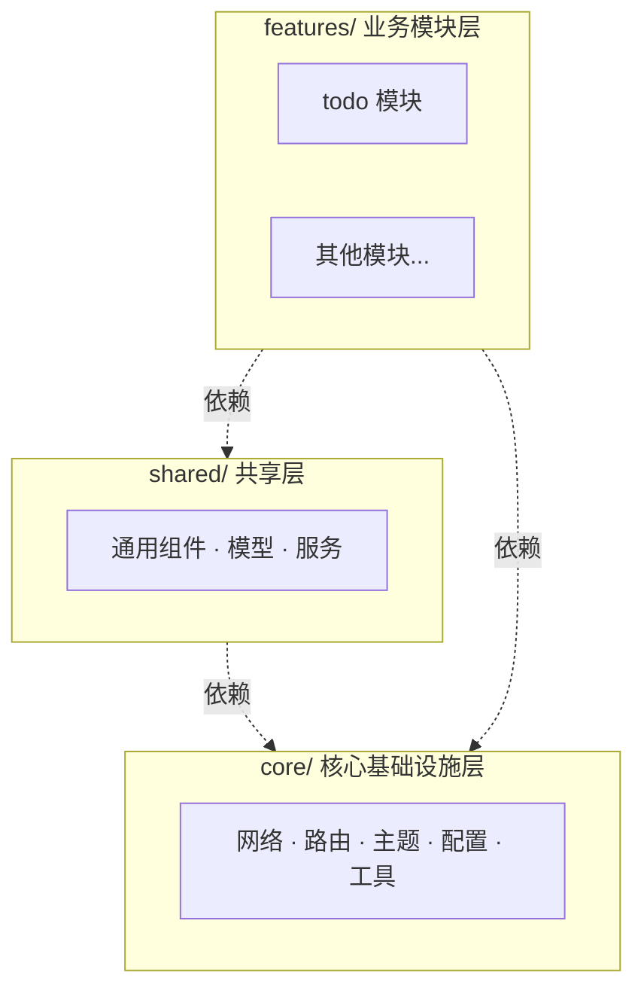
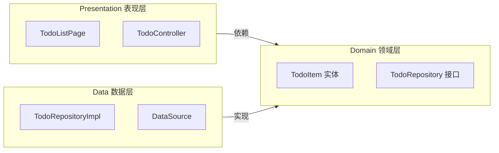
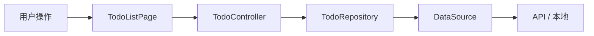
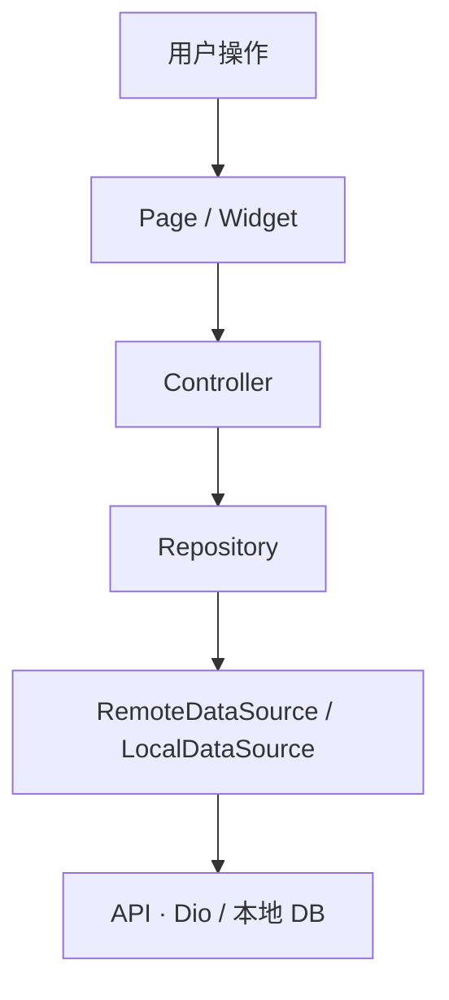
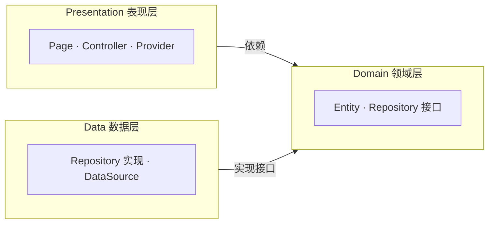

> 本文面向有编程经验但 Flutter 零基础的开发者，提供结构清晰、层次分明的项目架构与开发手册。涵盖目录设计、核心工具概念、数据流与快速上手，可作为日常开发的参考手册。

**适用场景**：本文采用**最健壮**的工程化设计，面向多人协作、功能模块较多、需长期维护的项目，直接按此结构落地即可。

### 生态概览（本文采用的技术栈）

以下为本文推荐并贯穿全文示例的技术选型，便于与 Flutter 生态一一对应：

| 类别 | 选型 | 说明 |
|------|------|------|
| **状态管理 / 依赖注入** | Riverpod | 官方推荐，状态 + DI 一体，与 Flutter 3 生态契合 |
| **路由** | GoRouter | 声明式、路径驱动，支持 redirect、深链、嵌套路由 |
| **网络** | Dio | 拦截器、超时、取消，配合 Repository 使用 |
| **数据类 / 序列化** | freezed + json_serializable | 不可变模型、`copyWith`、JSON ↔ 模型 |
| **UI 组件** | **Cupertino** | iOS 风格组件（CupertinoButton、CupertinoListTile、CupertinoNavigationBar 等），根容器使用 `CupertinoApp` |
| **本地存储** | shared_preferences | 键值对存储（如 Token、简单配置） |
| **开发 / 构建** | FVM + build_runner | FVM 管理 Flutter 版本，build_runner 驱动 Riverpod/freezed/json_serializable 代码生成 |
| **测试** | flutter_test + integration_test | 单元测试、Widget 测试、集成测试 |

业务页面与 shared 组件统一使用 **Cupertino** 系组件，保持 iOS 风格一致；`core/theme` 可采用 Cupertino 配色与文字风格。

---

## 一、Flutter 核心概念速览

在进入架构之前，先理解 Flutter 的底层思维，便于你快速建立心智模型。

### 1.1 一切皆 Widget

Flutter 的 UI 由 **Widget** 组成，类似于 Vue 的组件、React 的 Component。

| 概念 | 类比 | 说明 |
|------|------|------|
| **Widget** | Vue 组件 / React 组件 | UI 的构建块，可以是按钮、文本、布局容器 |
| **StatefulWidget** | 有状态的组件 | 内部有可变数据，数据变化会触发重建 |
| **StatelessWidget** | 无状态组件 | 纯展示，无内部可变状态 |
| **BuildContext** | Vue 的 `this` / React 的 context | 当前 Widget 在树中的位置，用于获取主题、路由等 |

**关键理解**：Widget 是**不可变的**（immutable）。要更新 UI，不是修改 Widget，而是用新数据**重建** Widget 树。状态管理（如 Riverpod）的本质，就是「谁持有数据、谁触发重建」。

### 1.2 Dart 语言要点（有经验者可略读）

- **空安全**：变量默认非空，需显式加 `?` 表示可空，如 `String? name`
- **异步**：`Future` 类似 Promise，`async/await` 语法与 JS 一致
- **没有 `new`**：`User()` 即可，`new` 可选
- **级联操作符**：`obj..a = 1..b = 2` 连续调用，返回原对象

---

## 二、项目目录结构（完整版）

基于 **Core / Shared / Features** 混合模式 + **Data / Domain / Presentation** 分层，推荐结构如下。

三层结构关系（谁依赖谁）：



完整目录树（以 **Todo 模块**为例展开）：

```
lib/
├── main.dart                    # 入口：初始化 App、Provider、Router
├── app.dart                     # 根组件：Theme、Router 配置
│
├── core/                        # 核心基础设施（框架级，与业务无关）
│   ├── config/                  # 环境配置
│   │   └── env.dart
│   ├── network/                 # 网络层
│   │   ├── dio_client.dart      # Dio 封装
│   │   └── api_interceptor.dart # 拦截器（Token、错误处理）
│   ├── router/                  # 路由
│   │   └── app_router.dart
│   ├── theme/                   # 主题（Cupertino 风格配色与文字）
│   │   └── app_theme.dart
│   ├── location/                # 定位能力（设备级）
│   │   └── location_service.dart
│   ├── utils/                   # 纯工具函数
│   │   └── validators.dart
│   └── exceptions/              # 全局异常定义
│       └── app_exception.dart
│
├── shared/                      # 共享层（跨 Feature 复用）
│   ├── components/              # 通用 UI 组件
│   │   ├── app_button.dart
│   │   ├── app_loading.dart
│   │   └── app_error_widget.dart
│   ├── models/                  # 通用数据模型
│   └── services/                # 通用服务（多 Feature 共用时放入）
│       └── storage_service.dart
│
└── features/                    # 业务模块（按功能领域划分）
    └── todo/                    # 示例：待办模块
        ├── data/                # 数据层
        │   ├── dtos/            # 数据传输对象（API JSON 结构）
        │   │   └── todo_item_dto.dart
        │   ├── datasources/
        │   │   ├── remote/      # 远程 API
        │   │   │   └── todo_remote_datasource.dart
        │   │   └── local/       # 本地存储（缓存、DB，按需）
        │   │       └── todo_local_datasource.dart
        │   └── repositories/
        │       └── todo_repository_impl.dart
        │
        ├── domain/              # 领域层（按需添加，见 2.3 节）
        │   ├── entities/        # 业务实体
        │   │   └── todo_item.dart
        │   └── repositories/    # 仓储接口（抽象，简单模块可省略）
        │       └── todo_repository.dart
        │
        └── presentation/       # 表现层
            ├── providers/       # Riverpod Provider 定义
            │   └── todo_providers.dart
            ├── controllers/     # 状态逻辑（Notifier）
            │   └── todo_controller.dart
            ├── pages/           # 页面（Scaffold）
            │   └── todo_list_page.dart
            └── widgets/         # 模块内私有组件
                └── todo_item_tile.dart
```

### 2.2 分层设计思路：为什么是 Data / Domain / Presentation？

以 **Todo 模块**为例：列表从哪来、谁管状态、谁管 UI，各层只做一件事，改一层时其它层少动，便于长期维护和测试。

**三层与依赖方向**（Domain 最内层、最稳定）：



- **Data**：列表从哪来（API/本地）、谁发请求、谁存数据；DTO、DataSource、Repository 实现。换 API 或加缓存只改这里。
- **Domain**：业务里「待办」长什么样（Entity）、对外能力是什么（Repository 接口）。便于测试 Mock、以后换实现。
- **Presentation**：谁提供依赖（Provider）、谁管列表状态和加载/错误（Controller）、谁只负责展示和点击（Page/Widget）。

**Todo 数据流**（一次操作如何穿过各层）：



### 2.3 Domain 层何时引入（YAGNI）

| 场景 | 建议 |
|------|------|
| **简单 CRUD、单一数据源** | 可省略 domain，data 层直接提供 Repository 实现类，presentation 直接依赖 |
| **需 Mock 测试、多数据源切换** | 引入 domain 层，定义 Repository 接口，data 实现 |
| **复杂业务规则、多实体协作** | 引入完整 domain 层（entities + 接口） |

**原则**：默认可不建 domain，仅在「需要抽象」时再引入，避免过度设计。

### 2.4 目录职责速查表

| 目录 | 职责 | 依赖方向 |
|------|------|----------|
| `core/` | 框架配置、网络、路由、主题、定位 | 被所有层依赖 |
| `shared/` | 跨 Feature 的组件、模型、服务 | 被 features 依赖 |
| `features/*/data/` | 获取与持久化数据（API、DB） | 实现 domain 接口 |
| `features/*/domain/` | 业务实体与仓储接口 | 无依赖（最纯粹） |
| `features/*/presentation/` | UI、状态、用户交互 | 依赖 domain |

---

## 三、核心工具与概念详解

以下工具是构建现代 Flutter 项目的标配，理解它们能大幅提升开发效率。

### 3.1 Riverpod —— 依赖注入与状态管理

**是什么**：Riverpod 是 Flutter 官方推荐的**状态管理 + 依赖注入**方案，可类比为 Vue 的 Pinia + 全局 DI 容器。

**核心概念**：

| 概念 | 说明 | 类比 |
|------|------|------|
| **Provider** | 声明「如何创建/获取」某个对象或状态 | Vue 的 `provide/inject`、FastAPI 的 `Depends` |
| **ref.watch** | 监听 Provider，数据变化时自动重建 Widget | Vue 的 `computed` / `watch` |
| **ref.read** | 一次性读取，不监听变化 | 直接调用 |
| **Notifier** | 持有状态并处理业务逻辑的类 | Vue 的 Store、Pinia store |
| **AsyncNotifier** | 处理异步状态（加载中/成功/失败） | 带 loading/error 的 Store |

**典型用法**（以 Todo 模块为例）：

```dart
// 1. 定义 Provider（依赖注入）
final todoRepositoryProvider = Provider((ref) {
  final dio = ref.watch(dioProvider);
  return TodoRepositoryImpl(api: dio);
});

// 2. 定义状态 Provider（状态管理）
final todoControllerProvider = NotifierProvider<TodoController, AsyncValue<List<TodoItem>>>(() {
  return TodoController();
});

// 3. 在 Widget 中使用
class TodoListPage extends ConsumerWidget {
  @override
  Widget build(BuildContext context, WidgetRef ref) {
    final todoState = ref.watch(todoControllerProvider);  // 自动注入 + 监听
    return todoState.when(
      loading: () => CircularProgressIndicator(),
      error: (e, _) => Text('错误: $e'),
      data: (items) => ListView.builder(
        itemCount: items.length,
        itemBuilder: (_, i) => TodoItemTile(item: items[i]),
      ),
    );
  }
}
```

**为什么选 Riverpod**：一个工具同时解决「谁创建对象」和「谁持有状态」，减少样板代码，与 Flutter 3 生态契合。

**推荐：Riverpod Generator（代码生成）**

使用 `@riverpod` 注解可自动生成 Provider，减少手写样板，是当前更流行的写法：

```dart
// 使用 @riverpod 注解，运行 build_runner 后自动生成 todoRepositoryProvider
@riverpod
TodoRepository todoRepository(TodoRepositoryRef ref) {
  final dio = ref.watch(dioProvider);
  return TodoRepositoryImpl(api: dio);
}

// AsyncNotifier 自动生成 provider
@riverpod
class TodoController extends _$TodoController {
  @override
  Future<List<TodoItem>> build() async => ref.read(todoRepositoryProvider).fetchList();

  Future<void> addItem(String title) async {
    state = const AsyncLoading();
    state = await AsyncValue.guard(() => ref.read(todoRepositoryProvider).add(title));
  }
}
```

在 Widget 中用法不变：`ref.watch(todoControllerProvider)`。需在 `pubspec.yaml` 添加 `riverpod_generator`，并运行 `dart run build_runner build`。

---

### 3.2 Dio —— HTTP 客户端

**是什么**：Dart 最流行的 HTTP 库，类似 Axios，支持拦截器、超时、取消等。

**在项目中的位置**：`core/network/dio_client.dart`，封装单例，供各 Repository 使用。

**典型封装**：

```dart
// core/network/dio_client.dart
final dioProvider = Provider((ref) {
  final dio = Dio(BaseOptions(
    baseUrl: Env.apiBaseUrl,
    connectTimeout: Duration(seconds: 10),
  ));
  dio.interceptors.add(AuthInterceptor());  // Token 注入
  dio.interceptors.add(LogInterceptor());   // 请求日志
  return dio;
});
```

**与 Repository 的关系**：Repository 通过 `ref.watch(dioProvider)` 获取 Dio 实例，调用 `dio.get('/todos')` 等，不直接在各处 new Dio。

---

### 3.3 GoRouter —— 声明式路由

**是什么**：Flutter 官方推荐的声明式路由库，支持深层链接、路由守卫、嵌套路由。

**核心概念**：

| 概念 | 说明 |
|------|------|
| **GoRoute** | 定义一条路由（path、页面、子路由） |
| **GoRouter** | 路由配置的根对象 |
| **context.go('/path')** | 跳转并替换栈 |
| **context.push('/path')** | 压栈跳转 |
| **redirect** | 路由守卫，如根据登录态重定向 |

**典型配置**：

```dart
// core/router/app_router.dart
final goRouter = GoRouter(
  initialLocation: '/todos',
  redirect: (context, state) {
    // 例如：未登录时重定向到登录页
    // final isLoggedIn = ref.read(authStateProvider).valueOrNull != null;
    // if (!isLoggedIn && !state.matchedLocation.startsWith('/login')) return '/login';
    return null;  // 不重定向
  },
  routes: [
    GoRoute(path: '/todos', builder: (_, __) => TodoListPage()),
  ],
);
```

---

### 3.4 freezed —— 不可变数据类

**是什么**：代码生成库，自动生成 `copyWith`、`==`、`hashCode`、`toString`，让数据类不可变且易用。

**为什么需要**：Dart 没有 data class，手写上述方法繁琐且易错。freezed 类似 Kotlin 的 `data class`、TypeScript 的 `interface` + 工具函数。

**典型用法**（以 TodoItem 为例）：

```dart
// 定义
@freezed
class TodoItem with _$TodoItem {
  const factory TodoItem({
    required String id,
    required String title,
    @Default(false) bool completed,
  }) = _TodoItem;

  factory TodoItem.fromJson(Map<String, dynamic> json) => _$TodoItemFromJson(json);
}

// 使用
final item = TodoItem(id: '1', title: '写文档');
final done = item.copyWith(completed: true);  // 新对象，原对象不变
```

---

### 3.5 json_serializable —— JSON 序列化

**是什么**：配合 freezed 或单独使用，自动生成 `fromJson` / `toJson`，处理 API 返回的 JSON。

**与 freezed 配合**：在 freezed 类中加 `factory TodoItem.fromJson(...)`，运行 `dart run build_runner build` 生成 `*.g.dart`、`*.freezed.dart`。

**DTO 与 Entity**：从 API 拿到的用 DTO（字段可与后端一致），转换后得到 Entity（面向 UI 的干净模型）。转换逻辑放在 Repository。

---

### 3.6 其他常用工具

| 工具 | 用途 |
|------|------|
| **Cupertino**（flutter 内置） | iOS 风格组件库，本文业务 UI 统一使用（CupertinoApp、CupertinoButton、CupertinoListTile 等） |
| **logger** | 统一日志格式，可过滤级别 |
| **shared_preferences** | 键值对本地存储（类似 localStorage） |
| **geolocator** | 定位（GPS） |
| **google_maps_flutter** / **flutter_map** | 地图组件 |

---

## 四、数据流与分层协作

理解「数据从哪来、往哪去」，是写好架构的关键。

### 4.1 数据流向图

以 Todo 为例：用户操作（拉列表、新增、勾选、删除）经 Page 调用 Controller，Controller 调 Repository，Repository 调 DataSource，最终到达 API 或本地存储。



### 4.2 各层职责

| 层级 | 职责 | 不做什么 |
|------|------|----------|
| **Page** | 展示 UI、响应用户操作、调用 Controller | 不直接调 API、不写业务逻辑 |
| **Controller** | 持有状态、调用 Repository、处理加载/错误 | 不解析 JSON、不关心数据从哪来 |
| **Repository** | 协调 DataSource、DTO→Entity 转换 | 不持有 UI 状态 |
| **DataSource** | 发起 HTTP 请求、读写本地存储 | 不处理业务规则 |

### 4.3 依赖方向（Clean Architecture）



- **Domain**：最内层，无外部依赖，只有实体和接口
- **Data**：实现 Domain 的 Repository 接口
- **Presentation**：依赖 Domain 接口，通过 Riverpod 注入具体实现

### 4.4 错误处理策略

| 层级 | 策略 | 示例 |
|------|------|------|
| **全局** | Dio 拦截器统一捕获网络错误，可弹 SnackBar 或记录日志 | 401 自动跳转登录、500 统一提示 |
| **局部** | Controller 用 `AsyncValue` 持有 error，Page 用 `state.when(error: ...)` 展示 | 列表加载失败显示重试按钮 |
| **重试** | 在 Repository 或 DataSource 层封装重试逻辑（如 `dio_retry` 包） | 网络抖动时自动重试 1～2 次 |
| **业务异常** | 定义 `AppException`（如 `NetworkException`），在 Repository 抛出，Controller 捕获后转为用户友好文案 | 删除失败 →「操作失败，请重试」 |

**原则**：全局拦截器处理「通用」错误（如 Token 过期）；业务相关错误在 Controller 层处理，便于针对不同页面做差异化展示。

---

## 五、开发环境与日常流程（纯 FVM）

**思路**：仅用 FVM 管理 Flutter，不单独安装 Flutter SDK。FVM 按项目下载并切换 Flutter 版本。

### 5.1 安装 FVM

| 平台 | 操作 |
|------|------|
| **Windows** | 打开 [GitHub Releases](https://github.com/leoafarias/fvm/releases)，下载对应平台的包（如 `fvm-x.x.x-windows-x64.zip`），解压后将 `bin` 加入 PATH；若无 Windows 包可用 `choco install fvm` |
| **macOS** | `brew tap leoafarias/fvm && brew install fvm` |

### 5.2 使用流程

| 步骤 | 命令 |
|------|------|
| 进入项目 | `cd my_app` |
| 指定版本 | `fvm use stable` 或 `fvm use 3.24.0`（首次自动下载 Flutter） |
| 日常命令 | `fvm flutter run`、`fvm flutter pub get`、`fvm dart run build_runner build` 等 |

**Git**：提交 `.fvmrc`，不提交 `.fvm/flutter_sdk`。团队拉代码后执行 `fvm install` 同步版本。

### 5.3 常用命令速查

| 操作 | 命令 |
|------|------|
| 新建项目 | `fvm flutter create my_app` |
| 安装依赖 | `fvm flutter pub get` |
| 代码生成 | `fvm dart run build_runner build` |
| 运行 | `fvm flutter run` |
| 构建 | `fvm flutter build apk` / `fvm flutter build ios` |
| 分析 | `fvm flutter analyze` |

### 5.4 常见问题

| 问题 | 处理 |
|------|------|
| 团队版本不一致 | `fvm install` |
| 网络慢 | 配置 `PUB_HOSTED_URL`、`FLUTTER_STORAGE_BASE_URL` 镜像 |

---

## 六、快速上手指南

### 6.1 新建项目与依赖

```bash
fvm flutter create my_app
cd my_app
fvm use stable
```

在 `pubspec.yaml` 中添加：

```yaml
dependencies:
  flutter_riverpod: ^2.4.0
  riverpod_annotation: ^2.3.0
  dio: ^5.4.0
  go_router: ^13.0.0
  freezed_annotation: ^2.4.0
  json_annotation: ^4.8.0

dev_dependencies:
  build_runner: ^2.4.0
  riverpod_generator: ^2.3.0
  freezed: ^2.4.0
  json_serializable: ^6.7.0
```

执行 `fvm flutter pub get`。

### 6.2 创建目录结构

按第二节的目录结构，先创建 `core/`、`shared/`、`features/todo/` 等空目录和占位文件，再逐步实现。

### 6.3 最小闭环：Todo 列表流程

1. **core/network**：封装 Dio，配置 baseUrl
2. **features/todo/data**：定义 `TodoItemDto`、`TodoRemoteDataSource`、`TodoRepositoryImpl`
3. **features/todo/domain**：定义 `TodoItem` 实体、`TodoRepository` 接口
4. **features/todo/presentation**：`TodoController`（调用 Repository）、`TodoListPage`（列表 + 调用 Controller）
5. **core/router**：配置 `/todos`，在 `main.dart` 中挂载 `ProviderScope` 与 `CupertinoApp`（`routerConfig: goRouter`），业务页面使用 Cupertino 组件（如 `CupertinoListTile`、`CupertinoButton`）

完成上述步骤，即可跑通「拉列表 → 新增 → 勾选完成 → 删除」的完整流程。

### 6.4 代码生成命令

修改 freezed/json_serializable 相关文件后，运行：

```bash
fvm dart run build_runner build
# 或监听模式
fvm dart run build_runner watch
```

---

## 七、测试目录结构

建议与 `lib/` 镜像对应：

```
test/
├── core/
├── shared/
└── features/
    └── todo/
        ├── data/
        ├── domain/
        └── presentation/
```

- **单元测试**：Repository、Controller、工具函数
- **Widget 测试**：单个 Widget 的渲染与交互
- **集成测试**：完整流程（如从列表页到勾选完成）

---

## 八、设计原则回顾

| 原则 | 实践 |
|------|------|
| **YAGNI** | 不预先创建空模块，Domain 层按需引入 |
| **单一职责** | 每层、每文件职责明确 |
| **依赖倒置** | Presentation 依赖 Domain 接口（若有），不依赖 Data 实现 |
| **模块内聚** | 一个 Feature 内的代码尽量自包含 |
| **DRY** | 共享组件/模型放 shared，简单场景 DTO 与 Entity 可合并 |

---

## 九、延伸阅读

- [Riverpod 官方文档](https://riverpod.dev)
- [GoRouter 官方文档](https://pub.dev/packages/go_router)
- [freezed 文档](https://pub.dev/packages/freezed)
- [Flutter 官方架构文档](https://docs.flutter.dev/data-and-backend/state-mgmt/options)

---

> 本文档随项目演进可持续补充。建议将「目录结构」和「工具概念」部分作为日常开发的速查手册使用。
