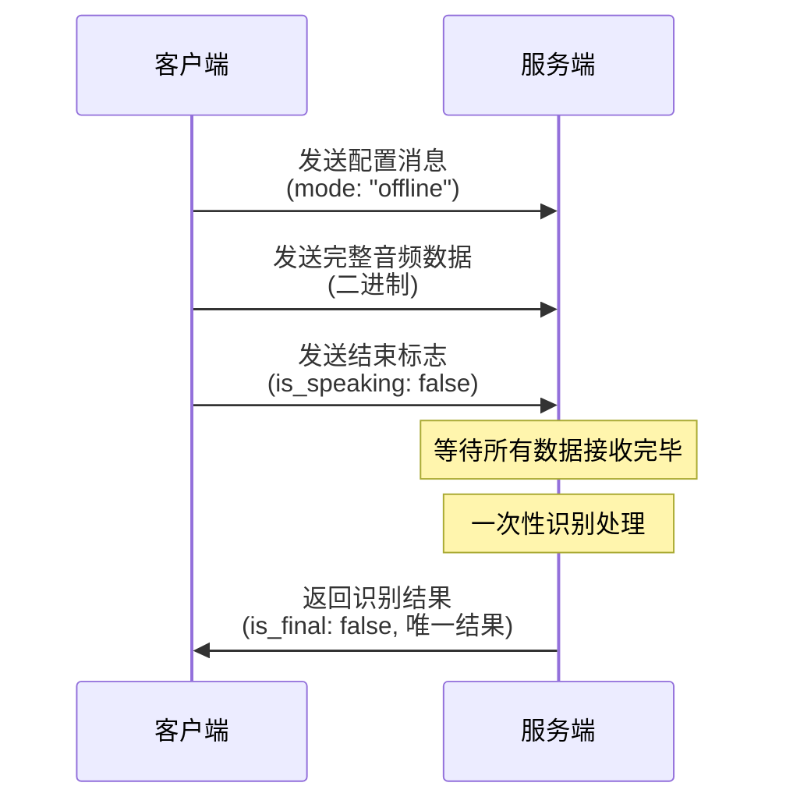
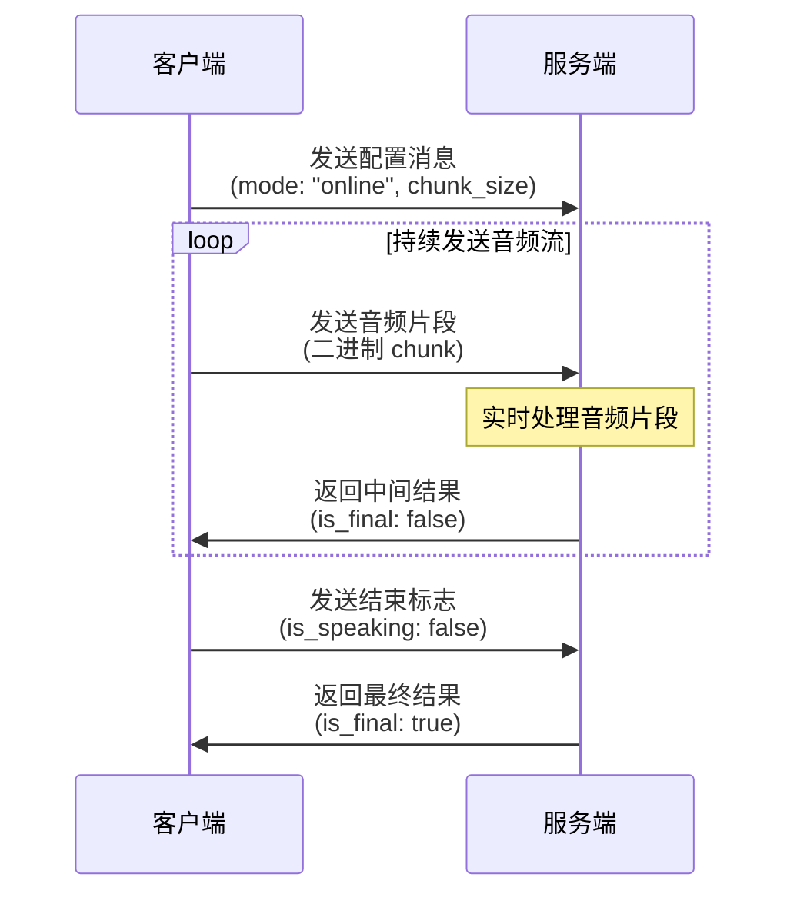
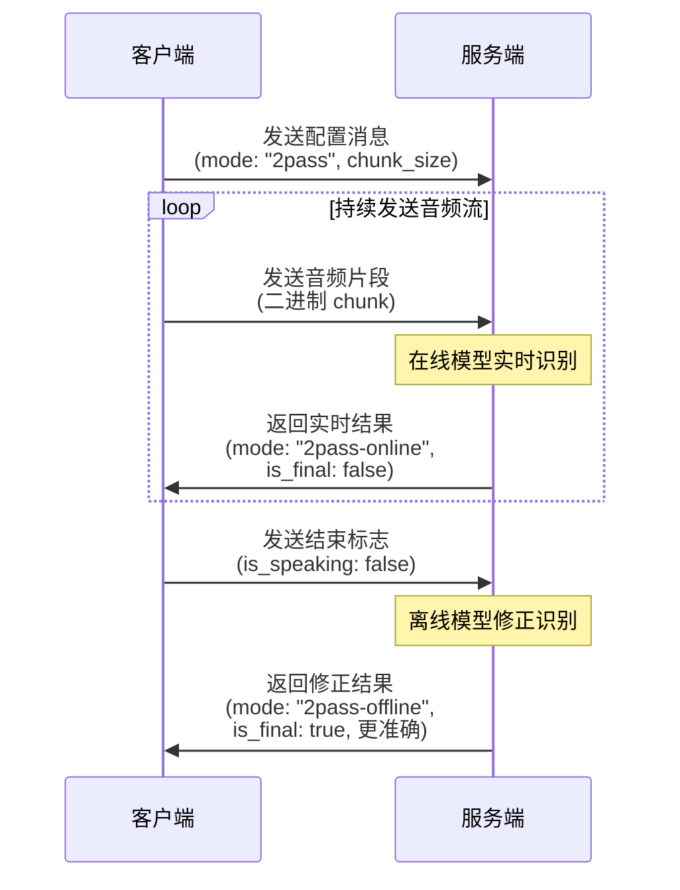
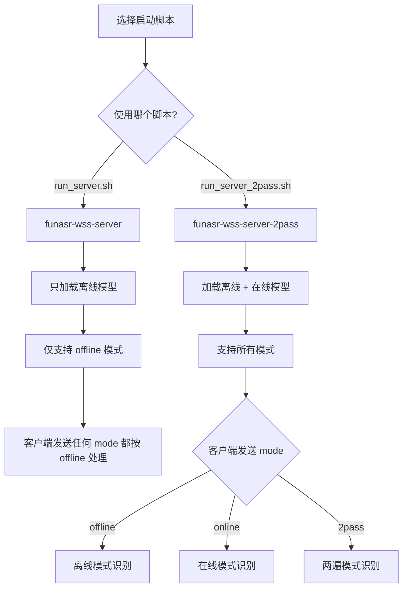
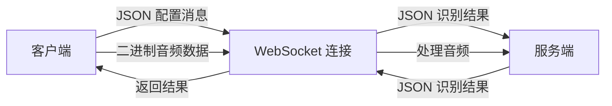
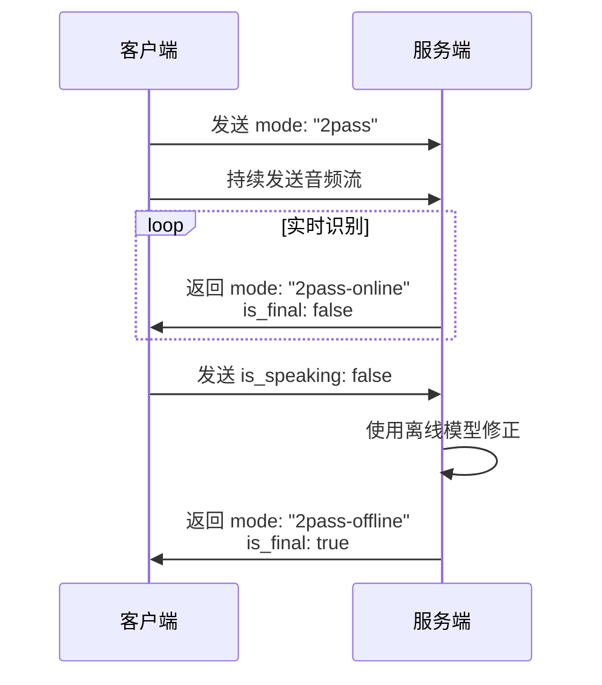

> FunASR 是阿里巴巴达摩院开源的语音识别框架，提供离线文件转写和实时语音识别服务。本文档介绍 FunASR 的识别模式、部署方式选择、SDK 部署实践，以及 WebSocket 通信协议的详细说明。

## 一、FunASR 简介

FunASR 是一个完整的语音识别解决方案，集成了语音端点检测（VAD）、语音识别（ASR）、标点预测（PUNC）等模型，可以将音频识别成带标点的文字，支持上百路并发请求。

### 核心特性

- **完整的语音识别链路**：集成 VAD、ASR、PUNC 等模型
- **支持多种音视频格式**：服务端集成 ffmpeg，支持 pcm、mp3、mp4 等多种格式
- **高性能**：支持上百路请求同时进行转写
- **丰富的输出**：输出为带标点的文字，含有字级别时间戳，支持 ITN（逆文本规范化）与用户自定义热词
- **多语言客户端**：提供 html、python、c++、java 与 c# 等多种编程语言客户端

## 二、识别模式详解

FunASR 支持三种识别模式，每种模式适用于不同的使用场景。理解这些模式的区别，有助于选择最适合的方案。

### 2.1 offline 模式（离线文件转写）

**工作原理：**
- 客户端发送完整的音频数据后，服务端等待所有数据接收完毕
- 服务端对完整音频进行一次性识别处理
- 只返回一次识别结果（`is_final: False`）

**特点：**
- ✅ **延迟低**：不需要实时处理，可以批量处理
- ✅ **准确度高**：基于完整音频上下文，识别更准确
- ✅ **资源占用少**：不需要维护实时连接状态
- ❌ **无实时反馈**：必须等待音频全部发送完毕才能得到结果

**适用场景：**
- 录音后识别（微信式录音）
- 文件转写（mp3、mp4 等音频文件）
- 批量音频处理

**返回值特点：**
- `mode: "offline"`
- `is_final: False`（**注意：虽然为 False，但服务端只会返回一次结果，这实际上就是最终结果**）
- 返回完整的识别文本

**工作流程：**



### 2.2 online 模式（实时语音识别）

**工作原理：**
- 客户端持续发送音频流（chunk by chunk）
- 服务端实时处理每个音频片段
- 持续返回中间结果（`is_final: false`），最后返回最终结果（`is_final: true`）

**特点：**
- ✅ **实时反馈**：边说话边显示识别结果
- ✅ **低延迟**：每个音频片段立即处理
- ❌ **准确度相对较低**：基于部分音频上下文，可能不够准确
- ❌ **资源占用高**：需要维护实时连接和状态

**适用场景：**
- 实时语音输入（类似语音输入法）
- 语音直播字幕
- 需要即时反馈的场景

**返回值特点：**
- `mode: "online"`
- 持续返回 `is_final: false` 的中间结果
- 最后返回 `is_final: true` 的最终结果
- 文本内容逐步完善

**工作流程：**



### 2.3 2pass 模式（两遍识别）

**工作原理：**
- 结合了 `online` 和 `offline` 两种模式
- 首先实时返回识别结果（`2pass-online`，`is_final: false`）
- 在句尾或音频结束时，使用离线模型进行修正（`2pass-offline`，`is_final: true`）

**特点：**
- ✅ **兼顾实时性和准确度**：既有实时反馈，又有高准确度
- ✅ **最佳用户体验**：先给用户看实时结果，再提供修正后的准确结果
- ❌ **资源占用最高**：需要同时维护实时处理和离线修正
- ❌ **延迟稍高**：最终结果需要等待离线修正完成

**适用场景：**
- 需要实时反馈且要求高准确度的场景
- 语音输入法（先显示实时结果，再修正）
- 会议实时转录（实时显示 + 会后修正）

**返回值特点：**
- 先返回 `mode: "2pass-online"`，`is_final: false`（实时结果）
- 最后返回 `mode: "2pass-offline"`，`is_final: true`（修正结果，更准确）

**工作流程：**



### 2.4 模式对比总结

| 模式 | 实时性 | 准确度 | 资源占用 | 返回次数 | 适用场景 |
|------|--------|--------|----------|----------|----------|
| `offline` | ❌ 无 | ⭐⭐⭐⭐⭐ | ⭐⭐ | 1 次 | 录音后识别、文件转写 |
| `online` | ⭐⭐⭐⭐⭐ | ⭐⭐⭐ | ⭐⭐⭐⭐ | 多次 | 实时语音输入 |
| `2pass` | ⭐⭐⭐⭐ | ⭐⭐⭐⭐⭐ | ⭐⭐⭐⭐⭐ | 多次 | 需要实时+高准确度 |

**选择建议：**
- 如果只需要录音后识别 → 选择 `offline`（最简单、最省资源）
- 如果需要实时反馈 → 选择 `online` 或 `2pass`
- 如果既要实时又要准确 → 选择 `2pass`（但资源占用最高）

## 三、部署方式说明

FunASR 提供了两种部署方式，**本质区别在于实现语言和部署方式，而非端口号**。端口号只是官方约定的默认值，都可以通过参数修改。

### 3.1 SDK 部署（C++ 实现）概述

**部署方式：**
- 使用 FunASR SDK（C++ 实现）
- 通过 Docker 镜像 `funasr-runtime-sdk-cpu-*` 部署
- **默认端口：10095**（可通过 `--port` 参数修改）

**特点：**
- ✅ **性能高**：C++ 实现，性能最优
- ✅ **资源占用低**：适合生产环境
- ✅ **稳定性好**：经过大量生产验证
- ✅ **高并发**：支持上百路并发请求
- ❌ **配置相对复杂**：需要了解启动参数
- ❌ **需要 Docker**：必须使用 Docker 环境

**Docker 镜像类型：**

FunASR 提供了多种 Docker 镜像，**不同的 SDK 文档对应不同的镜像源**。镜像类型主要根据**硬件环境**进行区分。

**实际使用的镜像示例：**
- CPU 版本：`funasr-runtime-sdk-cpu-0.4.7`（本文档示例）
- GPU/CUDA 版本：具体镜像名称请参考官方 GPU 部署文档

**为什么有多个不同的镜像？**

1. **硬件环境差异（主要区别）**：
   - **CPU 版本**：适用于没有 GPU 的服务器，使用 CPU 进行推理，只需要基础的运行库
   - **GPU/CUDA 版本**：适用于有 NVIDIA GPU 的环境，利用 GPU 加速，需要 CUDA、cuDNN 等 GPU 相关库，性能提升显著

2. **镜像本身是通用的**：
   - **重要理解**：同一个镜像（如 `funasr-runtime-sdk-cpu-0.4.7`）包含了所有依赖（离线和在线模型的依赖都有）
   - **模式支持由启动脚本决定**：使用 `run_server.sh` 只支持 offline，使用 `run_server_2pass.sh` 支持所有模式
   - **示例**：即使使用 "offline" 镜像，通过 `run_server_2pass.sh` 启动并配置在线模型后，也可以运行 online 和 2pass 模式

3. **不同 SDK 文档对应不同镜像**：
   - 官方文档中，不同的 SDK 部署文档会指定对应的镜像源
   - **主要区别是 CPU vs GPU**：CPU 部署文档使用 CPU 版本镜像，GPU 部署文档使用 GPU/CUDA 版本镜像
   - **识别模式的区别不在镜像，而在启动脚本**：同一个镜像可以通过不同的启动脚本支持不同的模式

**如何选择合适的镜像？**

**根据硬件环境选择**：
- **无 GPU 环境** → 选择 CPU 版本（如 `funasr-runtime-sdk-cpu-*`）
- **有 GPU 环境** → 选择 GPU/CUDA 版本（如 `funasr-runtime-sdk-cuda-*`，性能更高）

**模式支持由启动脚本决定**：
- **只需要 offline 模式** → 使用 `run_server.sh` 启动（资源占用更低）
- **需要 online/2pass 模式** → 使用 `run_server_2pass.sh` 启动（需要配置在线模型）

> **⚠️ 重要说明**：
> - **镜像本身是通用的**：同一个镜像包含了所有依赖，可以通过不同的启动脚本支持不同的模式
> - **模式支持由启动脚本决定**：`run_server.sh` 只支持 offline，`run_server_2pass.sh` 支持所有模式
> - **具体镜像名称请参考官方文档**：不同版本的 FunASR 和不同的部署场景，镜像名称可能不同
> - **请查阅 [FunASR 官方文档](https://github.com/modelscope/FunASR/tree/main/runtime/docs)** 中对应的 SDK 部署文档，确认具体的镜像名称和下载地址
> - **本文档示例使用**：`funasr-runtime-sdk-cpu-0.4.7`（CPU 版本），其他版本请参考官方文档

**两种启动方式：**
FunASR SDK 部署提供了两种启动脚本，**模式支持能力不同**：
- **`run_server.sh`**：仅支持 `offline` 模式，适合只需要录音后识别的场景
- **`run_server_2pass.sh`**：支持所有模式（offline、online、2pass），客户端可动态切换，最灵活

> **注意**：启动脚本的选择决定了服务端支持哪些识别模式。详细说明见 3.2 节。

### 3.2 SDK 部署的两种启动方式

**⚠️ 重要区别：启动脚本决定模式支持能力**

对于 **SDK 部署（10095）**，FunASR 提供了两种启动脚本，**模式支持能力不同**。选择哪个启动脚本，决定了服务端能够支持哪些识别模式。

#### 3.2.1 run_server.sh（仅支持 offline 模式）

**启动脚本：** `run_server.sh`  
**可执行文件：** `funasr-wss-server`  
**支持模式：** ❌ 仅支持 `offline` 模式

**特点：**
- 只加载离线模型（`--model-dir`）
- 无论客户端发送什么 `mode` 参数，都按 offline 模式处理
- 返回格式固定为 offline 格式（包含 `stamp_sents` 等）
- 适合只需要录音后识别的场景
- 资源占用相对较少

**适用场景：**
- 录音后识别（微信式录音）
- 文件转写（mp3、mp4 等音频文件）
- 批量音频处理
- 只需要 offline 模式的场景

**启动命令示例：**
```bash
cd FunASR/runtime
bash run_server.sh \
  --download-model-dir /workspace/models \
  --vad-dir damo/speech_fsmn_vad_zh-cn-16k-common-onnx \
  --model-dir damo/speech_paraformer-large-vad-punc_asr_nat-zh-cn-16k-common-vocab8404-onnx \
  --punc-dir damo/punc_ct-transformer_cn-en-common-vocab471067-large-onnx \
  --lm-dir damo/speech_ngram_lm_zh-cn-ai-wesp-fst \
  --itn-dir thuduj12/fst_itn_zh \
  --port 10095 \
  --certfile 0
```

**必需模型：**
- `--vad-dir`：VAD 模型（必需）
- `--model-dir`：ASR 离线模型（必需）
- `--punc-dir`：标点模型（必需）

**可选模型：**
- `--lm-dir`：语言模型（可选，提升准确度）
- `--itn-dir`：ITN 模型（可选，提升准确度）

#### 3.2.2 run_server_2pass.sh（支持所有模式）

**启动脚本：** `run_server_2pass.sh`  
**可执行文件：** `funasr-wss-server-2pass`  
**支持模式：** ✅ 支持 `offline`、`online`、`2pass` 三种模式

**特点：**
- 同时加载离线模型（`--model-dir`）和在线模型（`--online-model-dir`）
- 使用实时标点模型（`punc_ct-transformer_zh-cn-common-vad_realtime-vocab272727-onnx`）
- 客户端可以通过 `mode` 参数动态切换模式
- 适合需要多种模式的场景
- 资源占用相对较高（需要加载更多模型）

**适用场景：**
- 需要支持多种识别模式的场景
- 需要实时语音识别（online 模式）
- 需要兼顾实时性和准确度（2pass 模式）
- 生产环境推荐（功能最全面）

**启动命令示例：**
```bash
cd FunASR/runtime
bash run_server_2pass.sh \
  --download-model-dir /workspace/models \
  --vad-dir damo/speech_fsmn_vad_zh-cn-16k-common-onnx \
  --model-dir damo/speech_paraformer-large-vad-punc_asr_nat-zh-cn-16k-common-vocab8404-onnx \
  --online-model-dir damo/speech_paraformer-large_asr_nat-zh-cn-16k-common-vocab8404-online-onnx \
  --punc-dir damo/punc_ct-transformer_zh-cn-common-vad_realtime-vocab272727-onnx \
  --lm-dir damo/speech_ngram_lm_zh-cn-ai-wesp-fst \
  --itn-dir thuduj12/fst_itn_zh \
  --port 10095 \
  --certfile 0
```

**必需模型：**
- `--vad-dir`：VAD 模型（必需）
- `--model-dir`：ASR 离线模型（必需）
- `--online-model-dir`：ASR 在线模型（必需，用于 online/2pass 模式）
- `--punc-dir`：实时标点模型（必需，使用实时标点模型）

**可选模型：**
- `--lm-dir`：语言模型（可选，提升准确度）
- `--itn-dir`：ITN 模型（可选，提升准确度）

**关键区别：**
- `run_server_2pass.sh` 需要额外的在线模型（`--online-model-dir`）
- 标点模型需要使用实时标点模型（`punc_ct-transformer_zh-cn-common-vad_realtime-vocab272727-onnx`）

#### 3.2.3 两种启动脚本对比

**功能对比：**

| 维度 | run_server.sh | run_server_2pass.sh |
|------|--------------|---------------------|
| **可执行文件** | `funasr-wss-server` | `funasr-wss-server-2pass` |
| **离线模型** | ✅ `--model-dir` | ✅ `--model-dir` |
| **在线模型** | ❌ 无 | ✅ `--online-model-dir`（必需） |
| **标点模型** | `punc_ct-transformer_cn-en-common-vocab471067-large-onnx` | `punc_ct-transformer_zh-cn-common-vad_realtime-vocab272727-onnx` |
| **支持 offline** | ✅ 是 | ✅ 是 |
| **支持 online** | ❌ 否（强制按 offline 处理） | ✅ 是 |
| **支持 2pass** | ❌ 否（强制按 offline 处理） | ✅ 是 |
| **客户端动态切换** | ❌ 不支持 | ✅ 支持 |
| **资源占用** | ⭐⭐ 较低 | ⭐⭐⭐⭐ 较高 |
| **适用场景** | 仅需要 offline 模式 | 需要多种模式 |

**模式选择机制：**



**关键要点：**
- ⚠️ **启动脚本决定模式支持**：使用 `run_server.sh` 只支持 offline，使用 `run_server_2pass.sh` 支持所有模式
- ✅ **模式选择在客户端**：使用 `run_server_2pass.sh` 时，客户端通过 WebSocket 消息中的 `mode` 参数选择使用哪个模式
- ✅ **必需模型**：VAD、ASR、PUNC（所有模式都需要）
- ✅ **2pass 模式额外需要**：在线模型（`--online-model-dir`）和实时标点模型
- ✅ **同一个服务端可以同时处理不同模式**：使用 `run_server_2pass.sh` 时，不同的客户端连接可以使用不同的模式

**选择建议：**
- 如果只需要录音后识别 → 使用 `run_server.sh`（最简单、最省资源）
- 如果需要支持多种模式 → 使用 `run_server_2pass.sh`（功能最全面，生产环境推荐）

> **注意**：
> - 详细的客户端使用方式和 WebSocket 消息格式请参考第五章
> - 具体的 Docker 部署实践请参考第四章

### 3.3 Python WebSocket 服务器部署

**部署方式：**
- 使用 Python WebSocket 服务器
- 通过 `websocket_server.py` 启动
- **默认端口：10096**（可通过 `--port` 参数修改）
- 适合快速测试和开发

**特点：**
- ✅ **部署简单**：Python 环境即可运行，无需 Docker
- ✅ **易于调试**：Python 代码，方便修改和调试
- ✅ **快速原型**：适合快速验证功能
- ❌ **性能相对较低**：Python 实现，性能不如 C++
- ❌ **资源占用较高**：不适合高并发生产环境
- ❌ **并发能力有限**：通常支持 20-50 路并发

#### 模式支持方式

**⚠️ 重要说明：Python 服务器的模式支持方式需要查阅官方文档确认**

Python WebSocket 服务器（10096）的模式支持方式（offline、online、2pass）的具体实现和行为，请参考官方文档：

- **官方文档**：https://github.com/modelscope/FunASR/tree/main/runtime/python/websocket
- **建议**：使用前请查阅官方文档，确认模式支持的具体实现方式

> **注意**：
> - 本文档主要介绍 SDK 部署方式（10095），这是生产环境推荐的方式
> - SDK 部署的模式支持行为已在官方文档中明确说明（详见 3.2 节）
> - Python 服务器的模式支持方式请参考官方 Python 部署文档

#### 启动命令和模型配置

**启动命令示例：**

```bash
python -m funasr.runtime.python.websocket.websocket_server \
  --port 10096 \
  --model_dir damo/speech_paraformer-large-vad-punc_asr_nat-zh-cn-16k-common-vocab8404-onnx \
  --vad_dir damo/speech_fsmn_vad_zh-cn-16k-common-onnx \
  --punc_dir damo/punc_ct-transformer_cn-en-common-vocab471067-large-onnx \
  --lm_dir damo/speech_ngram_lm_zh-cn-ai-wesp-fst \
  --itn_dir thuduj12/fst_itn_zh
```

**必需模型参数：**
- `--model_dir`：ASR 模型（必需）
- `--vad_dir`：VAD 模型（必需）
- `--punc_dir`：标点模型（必需）

**可选模型参数：**
- `--lm_dir`：语言模型（可选，提升准确度）
- `--itn_dir`：ITN 模型（可选，提升准确度）

**参数说明：**
- 参数命名与 SDK 部署略有不同（使用下划线 `_` 而非连字符 `-`）
- 模型 ID 和功能与 SDK 部署相同
- 模式支持方式请参考官方文档：https://github.com/modelscope/FunASR/tree/main/runtime/python/websocket

> **注意**：
> - 以上启动命令和参数基于官方文档，具体模式支持行为请查阅官方文档确认
> - 如需精确控制识别模式，建议使用 SDK 部署（10095），其模式支持行为已在官方文档中明确说明

### 3.4 部署方式对比总结

| 维度 | SDK 部署（C++） | Python 服务器部署 |
|------|----------------|------------------|
| **实现语言** | C++ | Python |
| **默认端口** | 10095 | 10096 |
| **端口可修改** | ✅ 是 | ✅ 是 |
| **性能** | ⭐⭐⭐⭐⭐ 高 | ⭐⭐⭐ 中等 |
| **资源占用** | ⭐⭐ 低 | ⭐⭐⭐⭐ 较高 |
| **并发能力** | 100+ 路 | 20-50 路 |
| **部署复杂度** | ⭐⭐⭐ 中等 | ⭐⭐ 简单 |
| **调试难度** | ⭐⭐⭐ 较难 | ⭐⭐ 容易 |
| **生产环境** | ✅ 推荐 | ⚠️ 不推荐 |

**重要理解：**
- **端口号只是默认值**：10095 和 10096 只是官方约定的默认端口，都可以通过 `--port` 参数修改
- **真正区别是部署方式**：SDK（C++）vs Python 服务器
- **模式支持差异**：
  - **SDK 部署（10095）**：根据启动脚本不同，支持不同的模式（详见 3.2 节）
    - 使用 `run_server.sh`：仅支持 offline 模式
    - 使用 `run_server_2pass.sh`：支持所有模式（offline、online、2pass），客户端通过 `mode` 参数选择
  - **Python 服务器（10096）**：模式支持方式请参考官方文档：https://github.com/modelscope/FunASR/tree/main/runtime/python/websocket
- **协议相同**：都使用相同的 WebSocket 通信协议

### 3.5 如何选择部署方式

| 场景 | 推荐部署方式 | 原因 |
|------|------------|------|
| 生产环境 | SDK 部署 | 性能高、资源占用低、稳定性好、高并发 |
| 开发测试 | Python 服务器 | 部署简单、易于调试、无需 Docker |
| 高并发场景 | SDK 部署 | C++ 实现，性能最优 |
| 快速原型 | Python 服务器 | 无需 Docker，直接运行 |
| 资源受限 | SDK 部署 | 内存和 CPU 占用更低 |

**注意：** 
- 本文档主要介绍 SDK 部署方式，这是生产环境推荐的方式
- **SDK 部署（10095）**：根据启动脚本不同，支持不同的模式（详见 3.2 节）
- **Python 服务器（10096）**：模式支持方式请参考官方文档：https://github.com/modelscope/FunASR/tree/main/runtime/python/websocket

### 3.6 模式支持方式快速参考

> **说明**：本节提供模式支持方式的快速参考表。详细的启动脚本说明和选择建议请参考 3.2 节。

**SDK 部署（10095）vs Python 服务器（10096）的模式支持方式：**

| 部署方式 | 启动脚本 | 模式支持方式 | 必需模型 |
|---------|---------|------------|---------|
| **SDK 部署（10095）** | `run_server.sh` | ❌ **仅支持 offline 模式** | VAD + ASR + PUNC（必需）<br>LM + ITN（可选） |
| **SDK 部署（10095）** | `run_server_2pass.sh` | ✅ **支持所有模式**（offline、online、2pass） | VAD + ASR + PUNC + **在线模型**（必需）<br>LM + ITN（可选） |
| **Python 服务器（10096）** | `websocket_server.py` | ⚠️ **请参考官方文档** | VAD + ASR + PUNC（必需）<br>LM + ITN（可选） |

**重要区别：**
- **SDK 部署 - run_server.sh**：只支持 offline 模式，适合只需要录音后识别的场景（详见 3.2.1 节）
- **SDK 部署 - run_server_2pass.sh**：支持所有模式，客户端可动态切换，最灵活，生产环境推荐（详见 3.2.2 节）
- **Python 服务器**：模式支持方式请参考官方文档确认

**模型配置对比：**

| 模型类型 | SDK 部署参数 | Python 服务器参数 | run_server.sh | run_server_2pass.sh |
|---------|------------|-----------------|--------------|-------------------|
| VAD 模型 | `--vad-dir` | `--vad_dir` | ✅ 必需 | ✅ 必需 |
| ASR 离线模型 | `--model-dir` | `--model_dir` | ✅ 必需 | ✅ 必需 |
| ASR 在线模型 | `--online-model-dir` | `--online_model_dir` | ❌ 不需要 | ✅ 必需（用于 online/2pass） |
| 标点模型 | `--punc-dir` | `--punc_dir` | ✅ 必需 | ✅ 必需（使用实时标点模型） |
| 语言模型 | `--lm-dir` | `--lm_dir` | ⚠️ 可选 | ⚠️ 可选 |
| ITN 模型 | `--itn-dir` | `--itn_dir` | ⚠️ 可选 | ⚠️ 可选 |

**注意：** 
- Python 服务器的参数使用下划线（`_`），SDK 部署使用连字符（`-`），但模型 ID 和功能相同
- `run_server_2pass.sh` 需要额外的在线模型（`--online-model-dir`）和实时标点模型
- `run_server.sh` 只使用离线模型和普通标点模型
- 详细的启动脚本说明、启动命令和选择建议请参考 3.2 节

## 四、SDK 部署实践（Docker）

> **说明**：本章节详细介绍 SDK 部署方式（Docker + C++ 实现），这是生产环境推荐的方式。Python 服务器部署方式请参考官方文档。

### 4.1 拉取镜像

```bash
sudo docker pull \
  registry.cn-hangzhou.aliyuncs.com/funasr_repo/funasr:funasr-runtime-sdk-cpu-0.4.7
```

### 4.2 启动容器

```bash
# 创建模型目录（用于挂载）
mkdir -p ./funasr-runtime-resources/models

# 启动容器
sudo docker run -p 10095:10095 -it --privileged=true \
  -v $PWD/funasr-runtime-resources/models:/workspace/models \
  registry.cn-hangzhou.aliyuncs.com/funasr_repo/funasr:funasr-runtime-sdk-cpu-0.4.7
```

**参数说明：**
- `-p 10095:10095`：映射容器端口到主机端口（FunASR 默认端口为 10095）
- `--privileged=true`：赋予容器特权模式（某些功能需要）
- `-v $PWD/funasr-runtime-resources/models:/workspace/models`：挂载模型目录，模型会自动下载到此目录

### 4.3 启动服务

进入容器后，根据需求选择启动脚本：

#### 4.3.1 仅支持 offline 模式（推荐用于录音后识别）

如果只需要录音后识别功能，使用 `run_server.sh`：

```bash
cd FunASR/runtime

# 启动服务（16k 模型，关闭 SSL，仅支持 offline 模式）
nohup bash run_server.sh \
  --download-model-dir /workspace/models \
  --vad-dir damo/speech_fsmn_vad_zh-cn-16k-common-onnx \
  --model-dir damo/speech_paraformer-large-vad-punc_asr_nat-zh-cn-16k-common-vocab8404-onnx \
  --punc-dir damo/punc_ct-transformer_cn-en-common-vocab471067-large-onnx \
  --lm-dir damo/speech_ngram_lm_zh-cn-ai-wesp-fst \
  --itn-dir thuduj12/fst_itn_zh \
  --port 10095 \
  --certfile 0 > log.txt 2>&1 &

# 查看日志
tail -f log.txt
```

> **说明**：使用 `run_server.sh` 启动的服务只支持 `offline` 模式。无论客户端发送什么 `mode` 参数，都会按 offline 模式处理。适合只需要录音后识别的场景。

#### 4.3.2 支持所有模式（推荐用于需要多种模式的场景）

如果需要支持 `offline`、`online`、`2pass` 三种模式，使用 `run_server_2pass.sh`：

```bash
cd FunASR/runtime

# 启动服务（16k 模型，关闭 SSL，支持所有模式）
nohup bash run_server_2pass.sh \
  --download-model-dir /workspace/models \
  --vad-dir damo/speech_fsmn_vad_zh-cn-16k-common-onnx \
  --model-dir damo/speech_paraformer-large-vad-punc_asr_nat-zh-cn-16k-common-vocab8404-onnx \
  --online-model-dir damo/speech_paraformer-large_asr_nat-zh-cn-16k-common-vocab8404-online-onnx \
  --punc-dir damo/punc_ct-transformer_zh-cn-common-vad_realtime-vocab272727-onnx \
  --lm-dir damo/speech_ngram_lm_zh-cn-ai-wesp-fst \
  --itn-dir thuduj12/fst_itn_zh \
  --port 10095 \
  --certfile 0 > log_2pass.txt 2>&1 &

# 查看日志
tail -f log_2pass.txt
```

> **说明**：使用 `run_server_2pass.sh` 启动的服务支持所有模式（offline、online、2pass）。客户端可以通过 `mode` 参数动态切换模式。首次启动会下载在线模型，可能需要几分钟时间。详见 3.2 节和 5.5 节。

**启动参数说明：**

| 参数 | 说明 |
|------|------|
| `--download-model-dir` | 模型下载地址，通过设置 model ID 从 Modelscope 下载模型 |
| `--model-dir` | ASR 模型 ID 或本地模型路径 |
| `--vad-dir` | VAD 模型 ID 或本地模型路径 |
| `--punc-dir` | 标点模型 ID 或本地模型路径 |
| `--lm-dir` | 语言模型 ID 或本地模型路径 |
| `--itn-dir` | ITN 模型 ID 或本地模型路径 |
| `--port` | 服务端监听端口号，默认为 10095 |
| `--certfile` | SSL 证书文件，设置为 `0` 表示关闭 SSL |
| `--keyfile` | SSL 密钥文件 |
| `--hotword` | 热词文件路径（可选） |
| `--decoder-thread-num` | 服务端线程池个数（支持的最大并发路数） |
| `--io-thread-num` | 服务端启动的 IO 线程数 |
| `--model-thread-num` | 每路识别的内部线程数，默认为 1 |

**8k 模型启动示例：**

```bash
cd FunASR/runtime
nohup bash run_server.sh \
  --download-model-dir /workspace/models \
  --vad-dir damo/speech_fsmn_vad_zh-cn-8k-common-onnx \
  --model-dir damo/speech_paraformer_asr_nat-zh-cn-8k-common-vocab8358-tensorflow1-onnx \
  --punc-dir damo/punc_ct-transformer_cn-en-common-vocab471067-large-onnx \
  --lm-dir damo/speech_ngram_lm_zh-cn-ai-wesp-fst \
  --itn-dir thuduj12/fst_itn_zh \
  --port 10095 \
  --certfile 0 > log.txt 2>&1 &
```

### 4.4 验证服务

```bash
# 查看服务进程
ps -x | grep funasr-wss-server

# 查看端口监听
netstat -tlnp | grep 10095

# 查看日志
tail -f log.txt
```

服务启动成功后，日志中应该看到：
```
[INFO] FunASR WebSocket server started on port 10095
[INFO] Model loaded successfully
```

### 4.5 关闭服务

```bash
# 查看 funasr-wss-server 对应的 PID
ps -x | grep funasr-wss-server

# 关闭服务
kill -9 PID
```

## 五、WebSocket 通信协议

FunASR 基于 WebSocket 协议进行通信，采用**混合消息格式**：配置信息用 JSON，音频数据用二进制。

### 5.1 消息格式

FunASR 的 WebSocket 通信采用两种消息类型：

1. **JSON 消息**：用于发送配置参数和元数据
2. **二进制消息**：用于发送音频数据（PCM 格式为 Int16Array）



这种设计的好处是：
- JSON 消息便于解析和调试
- 二进制消息传输音频数据效率高
- 两种消息类型可以混合发送

### 5.2 离线文件转写模式（offline）

#### 客户端 → 服务端

**首次通信（配置消息）：**

```json
{
  "mode": "offline",
  "wav_name": "wav_name",
  "wav_format": "pcm",
  "is_speaking": true,
  "hotwords": "{\"阿里巴巴\":20,\"通义实验室\":30}",
  "itn": true,
  "audio_fs": 16000
}
```

**参数说明：**

| 参数 | 类型 | 说明 |
|------|------|------|
| `mode` | string | 固定为 `"offline"`，表示推理模式为离线文件转写 |
| `wav_name` | string | 需要推理的音频文件名 |
| `wav_format` | string | 音视频文件后缀名，可选 `pcm`、`mp3`、`mp4` 等。**注意**：当输入音频为 PCM 数据时，必须指定 `wav_format: "pcm"` 和 `audio_fs` |
| `is_speaking` | boolean | `true` 表示开始识别，`false` 表示断句尾点或音频结束 |
| `audio_fs` | number | 当输入音频为 pcm 数据时，**必需**指定音频采样率（如 16000、8000）。与 `wav_format: "pcm"` 配合使用 |
| `hotwords` | string | 热词数据（JSON 字符串格式），例如 `"{\"阿里巴巴\":20,\"通义实验室\":30}"`，数字为权重 |
| `itn` | boolean | 设置是否使用 ITN（逆文本规范化），默认为 `true` |
| `svs_lang` | string | 设置 SenseVoiceSmall 模型语种，默认为 `"auto"` |
| `svs_itn` | boolean | 设置 SenseVoiceSmall 模型是否开启标点、ITN，默认为 `true` |

**发送音频数据：**

- **PCM 格式**：直接将音频数据（Int16Array）以二进制形式发送
- **其他格式**：连同头部信息与音视频 bytes 数据一起发送

**发送结束标志：**

```json
{
  "is_speaking": false
}
```

#### 服务端 → 客户端

**识别结果消息：**

```json
{
  "mode": "offline",
  "wav_name": "wav_name",
  "text": "asr outputs",
  "is_final": false,
  "timestamp": "[[100,200], [200,500]]",
  "stamp_sents": []
}
```

**参数说明：**

| 参数 | 类型 | 说明 |
|------|------|------|
| `mode` | string | 固定为 `"offline"`，表示推理模式为离线文件转写 |
| `wav_name` | string | 推理的音频文件名 |
| `text` | string | 语音识别输出文本 |
| `is_final` | boolean | 在 offline 模式下，服务端只会返回一次识别结果，此字段为 `False`（虽然为 False，但这是唯一一次返回，实际上就是最终结果） |
| `timestamp` | string | 如果 AM 为时间戳模型，会返回此字段，表示字级别时间戳，格式为 `"[[100,200], [200,500]]"`（单位：毫秒） |
| `stamp_sents` | array | 如果 AM 为时间戳模型，会返回此字段，表示句子级别时间戳 |

**`stamp_sents` 格式示例：**

```json
[
  {
    "text_seg": "正 是 因 为",
    "punc": ",",
    "start": 430,
    "end": 1130,
    "ts_list": [[430,670], [670,810], [810,1030], [1030,1130]]
  }
]
```

### 5.3 实时语音识别模式（online / 2pass）

#### 客户端 → 服务端

**首次通信（配置消息）：**

```json
{
  "mode": "2pass",
  "wav_name": "wav_name",
  "is_speaking": true,
  "wav_format": "pcm",
  "chunk_size": [5, 10, 5],
  "hotwords": "{\"阿里巴巴\":20,\"通义实验室\":30}",
  "itn": true,
  "audio_fs": 16000
}
```

**参数说明：**

| 参数 | 类型 | 说明 |
|------|------|------|
| `mode` | string | `"offline"` 表示一句话识别；`"online"` 表示实时语音识别；`"2pass"` 表示实时语音识别，并且说话句尾采用离线模型进行纠错 |
| `wav_name` | string | 需要推理的音频文件名 |
| `wav_format` | string | 音视频文件后缀名，只支持 `pcm` 音频流 |
| `is_speaking` | boolean | `true` 表示开始识别，`false` 表示断句尾点或音频结束 |
| `chunk_size` | array | 流式模型 latency 配置，`[5,10,5]` 表示当前音频为 600ms，并且回看 300ms，又看 300ms |
| `audio_fs` | number | 当输入音频为 pcm 数据时，需要指定音频采样率（支持 8000、16000） |
| `hotwords` | string | 热词数据（JSON 字符串格式） |
| `itn` | boolean | 设置是否使用 ITN，默认为 `true` |
| `svs_lang` | string | 设置 SenseVoiceSmall 模型语种，默认为 `"auto"` |
| `svs_itn` | boolean | 设置 SenseVoiceSmall 模型是否开启标点、ITN，默认为 `true` |

**发送音频数据：**

直接将音频数据（移除头部信息后的 bytes 数据）发送，支持音频采样率为 8000（需要在 `message` 中指定 `audio_fs` 为 8000）或 16000。

**发送结束标志：**

```json
{
  "is_speaking": false
}
```

#### 服务端 → 客户端

**识别结果消息：**

```json
{
  "mode": "2pass-online",
  "wav_name": "wav_name",
  "text": "asr outputs",
  "is_final": false,
  "timestamp": "[[100,200], [200,500]]",
  "stamp_sents": []
}
```

**注意：** 上面的示例是 `2pass-online` 的实时结果（`is_final: false`）。如果是 `2pass-offline` 的修正结果，则 `is_final: true`。

**参数说明：**

| 参数 | 类型 | 说明 |
|------|------|------|
| `mode` | string | 表示推理模式，分为：<br>- `"2pass-online"`：实时识别结果（`is_final: false`）<br>- `"2pass-offline"`：2 遍修正识别结果（`is_final: true`，更准确）<br>- `"online"`：在线模式识别结果 |
| `wav_name` | string | 推理的音频文件名 |
| `text` | string | 语音识别输出文本 |
| `is_final` | boolean | 表示识别结束：<br>- `false`：中间结果（实时更新）<br>- `true`：最终结果 |
| `timestamp` | string | 如果 AM 为时间戳模型，会返回此字段，表示字级别时间戳 |
| `stamp_sents` | array | 如果 AM 为时间戳模型，会返回此字段，表示句子级别时间戳 |

### 5.4 客户端发送模式 vs 服务端返回模式

**重要理解：** 客户端发送的模式和服务端返回的模式可能不一致！

| 客户端发送 | 服务端可能返回 | 说明 |
|-----------|--------------|------|
| `"offline"` | `"offline"` | 一对一对应 |
| `"online"` | `"online"` | 一对一对应 |
| `"2pass"` | `"2pass-online"`<br>`"2pass-offline"` | **一对多**：客户端发送 `"2pass"`，服务端会返回两种模式的结果 |

**为什么 2pass 模式会返回两种结果？**



当客户端发送 `mode: "2pass"` 时：
1. 服务端首先使用在线模型实时识别，返回 `mode: "2pass-online"`，`is_final: false`
2. 在句尾或音频结束时，服务端使用离线模型进行修正，返回 `mode: "2pass-offline"`，`is_final: true`

这样设计的好处是：客户端可以同时获得实时反馈和最终准确结果。

### 5.5 模式选择机制（SDK 部署）

**⚠️ 重要理解：启动脚本决定模式支持能力，模式选择在客户端！**

> **说明**：本节主要介绍 **SDK 部署（10095）** 的模式选择机制。**Python 服务器（10096）** 的模式支持方式可能不同，详见 3.2 节和 3.6 节。

对于 **SDK 部署（10095）**，模式支持能力取决于启动时使用的脚本：

- **使用 `run_server.sh`**：只支持 `offline` 模式，客户端发送任何 `mode` 都按 offline 处理
- **使用 `run_server_2pass.sh`**：支持所有模式（offline、online、2pass），客户端可以通过 `mode` 参数动态切换

**模式选择机制：**

当使用 `run_server_2pass.sh` 启动服务时，模式的选择不是在服务端部署时决定的，而是在客户端使用时通过 WebSocket 消息中的 `mode` 参数选择的。

#### 客户端如何选择模式

服务端部署后，客户端通过 WebSocket 连接，在首次发送的 JSON 消息中指定 `mode` 参数来选择使用哪个模式：

**使用 offline 模式：**
```json
// 客户端首次消息
{
  "mode": "offline",
  "wav_name": "test.wav",
  "wav_format": "pcm",
  "is_speaking": true,
  "audio_fs": 16000
}
// 然后一次性发送完整音频数据
```

**使用 online 模式：**
```json
// 客户端首次消息
{
  "mode": "online",
  "wav_name": "test.wav",
  "wav_format": "pcm",
  "is_speaking": true,
  "chunk_size": [5, 10, 5],
  "audio_fs": 16000
}
// 然后持续发送音频流（chunk by chunk）
```

**使用 2pass 模式：**
```json
// 客户端首次消息
{
  "mode": "2pass",
  "wav_name": "test.wav",
  "wav_format": "pcm",
  "is_speaking": true,
  "chunk_size": [5, 10, 5],
  "audio_fs": 16000
}
// 然后持续发送音频流（chunk by chunk）
```

#### offline vs online 模式的关键区别

| 维度 | offline 模式 | online/2pass 模式 |
|------|-------------|------------------|
| **启动脚本** | `run_server.sh` 或 `run_server_2pass.sh` | 必须使用 `run_server_2pass.sh` |
| **可执行文件** | `funasr-wss-server` 或 `funasr-wss-server-2pass` | `funasr-wss-server-2pass` |
| **服务端支持** | ✅ `run_server.sh` 仅支持 offline<br>✅ `run_server_2pass.sh` 支持所有模式 | ✅ 仅 `run_server_2pass.sh` 支持 |
| **客户端发送的 mode** | `"offline"` | `"online"` 或 `"2pass"` |
| **客户端首次消息** | `{"mode": "offline", ...}` | `{"mode": "online", "chunk_size": [5,10,5], ...}` |
| **客户端发送方式** | 一次性发送完整音频 | 持续发送音频流（chunk by chunk） |
| **客户端 chunk_size** | ❌ 不需要 | ✅ 必需（如 `[5,10,5]`） |
| **服务端处理方式** | 等待完整音频后一次性处理 | 实时处理每个音频片段 |
| **返回结果** | 只返回一次（`is_final: False`） | 持续返回中间结果和最终结果 |

**总结：**
- ⚠️ **启动脚本决定模式支持**：使用 `run_server.sh` 只支持 offline，使用 `run_server_2pass.sh` 支持所有模式
- ✅ **模式选择在客户端**：使用 `run_server_2pass.sh` 时，客户端通过 WebSocket 消息中的 `mode` 参数选择使用哪个模式
- ✅ **同一个服务端可以同时处理不同模式**：使用 `run_server_2pass.sh` 时，不同的客户端连接可以使用不同的模式
- ✅ **灵活高效**：根据需求选择合适的启动脚本，`run_server_2pass.sh` 可以满足所有需求

### 5.6 返回值类型详解

#### 离线模式（offline）返回值

```json
{
  "mode": "offline",
  "wav_name": "example.wav",
  "text": "这是识别结果。",
  "is_final": false,
  "timestamp": "[[100,200], [200,500], [500,800]]",
  "stamp_sents": [
    {
      "text_seg": "这 是 识 别",
      "punc": "，",
      "start": 100,
      "end": 500,
      "ts_list": [[100,200], [200,300], [300,400], [400,500]]
    },
    {
      "text_seg": "结 果",
      "punc": "。",
      "start": 500,
      "end": 800,
      "ts_list": [[500,650], [650,800]]
    }
  ]
}
```

**特点：**
- `is_final` 为 `False`（**注意：虽然为 False，但服务端只会返回一次结果，这实际上就是最终结果**）
- 返回完整的识别文本
- 如果使用时间戳模型，会包含详细的时间戳信息

#### 实时模式（online）返回值

```json
// 中间结果
{
  "mode": "online",
  "wav_name": "stream.wav",
  "text": "这是",
  "is_final": false
}

// 继续识别...
{
  "mode": "online",
  "wav_name": "stream.wav",
  "text": "这是识别",
  "is_final": false
}

// 最终结果
{
  "mode": "online",
  "wav_name": "stream.wav",
  "text": "这是识别结果。",
  "is_final": true
}
```

**特点：**
- 持续返回 `is_final: false` 的中间结果
- 最后返回 `is_final: true` 的最终结果
- 文本内容逐步完善

#### 2pass 模式返回值

```json
// 实时识别结果（2pass-online）
{
  "mode": "2pass-online",
  "wav_name": "stream.wav",
  "text": "这是识别",
  "is_final": false
}

// 继续实时识别...
{
  "mode": "2pass-online",
  "wav_name": "stream.wav",
  "text": "这是识别结果",
  "is_final": false
}

// 离线修正结果（2pass-offline）- 更准确
{
  "mode": "2pass-offline",
  "wav_name": "stream.wav",
  "text": "这是识别结果。",
  "is_final": true
}
```

**特点：**
- 先返回 `mode: "2pass-online"` 的实时结果（`is_final: false`）
- 最后返回 `mode: "2pass-offline"` 的修正结果（`is_final: true`）
- `2pass-offline` 结果更准确，但延迟更高

### 5.7 热词配置

热词用于提高特定词汇的识别准确率。热词权重仅在 fst 热词服务下生效。

**客户端热词（JSON 字符串格式）：**

```json
{
  "mode": "offline",
  "hotwords": "{\"阿里巴巴\":20,\"通义实验室\":30,\"达摩院\":25}"
}
```

**服务端热词（文件格式）：**

在宿主机创建热词文件 `./funasr-runtime-resources/models/hotwords.txt`：

```
阿里巴巴 20
通义实验室 30
达摩院 25
```

启动服务时指定热词文件：

```bash
bash run_server.sh \
  --hotword /workspace/models/hotwords.txt \
  ...
```

**注意：**
- 服务端热词全局生效
- 客户端热词只针对对应客户端生效
- 如果客户端提供热词，则与服务端热词合并使用
- 建议热词长度不超过 10，个数不超过 1k，权重 1~100

## 六、常见问题

### 6.1 模型下载慢

首次启动会自动从 ModelScope 下载模型，可能需要几分钟到十几分钟，请耐心等待。模型会下载到挂载的目录 `./funasr-runtime-resources/models`。

### 6.2 端口被占用

```bash
# 检查端口占用
netstat -tlnp | grep 10095

# 修改端口（在启动命令中添加，可以改为任意可用端口）
bash run_server.sh --port 10097 ...
```

**注意：** 端口号只是默认值，SDK 部署默认 10095，Python 服务器默认 10096，都可以通过 `--port` 参数修改为任意可用端口。

### 6.3 容器立即退出

```bash
# 查看容器日志
docker logs <container_id>

# 查看退出原因
docker inspect <container_id> | grep -A 10 "State"
```

### 6.4 服务启动失败

```bash
# 查看详细日志
tail -f log.txt

# 检查模型是否正确下载
ls -lh /workspace/models/
```

### 6.5 识别结果不准确

- 检查音频采样率是否匹配（16k 或 8k）
- 确认音频格式是否正确（PCM 格式需要指定 `audio_fs`）
- 尝试使用热词提高特定词汇识别率
- 考虑使用 `2pass` 模式获得更准确的结果

## 七、总结

FunASR 提供了完整的语音识别解决方案，关键要点总结：

### 模式选择

- **offline**：最简单，适合录音后识别，只返回一次最终结果
- **online**：实时反馈，适合实时语音输入，持续返回中间结果
- **2pass**：兼顾实时性和准确度，先给实时结果，再给修正结果

### 部署选择

- **SDK 部署（C++ 实现）**：生产环境推荐，性能最优，高并发，默认端口 10095
- **Python 服务器部署**：开发测试推荐，易于调试，无需 Docker，默认端口 10096
- **端口可修改**：两种部署方式的端口都可以通过 `--port` 参数修改，端口号只是默认值

### 通信协议

- 基于 WebSocket，JSON 配置 + 二进制音频数据
- 客户端发送的模式和服务端返回的模式可能不一致（特别是 2pass 模式）
- 理解 `is_final` 标志的重要性：
  - `false`：在 offline 模式下，虽然为 false，但这是唯一一次返回，实际上就是最终结果
  - `false`：在 online/2pass 模式下，表示中间结果（实时更新）
  - `true`：在 online/2pass 模式下，表示最终结果

### 模式选择机制

- **SDK 部署（10095）**：
  - 使用 `run_server.sh`：只支持 `offline` 模式
  - 使用 `run_server_2pass.sh`：支持所有模式（offline、online、2pass），客户端通过 `mode` 参数动态切换
- **模式选择在客户端**：使用 `run_server_2pass.sh` 时，客户端发送不同的 `mode` 参数即可使用不同模式
- **详细说明**：详见 3.2 节（启动脚本说明）和 5.5 节（模式选择机制）

### 最佳实践

1. **录音后识别场景**：
   - 使用 `run_server.sh` 启动服务（只支持 offline 模式）
   - 客户端使用 `offline` 模式，最简单高效
2. **需要多种模式场景**：
   - 使用 `run_server_2pass.sh` 启动服务（支持所有模式）
   - 客户端根据需要选择 `offline`、`online` 或 `2pass` 模式
3. **生产环境**：使用 SDK 部署（C++ 实现，高性能）
4. **开发测试**：使用 Python 服务器部署（易于调试）
5. **部署建议**：
   - 如果只需要录音后识别 → 使用 `run_server.sh`（资源占用更少）
   - 如果需要多种模式 → 使用 `run_server_2pass.sh`（功能更全面）

选择合适的模式和部署方式，可以满足从文件转写到实时语音识别的各种需求。

## 八、参考文档

- [FunASR 官方仓库](https://github.com/modelscope/FunASR)
- [SDK 部署指南](https://github.com/modelscope/FunASR/blob/main/runtime/docs/SDK_advanced_guide_offline_zh.md)
- [WebSocket 通信协议](https://github.com/modelscope/FunASR/blob/main/runtime/docs/websocket_protocol_zh.md)
- [ModelScope 模型库](https://www.modelscope.cn/models?page=1&tasks=automatic-speech-recognition)

