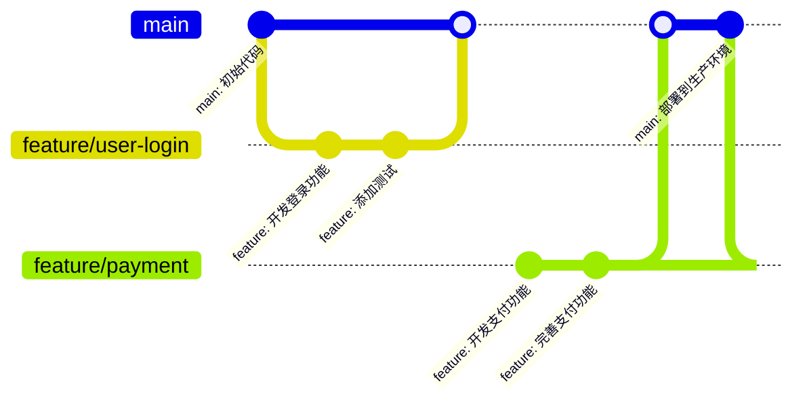
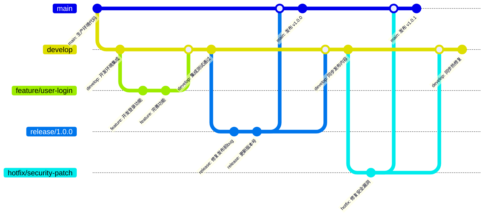
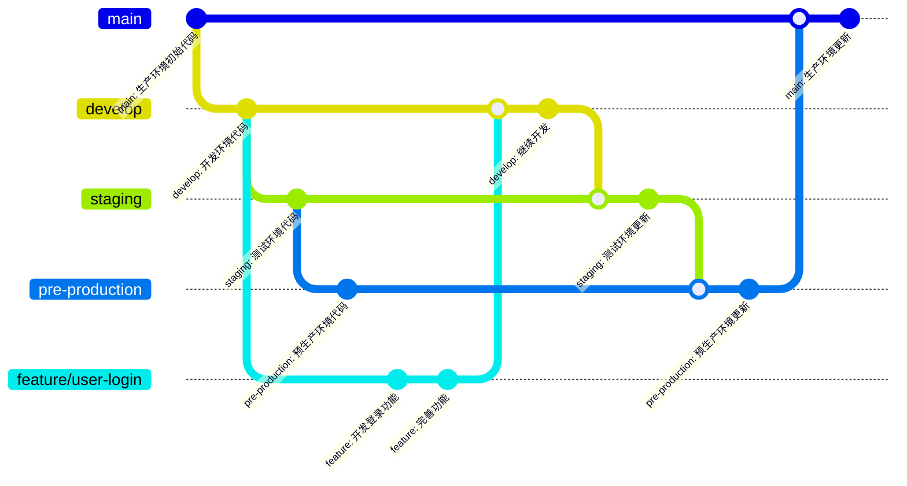
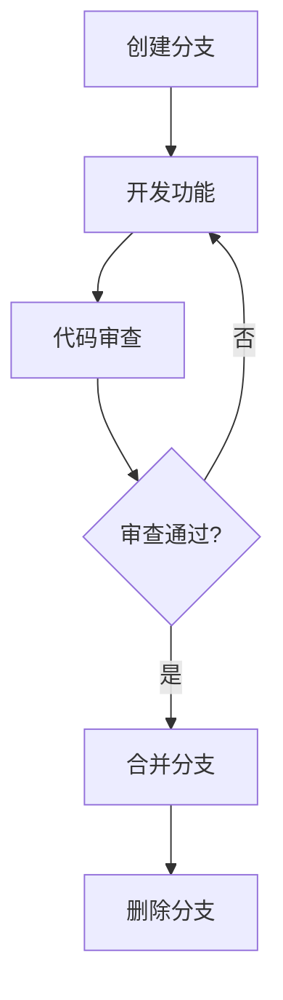

> 统一的 Git 分支命名和管理规范，包括分支类型、命名规则、分支策略、功能分支管理、代码审查流程等，提升团队协作效率和代码质量。

## 快速参考

### 分支类型速查

| 类型 | 命名格式 | 用途 | 从哪个分支创建 | 合并到哪个分支 |
|------|---------|------|---------------|---------------|
| `feature` | `feature/<描述>` | 开发新功能 | `develop` 或 `main` | `develop` 或 `main` |
| `bugfix` | `bugfix/<描述>` | 修复 bug | `develop` 或 `main` | `develop` 或 `main` |
| `hotfix` | `hotfix/<描述>` | 紧急修复生产 bug | `main` | `main` 和 `develop` |
| `release` | `release/<版本号>` | 准备版本发布 | `develop` | `main` 和 `develop` |
| `refactor` | `refactor/<描述>` | 代码重构 | `develop` | `develop` |
| `docs` | `docs/<描述>` | 文档更新 | `develop` | `develop` |
| `chore` | `chore/<描述>` | 构建、配置变更 | `develop` | `develop` |

### 命名规范

- **格式**：`<类型>/<描述>`，使用 kebab-case（小写字母和连字符）
- **描述**：清晰描述功能或问题，避免模糊命名
- **可选**：可包含 issue 编号，如 `feature/123-user-login`

### 分支策略选择

| 策略 | 适用场景 | 团队规模 | 发布周期 |
|------|---------|---------|---------|
| **GitHub Flow** | 持续部署、快速迭代 | 1-5 人 | 频繁（每天/每周） |
| **Git Flow** | 有明确发布周期 | 5+ 人 | 定期（每月/每季度） |
| **GitLab Flow** | 多环境管理 | 5+ 人 | 定期 |

### 常用命令

```bash
# 创建功能分支
git checkout -b feature/user-login develop

# 同步主分支
git fetch origin
git rebase origin/develop

# 删除本地分支
git branch -d feature/user-login

# 删除远程分支
git push origin --delete feature/user-login
```

## 一、为什么需要分支管理规范

不规范的分支命名和管理会导致：

- **识别困难**：无法快速判断分支用途（如 `fix`、`new-feature`、`临时分支`）
- **管理混乱**：分支数量多时难以追踪和维护
- **协作低效**：合并冲突频繁，代码审查困难
- **追溯困难**：无法关联 issue 或需求

统一的分支管理规范能够：
- 快速识别分支用途和状态
- 减少合并冲突和沟通成本
- 支持自动化流程（CI/CD、代码审查）
- 便于问题追踪和版本管理

## 二、分支类型和命名规范

### 2.1 主要分支

#### main/master（主分支）

**用途**：生产环境代码，始终保持可发布状态

**命名**：
- 新项目推荐使用 `main`
- 旧项目可能使用 `master`

**特点**：
- 受保护分支，禁止直接推送
- 只能通过 Pull Request 合并
- 每次合并必须经过代码审查
- 始终保持稳定和可发布状态

#### develop（开发分支）

**用途**：开发环境代码，集成所有功能开发

**命名**：`develop`

**特点**：
- 从 `main` 分支创建
- 所有功能分支从 `develop` 创建
- 功能开发完成后合并回 `develop`
- 用于集成测试和开发环境部署

### 2.2 功能分支

#### feature（功能分支）

**用途**：开发新功能

**命名格式**：`feature/<功能描述>` 或 `feature/<issue编号>-<功能描述>`

**示例**：
```bash
feature/user-login
feature/123-user-profile
feature/payment-integration
```

**特点**：
- 从 `develop` 分支创建（Git Flow）或从 `main` 创建（GitHub Flow）
- 开发完成后合并回对应分支
- 功能完成后可以删除

**命名规范**：
- 使用小写字母和连字符（kebab-case）
- 使用英文或拼音，避免中文
- 包含功能描述，避免使用 `feature/new` 这样的模糊命名
- 可以包含 issue 编号便于追踪

#### bugfix（修复分支）

**用途**：修复 bug

**命名格式**：`bugfix/<bug描述>` 或 `bugfix/<issue编号>-<bug描述>`

**示例**：
```bash
bugfix/login-error
bugfix/456-pagination-bug
bugfix/api-timeout
```

**特点**：
- 从 `develop` 分支创建（修复开发中的 bug）
- 或从 `main` 分支创建（修复生产环境的 bug）
- 修复完成后合并回对应分支
- 修复完成后可以删除

#### hotfix（热修复分支）

**用途**：紧急修复生产环境的 bug

**命名格式**：`hotfix/<bug描述>` 或 `hotfix/<issue编号>-<bug描述>`

**示例**：
```bash
hotfix/security-patch
hotfix/789-critical-bug
hotfix/database-connection
```

**特点**：
- 从 `main` 分支创建
- 修复完成后同时合并到 `main` 和 `develop`
- 用于紧急修复，需要快速处理
- 修复完成后可以删除

#### release（发布分支）

**用途**：准备新版本发布

**命名格式**：`release/<版本号>` 或 `release/v<版本号>`

**示例**：
```bash
release/1.0.0
release/v2.1.0
release/2024.12.01
```

**特点**：
- 从 `develop` 分支创建
- 用于版本发布前的最后准备
- 只修复 bug，不添加新功能
- 发布完成后合并到 `main` 和 `develop`，然后删除

### 2.3 其他分支类型

#### refactor（重构分支）

**用途**：代码重构

**命名格式**：`refactor/<重构描述>`

**示例**：
```bash
refactor/user-service
refactor/api-structure
refactor/database-schema
```

#### docs（文档分支）

**用途**：文档更新

**命名格式**：`docs/<文档描述>`

**示例**：
```bash
docs/api-documentation
docs/readme-update
docs/contributing-guide
```

#### chore（杂项分支）

**用途**：构建、配置等杂项变更

**命名格式**：`chore/<描述>`

**示例**：
```bash
chore/docker-config
chore/ci-update
chore/dependencies-update
```

## 三、分支策略

### 3.1 如何选择分支策略

选择分支策略时，考虑以下因素：

| 因素 | GitHub Flow | Git Flow | GitLab Flow |
|------|------------|----------|-------------|
| **团队规模** | 1-5 人 | 5+ 人 | 5+ 人 |
| **发布频率** | 每天/每周 | 每月/每季度 | 每月/每季度 |
| **环境数量** | 1-2 个 | 2-3 个 | 3+ 个 |
| **发布周期** | 无固定周期 | 有固定周期 | 有固定周期 |
| **版本维护** | 不需要 | 需要 | 需要 |
| **复杂度** | 低 | 中 | 高 |

**决策指南**：
- **小型项目/持续部署**：选择 GitHub Flow
- **中大型项目/定期发布**：选择 Git Flow
- **多环境管理/严格流程**：选择 GitLab Flow

### 3.2 GitHub Flow

**适用场景**：持续部署、小型团队、快速迭代

**分支结构和工作流程**：


**工作流程**：

1. **创建功能分支**：从 `main` 创建
   ```bash
   git checkout main
   git pull origin main
   git checkout -b feature/user-login
   ```

2. **开发功能**：在功能分支上提交代码
   ```bash
   git add .
   git commit -m "feat(user): 添加用户登录功能"
   git push origin feature/user-login
   ```

3. **创建 Pull Request**：合并到 `main`
   - 代码审查通过后合并
   - 合并后自动部署到生产环境

**特点**：
- 简单直接，只有 `main` 和功能分支
- 合并到 `main` 即部署
- 适合持续部署和快速迭代

### 3.3 Git Flow

**适用场景**：中大型项目、有明确发布周期、需要版本维护

**分支结构和工作流程**：


**工作流程**：

**1. 功能开发流程**：
```bash
# 从 develop 创建功能分支
git checkout develop
git checkout -b feature/user-login

# 开发完成后合并到 develop
git checkout develop
git merge feature/user-login
```

**2. 发布流程**：
```bash
# 从 develop 创建发布分支
git checkout develop
git checkout -b release/1.0.0

# 在 release 分支上只修复 bug，不添加新功能
# 修复完成后合并到 main 和 develop
git checkout main
git merge release/1.0.0
git tag v1.0.0

git checkout develop
git merge release/1.0.0

# 删除发布分支
git branch -d release/1.0.0
```

**3. 热修复流程**：
```bash
# 从 main 创建热修复分支
git checkout main
git checkout -b hotfix/security-patch

# 修复后同时合并到 main 和 develop
git checkout main
git merge hotfix/security-patch
git tag v1.0.1

git checkout develop
git merge hotfix/security-patch

# 删除热修复分支
git branch -d hotfix/security-patch
```

**特点**：
- 有 `develop` 分支用于集成开发
- 有 `release` 分支用于版本发布
- 有 `hotfix` 分支用于紧急修复
- 适合有明确发布周期的项目

### 3.4 GitLab Flow

**适用场景**：需要多环境管理、有严格发布流程

**分支结构和工作流程**：


**工作流程**：

**1. 功能开发**：
```bash
# 从 develop 创建功能分支
git checkout develop
git checkout -b feature/user-login

# 开发完成后合并回 develop
git checkout develop
git merge feature/user-login
```

**2. 环境推进**：代码通过合并操作在不同环境分支间推进
```bash
# develop → staging（测试环境）
git checkout staging
git merge develop

# staging → pre-production（预生产环境）
git checkout pre-production
git merge staging

# pre-production → production（生产环境）
git checkout production
git merge pre-production
```

**特点**：
- 每个环境有独立分支，便于回滚和问题追踪
- 代码必须按顺序推进，不能跨环境合并
- 适合需要严格环境隔离和发布流程的项目

**特点**：
- 通过环境分支管理不同环境
- 代码通过合并操作在不同环境间推进
- 适合需要严格环境隔离的项目

## 四、功能分支实践

### 4.1 分支生命周期



### 4.2 创建和开发

**创建分支**：
```bash
git checkout develop
git pull origin develop
git checkout -b feature/user-login
```

**开发规范**：
- 遵循 [Git Commit 提交规范](https://blog.mapin.net/posts/Git%20Commit%20%E6%8F%90%E4%BA%A4%E8%A7%84%E8%8C%83%E6%8C%87%E5%8D%97)
- 频繁提交，保持提交粒度小
- 每个提交都是可工作的

**推送分支**：
```bash
# 首次推送
git push -u origin feature/user-login

# 后续推送
git push
```

### 4.3 代码审查和合并

**创建 Pull Request**：
- 标题清晰描述功能
- 详细描述变更内容
- 关联相关 issue
- 添加审查者

**审查清单**：
- [ ] 代码符合项目规范
- [ ] 通过了所有测试
- [ ] 没有引入新的 bug
- [ ] 文档已更新
- [ ] 提交信息符合规范

**合并方式**：
- 优先使用 "Squash and merge" 或 "Rebase and merge"
- 避免使用 "Merge commit"（除非必要）

**合并前检查**：
- [ ] 代码审查通过
- [ ] 所有测试通过
- [ ] 没有合并冲突
- [ ] 分支是最新的

### 4.4 最佳实践

#### 保持分支同步

定期同步主分支，避免冲突累积：

```bash
# 在功能分支上
git checkout feature/user-login
git fetch origin
git rebase origin/develop
# 或使用 merge
git merge origin/develop
```

**选择 merge 还是 rebase**：
- **merge**：保留完整历史，适合共享分支
- **rebase**：线性历史，适合个人分支

#### 控制分支粒度

**原则**：
- 一个分支只实现一个功能
- 功能应该尽可能小
- 避免"大爆炸"式的分支

**示例**：
```bash
# ✅ 好的做法：细粒度分支
feature/user-login
feature/user-register
feature/user-profile

# ❌ 不好的做法：大粒度分支
feature/user-management  # 包含登录、注册、个人资料等所有功能
```

#### 避免长期分支

**问题**：
- 长期分支容易产生大量冲突
- 难以合并和维护
- 增加代码审查难度

**解决方案**：
- 将大功能拆分为多个小功能
- 每个功能分支尽快合并
- 定期同步主分支

#### 多人协作

**场景**：多个开发者协作开发同一个功能

**推荐方案**：使用子功能分支

```bash
feature/user-login           # 主功能分支
  ├── feature/user-login-ui  # UI 子功能
  └── feature/user-login-api # API 子功能
```

**工作流程**：
```bash
# 开发者 A：开发 UI
git checkout -b feature/user-login-ui feature/user-login
# 开发完成后合并到 feature/user-login

# 开发者 B：开发 API
git checkout -b feature/user-login-api feature/user-login
# 开发完成后合并到 feature/user-login
```

### 4.5 删除分支

**本地删除**：
```bash
git checkout develop
git branch -d feature/user-login
```

**远程删除**：
- Pull Request 合并后可以自动删除
- 或手动删除：`git push origin --delete feature/user-login`

## 五、分支保护与自动化

### 5.1 分支保护规则

**main/master 分支**：
- ✅ 禁止直接推送
- ✅ 必须通过 Pull Request 合并
- ✅ 必须经过代码审查（至少 1 人）
- ✅ 必须通过所有测试
- ✅ 禁止强制推送
- ✅ 禁止删除分支

**develop 分支**（可选）：
- ✅ 禁止直接推送（可选）
- ✅ 必须通过 Pull Request 合并（可选）
- ✅ 必须通过所有测试
- ✅ 禁止强制推送

### 5.2 分支保护配置

**GitHub 配置**：
```
Branch protection rules for main:
- Require a pull request before merging
  - Require approvals: 1
  - Dismiss stale pull request approvals
- Require status checks to pass before merging
  - Require branches to be up to date before merging
- Require conversation resolution before merging
- Do not allow bypassing the above settings
```

**GitLab 配置**：
```
Protected branch: main
- Allowed to merge: Maintainers
- Allowed to push: (no one)
- Allowed to force push: No
```

### 5.3 分支命名检查

#### Git Hooks

**pre-push hook 示例**：
```bash
#!/bin/bash
# .git/hooks/pre-push

branch=$(git symbolic-ref --short HEAD)

# 检查分支命名
if [[ ! $branch =~ ^(main|develop|feature|bugfix|hotfix|release|refactor|docs|chore)/ ]]; then
    echo "❌ 分支命名不符合规范：$branch"
    echo "分支应该以以下前缀开头："
    echo "  - feature/"
    echo "  - bugfix/"
    echo "  - hotfix/"
    echo "  - release/"
    echo "  - refactor/"
    echo "  - docs/"
    echo "  - chore/"
    exit 1
fi

exit 0
```

#### CI/CD 检查

在 CI/CD 流程中添加分支命名检查：

```yaml
# GitHub Actions 示例
- name: Check branch name
  run: |
    if [[ ! "${{ github.ref_name }}" =~ ^(main|develop|feature|bugfix|hotfix|release|refactor|docs|chore)/ ]]; then
      echo "分支命名不符合规范"
      exit 1
    fi
```

## 六、常见问题

### Q1: 如何重命名分支？

**A:** 
```bash
# 重命名本地分支
git branch -m old-name new-name

# 删除远程旧分支
git push origin --delete old-name

# 推送新分支
git push origin -u new-name
```

### Q2: 如何合并多个功能分支？

**A:** 按顺序合并到 develop：
```bash
git checkout develop
git merge feature/feature-1
git merge feature/feature-2
git merge feature/feature-3
```

### Q3: 功能分支可以合并到 main 吗？

**A:** 
- **GitHub Flow**：可以，功能分支直接合并到 `main`
- **Git Flow**：不推荐，应该先合并到 `develop`，经过测试后再通过 `release` 分支合并到 `main`

### Q4: 如何回滚分支合并？

**A:** 
```bash
# 使用 revert（推荐，保留历史）
git revert -m 1 <merge-commit-hash>

# 或使用 reset（谨慎使用，会改写历史）
git reset --hard <commit-before-merge>
```

### Q5: 如何处理长期未合并的分支？

**A:** 
1. 检查分支是否还有用
2. 如果没用，删除分支
3. 如果还有用，尽快合并或拆分为多个小分支

### Q6: merge 和 rebase 有什么区别？什么时候用哪个？

**A:** 
- **merge**：保留完整历史，创建合并提交，适合共享分支
- **rebase**：线性历史，不创建合并提交，适合个人分支

**建议**：
- 个人功能分支：使用 rebase 保持历史清晰
- 共享分支：使用 merge 保留完整历史

### Q7: 如何处理合并冲突？

**A:** 
1. 先同步主分支：`git fetch origin && git rebase origin/develop`
2. 解决冲突：编辑冲突文件，选择保留的代码
3. 标记已解决：`git add <冲突文件>`
4. 继续 rebase：`git rebase --continue`

### Q8: 如何查看分支关系？

**A:** 
```bash
# 查看分支树
git log --oneline --graph --all

# 查看分支列表
git branch -a

# 查看远程分支
git branch -r
```

### Q9: 如何清理已合并的分支？

**A:** 
```bash
# 删除本地已合并的分支
git branch --merged develop | grep -v "develop\|main" | xargs git branch -d

# 删除远程已合并的分支（需要先 fetch）
git fetch --prune
git branch -r --merged develop | grep -v "develop\|main" | sed 's/origin\///' | xargs -I {} git push origin --delete {}
```

### Q10: 如何同步 fork 的分支？

**A:** 
```bash
# 添加上游仓库
git remote add upstream <上游仓库URL>

# 获取上游更新
git fetch upstream

# 合并上游分支
git checkout develop
git merge upstream/develop
```

## 七、总结

### 核心原则

1. **清晰性**：分支命名应该清晰描述用途
2. **一致性**：团队统一使用相同的分支策略
3. **隔离性**：不同功能在不同分支开发
4. **可追溯性**：分支应该可以追溯到 issue 或需求

### 关键要点

- 使用标准的分支类型（feature、bugfix、hotfix 等）
- 遵循命名规范（kebab-case，包含描述）
- 选择合适的分支策略（Git Flow、GitHub Flow 等）
- 保护主分支，必须通过 Pull Request 合并
- 及时删除已完成的分支
- 保持分支同步，避免长期分支

### 参考资源

- [Git Flow](https://nvie.com/posts/a-successful-git-branching-model/) - Git Flow 分支模型
- [GitHub Flow](https://guides.github.com/introduction/flow/) - GitHub Flow 工作流
- [GitLab Flow](https://docs.gitlab.com/ee/topics/gitlab_flow.html) - GitLab Flow 工作流
- [Git Branching Strategies](https://www.atlassian.com/git/tutorials/comparing-workflows) - 分支策略对比

---

遵循统一的分支管理规范，可以显著提升团队协作效率和代码质量。建议在项目初期就建立规范，并根据项目特点选择合适的分支策略。
