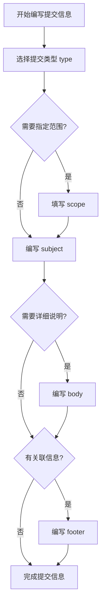
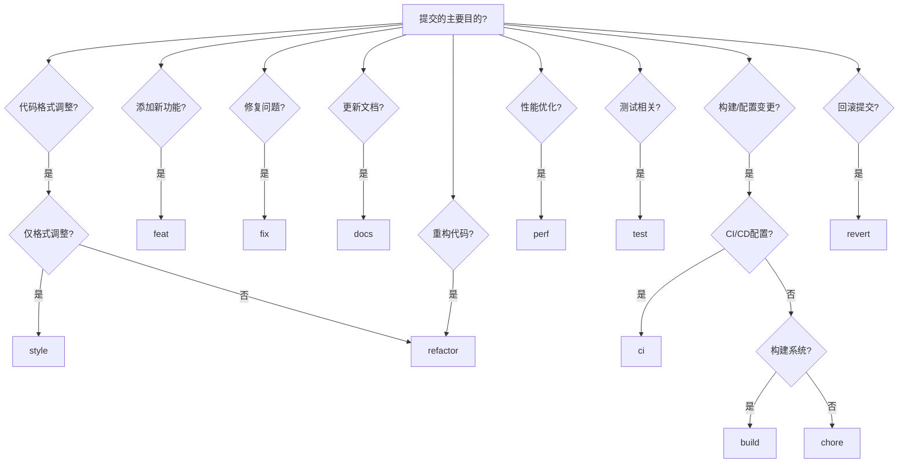

> 统一的 Git Commit 提交信息规范，提升代码审查效率、便于生成变更日志、支持后续集成自动化流程。本文档基于 [Conventional Commits](https://www.conventionalcommits.org/) 标准。

## 快速参考

### 提交信息格式模板

```bash
<type>(<scope>): <subject>

<body>

<footer>
```

**格式说明：**
- `type`（必需）：提交类型
- `scope`（可选）：影响范围
- `subject`（必需）：简短描述，不超过 72 个字符
- `body`（可选）：详细说明
- `footer`（可选）：相关引用

### 提交类型速查

| 类型 | 说明 | 使用场景 |
|------|------|----------|
| `feat` | 新功能 | 添加新功能、新特性 |
| `fix` | 修复 bug | 修复错误、问题 |
| `docs` | 文档变更 | 更新文档、注释 |
| `style` | 代码格式 | 格式化、缩进、空格（不影响功能） |
| `refactor` | 重构 | 代码结构优化（不改变功能） |
| `perf` | 性能优化 | 提升性能 |
| `test` | 测试相关 | 添加、修改测试 |
| `chore` | 杂项 | 构建、配置变更 |
| `ci` | CI 配置 | CI/CD 配置变更 |
| `build` | 构建系统 | 构建工具变更 |
| `revert` | 回滚 | 回滚之前的提交 |

### 常见场景示例

```bash
# 简单功能添加
feat: 添加用户注册功能

# 修复 bug
fix(api): 修复用户列表接口分页错误

# 文档更新
docs(readme): 更新项目安装说明

# 重构代码
refactor(user): 重构用户服务层

# 性能优化
perf(db): 优化数据库查询性能

# 带详细说明
feat(auth): 添加用户登录功能

添加基于 JWT 的用户认证功能，支持用户注册和登录。

Closes #123

# 破坏性变更
refactor(auth): 重构认证系统

BREAKING CHANGE: 移除了 Session 认证方式，请使用 JWT 认证
```

## 一、提交信息格式

### 1.1 基本格式

```
<type>(<scope>): <subject>

<body>

<footer>
```

**组成部分：**
- **type（必需）**：提交类型，说明提交的性质
- **scope（可选）**：影响范围，说明提交影响的功能模块
- **subject（必需）**：简短描述，说明本次提交的目的
- **body（可选）**：详细描述，说明提交的动机和与之前行为的对比
- **footer（可选）**：相关引用，如关闭的 issue、破坏性变更等

### 1.2 格式要求

#### Type（类型）

**必需字段**，使用以下类型之一：

| 类型 | 说明 | 示例 |
|------|------|------|
| `feat` | 新功能（feature） | `feat(auth): 添加用户登录功能` |
| `fix` | 修复 bug | `fix(api): 修复用户列表接口分页错误` |
| `docs` | 文档变更 | `docs(readme): 更新安装说明` |
| `style` | 代码格式变更（不影响代码运行） | `style: 格式化代码，修复缩进` |
| `refactor` | 重构（既不是新功能也不是修复 bug） | `refactor(user): 重构用户服务层` |
| `perf` | 性能优化 | `perf(db): 优化数据库查询性能` |
| `test` | 测试相关变更 | `test(user): 添加用户服务单元测试` |
| `chore` | 构建过程或辅助工具的变动 | `chore(deps): 更新依赖包版本` |
| `ci` | CI 配置文件和脚本的变更 | `ci: 更新构建配置` |
| `build` | 构建系统或外部依赖的变更 | `build: 更新 Dockerfile` |
| `revert` | 回滚之前的提交 | `revert: 回滚 feat(auth): 添加登录功能` |

#### Scope（范围）

**可选字段**，表示提交影响的范围。

**何时使用：**
- 提交影响特定的功能模块或组件
- 需要明确标识变更的影响范围
- 项目有明确的模块划分

**命名规范：**
- 使用小写字母和连字符（kebab-case）
- 使用简短、清晰的名称
- 与项目结构保持一致

**常见类型：**

| 类型 | 说明 | 示例 |
|------|------|------|
| **功能模块** | 业务功能模块 | `auth`、`user`、`order`、`payment` |
| **技术层** | 技术架构层次 | `api`、`db`、`service`、`controller` |
| **文件路径** | 文件或目录 | `config`、`utils`、`middleware` |
| **技术栈** | 技术栈标识 | `frontend`、`backend`、`docker` |
| **组件** | 组件或库 | `button`、`router`、`store` |

**示例：**
```bash
feat(auth): 添加 JWT 认证
fix(api/user): 修复用户列表接口
docs(readme): 更新项目说明
refactor(db): 重构数据库连接层
```

**注意：**
- 如果影响多个范围，可以使用 `*` 表示全局影响：`feat(*): 添加全局配置`
- 如果影响范围不明确或影响较小，可以省略 scope：`feat: 添加新功能`
- 保持 scope 命名的一致性，团队统一使用相同的命名规范

#### Subject（主题）

**必需字段**，简短描述本次提交的目的。

**要求：**
- 使用祈使句，现在时态（如：使用"添加"而不是"添加了"）
- 首字母小写（除非是专有名词）
- 结尾不加句号
- 长度建议不超过 72 个字符（Git 标准），尽量控制在 50 个字符以内
- 清晰描述"做了什么"，而不是"为什么做"

**示例：**
```bash
# ✅ 好的示例
feat(auth): 添加用户登录功能
fix(api): 修复分页参数验证错误
docs: 更新 API 文档

# ❌ 不好的示例
feat(auth): 添加了用户登录功能  # 使用了"了"
fix(api): 修复分页参数验证错误。  # 结尾有句号
docs: 更新 API 文档，因为之前的文档过时了  # 太长，解释了原因
```

#### Body（正文）

**可选字段**，详细描述本次提交的动机和与之前行为的对比。

**何时需要：**
- 提交涉及复杂的变更，需要详细说明
- 需要解释变更的原因和动机
- 需要说明与之前行为的对比
- 包含破坏性变更（BREAKING CHANGE）

**何时可以省略：**
- 简单、直观的变更
- 提交信息在 subject 中已经足够清晰
- 影响范围较小的修复

**要求：**
- 在 subject 后空一行
- 使用祈使句，现在时态
- 说明"为什么"做这个变更，而不是"做了什么"（"做了什么"在 subject 中已经说明）
- 每行不超过 72 个字符
- 可以使用列表、代码块等格式增强可读性

**示例：**
```bash
feat(auth): 添加用户登录功能

添加基于 JWT 的用户认证功能，支持：
- 用户注册和登录
- Token 生成和验证
- 密码加密存储

替换了之前的 Session 认证方式，提升安全性和可扩展性。
```

#### Footer（脚注）

**可选字段**，包含相关引用和元数据。

**常用格式：**
- **关闭 Issue**：`Closes #123`、`Fixes #456`、`Resolves #789`
- **破坏性变更**：`BREAKING CHANGE: 描述破坏性变更`
- **关联 Issue**：`Refs #789`、`Related to #123`
- **共同作者**：`Co-authored-by: Name <email@example.com>`
- **签名**：`Signed-off-by: Name <email@example.com>`（用于某些项目要求）

**格式说明：**
- 每个 footer 项占一行
- 使用关键字开头（Closes、Fixes、Refs 等）
- BREAKING CHANGE 必须大写，后跟冒号和空格

**示例：**
```bash
feat(auth): 添加用户登录功能

添加基于 JWT 的用户认证功能。

Closes #123
Refs #456

BREAKING CHANGE: 移除了 Session 认证方式，请使用 JWT 认证
```

### 1.3 格式流程图



### 1.4 完整示例

```bash
# 示例 1：简单提交
feat: 添加用户注册功能

# 示例 2：带 scope 的提交
feat(auth): 添加用户登录功能

# 示例 3：带 body 的提交
feat(user): 添加用户头像上传功能

支持用户上传自定义头像，图片会自动压缩和裁剪。
使用 MinIO 作为对象存储服务。

# 示例 4：带 footer 的提交
fix(api): 修复用户列表接口分页错误

修复了当 page 参数为 0 时返回空结果的问题。

Fixes #123

# 示例 5：破坏性变更
refactor(auth): 重构认证系统

将 Session 认证改为 JWT 认证，提升安全性和可扩展性。

BREAKING CHANGE: 移除了 Session 认证方式，现有客户端需要更新为使用 JWT Token
```

## 二、提交类型

### 2.1 类型选择决策树



### 2.2 类型说明

#### feat（新功能）

用于添加新功能的提交。

**示例：**
```bash
feat(user): 添加用户头像上传功能
feat(api): 添加用户列表接口
feat(auth): 添加 OAuth2 登录支持
```

#### fix（修复 bug）

用于修复 bug 的提交。

**示例：**
```bash
fix(api): 修复用户列表接口分页错误
fix(auth): 修复 Token 过期时间计算错误
fix(db): 修复数据库连接池泄漏问题
```

#### docs（文档）

用于文档相关的变更。

**示例：**
```bash
docs(readme): 更新项目安装说明
docs(api): 添加 API 接口文档
docs: 更新贡献指南
```

#### style（格式）

用于代码格式的变更，不影响代码运行。

**示例：**
```bash
style: 格式化代码，修复缩进
style(api): 统一代码风格
```

**注意：**
- 不包括 CSS 样式的变更（CSS 变更使用 `feat` 或 `fix`）
- 主要指代码格式化、缩进、空格等

#### refactor（重构）

用于重构代码的提交，既不是新功能也不是修复 bug。

**示例：**
```bash
refactor(user): 重构用户服务层
refactor(api): 提取公共验证逻辑
refactor(db): 优化数据库查询结构
```

#### perf（性能优化）

用于性能优化的提交。

**示例：**
```bash
perf(db): 优化数据库查询性能
perf(api): 添加接口响应缓存
perf: 优化图片加载性能
```

#### test（测试）

用于测试相关的变更。

**示例：**
```bash
test(user): 添加用户服务单元测试
test(api): 添加接口集成测试
test: 修复测试用例
```

#### chore（杂项）

用于构建过程或辅助工具的变动。

**示例：**
```bash
chore(deps): 更新依赖包版本
chore(config): 更新配置文件
chore: 清理无用文件
```

#### ci（持续集成）

用于 CI 配置文件和脚本的变更。

**示例：**
```bash
ci: 更新构建配置
ci: 更新 CI 脚本
ci: 修复构建脚本
```

**注意：**
- 如果项目暂未使用 CI/CD，此类型可以用于构建相关配置的变更
- 也可以归类到 `chore` 类型

#### build（构建）

用于构建系统或外部依赖的变更。

**示例：**
```bash
build: 更新 Dockerfile
build: 更新构建配置
build(deps): 更新构建依赖
```

#### revert（回滚）

用于回滚之前的提交。

**示例：**
```bash
revert: 回滚 feat(auth): 添加登录功能
revert: 回滚 fix(api): 修复分页错误
```

### 2.3 类型对比

**常见混淆场景：**

| 对比 | 说明 | 示例 |
|------|------|------|
| **feat vs fix** | 新功能用 feat，修复 bug 用 fix | `feat: 添加功能` vs `fix: 修复错误` |
| **refactor vs perf** | 重构代码结构用 refactor，优化性能用 perf | `refactor: 重构代码` vs `perf: 优化性能` |
| **style vs refactor** | 仅格式调整用 style，代码结构改变用 refactor | `style: 格式化` vs `refactor: 重构结构` |
| **chore vs build** | 一般配置变更用 chore，构建系统变更用 build | `chore: 更新配置` vs `build: 更新构建工具` |

## 三、提交原则

### 3.1 提交粒度

**原则：**
- 一个提交应该只做一件事
- 提交应该尽可能小，但也要有意义
- 避免"大爆炸"式的提交

**示例：**
```bash
# ✅ 好的做法：细粒度提交
feat(user): 添加用户模型
feat(user): 添加用户注册接口
feat(user): 添加用户注册验证

# ❌ 不好的做法：大粒度提交
feat(user): 实现用户注册功能（包含模型、接口、验证等）
```

### 3.2 提交频率

**建议：**
- 每个提交应该是一个逻辑上独立的变更
- 不要将多个不相关的变更放在一个提交中
- 频繁提交，但确保每次提交都是可工作的

**示例：**
```bash
# ✅ 好的做法：分别提交
feat(user): 添加用户注册功能
test(user): 添加用户注册测试
docs(user): 更新用户模块文档

# ❌ 不好的做法：混合提交
feat(user): 添加用户注册功能和测试，更新文档
```

### 3.3 提交语言

**建议：**
- 团队统一使用一种语言（中文或英文）
- 如果使用中文，确保所有提交信息都是中文
- 如果使用英文，确保所有提交信息都是英文

**示例：**
```bash
# ✅ 统一使用中文
feat(auth): 添加用户登录功能
fix(api): 修复分页错误

# ✅ 统一使用英文
feat(auth): add user login feature
fix(api): fix pagination error

# ❌ 混合使用
feat(auth): 添加用户登录功能
fix(api): fix pagination error
```

### 3.4 提交前检查

**检查清单：**
- [ ] 代码可以正常编译/运行
- [ ] 通过了所有测试
- [ ] 提交信息符合规范
- [ ] 没有包含调试代码或注释
- [ ] 没有包含敏感信息

## 四、实用工具

### 4.1 提交信息模板

**创建提交模板：**

1. **创建 `.gitmessage` 文件**（项目根目录）：
```bash
# <type>(<scope>): <subject>
#
# 为什么做这个变更
# <body>
#
# 相关引用
# <footer>
#
# 类型说明：
# feat:     新功能
# fix:      修复 bug
# docs:     文档变更
# style:    代码格式变更
# refactor: 重构
# perf:     性能优化
# test:     测试相关
# chore:    构建过程或辅助工具的变动
# ci:       CI 配置变更
# build:    构建系统变更
# revert:   回滚提交
```

2. **配置 Git 使用模板**：
```bash
# 全局配置（所有项目使用）
git config --global commit.template ~/.gitmessage

# 项目配置（仅当前项目使用）
git config commit.template .gitmessage
```

3. **使用模板创建提交**：
```bash
# 方式一：使用 -t 参数
git commit -t .gitmessage

# 方式二：直接 git commit（如果已配置模板）
git commit
# Git 会自动打开编辑器，显示模板内容
```

4. **提交模板到仓库**（可选）：
```bash
# 将模板文件提交到仓库，团队成员可以共享
git add .gitmessage
git commit -m "docs: 添加提交信息模板"
```

**注意：**
- 模板中的注释行（以 `#` 开头）不会被包含在提交信息中
- 团队成员需要手动配置 `git config commit.template .gitmessage` 才能使用
- 可以在项目 README 中说明如何配置模板

## 五、总结

### 核心原则

1. **一致性**：团队统一使用相同的提交规范
2. **清晰性**：提交信息应该清晰描述变更内容
3. **完整性**：包含足够的信息，便于理解和追溯
4. **可维护性**：规范的执行应该简单易行

### 关键要点

- 使用标准的提交类型（feat、fix、docs 等）
- 提交信息使用祈使句，现在时态
- 一个提交只做一件事
- 通过代码审查确保规范执行
- 定期审查提交历史，保持规范一致性

### 参考资源

- [Conventional Commits](https://www.conventionalcommits.org/) - 提交规范标准
- [Angular Commit Message Guidelines](https://github.com/angular/angular/blob/main/CONTRIBUTING.md#commit) - Angular 提交规范

---

遵循统一的提交规范，可以显著提升团队协作效率和代码质量。建议在项目初期就建立规范，并通过代码审查确保规范执行。
