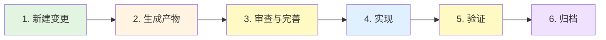

> 参考文档
> 1. [OpenSpec 官方仓库](https://github.com/Fission-AI/OpenSpec)
> 2. [OpenSpec npm 包](https://www.npmjs.com/package/@fission-ai/openspec)
> 3. [官方文档索引](https://github.com/Fission-AI/OpenSpec/tree/main/docs)：Getting Started、Workflows、Commands、CLI、Supported Tools、Concepts、Customization、Multi-Language

# OpenSpec 使用指南

## 概述

OpenSpec 是规范驱动开发工具，在编码前将需求与范围落成结构化文件（proposal、specs、design、tasks），由 AI 按这些文件实现，实现可追溯、可审计。无需 API 密钥；产物位于 `openspec/`，可随代码提交并在团队内共享。

**推荐用法**：以自然语言向 AI 描述意图（例如「为站点加一篇《uv 使用指南》博客」「把侧边栏改成按年份分组」），由 AI 理解后代为执行 OpenSpec 流程——新建变更、生成规划产物、按任务实现、归档。你无需记忆或输入具体命令；若 AI 已加载项目内的 OpenSpec 技能（通过 `openspec init` 安装），直接说明要做的事即可。

---

## 环境与安装

**环境要求**：Node.js ≥ 20.19.0。

```bash
npm install -g @fission-ai/openspec@latest
cd <项目根目录>
openspec init
```

`init` 会提示选择 AI 工具、安装技能（如 `.cursor/skills/openspec-*`）、创建 `openspec/` 目录。完成后重启 AI 工具以加载技能。可选：创建 `openspec/config.yaml` 以注入项目约定（见「项目配置」）。建议首次用一个小需求（如新增一篇短文或改一处配置）按六步走通一遍，以熟悉 AI 与 OpenSpec 的协作方式。

---

## 核心概念

- **变更（change）**：单次工作单元，对应 `openspec/changes/<变更名>/` 目录。例如新增一篇博客、修改侧边栏逻辑。
- **产物（artifacts）**：变更内的规划文档——proposal（目标与范围）、specs（需求与场景）、design（技术方案）、tasks（任务清单）。AI 依此实现。
- **主规范（specs）**：`openspec/specs/` 为当前项目的规范基线。变更在自身目录内编写 delta（新增/修改/删除的需求），归档时合并入主规范。
- **归档（archive）**：将变更的 delta 合并入主规范，并将变更目录移至 `openspec/changes/archive/YYYY-MM-DD-<变更名>/`。

主流程：新建变更 → 生成产物 →（可选）审查与完善 → 实现 →（可选）验证 → 归档。审查与完善可穿插于实现前后，支持随时修改 proposal/specs/design 后继续。

---

## 目录结构

```
openspec/
├── specs/                 # 主规范（归档时合并 delta）
│   └── <domain>/
│       └── spec.md
├── changes/
│   ├── <change-name>/     # 活动变更
│   │   ├── .openspec.yaml
│   │   ├── proposal.md
│   │   ├── design.md
│   │   ├── tasks.md
│   │   └── specs/         # 本变更的 delta
│   └── archive/           # 已归档
│       └── YYYY-MM-DD-<change-name>/
└── config.yaml            # 项目配置（可选）
```

---

## 规范工作流程（六步）

### 流程概览



### 步骤说明

> **1. 新建变更**
>
> 你表达要做的事（如「为博客加一篇《uv 使用指南》」「侧边栏按年份分组」）。AI 会创建 `openspec/changes/<变更名>/` 与 `.openspec.yaml`，并准备生成 proposal。

↓

> **2. 生成规划产物**
>
> 你可要求「一次性给出全部规划」或「先出 proposal 我看看再继续」。AI 会生成 proposal、specs、design、tasks（或按依赖逐个生成）。若项目有 config.yaml，会自动带入其中的 context 与 rules。

↓

> **3. （可选）审查与完善**
>
> 你查看或编辑 `openspec/changes/<变更名>/` 下的 proposal.md、design.md、tasks.md，或直接说「把 xxx 需求改成 xxx」「第二节先讲安装再讲配置」。AI 会按你的指示修改产物。可在实现前后反复进行。

↓

> **4. 实现**
>
> 你确认规划后说「按这个实现」或「开始实现」。AI 会按 tasks.md 执行并在完成项标记 `[x]`。

↓

> **5. （可选）验证**
>
> 你可要求「检查实现和设计是否一致」。AI 会校验并给出 CRITICAL / WARNING / SUGGESTION。

↓

> **6. 归档**
>
> 你说「归档这个变更」或「收尾」。AI 会提示是否将 delta 合并入主规范，确认后把变更移至 `openspec/changes/archive/YYYY-MM-DD-<变更名>/`。

---

## 自然语言表达示例

以下表达方式均可由 AI 解析并触发对应 OpenSpec 流程；无需记忆命令，按习惯描述即可。

| 意图 | 可这样说 |
|------|----------|
| 新建并规划 | 「为站点加一篇《uv 使用指南》博客，用 OpenSpec 走一遍」「我要改侧边栏按年份分组，先建个变更并出方案」 |
| 生成/补充产物 | 「一次性给出 proposal、设计和任务清单」「先出大纲和编写思路，我确认再写正文」 |
| 修改规划 | 「把第二节改成先讲安装再讲配置」「需求里加一条：未登录时跳转登录页」 |
| 实现 | 「按当前 tasks 实现」「实现 add-blog-uv-guide 的变更」 |
| 验证与归档 | 「检查实现和设计是否一致」「归档 add-blog-uv-guide」 |

斜杠命令（如 `/opsx:new`、`/opsx-ff`）为可选，供习惯输入命令时使用；AI 在理解自然语言后内部会调用相应能力。完整命令列表见「斜杠命令速查」。

---

## 斜杠命令速查

以自然语言描述意图时通常无需使用；若需直接触发，可参考下表。Cursor 多为连字符（`/opsx-new`），Claude Code 多为冒号（`/opsx:new`）。

| 阶段/用途 | 命令 | 说明 |
|-----------|------|------|
| 探索 | `/opsx:explore` 或 `/opsx-explore` | 澄清需求，不创建文件 |
| 新建变更 | `/opsx:new [变更名]` 或 `/opsx-new [变更名]` | 创建变更目录 |
| 创建产物 | `/opsx:continue [变更名]` 或 `/opsx-continue [变更名]` | 按依赖生成下一产物 |
| 创建产物 | `/opsx:ff [变更名]` 或 `/opsx-ff [变更名]` | 一次性生成全部规划产物 |
| 实现 | `/opsx:apply [变更名]` 或 `/opsx-apply [变更名]` | 按 tasks.md 执行并标记完成 |
| 验证 | `/opsx:verify [变更名]` 或 `/opsx-verify [变更名]` | 校验实现与规范 |
| 合并规范 | `/opsx:sync [变更名]` 或 `/opsx-sync [变更名]` | 将 delta 合并入主规范 |
| 归档 | `/opsx:archive [变更名]` 或 `/opsx-archive [变更名]` | 合并规范并移入 archive |
| 批量归档 | `/opsx:bulk-archive` 或 `/opsx-bulk-archive` | 归档多个变更 |
| 入门 | `/opsx:onboard` 或 `/opsx-onboard` | 引导式完整流程 |

终端查询：`openspec list`、`openspec show <变更名>`、`openspec status --change <变更名>`、`openspec validate <变更名>`。

---

## 使用示例

### 示例一：新增博客文章

场景：文档站，文章在 `docs/posts/`，要求先出大纲与编写思路、确认后再写正文（可写入 config.yaml rules）。

- 你：「为博客加一篇《uv 使用指南》，用 OpenSpec 走一遍。」
- AI 会新建变更（如 add-blog-uv-guide）、生成 proposal 与 design（含大纲与编写思路）及 tasks。若 config 要求先确认大纲，AI 会先给出大纲与思路，等你确认。
- 你确认后：「按这个实现。」
- AI 按 tasks 执行：确认大纲 → 创建 `docs/posts/xxx.md` → 撰写内容 → 检查 frontmatter 与 tags。
- 你：「检查一下再归档。」AI 执行 verify 后执行 archive。

### 示例二：修改代码（如侧边栏逻辑）

场景：修改文章列表/侧边栏生成逻辑，涉及 `docs/.vitepress/theme/utils/posts.ts` 或配置。

- 你：「侧边栏要按年份分组，先建个 OpenSpec 变更并出方案。」
- AI 新建变更（如 fix-sidebar-by-year）、生成 proposal（标明改动文件与影响）、design（方案与备选）、tasks（代码改动、本地验证、回滚方式）。
- 你核对后：「按 tasks 实现。」AI 按 tasks 改代码并在 tasks.md 中标记完成。
- 你：「验证后归档。」AI 执行 verify 与 archive。

---

## 项目配置（config.yaml）

路径：`openspec/config.yaml`。AI 在生成 proposal、specs、design、tasks 时会读取并注入；修改后无需重启即可生效。

| 配置项 | 说明 |
|--------|------|
| `schema`（必填） | 默认工作流，常用 `spec-driven`。可选值见 `openspec schemas`；自定义见「延伸阅读」中的 Customization |
| `context`（可选） | 注入所有产物的全局上下文：技术栈、目录约定、业务/风格说明。建议 ≤50KB，优先写易被忽略的约定 |
| `rules`（可选） | 按产物类型注入：`proposal`、`specs`、`design`、`tasks`。用于该产物的格式与内容约束 |

**context 与 rules**：context 作用于所有产物；rules 仅作用于对应 key 的产物。完整示例见本仓库 `openspec/config.yaml`。

**最小示例**：

```yaml
schema: spec-driven

context: |
  技术栈：TypeScript、VitePress、Vue 3
  站点根目录：docs/，文章目录：docs/posts/
  frontmatter：title、date、tags

rules:
  proposal:
    - 包含 "Goals" 与 "Non-goals"
    - 写文章类：先出大纲与编写思路，用户确认后再创建 post 的 md
  tasks:
    - 任务按可交付物拆分，单任务建议 0.5–2 小时可完成
```

---

## 参考

### Delta Specs 格式

变更内 `specs/` 使用 delta 格式：`## ADDED Requirements`、`## MODIFIED Requirements`、`## REMOVED Requirements`。需求标题为 `### Requirement: <名称>`，可含 `#### Scenario:`（Given/When/Then）。归档时 ADDED 并入主 spec，MODIFIED 替换对应需求，REMOVED 从主 spec 移除。

### CLI 命令

```bash
openspec list                          # 活动变更列表
openspec show <变更名>                 # 变更详情
openspec status --change <变更名>      # 产物状态（ready/done/blocked）
openspec validate <变更名>             # 规范格式校验
openspec archive <变更名> [-y]         # 归档
openspec view                          # 交互式仪表板
openspec update                        # 刷新技能（升级 CLI 后在项目内执行）
openspec schemas                       # 可用 schema 列表
```

---

## 延伸阅读（与 OpenSpec 的关联）

以下官方文档与日常使用 OpenSpec 直接相关，按需查阅。

### Workflows（工作流组合）

[Workflows](https://github.com/Fission-AI/OpenSpec/blob/main/docs/workflows.md) 介绍多种「新建变更 → 生成产物 → 实现 → 归档」的组合方式（例如何时用一次性生成、何时用逐个生成、多变更并行时如何操作）。当你需要固定流程模板或与团队统一节奏时，可据此调整表达方式或让 AI 遵循某一模式。

### Commands（斜杠命令与技能）

[Commands](https://github.com/Fission-AI/OpenSpec/blob/main/docs/commands.md) 列出全部斜杠命令、参数及说明。以自然语言驱动为主时，通常不必查阅；若你或 AI 需要精确触发某一动作（如仅生成下一产物、仅同步规范不归档），可在此核对命令与语义对应关系。

### Customization（自定义 Schema）

[Customization](https://github.com/Fission-AI/OpenSpec/blob/main/docs/customization.md) 说明如何自定义工作流 schema、产物类型与依赖关系。与 `config.yaml` 中的 `schema` 及 `rules` 配合：若默认 `spec-driven` 不满足需求（例如要增加「评审」产物、调整 proposal → design 顺序），可在此了解如何定义并引用自定义 schema。

---

## 总结

OpenSpec 在编码前将需求与范围落成结构化产物（proposal、specs、design、tasks），由 AI 依此实现，实现可追溯、可审计，产物可随代码提交并共享。

**使用方式**：以自然语言描述意图，由 AI 执行新建变更、生成产物、实现、验证与归档；可随时要求调整产物或继续下一步。项目约定通过 `openspec/config.yaml` 的 context 与 rules 注入，生成的 proposal/design/tasks 自动符合既定技术栈与协作约定。

**上手条件**：在项目根目录执行 `openspec init` 并重启 AI 工具；理解变更、产物、主规范、归档四概念及六步流程顺序即可开始使用。延伸阅读与本文章节的对应关系见「延伸阅读」一节。
