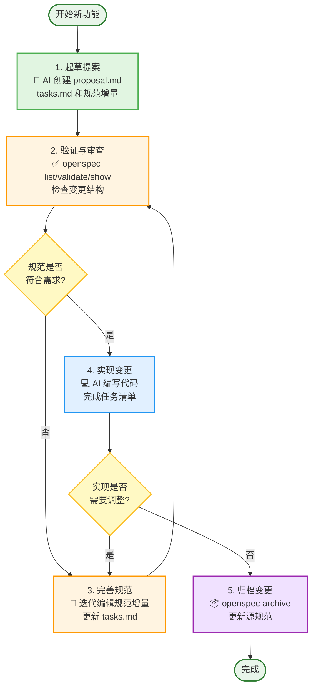

> 参考文档
> 1. [OpenSpec 官方仓库](https://github.com/Fission-AI/OpenSpec)
> 2. [OpenSpec npm 包](https://www.npmjs.com/package/@fission-ai/openspec)

# OpenSpec 使用指南

OpenSpec 是一个规范驱动的开发工具，帮助开发者和 AI 编程助手在编写代码之前就需求达成一致。**无需 API 密钥**。

## 核心优势

- **需求对齐**：开发者和 AI 在开始工作前就规范达成一致
- **结构化变更**：提案、任务和规范更新文件夹保持范围明确且可审计
- **可见性**：清晰了解哪些内容被提议、激活或归档
- **工具兼容**：与主流 AI 工具配合使用，支持自定义斜杠命令
- **口语化驱动**：全流程可用自然语言沟通，AI 负责解析意图并生成规范文件
- **结果可持久化**：所有产物都写入仓库，可直接 `git add`+`git push` 与团队共享

## 口语化驱动 & 可协作

OpenSpec 的最佳实践是**用口语化语句驱动每一步**，让 AI 负责把需求翻译成结构化的 `proposal.md`、`tasks.md` 和规范增量。这样做有两大好处：

- **上手快**：你只需描述“想做什么”“哪里不对”，AI 会自动补齐格式和文件。
- **天然协作**：生成的文件都存放在 `openspec/` 目录下，和代码一起提交即可。在 Git 中 review 或 PR，就能和同事同步任务、规范和实现进度。

简单流程：说出需求 → AI 生成/更新 OpenSpec 文件 → `git add openspec/` → 提交/推送，与团队共享上下文。

## 工作流程



## 快速开始

### 安装

```bash
# 全局安装 CLI（需要 Node.js >= 20.19.0）
npm install -g @fission-ai/openspec@latest

# 验证安装
openspec --version
```

### 初始化项目

```bash
cd my-project
openspec init
```

初始化过程会：
- 提示选择 AI 工具（Cursor、Claude Code、CodeBuddy 等）
- 自动配置斜杠命令，生成 `AGENTS.md`
- 创建 `openspec/` 目录结构

初始化后重启 AI 工具以加载新的斜杠命令。

## 基本命令

```bash
openspec list                    # 查看活动变更文件夹
openspec show <change>           # 显示变更详情
openspec validate <change>       # 验证规范格式
openspec archive <change> [-y]   # 归档已完成的变更
openspec view                    # 交互式仪表板
openspec update                  # 更新代理说明
```

## 使用示例

### 1. 创建提案

**方式一：使用斜杠命令**（推荐，支持的工具可直接使用）

在 AI 工具聊天框中输入：
```
/openspec-proposal 添加用户搜索功能
```
或（部分工具使用冒号格式）：
```
/openspec:proposal 添加用户搜索功能
```

**方式二：自然语言**

这个方式我用的最多，直接就是语义化的描述，说创建一个openspec的任务，这样最符合用户习惯和直觉，当然如果喜欢使用/来敲命令的话，当然也可
```text
为添加用户搜索功能创建 OpenSpec 变更提案
```

AI 会在 `openspec/changes/add-user-search/` 中创建：
- `proposal.md` - 变更说明
- `tasks.md` - 任务清单
- `specs/` - 规范增量

### 2. 审查与验证

```bash
openspec list                    # 查看变更列表
openspec validate add-user-search  # 验证格式
openspec show add-user-search      # 查看详情
```

### 3. 完善规范

继续与 AI 对话完善规范，哪里不对说哪里，直接口语化表达就行：

```text
为xxx功能优化xxx细节，这个功能不对，需要xxxx来实现
```

### 4. 实现变更

规范确认后，开始实现：

**使用斜杠命令**：
```
/openspec-apply add-user-search
```
或
```
/openspec:apply add-user-search
```

**或使用自然语言**：
```text
实现 add-user-search 变更
```

AI 会根据 `tasks.md` 完成任务并标记完成。

### 5. 归档变更

实现完成后归档：

**使用斜杠命令**：
```
/openspec-archive add-user-search
```
或
```
/openspec:archive add-user-search
```

**或使用终端命令**：
```bash
openspec archive add-user-search -y
```

归档后，规范会更新到 `openspec/specs/` 中。

> ✏️ 提示：此时 `openspec/changes/` 中的任务记录与 `openspec/specs/` 的最新规范一起可被提交。把这些文件 `git add` 后推送，即可让同事在任意环境中获得相同的上下文。

## 文件结构

```
openspec/
├── specs/              # 当前规范（归档后更新）
│   └── <domain>/
│       └── spec.md
├── changes/            # 活动变更
│   └── <change-name>/
│       ├── proposal.md # 变更说明
│       ├── tasks.md    # 任务清单
│       └── specs/      # 规范增量
└── project.md          # 项目级约定（可选）
```

## 原生斜杠命令使用

### 什么是原生斜杠命令？

原生斜杠命令是 OpenSpec 在支持的 AI 工具中提供的快捷方式。**直接在 AI 工具的聊天输入框中输入斜杠命令即可使用**，无需额外配置。

### 如何使用

1. **初始化项目**：运行 `openspec init` 并选择你的 AI 工具
2. **重启 AI 工具**：初始化后重启工具以加载斜杠命令
3. **输入斜杠命令**：在聊天框中输入 `/` 即可看到 OpenSpec 相关命令

### 三个核心命令

所有支持的工具都提供三个核心命令：

- **`/openspec-proposal`** 或 **`/openspec:proposal`** - 创建变更提案
- **`/openspec-apply`** 或 **`/openspec:apply`** - 实现变更
- **`/openspec-archive`** 或 **`/openspec:archive`** - 归档变更

### 命令格式差异

不同工具的斜杠命令格式略有不同：

- **使用冒号格式**（`:`）：Claude Code、CodeBuddy、Qoder 等
  ```
  /openspec:proposal 添加用户搜索功能
  /openspec:apply add-user-search
  /openspec:archive add-user-search
  ```

- **使用连字符格式**（`-`）：Cursor、GitHub Copilot、Windsurf 等
  ```
  /openspec-proposal 添加用户搜索功能
  /openspec-apply add-user-search
  /openspec-archive add-user-search
  ```

### 支持的 AI 工具

**原生支持**（可直接使用斜杠命令）：
- Cursor、Claude Code、CodeBuddy、GitHub Copilot、Windsurf、Qoder、OpenCode 等

**其他工具**：
- 不支持斜杠命令的工具可以通过自然语言使用 OpenSpec
- AI 会自动读取 `openspec/AGENTS.md` 中的工作流说明
- 直接说"创建 OpenSpec 提案"、"实现变更"、"归档变更"即可

## 规范格式要点

规范增量使用以下格式：

- **`## 新增需求`** - 新功能
- **`## 修改的需求`** - 更改的行为
- **`## 删除的需求`** - 已弃用的功能

每个需求使用 `### 需求：<名称>` 作为标题，至少包含一个 `#### 场景：` 块。

## 更新 OpenSpec

```bash
# 升级 CLI
npm install -g @fission-ai/openspec@latest

# 更新项目配置
openspec update
```

## 总结

OpenSpec 通过规范驱动的工作流，让 AI 辅助开发更加可预测和可控。核心特点：

- ✅ 无需 API 密钥
- ✅ 轻量级工作流
- ✅ 支持多种 AI 工具（斜杠命令 + 口语化表达双轨并行）
- ✅ 结构化变更管理
- ✅ 规范与代码分离
- ✅ 自然语言描述即可产出可追踪文件，推送到 Git 后即可多人协作

只需用口语化方式告诉 AI 接下来要做什么、哪里需要调整，OpenSpec 就能生成可持久化的规范与任务。把这些文件提交到仓库后，你的团队即可基于同一上下文协作，实现“规范先行、实现可追踪”的工作方式。
