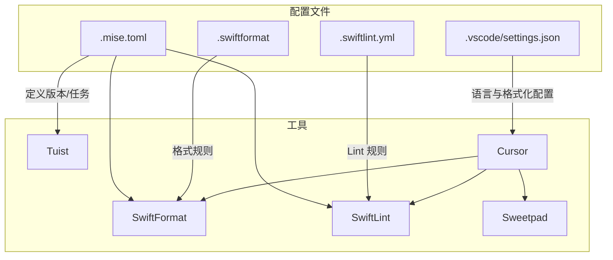
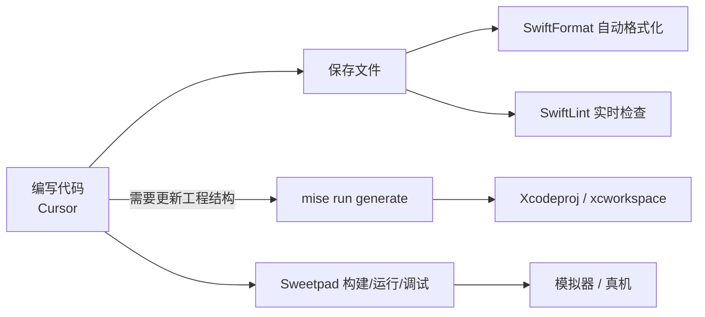

> 本文只保留当前实现的工具链配置与流程，聚焦 Cursor + Sweetpad + Tuist + Mise + Xcodes + SwiftFormat + SwiftLint 的协同使用，去除不必要的评估与冗余配置。

### 适用场景与阅读顺序

- **你适合读这篇文档，如果**：已经有一定 iOS / SwiftUI 开发经验，希望在 macOS 上用 Cursor + Tuist + Mise 取代传统纯 Xcode 工作流。
- **本文不覆盖**：CI/CD、复杂模块化设计等高级主题，只专注「本机开发环境 + 工具链协同」。
- **推荐阅读路径**：
  - 第一次搭建时：按顺序阅读「一 → 二 → 三」，先用第二节的「最小可用示例」跑通，再回到第三节按步骤细化配置。
  - 已有经验想查速记：直接看第二节「安装与初始化」，把它当成命令速查表使用。

## 一、工具链概览与职责

```mermaid
graph TD
    subgraph Environment [系统环境]
        Xcodes[Xcodes] -->|管理| Xcode[Xcode / CLT]
        Xcode -.->|提供| Swift[Swift Toolchain]
    end

    subgraph VersionControl [版本管理 (Mise)]
        Mise[Mise] -->|锁定版本| TuistCLI[Tuist]
        Mise -->|锁定版本| SFormat[SwiftFormat]
        Mise -->|锁定版本| SLint[SwiftLint]
    end

    subgraph Project [项目管理]
        Config[Project.swift] -->|输入| TuistCLI
        TuistCLI -->|生成| Xcodeproj[.xcodeproj / .xcworkspace]
    end

    subgraph Editor [开发体验 (Cursor)]
        Cursor -->|LSP 支持| SourceKit[SourceKit-LSP]
        SourceKit -->|依赖| Swift
        Cursor -->|读取| Xcodeproj
        Cursor -->|保存自动执行| SFormat
        Cursor -->|实时检查| SLint
        Cursor -->|扩展| Sweetpad[Sweetpad]
        Sweetpad -->|构建/运行/调试| Xcode
    end
```

### 工具职责与配合

| 工具 | 主要职责 | 与其他工具的配合 |
|------|---------|----------------|
| **Cursor** | 代码编辑、AI 辅助 | 使用 Xcode 自带的 Swift；读取 Tuist 生成的项目；集成 SwiftFormat/SwiftLint；通过 Sweetpad 构建运行 |
| **Sweetpad** | 构建/运行/调试 | 在 Cursor 中直接构建、运行和调试，无需打开 Xcode IDE |
| **Tuist** | 项目结构生成 | 使用 Mise 管理的 Tuist 版本；生成 Xcode 项目供 Cursor 使用 |
| **Mise** | 工具版本统一管理 | 管理 Tuist、SwiftFormat、SwiftLint 版本（Swift 由 Xcode 提供） |
| **Xcodes** | Xcode 版本管理 | 下载/切换 Xcode，为编译和 SourceKit 提供工具链 |
| **SwiftFormat** | 代码格式化 | 通过 Mise 管理版本；集成到 Cursor 和 Git Hooks |
| **SwiftLint** | 代码质量检查 | 通过 Mise 管理版本；集成到 Cursor 和 Git Hooks |

## 二、安装与初始化

### 环境初始化

```bash
# 1) 安装 Xcodes（用于管理多个 Xcode 版本）
brew install xcodesorg/made/xcodes
xcodes install 15.0
xcodes select 15.0

# 2) 安装 Mise 并在 zsh 中启用
brew install mise
echo 'eval "$(mise activate zsh)"' >> ~/.zshrc  # 一次性添加到 ~/.zshrc
source ~/.zshrc  # 或重新打开一个终端

# 3) 验证基础工具链（Swift 由 Xcode 提供）
xcodebuild -version
xcrun swift --version

# 4) 配置 Cursor（详细见后文）
# 安装扩展：
# - Swift Language Support（语言支持）
# - Sweetpad（构建/运行/调试）
# 并根据下文创建 .vscode/settings.json
```

### 项目初始化（最小可用示例）

> 本小节给出一屏内能跑通的「TL;DR」命令，详细解释与扩展配置见第三节「完整初始化实战」。

```bash
# 1) 创建项目目录
mkdir -p MyApp && cd MyApp

# 2) 配置 .mise.toml（与第三节示例保持一致）
cat > .mise.toml << 'EOF_TOML'
[tools]
tuist = "4.0.0"
swiftformat = "0.53.0"
swiftlint = "0.54.0"

[env]
XCODE_VERSION = "15.0"
SWIFT_VERSION = "5.9"

[tasks.generate]
description = "生成 Xcode 项目"
run = "tuist generate"
EOF_TOML

# 3) 安装并激活当前项目需要的工具
mise install

# 4) 初始化并生成项目结构（默认创建 iOS 应用）
tuist init --name MyApp
mise run generate  # 等价于 tuist generate，但通过 mise 统一入口

# 5) 使用 Cursor 打开当前目录
cursor .
```

## 三、完整初始化实战

本节将演示如何从零开始，使用这套工具链初始化一个 SwiftUI 项目。


### 1. 准备工作

在继续之前，请先完成第二节「安装与初始化」中的环境准备（包括 Xcodes 与 Mise 的安装与激活）。  
如果你已经有一套可用的 Xcode 与 Swift 开发环境，可以直接从本节的「步骤演示」开始，对照命令逐步落地项目配置。

### 2. 步骤演示

#### 第一步：创建项目目录与环境配置

```bash
# 创建目录
mkdir MyApp && cd MyApp

# 初始化 Mise 配置
# 指定工具版本，确保团队一致性
cat > .mise.toml << 'EOF_TOML'
[tools]
tuist = "4.0.0"
swiftformat = "0.53.0"
swiftlint = "0.54.0"

[env]
XCODE_VERSION = "15.0"
SWIFT_VERSION = "5.9"

[tasks.generate]
description = "生成 Xcode 项目"
run = "tuist generate"
EOF_TOML

# 安装并使用 .mise.toml 中声明的工具版本
mise install
```

#### 第二步：使用 Tuist 初始化项目结构

```bash
# 初始化 iOS 应用结构（tuist 默认平台为 iOS）
tuist init --name MyApp

# 此时目录下会生成：
# - Project.swift (项目定义)
# - Tuist/ (配置目录)
# - MyApp/ (源码)
# - MyAppTests/ (测试)
```

#### 第三步：添加代码质量配置

创建 `.swiftformat` 配置文件（示例偏向可读性与团队一致性，可按需调整）：
```bash
cat > .swiftformat << 'EOF_FMT'
--indent 4
--maxwidth 120
--wraparguments before-first
--wrapcollections before-first
--disable blankLinesAtStartOfScope
--disable blankLinesAtEndOfScope
--enable isEmpty
--enable strongifiedSelf
EOF_FMT
```

上述配置的大致意图：
- **统一缩进与行宽**：通过 `--indent 4` 与 `--maxwidth 120` 在可读性和 SwiftUI DSL 书写之间做平衡。
- **控制换行风格**：`--wraparguments` / `--wrapcollections` 让多参数、多元素时更利于 diff 与阅读。
- **精简空行**：禁用 scope 起始/结束处多余空行，保持文件结构紧凑。
- **启用部分规则**：如 `sortedImports` 等有助于保持 import 顺序稳定，减少无意义 diff。

创建 `.swiftlint.yml` 配置文件（示例更关注实用性，避免对 SwiftUI DSL 过于苛刻）：
```bash
cat > .swiftlint.yml << 'EOF_LINT'
disabled_rules:
  - trailing_whitespace
  - line_length

opt_in_rules:
  - empty_count
  - empty_string
  - first_where
  - sorted_first_last
  - vertical_parameter_alignment_on_call

excluded:
  - Pods
  - .build
  - DerivedData
  - .tuist
EOF_LINT
```

上述配置的大致意图：
- **放宽个别规则**：关闭 `line_length`、`trailing_whitespace`，避免对 SwiftUI 链式/DSL 风格产生过多噪音。
- **启用更 Swifty 的写法**：通过 `opt_in_rules` 鼓励使用 `first(where:)` 等更语义化的 API。
- **忽略构建产物目录**：`Pods` / `.build` / `DerivedData` / `.tuist` 等不参与 lint，减少误报与扫描时间。

你可以用以下命令单独验证格式化与 Lint 是否正常：

```bash
swiftformat .
swiftlint lint
```

#### 第四步：配置编辑器 (Cursor/VS Code)

**安装扩展**：
1. 在 Cursor 扩展市场搜索并安装 **Swift Language Support**
2. 在 Cursor 扩展市场搜索并安装 **Sweetpad**（用于构建、运行、调试）

创建 `.vscode/settings.json` 以启用自动化支持（示例中指定了具体二进制路径，升级 SwiftFormat / SwiftLint 版本时请同步更新）：

```bash
mkdir .vscode
cat > .vscode/settings.json << 'EOF_JSON'
{
  "swift.path": "/usr/bin/swift",
  "swift.sourcekit-lsp.serverPath": "/usr/bin/sourcekit-lsp",
  "files.associations": {
    "*.swift": "swift",
    "Project.swift": "swift",
    ".mise.toml": "toml"
  },
  "editor.formatOnSave": true,
  "editor.defaultFormatter": "vscode.swift-format",
  "files.exclude": {
    "**/.build": true,
    "**/DerivedData": true,
    "**/.tuist": true,
    "**/*.xcodeproj": false,
    "**/*.xcworkspace": false
  },
  "swiftformat.path": "~/.local/share/mise/installs/swiftformat/0.53.0/bin/swiftformat",
  "swiftlint.path": "~/.local/share/mise/installs/swiftlint/0.54.0/bin/swiftlint",
  "swiftlint.enable": true,
  "swiftlint.runOnSave": true
}
EOF_JSON
```

这些设置的作用大致如下：
- **语言与格式化**：`swift.path` / `sourcekit-lsp` 提供语言服务，`editor.formatOnSave` 搭配 SwiftFormat 实现保存即格式化。
- **文件关联与排除**：`files.associations` 让 `Project.swift` 等文件有正确的语法高亮；`files.exclude` 避免 Cursor 对构建产物进行索引，提升性能。
- **集成 SwiftFormat / SwiftLint**：通过 `swiftformat.path` 和 `swiftlint.*` 让格式化与 Lint 集成到编辑器工作流中；若未来通过 PATH 自动识别，也可以酌情省略具体 path。

为了更直观地理解这些配置文件与工具之间的关系，可以参考下图：



#### 第五步：生成并打开项目

```bash
# 生成 Xcode 项目文件 (.xcodeproj/.xcworkspace)
mise run generate  # 推荐通过 mise 统一命令入口

# 使用 Cursor 打开当前目录
cursor .
```

### 3. 开始开发

现在，你已经拥有了一个配置完备的开发环境：
1. **Tuist** 管理了项目结构，随时可以通过 `tuist generate` 重新生成项目文件。
2. **Mise** 锁定了工具版本，确保团队成员环境一致。
3. **Cursor** 配置好了 Swift 支持，保存文件时会自动执行 **SwiftFormat** 和 **SwiftLint**。
4. **Sweetpad** 让你可以在 Cursor 中直接构建、运行和调试，无需打开 Xcode IDE。

#### 开发工作流



**编写代码**：
- 在 Cursor 中编辑 Swift 文件
- 保存时自动格式化（SwiftFormat）
- 实时代码检查（SwiftLint）

**构建与运行**（使用 Sweetpad）：
- 按 `Cmd+Shift+P` 打开命令面板
- 输入 `Sweetpad: Build` 构建项目
- 输入 `Sweetpad: Run` 运行到模拟器
- 输入 `Sweetpad: Debug` 启动调试模式
- 或使用 Sweetpad 侧边栏的按钮进行操作

**预览效果**：
- 运行后会自动打开模拟器
- 可以在 Cursor 的调试面板查看日志
- 支持断点调试

你可以直接开始修改 `Sources/MyApp/ContentView.swift`，享受流畅的开发体验。
