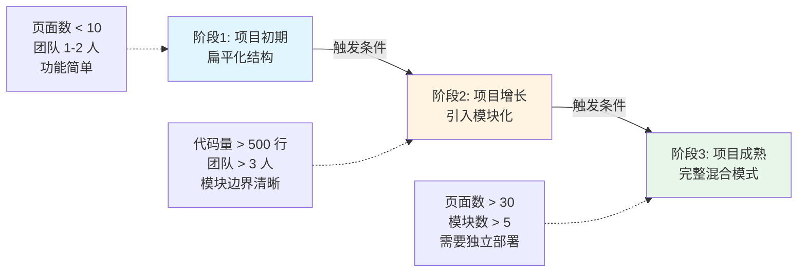
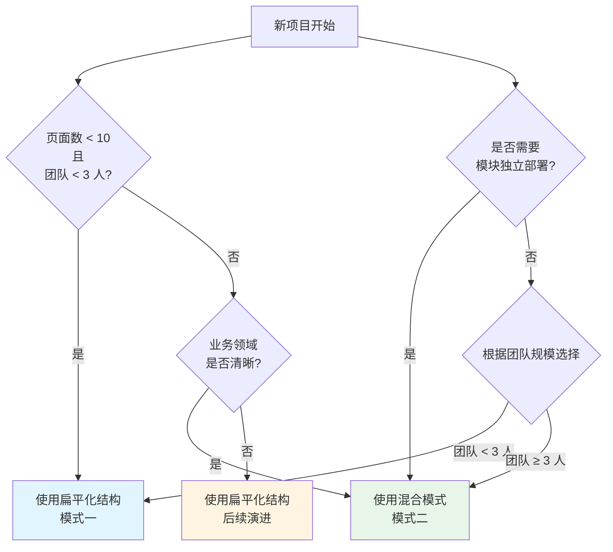
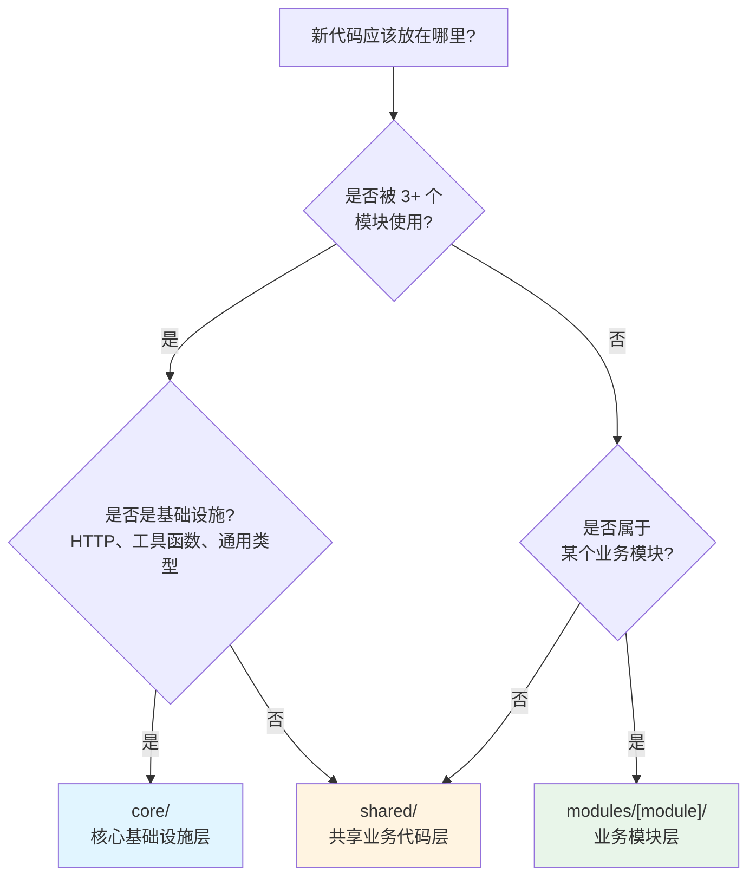
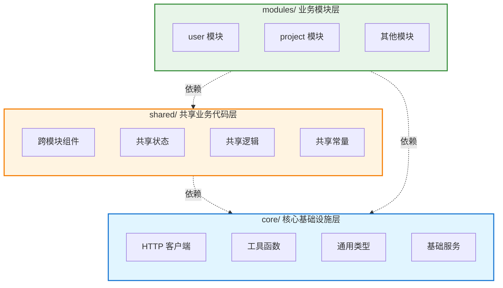
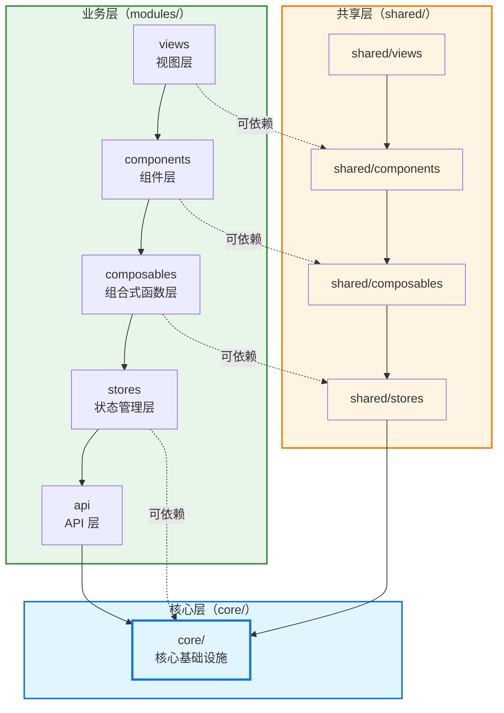
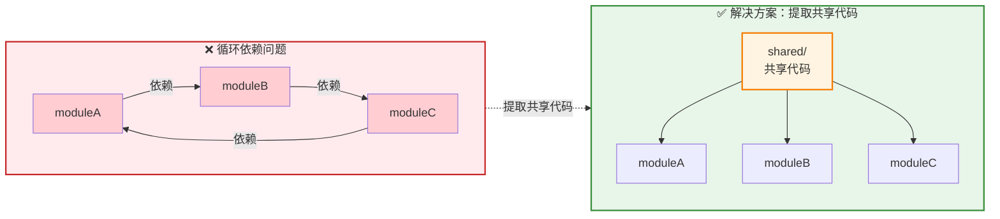
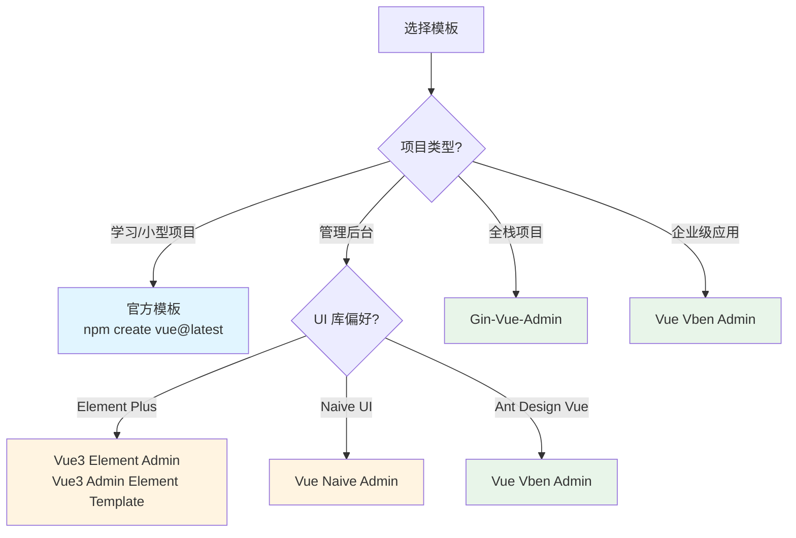

> 本文基于实际 Vue 3 项目经验，从工程化角度分析前端项目结构设计，提取通用的、解耦的架构模式，帮助开发者构建可维护、可扩展、可测试的前端项目。

## 一、工程化结构设计原则

### 1.1 核心设计理念

#### 关注点分离（Separation of Concerns）
将不同职责的代码分离到不同的目录和文件中，确保每个模块只关注自己的核心功能。

**实践要点：**
- API 调用逻辑独立于业务组件
- 类型定义集中管理，避免散落各处
- 样式、逻辑、模板分离（Vue SFC 内部也要保持清晰）

#### 单一职责原则（Single Responsibility Principle）
每个文件、每个目录都应该有明确的单一职责。

**示例：**
- `api/user.ts` 只负责用户相关的 API 调用
- `stores/useUserStore.ts` 只管理用户相关的状态
- `types/modules/user/types.ts` 只定义用户相关的类型

#### 模块化与解耦
通过模块化设计降低代码间的耦合度，提高代码的可复用性和可测试性。

**关键实践：**
- 使用组合式函数（Composables）封装可复用逻辑
- 通过接口和类型定义实现模块间的契约
- 避免模块间的直接依赖，通过事件或状态管理通信

#### 可维护性与可扩展性
结构设计应该便于后续的维护和扩展。

**设计考虑：**
- 新功能应该能够轻松添加到现有结构中
- 修改某个模块不应该影响其他模块
- 代码结构清晰，新成员能够快速理解

#### 类型安全与开发体验
充分利用 TypeScript 的类型系统，提升开发效率和代码质量。

**实践建议：**
- 为所有 API 请求和响应定义类型
- 使用类型推导减少重复的类型定义
- 利用 IDE 的类型提示提升开发体验

### 1.2 目录组织原则

#### 两种核心设计模式

根据项目规模和复杂度，有两种主要的结构形态：**扁平化结构（按技术层次）**和**混合模式（功能领域 + 技术层次）**。  
> 默认推荐：中大型、长期维护的项目应直接采用混合模式（core/shared/modules），扁平结构只适用于项目早期的快速验证或学习对比，是迈向混合模式前的过渡形态。

##### 模式一：扁平化结构（按技术层次划分）

**完整目录结构：**
```
src/
├── main.ts                 # 应用入口
├── App.vue                 # 根组件
├── vite-env.d.ts           # Vite 类型声明
│
├── api/                    # API 层（数据交互）
│   ├── core/               # 核心基础设施
│   │   ├── client/         # HTTP 客户端
│   │   ├── interceptors/   # 拦截器
│   │   └── services/       # 基础服务
│   ├── index.ts            # API 统一导出
│   ├── user.ts             # 用户 API
│   ├── project.ts          # 项目 API
│   └── [module].ts         # 其他模块 API
│
├── types/                  # 类型定义层
│   ├── common/             # 通用类型
│   │   ├── response.ts
│   │   ├── pagination.ts
│   │   └── validation.ts
│   ├── modules/            # 业务模块类型
│   │   ├── user/
│   │   │   ├── types.ts
│   │   │   ├── requests.ts
│   │   │   └── responses.ts
│   │   └── [module]/
│   └── index.ts
│
├── stores/                 # 状态管理层
│   ├── useAuthStore.ts
│   ├── useUserStore.ts
│   └── use[Module]Store.ts
│
├── composables/           # 组合式函数层
│   ├── useAuth.ts
│   ├── usePagination.ts
│   └── use[Feature].ts
│
├── router/                 # 路由层
│   ├── index.ts
│   ├── guards.ts
│   ├── utils.ts
│   └── modules/            # 路由模块
│       ├── auth.ts
│       └── [module].ts
│
├── views/                  # 视图层
│   ├── auth/
│   │   └── Login.vue
│   ├── user/
│   │   ├── UserListView.vue
│   │   └── UserDetailView.vue
│   └── [module]/
│
├── components/             # 组件层
│   ├── layout/             # 布局组件
│   ├── form/               # 表单组件
│   └── common/             # 通用组件
│
├── utils/                  # 工具函数层
│   ├── format.ts
│   ├── validation.ts
│   └── [category].ts
│
├── constants/              # 常量定义层
│   ├── api.ts
│   └── [module].ts
│
├── styles/                 # 样式层
│   ├── global.css
│   ├── variables.css
│   └── mixins/
│
├── locales/                # 国际化层
│   ├── index.ts
│   ├── zh-CN.ts
│   └── modules/
│
├── plugins/                # 插件层
│   └── i18n.ts
│
└── assets/                 # 资源层
    ├── images/
    └── fonts/
```

**特点：**
- ✅ **认知负担低**：按技术类型分类，直观易懂
- ✅ **路径短**：`@/components/UserForm.vue`，导入路径简洁
- ✅ **共享代码集中**：通用组件、工具函数天然集中，便于复用
- ✅ **适合小型项目**：结构简单，上手快，开发效率高

**适用场景：**
- 项目初期（< 10 个页面）
- 小型项目（1-2 人团队）
- 功能相对简单，模块边界不清晰
- 快速原型开发

**局限性：**
- ❌ 文件定位困难：`api/` 下文件多时难以快速定位
- ❌ 模块边界模糊：用户相关代码分散在多个目录
- ❌ 并行协作冲突：多人修改同一模块时容易冲突
- ❌ 模块拆分困难：相关代码分散，难以独立拆分

**从扁平结构迁移到混合模式的触发信号：**
1. 某个业务的代码散落在 ≥5 个目录（api/types/stores/components/views）且难以定位；
2. 单个目录（如 `api/`、`stores/`）文件数超过 15 个，团队开始出现合并冲突；
3. 需要为某业务单独定制权限、主题或构建产物；
4. 希望复用某业务模块到其他项目；
5. 需要引入多团队并行协作。

**迁移 Checklist：**
1. 在 `src/modules/[module]/` 下创建模块目录，迁移该模块的 api/types/stores/composables/views/components；
2. 将跨 3+ 模块使用的组件/逻辑/常量抽到 `shared/`，纯工具抽到 `core/`；
3. 调整路由、Store、国际化等引用路径，统一从模块入口导出；
4. 更新别名/tsconfig 路径，保证构建工具感知新的目录；
5. 补充文档说明模块职责与依赖，确保团队统一认知。

##### 模式二：混合模式（功能领域 + 技术层次）

**完整目录结构：**
```
src/
├── main.ts                 # 应用入口
├── App.vue                 # 根组件
├── vite-env.d.ts           # Vite 类型声明
│
├── core/                   # 核心基础设施层（技术层次）
│   ├── api/                # HTTP 客户端、拦截器
│   │   ├── client/
│   │   ├── interceptors/
│   │   └── services/
│   ├── utils/              # 纯工具函数（无业务逻辑）
│   │   ├── format.ts
│   │   ├── validation.ts
│   │   └── storage.ts
│   └── types/              # 通用类型定义
│       ├── common/
│       └── index.ts
│
├── shared/                 # 共享业务代码层（跨模块）
│   ├── components/         # 跨模块组件
│   │   ├── layout/
│   │   ├── form/
│   │   └── common/
│   ├── stores/             # 跨模块状态
│   │   └── useAuthStore.ts
│   ├── composables/        # 跨模块逻辑
│   │   ├── usePagination.ts
│   │   └── useForm.ts
│   └── constants/          # 共享常量
│       └── api.ts
│
├── modules/                # 业务模块层（功能领域）
│   ├── user/               # 用户模块
│   │   ├── api/            # 模块特定 API
│   │   │   └── index.ts
│   │   ├── types/          # 模块类型
│   │   │   ├── types.ts
│   │   │   ├── requests.ts
│   │   │   └── responses.ts
│   │   ├── stores/         # 模块 Store
│   │   │   └── useUserStore.ts
│   │   ├── composables/    # 模块 Composables
│   │   │   └── useUser.ts
│   │   ├── components/     # 模块组件
│   │   │   └── UserForm.vue
│   │   └── views/          # 模块视图
│   │       ├── UserListView.vue
│   │       └── UserDetailView.vue
│   │
│   ├── project/            # 项目模块
│   │   ├── api/
│   │   ├── types/
│   │   ├── stores/
│   │   ├── components/
│   │   └── views/
│   │       └── workflow/    # 子模块
│   │           └── WorkflowListView.vue
│   │
│   └── [module]/          # 其他业务模块
│
├── router/                 # 路由层（共享）
│   ├── index.ts
│   ├── guards.ts
│   └── modules/
│
├── styles/                 # 样式层（共享）
│   ├── global.css
│   ├── variables.css
│   └── mixins/
│
├── locales/                # 国际化层（共享）
│   ├── index.ts
│   └── modules/
│
├── plugins/                # 插件层（共享）
│   └── i18n.ts
│
└── assets/                 # 资源层（共享）
    ├── images/
    └── fonts/
```

**特点：**
- ✅ **模块边界清晰**：相关代码集中，易于理解业务逻辑
- ✅ **支持并行协作**：不同模块可并行开发，减少冲突
- ✅ **便于模块拆分**：模块自包含，可独立部署
- ✅ **可扩展性强**：新模块按相同结构添加，结构清晰

**适用场景：**
- 中大型项目（> 10 个页面）
- 多人团队协作（3+ 人）
- 业务领域清晰，模块边界明确
- 需要模块独立部署或复用

**局限性：**
- ❌ 认知负担增加：需要理解"共享 vs 模块特定"的划分
- ❌ 路径变长：`@/modules/user/components/UserForm.vue`
- ❌ 可能重复：模块间可能有相似代码
- ❌ 决策成本：需要判断代码放在共享层还是模块内

#### 渐进式演进路径

项目结构应该随着项目发展而演进，而不是一开始就采用最复杂的结构：



**阶段 1：项目初期（扁平化结构）**
- **适用条件**：页面数 < 10，团队规模 1-2 人，功能相对简单
- **结构**：扁平化结构（模式一），按技术层次组织

**阶段 2：项目增长（引入模块化）**
- **触发条件**：某个功能代码量 > 500 行，团队规模 > 3 人，出现明显的业务模块边界
- **结构**：开始模块化，共享代码仍在全局目录，业务代码按模块组织

**阶段 3：项目成熟（完整混合模式）**
- **触发条件**：页面数 > 30，模块数 > 5，需要模块独立部署
- **结构**：完整混合模式（模式二），core/shared/modules 三层结构

#### 决策树：如何选择设计模式？



#### 代码放置决策树



#### 最佳实践建议

1. **不要过度设计**：项目初期保持简单，使用扁平化结构
2. **及时重构**：当结构成为瓶颈时（文件难以定位、协作冲突增多），及时调整
3. **保持一致性**：一旦选择某种结构，全项目保持一致
4. **文档先行**：为结构划分建立清晰的文档和规范，特别是"共享 vs 模块特定"的划分标准

#### 约定优于配置
建立清晰的命名和结构约定，减少配置和决策成本。

**约定示例：**
- 所有 Store 文件以 `use` 开头，以 `Store.ts` 结尾
- 所有组件文件使用 PascalCase
- 所有工具函数文件使用 camelCase
- 统一使用 `index.ts` 作为模块入口

#### 一致性原则
在整个项目中保持结构、命名、编码风格的一致性。

**一致性体现在：**
- 目录结构模式一致
- 文件命名规范一致
- 代码组织方式一致
- 导入导出方式一致

## 二、标准目录结构设计

### 2.1 根目录结构
```
frontend/
├── public/              # 静态资源（不参与构建）
├── src/                 # 源代码目录
├── dist/                # 构建输出目录
├── node_modules/        # 依赖包
├── .env*                # 环境变量配置
├── package.json         # 项目配置和依赖
├── tsconfig.json        # TypeScript 配置
├── vite.config.ts       # Vite 构建配置
├── Dockerfile           # 容器化配置
└── README.md            # 项目文档
```

#### 2.2 src/ 核心目录架构

### 2.2 src/ 核心目录架构

#### 2.2.1 入口与配置层

**职责：** 应用的启动入口和全局配置

**文件说明：**

- `main.ts` - 应用入口文件
  - 创建 Vue 应用实例
  - 注册全局插件（路由、状态管理、UI 库等）
  - 挂载应用

- `App.vue` - 根组件
  - 应用的最外层容器
  - 通常包含路由视图
  - 全局布局和样式

- `vite-env.d.ts` - Vite 类型声明
  - Vite 相关的类型定义
  - 环境变量类型声明

#### 2.2.2 API 层（数据交互层）

**职责：** 封装所有与后端 API 的交互逻辑

**设计原则：**
- 统一 HTTP 客户端封装
- 统一的错误处理
- 统一的请求/响应拦截
- 按业务模块组织 API 函数

**目录结构：**
```
api/
├── core/                # 核心基础设施
│   ├── client/          # HTTP 客户端封装
│   │   └── index.ts     # HTTP 客户端实例
│   ├── interceptors/    # 请求/响应拦截器
│   │   ├── request.ts   # 请求拦截器（添加 token、设置 headers 等）
│   │   └── response.ts  # 响应拦截器（统一错误处理、数据转换等）
│   └── services/        # 基础服务
│       └── auth.ts      # 认证服务
├── index.ts             # API 统一导出
├── user.ts              # 用户相关 API（获取列表、详情、创建、更新、删除等）
├── project.ts           # 项目相关 API
└── [module].ts          # 其他业务模块 API
```

**设计要点：**
- `core/` 目录存放 HTTP 客户端封装和拦截器，所有 API 调用都通过统一的客户端
- 按业务模块组织 API 文件，每个模块一个文件
- 统一导出，便于管理和使用

#### 2.2.3 类型定义层（Type Safety）

**职责：** 集中管理所有 TypeScript 类型定义，确保类型安全

**设计原则：**
- 类型定义与业务逻辑分离
- 按模块组织，便于维护
- 统一导出，便于使用
- 避免类型重复定义

**目录结构：**
```
types/
├── common/              # 通用类型定义
│   ├── response.ts      # 响应类型（ApiResponse、PaginatedResponse 等）
│   ├── pagination.ts    # 分页类型（分页参数、分页响应等）
│   ├── validation.ts    # 验证类型（表单验证规则等）
│   └── index.ts         # 通用类型导出
├── modules/             # 业务模块类型
│   ├── user/            # 用户模块类型
│   │   ├── index.ts     # 模块类型统一导出
│   │   ├── types.ts     # 实体类型（User、UserRole 等）
│   │   ├── requests.ts  # 请求类型（CreateUserRequest、UpdateUserRequest 等）
│   │   └── responses.ts # 响应类型（UserResponse 等）
│   └── [module]/        # 其他业务模块
└── index.ts             # 全局类型导出
```

**设计要点：**
- 通用类型放在 `common/`，业务类型按模块组织
- 每个模块的类型分为：实体类型、请求类型、响应类型
- 统一导出，便于使用和维护

#### 2.2.4 状态管理层（State Management）

**职责：** 使用 Pinia 管理应用的全局状态

**设计原则：**
- 按功能模块划分 Store
- 保持 Store 的单一职责
- 使用组合式 API 风格
- 避免 Store 之间的循环依赖

**目录结构：**
```
stores/
├── useAuthStore.ts      # 认证状态（登录状态、用户信息等）
├── useUserStore.ts      # 用户状态（用户列表、当前用户等）
├── useProjectStore.ts   # 项目状态
└── use[Module]Store.ts  # 其他模块状态
```

**设计要点：**
- 按功能模块划分 Store，每个模块一个 Store 文件
- Store 包含：状态（State）、计算属性（Getters）、方法（Actions）
- 使用组合式 API 风格，保持代码简洁

#### 2.2.5 组合式函数层（Composables）

**职责：** 封装可复用的组合式逻辑，提升代码复用性

**设计原则：**
- 单一职责，每个 composable 只做一件事
- 可组合性，composables 之间可以相互组合
- 响应式，充分利用 Vue 的响应式系统
- 类型安全，提供完整的 TypeScript 类型

**目录结构：**
```
composables/
├── useAuth.ts           # 认证相关逻辑（登录、登出、权限检查等）
├── useUser.ts            # 用户相关逻辑（用户操作、状态管理等）
├── usePagination.ts      # 分页逻辑（分页状态、翻页操作等）
├── useForm.ts            # 表单处理逻辑（表单验证、提交等）
└── use[Feature].ts       # 其他功能组合式函数
```

**设计要点：**
- 每个 composable 只做一件事，保持单一职责
- 可组合性，composables 之间可以相互组合使用
- 充分利用 Vue 的响应式系统

#### 2.2.6 路由层（Routing）

**职责：** 管理应用的路由配置和导航逻辑

**设计原则：**
- 业务模块路由配置在模块内（`modules/{module}/router.ts`）
- 通用路由配置在 `router/modules/common.ts`（首页、404、403 等）
- 统一管理路由守卫
- 提供路由工具函数
- 使用懒加载优化性能

**目录结构：**
```
router/
├── index.ts             # 路由主入口（创建路由实例、配置路由选项）
├── guards.ts            # 路由守卫（认证检查、权限验证等）
├── utils.ts             # 路由工具函数（路由跳转、参数获取等）
└── modules/             # 路由模块统一管理
    ├── index.ts         # 路由模块统一导出（从 modules/{module}/router.ts 导入）
    └── common.ts        # 通用路由（首页、404、403 等，不属于任何业务模块）

modules/
├── auth/
│   ├── router.ts        # 认证模块路由配置（业务模块路由在模块内）
│   └── constants/
│       └── routes.ts    # 路由常量（路径、名称等）
├── user/
│   ├── router.ts        # 用户模块路由配置
│   └── constants/
│       └── routes.ts    # 路由常量
└── [module]/
    ├── router.ts        # 其他业务模块路由配置
    └── constants/
        └── routes.ts    # 路由常量
```

**设计要点：**
- **业务模块路由在模块内**：符合模块化原则，路由配置与模块代码在一起
- **通用路由单独管理**：首页、404、403 等通用路由保留在 `router/modules/common.ts`
- **统一导入**：在 `router/modules/index.ts` 中统一导入所有路由配置
- **路由常量分离**：路由路径和名称常量在 `modules/{module}/constants/routes.ts` 中定义
- 统一管理路由守卫，集中处理认证和权限
- 使用懒加载优化性能

#### 2.2.7 视图层（Views/Pages）

**职责：** 页面级组件，对应路由的视图

**设计原则：**
- 按业务模块组织
- 视图组件只负责页面布局和组合
- 业务逻辑通过 composables 或 stores 处理
- 保持视图组件的简洁性

**目录结构：**
```
views/
├── auth/                # 认证模块
│   └── Login.vue        # 登录页
├── user/                # 用户模块
│   ├── UserListView.vue      # 用户列表页
│   ├── UserDetailView.vue    # 用户详情页
│   └── components/           # 页面级组件（可选）
│       └── UserFormDialog.vue
├── project/             # 项目模块
│   ├── ProjectListView.vue
│   ├── ProjectDetailView.vue
│   └── workflow/        # 子模块
│       └── WorkflowListView.vue
└── common/              # 通用视图
    ├── NotFoundView.vue # 404 页面
    └── ForbiddenView.vue # 403 页面
```

**命名规范：**
- 列表页：`[Module]ListView.vue`
- 详情页：`[Module]DetailView.vue`
- 表单页：`[Module]FormView.vue`
- 对话框组件：`[Module]FormDialog.vue`（放在 views 或 components 均可）

#### 2.2.8 组件层（Components）

**职责：** 可复用的 UI 组件

**设计原则：**
- 按功能或领域分组
- 组件应该是自包含的
- 通过 props 和 events 与外部通信
- 避免组件间的直接依赖

**目录结构：**
```
components/
├── layout/             # 布局组件
│   ├── AppLayout.vue   # 应用主布局
│   ├── AppHeader.vue   # 头部组件
│   ├── AppMenu.vue     # 菜单组件
│   ├── PageHeader.vue  # 页面头部
│   └── index.ts        # 统一导出
├── form/               # 表单组件
│   ├── FormInput.vue
│   └── FormSelect.vue
├── table/              # 表格组件
│   └── DataTable.vue
├── dialog/             # 对话框组件
│   └── ConfirmDialog.vue
└── common/             # 通用业务组件
    └── LanguageSwitcher.vue
```

**组件分类：**
- **布局组件**：负责页面整体布局
- **功能组件**：实现特定功能的组件（如表单、表格）
- **业务组件**：包含业务逻辑的组件
- **基础组件**：最底层的 UI 组件（通常来自 UI 库）

#### 2.2.9 工具函数层（Utils）

**职责：** 提供纯函数工具，不依赖 Vue 实例

**设计原则：**
- 纯函数，无副作用
- 按功能分类组织
- 充分使用 TypeScript 类型
- 编写单元测试

**目录结构：**
```
utils/
├── format.ts           # 格式化工具（日期、数字、货币等格式化函数）
├── validation.ts       # 验证工具（邮箱、手机号、身份证等验证函数）
├── storage.ts          # 本地存储工具（localStorage、sessionStorage 封装）
├── url.ts              # URL 处理工具（URL 解析、参数处理等）
├── string.ts           # 字符串处理工具（字符串操作、转换等）
└── [category].ts       # 其他类别工具
```

**设计要点：**
- 纯函数，无副作用，不依赖 Vue 实例
- 按功能分类组织，便于查找和使用
- 充分使用 TypeScript 类型，确保类型安全

#### 2.2.10 常量定义层（Constants）

**职责：** 定义应用中使用的常量

**设计原则：**
- 使用 const 和 as const 确保类型安全
- 按模块组织常量
- 使用枚举或对象组织相关常量
- 避免魔法数字和字符串

**目录结构：**
```
constants/
├── api.ts              # API 相关常量（API 端点、HTTP 状态码等）
├── routes.ts            # 路由常量（路由路径、路由名称等）
├── user.ts             # 用户相关常量（用户角色、用户状态等）
└── [module].ts         # 其他模块常量
```

**设计要点：**
- 使用 `const` 和 `as const` 确保类型安全
- 按模块组织常量，便于管理
- 使用枚举或对象组织相关常量
- 避免魔法数字和字符串

#### 2.2.11 样式层（Styles）

**职责：** 管理应用的样式和主题

**设计原则：**
- 使用 CSS 变量实现主题切换
- 设计令牌（Design Tokens）统一管理设计规范
- 基础样式与业务样式分离
- 使用预处理器提升开发效率

**目录结构：**
```
styles/
├── global.css          # 全局样式（全局重置、基础样式等）
├── variables.css       # CSS 变量（主题变量：颜色、间距、字体等）
├── tokens/             # 设计令牌（设计系统的基础值）
│   ├── colors.ts       # 颜色令牌（如果使用 JS/TS 管理）
│   ├── spacing.ts      # 间距令牌
│   └── typography.ts   # 字体令牌
├── foundations/        # 基础样式
│   ├── reset.css       # 样式重置（清除浏览器默认样式）
│   └── typography.css  # 排版基础样式（字体、行高等）
└── mixins/             # SCSS 混入（可复用的样式片段）
    ├── _flexbox.scss   # Flexbox 混入（居中、布局等）
    └── _responsive.scss # 响应式混入（媒体查询等）
```

**设计要点：**
- 使用 CSS 变量实现主题切换
- 设计令牌统一管理设计规范
- 基础样式与业务样式分离
- 使用预处理器提升开发效率
- 需要多品牌/多主题时，可在 `styles/themes/[brand]/variables.css` 定义差异化变量，并在入口按租户/品牌动态切换

#### 2.2.12 国际化层（i18n）

**职责：** 管理多语言文本和国际化配置

**设计原则：**
- 按模块组织语言包
- 统一的 key 命名规范
- 支持嵌套结构
- 类型安全的 key 访问

**目录结构：**
```
locales/
├── index.ts            # i18n 配置入口（初始化 i18n 实例）
├── zh-CN.ts            # 中文语言入口（汇总所有中文文本）
├── en-US.ts            # 英文语言入口（汇总所有英文文本）
└── modules/            # 按模块组织的语言包
    ├── common/         # 通用文本（按钮、提示等）
    │   ├── zh-CN.ts
    │   └── en-US.ts
    ├── user/           # 用户模块文本
    │   ├── zh-CN.ts
    │   └── en-US.ts
    └── [module]/       # 其他模块
        ├── zh-CN.ts
        └── en-US.ts
```

**设计要点：**
- 按模块组织语言包，便于维护
- 统一的 key 命名规范
- 支持嵌套结构，组织复杂文本
- 类型安全的 key 访问
- 若模块有大量私有文案，可在 `modules/[module]/locales/` 定义局部语言包，并在全局 i18n 注册时动态合并，避免污染全局命名空间

#### 2.2.13 插件层（Plugins）

**职责：** 配置和封装第三方插件

**设计原则：**
- 每个插件一个文件
- 统一导出插件实例
- 提供类型定义
- 封装插件配置逻辑

**目录结构：**
```
plugins/
├── i18n.ts             # 国际化插件配置（初始化 i18n）
├── element-plus.ts     # Element Plus 配置（可选，UI 库配置）
└── [plugin].ts         # 其他插件配置
```

**设计要点：**
- 每个插件一个文件，便于管理
- 统一导出插件实例
- 封装插件配置逻辑

#### 2.2.14 资源层（Assets）

**职责：** 存放静态资源文件

**设计原则：**
- 按资源类型分类
- 图片资源考虑优化和懒加载
- 字体资源按需加载
- 大文件考虑 CDN

**目录结构：**
```
assets/
├── images/             # 图片资源
│   ├── icons/          # 图标
│   ├── logos/          # Logo
│   └── backgrounds/    # 背景图
├── fonts/              # 字体资源
│   └── custom-font.woff2
└── [type]/             # 其他类型资源（如 JSON、SVG 等）
```

**注意事项：**
- 使用 `public/` 目录存放不需要构建处理的静态资源
- 使用 `assets/` 目录存放需要构建工具处理的资源
- 图片资源考虑使用 WebP 格式
- 字体文件考虑使用 woff2 格式

## 三、模块化设计模式

### 3.1 混合模式详解（推荐用于中大型项目）

混合模式是结合技术层次和功能领域的最佳实践，通过 `core/`、`shared/`、`modules/` 三层结构实现清晰的职责划分。

#### 三层结构说明



**1. core/ - 核心基础设施层**
- **职责**：纯技术基础设施，不包含任何业务逻辑
- **内容**：HTTP 客户端、工具函数、通用类型、基础服务
- **特点**：被所有模块依赖，但不依赖任何业务模块
- **判断标准**：是否与业务无关，是否被所有模块使用

**2. shared/ - 共享业务代码层**
- **职责**：跨模块共享的业务代码
- **内容**：跨模块组件、共享状态、共享组合式函数、共享常量
- **特点**：包含业务逻辑，但被多个模块使用
- **判断标准**：是否被 3+ 个模块使用，是否包含业务逻辑

**3. modules/ - 业务模块层**
- **职责**：特定业务领域的完整实现
- **内容**：模块特定的 API、类型、状态、组件、视图
- **特点**：模块自包含，可独立开发和部署
- **判断标准**：是否只属于某个业务领域

#### 完整混合模式结构示例

```
src/
├── core/                   # 核心基础设施
│   ├── api/
│   │   ├── client/         # HTTP 客户端封装
│   │   │   └── index.ts
│   │   ├── interceptors/   # 请求/响应拦截器
│   │   │   ├── request.ts
│   │   │   └── response.ts
│   │   └── services/       # 基础服务（认证等）
│   │       └── auth.ts
│   ├── utils/              # 纯工具函数
│   │   ├── format.ts       # 日期、数字格式化
│   │   ├── validation.ts   # 验证工具
│   │   ├── storage.ts      # 本地存储
│   │   └── url.ts          # URL 处理
│   └── types/              # 通用类型
│       ├── common/
│       │   ├── response.ts
│       │   └── pagination.ts
│       └── index.ts
│
├── shared/                 # 共享业务代码
│   ├── components/         # 跨模块组件
│   │   ├── layout/         # 布局组件
│   │   │   ├── AppLayout.vue
│   │   │   └── AppHeader.vue
│   │   ├── form/           # 表单组件
│   │   │   └── FormInput.vue
│   │   └── common/         # 通用业务组件
│   │       └── LanguageSwitcher.vue
│   ├── stores/             # 跨模块状态
│   │   └── useAuthStore.ts
│   ├── composables/        # 跨模块逻辑
│   │   ├── usePagination.ts
│   │   └── useForm.ts
│   └── constants/          # 共享常量
│       └── api.ts
│
├── modules/                # 业务模块
│   ├── user/               # 用户模块
│   │   ├── router.ts        # 用户模块路由配置（业务模块路由在模块内）
│   │   ├── constants/       # 模块常量
│   │   │   ├── routes.ts    # 路由常量（路径、名称）
│   │   │   ├── api.ts       # API 端点常量
│   │   │   └── index.ts     # 常量统一导出
│   │   ├── api/             # 用户 API
│   │   │   └── index.ts
│   │   ├── types/           # 用户类型（按需创建）
│   │   │   ├── types.ts
│   │   │   ├── requests.ts
│   │   │   └── responses.ts
│   │   ├── stores/          # 用户 Store（按需创建）
│   │   │   └── useUserStore.ts
│   │   ├── composables/     # 用户 Composables（按需创建）
│   │   │   └── useUser.ts
│   │   ├── components/      # 用户组件（按需创建）
│   │   │   └── UserForm.vue
│   │   └── views/           # 用户视图
│   │       ├── UserListView.vue
│   │       └── UserDetailView.vue
│   │
│   └── project/            # 项目模块
│       ├── router.ts        # 项目模块路由配置
│       ├── constants/
│       │   └── routes.ts
│       ├── api/
│       ├── types/
│       ├── stores/
│       ├── components/
│       └── views/
│           └── workflow/    # 子模块
│               └── WorkflowListView.vue
│
├── router/                 # 路由（共享）
│   ├── index.ts            # 路由主入口
│   ├── guards.ts           # 路由守卫
│   └── modules/            # 路由模块统一管理
│       ├── index.ts        # 路由模块统一导出（从 modules/{module}/router.ts 导入）
│       └── common.ts       # 通用路由（首页、404、403 等）
│
├── styles/                 # 样式（共享）
│   ├── global.css
│   └── variables.css
│
├── locales/                # 国际化（共享）
│   ├── index.ts
│   └── modules/
│
└── plugins/                 # 插件（共享）
    └── i18n.ts
```

#### 划分标准详解

**core/ 的判断标准：**
- ✅ HTTP 客户端封装和拦截器
- ✅ 纯工具函数（格式化、验证、存储等）
- ✅ 通用类型定义（响应、分页等）
- ✅ 基础服务（认证服务等）
- ❌ 不包含任何业务逻辑
- ❌ 不依赖任何业务模块

**shared/ 的判断标准：**
- ✅ 被 3+ 个模块使用的组件
- ✅ 跨模块的状态管理
- ✅ 跨模块的组合式函数
- ✅ 共享的业务常量
- ❌ 只被 1-2 个模块使用的代码（应放在模块内）

**modules/ 的判断标准：**
- ✅ 只属于某个业务领域的代码
- ✅ 模块特定的 API、类型、组件
- ✅ 模块可能独立部署或复用
- ❌ 被多个模块使用的代码（应放在 shared/）

### 3.2 功能模块划分策略

#### 按业务领域划分（Domain-Driven）
以业务领域为核心，将相关的功能组织在一起。

**适用场景：**
- 中大型项目
- 业务领域清晰
- 团队按领域分工

**示例：**
```
modules/
├── user-management/    # 用户管理领域
├── project-management/ # 项目管理领域
└── workflow/           # 工作流领域
```

#### 按功能特性划分（Feature-Based）
以功能特性为核心，将实现某个完整功能的所有代码组织在一起。

**适用场景：**
- 功能边界清晰
- 功能相对独立
- 便于功能模块的复用

**示例：**
```
modules/
├── authentication/     # 认证功能
├── file-upload/        # 文件上传功能
└── data-export/        # 数据导出功能
```

### 3.3 模块内部结构

#### 完整模块结构（适用于大型模块）

**目录结构：**
```
modules/user/
├── api/                # 模块 API
│   └── index.ts
├── types/              # 模块类型
│   ├── index.ts
│   ├── types.ts        # 实体类型
│   ├── requests.ts     # 请求类型
│   └── responses.ts    # 响应类型
├── stores/             # 模块 Store
│   └── useUserStore.ts
├── composables/        # 模块 Composables
│   └── useUser.ts
├── components/         # 模块组件
│   ├── UserForm.vue
│   └── UserFormDialog.vue
└── views/              # 模块视图
    ├── UserListView.vue
    └── UserDetailView.vue
```

**特点：**
- 模块完全自包含
- 便于模块独立开发和测试
- 便于模块独立部署或复用
- 适合大型模块（代码量 > 1000 行）

#### 简化模块结构（适用于小型模块）

**目录结构：**
```
modules/user/
├── components/         # 模块组件
│   └── UserForm.vue
└── views/              # 模块视图
    └── UserListView.vue
```

**特点：**
- 结构简单，易于维护
- 共享代码放在 `shared/` 或 `core/`
- 适合小型模块（代码量 < 500 行）

#### 选择建议

**使用完整结构的情况：**
- 模块代码量 > 1000 行
- 模块可能独立部署
- 模块需要独立测试
- 模块可能被其他项目复用

**使用简化结构的情况：**
- 模块代码量 < 500 行
- 模块功能简单
- 共享代码较多，放在 `shared/` 更合适

#### 最小模块骨架示例（以 `project` 模块为例）

```text
modules/
└── project/
    ├── api/
    │   └── index.ts          # 模块 API 入口
    ├── types/
    │   ├── types.ts          # 实体类型
    │   ├── requests.ts       # 请求 DTO
    │   └── responses.ts      # 响应 DTO
    ├── stores/
    │   └── useProjectStore.ts
    ├── composables/
    │   └── useProject.ts
    ├── components/
    │   └── ProjectTable.vue
    └── views/
        ├── ProjectListView.vue
        └── ProjectDetailView.vue
```

**代码模板：**
```ts
// modules/project/api/index.ts
import http from '@/core/api/client'
import type { ProjectResponse } from '../types/responses'

export const projectApi = {
  getList: () => http.get<ProjectResponse[]>('/projects'),
}

// modules/project/stores/useProjectStore.ts
import { defineStore } from 'pinia'
import { projectApi } from '../api'

export const useProjectStore = defineStore('project', {
  state: () => ({ list: [] as ProjectResponse[], loading: false }),
  actions: {
    async fetchList() {
      this.loading = true
      try {
        const { data } = await projectApi.getList()
        this.list = data
      } finally {
        this.loading = false
      }
    },
  },
})

// modules/project/composables/useProject.ts
import { storeToRefs } from 'pinia'
import { useProjectStore } from '../stores/useProjectStore'

export function useProject() {
  const store = useProjectStore()
  const { list, loading } = storeToRefs(store)
  return { list, loading, fetchList: store.fetchList }
}

// modules/project/views/ProjectListView.vue
<template>
  <PageLayout title="项目列表">
    <ProjectTable :data="list" :loading="loading" @refresh="fetchList" />
  </PageLayout>
</template>

<script setup lang="ts">
import { onMounted } from 'vue'
import ProjectTable from '../components/ProjectTable.vue'
import { useProject } from '../composables/useProject'

const { list, loading, fetchList } = useProject()
onMounted(fetchList)
</script>
```

### 3.4 模块间依赖管理

#### 依赖方向规则



**依赖规则：**
1. **core/** 不依赖任何其他层（最底层）
2. **shared/** 只能依赖 `core/`
3. **modules/** 可以依赖 `core/` 和 `shared/`，但不能依赖其他 `modules/`
4. **views** 不应该被其他层依赖（最顶层）

#### 避免循环依赖



**问题示例：**
- moduleA 依赖 moduleB
- moduleB 依赖 moduleC
- moduleC 依赖 moduleA（形成循环依赖）

**解决方案：**

**方案 1：提取共享代码到 shared/**
- 将共同依赖的类型或工具提取到 `shared/` 目录
- 各模块从 `shared/` 导入，而不是相互导入

**方案 2：使用依赖注入**
- 通过参数传递依赖，而不是直接导入
- 降低模块间的直接耦合

**方案 3：重新设计模块边界**
- 合并相关模块
- 拆分大模块
- 调整依赖方向

#### 模块间通信

**推荐方式：**
1. **通过 shared/ 的状态管理**：跨模块状态放在 `shared/stores/`
2. **通过事件总线**：使用 Vue 的事件系统或第三方事件库
3. **通过路由参数**：通过 URL 传递数据

**避免方式：**
- ❌ 模块间直接导入
- ❌ 模块间直接调用函数
- ❌ 模块间共享状态（应放在 shared/）

## 四、命名规范与约定

### 4.1 文件命名规范

#### Vue 组件
- **规范：** PascalCase
- **示例：** `UserFormDialog.vue`、`ProjectListView.vue`
- **说明：** 与组件名保持一致，便于识别

#### TypeScript 文件
- **工具函数：** camelCase
  - 示例：`formatDate.ts`、`validateEmail.ts`
- **类型定义：** PascalCase
  - 示例：`UserType.ts`、`ApiResponse.ts`
- **Store：** camelCase，以 `Store.ts` 结尾
  - 示例：`useUserStore.ts`、`useAuthStore.ts`
- **Composable：** camelCase，以 `use` 开头
  - 示例：`usePagination.ts`、`useForm.ts`

#### 常量文件
- **规范：** camelCase 或 kebab-case
- **示例：** `constants.ts`、`api-constants.ts`

#### 配置文件
- **规范：** kebab-case 或 camelCase
- **示例：** `vite.config.ts`、`tsconfig.json`

### 4.2 目录命名规范

#### 推荐方式
- **小写字母 + 连字符：** `user-management/`、`project-list/`
- **纯小写字母：** `utils/`、`api/`、`stores/`

#### 不推荐
- 驼峰命名：`userManagement/`（不统一）
- 下划线：`user_management/`（不符合前端习惯）
- 大写字母：`UserManagement/`（跨平台兼容性问题）

### 4.3 导出规范

#### 统一使用 index.ts
- 每个目录都应该有一个 `index.ts` 作为入口文件
- 统一导出目录下的所有内容，简化导入路径
- 例如：`types/modules/user/index.ts` 导出该模块的所有类型

#### 命名导出优于默认导出
- **推荐**：使用命名导出（`export function`），便于按需导入和重命名
- **不推荐**：使用默认导出对象，不利于按需导入和类型推导

#### 组件导出
- 组件文件使用默认导出（Vue 组件的要求）
- 在 `index.ts` 中重新导出为命名导出，便于统一管理

## 五、工程化配置要点

### 5.1 构建工具配置（Vite）

#### 路径别名配置
- 配置路径别名（如 `@` 指向 `src/`），简化导入路径
- 在 `vite.config.ts` 中设置 `resolve.alias`
- 同时需要在 `tsconfig.json` 中配置对应的路径映射

#### 自动导入配置
- 使用 `unplugin-auto-import` 自动导入 Vue、Vue Router、Pinia 等常用 API
- 使用 `unplugin-vue-components` 自动导入组件
- 配置生成类型声明文件，确保类型安全

#### 环境变量管理
- 使用 `.env.development` 和 `.env.production` 管理不同环境的配置
- 环境变量必须以 `VITE_` 开头才能在前端代码中访问
- 在 `vite-env.d.ts` 中声明环境变量的类型

### 5.2 TypeScript 配置

#### 严格模式设置
- 启用 `strict` 模式，提升类型安全
- 配置未使用变量和参数的检查
- 启用隐式返回和 switch 语句的检查

#### 路径映射
- 在 `tsconfig.json` 中配置 `baseUrl` 和 `paths`
- 路径映射需要与 Vite 的别名配置保持一致
- 支持通过路径别名导入，提升开发体验

#### 类型声明文件
- 在 `vite-env.d.ts` 中声明 Vite 相关的类型
- 声明环境变量的类型，确保类型安全

### 5.3 代码质量工具

#### ESLint 配置
- 配置 Vue 3 和 TypeScript 的 ESLint 规则
- 根据项目需求调整规则，平衡严格性和开发效率
- 集成到开发流程中，自动检查代码质量

#### Prettier 配置
- 统一代码格式化规则（缩进、引号、分号等）
- 与 ESLint 配合使用，确保代码风格一致
- 配置编辑器自动格式化

#### Git Hooks（可选）
- 使用 `husky` + `lint-staged` 在提交前自动检查代码
- 确保提交的代码符合规范
- 提升代码质量和团队协作效率

## 六、最佳实践与建议

### 6.1 目录深度控制

#### 建议不超过 4 层嵌套
**好的结构：**
```
src/
├── views/
│   └── user/
│       └── UserListView.vue  # 3 层
```

**避免过深：**
```
src/
├── features/
│   └── user-management/
│       └── components/
│           └── forms/
│               └── dialogs/
│                   └── UserFormDialog.vue  # 6 层，过深！
```

#### 保持结构扁平化
- 优先考虑扁平化结构
- 只有在确实需要时才增加嵌套层级
- 使用清晰的命名减少对深层嵌套的需求

### 6.2 代码组织原则

#### 就近原则（相关代码放在一起）
将相关的代码放在同一个目录或附近，便于查找和维护。

**示例：**
```
components/user/
├── UserForm.vue
├── UserFormDialog.vue
└── UserList.vue
```
这些组件都相关，放在一起更合理。

#### 单一数据源（避免重复定义）
同一个数据或类型只在一个地方定义，其他地方通过导入使用。

**避免：**
- 在多个文件中重复定义相同的类型或常量
- 导致维护困难，修改时需要同步多个地方

**推荐：**
- 在 `types/` 或 `constants/` 目录下统一定义
- 其他地方通过导入使用，确保单一数据源

#### 关注点分离
不同职责的代码应该分离到不同的文件或目录。

**示例：**
- API 调用逻辑 → `api/`
- 状态管理逻辑 → `stores/`
- UI 展示逻辑 → `components/` 和 `views/`
- 业务逻辑 → `composables/`

### 6.3 可维护性提升

#### 清晰的目录结构
- 目录名称应该清晰表达其用途
- 遵循一致的命名规范
- 使用 `README.md` 说明复杂目录的用途

#### 一致的命名规范
在整个项目中保持命名规范的一致性：
- 文件命名规范统一
- 变量命名规范统一
- 函数命名规范统一

#### 完善的类型定义
- 为所有 API 接口定义类型
- 为组件 props 和 emits 定义类型
- 避免使用 `any` 类型

#### 适当的注释和文档
- 为复杂逻辑添加注释，说明设计思路和实现细节
- 为公共 API 添加 JSDoc 注释，说明参数、返回值等
- 在关键目录添加 `README.md` 说明，解释目录用途和设计原则

## 七、常见问题与解决方案

### 7.1 循环依赖问题

#### 问题描述
模块 A 依赖模块 B，模块 B 又依赖模块 A，形成循环依赖。

#### 解决方案

**方案 1：提取共享代码到 shared/**
- 将共同依赖的类型或工具提取到 `shared/` 目录
- 各模块从 `shared/` 导入，而不是相互导入

**方案 2：使用依赖注入**
- 通过参数传递依赖，而不是直接导入
- 降低模块间的直接耦合

**方案 3：重新设计模块边界**
- 合并相关模块
- 拆分大模块
- 调整依赖方向

### 7.2 类型定义重复

#### 问题描述
同一个类型在多个地方定义，导致维护困难。

#### 解决方案

**统一类型定义位置：**
- 在 `types/modules/[module]/` 目录下统一定义模块的所有类型
- 其他地方统一从该目录导入，避免重复定义

**使用类型工具：**
- 使用 TypeScript 的工具类型（Pick、Omit、Partial 等）避免重复
- 通过类型组合和推导减少类型定义

### 7.3 模块边界模糊

#### 问题描述
不清楚某个功能应该放在哪个模块，导致代码组织混乱。

#### 解决方案

**明确模块职责：**
- 为每个模块定义清晰的职责范围
- 使用文档说明模块的边界
- 定期审查和重构模块结构

**建立模块规范：**
- 为每个模块创建 `README.md` 文档
- 明确模块的职责范围和不包含的内容
- 说明模块的边界和与其他模块的关系

### 7.4 代码组织混乱

#### 问题描述
随着项目发展，代码组织变得混乱，难以维护。

#### 解决方案

**定期重构：**
- 定期审查目录结构
- 重构不符合规范的代码
- 提取重复代码到公共层

**建立代码审查机制：**
- 在 PR 中检查代码组织
- 使用工具检查目录结构
- 制定代码组织规范文档

**使用工具辅助：**
- 使用 ESLint 规则检查导入路径
- 使用工具检查循环依赖
- 使用代码分析工具识别问题

## 八、总结

### 工程化结构设计的核心目标

1. **可维护性**：清晰的目录结构使代码易于理解和修改
2. **可扩展性**：模块化设计便于添加新功能
3. **可测试性**：良好的结构使单元测试和集成测试更容易
4. **团队协作**：统一的规范减少沟通成本，提高开发效率
5. **类型安全**：完善的类型定义提升代码质量和开发体验

### 关键设计原则回顾

1. **关注点分离**：不同职责的代码分离到不同目录
2. **单一职责**：每个文件、每个目录都有明确的单一职责
3. **模块化与解耦**：通过模块化设计降低代码耦合度
4. **约定优于配置**：建立清晰的命名和结构约定
5. **一致性原则**：在整个项目中保持结构、命名的一致性

### 实践建议

1. **渐进式演进**：从扁平化结构开始，根据项目发展逐步演进到混合模式
2. **明确划分标准**：建立清晰的"core/shared/modules"划分标准，减少决策成本
3. **团队共识**：确保团队成员理解并遵循结构规范，特别是代码放置的决策树
4. **定期审查**：定期审查目录结构，及时重构不符合规范的部分
5. **文档维护**：保持文档与代码同步，及时更新结构说明和划分标准

### 设计模式选择总结

| 维度 | 扁平化结构 | 混合模式 |
|------|-----------|---------|
| **适用规模** | 小型项目（< 10 页面） | 中大型项目（> 10 页面） |
| **团队规模** | 1-2 人 | 3+ 人 |
| **认知负担** | 低 | 中等 |
| **路径长度** | 短 | 较长 |
| **模块边界** | 模糊 | 清晰 |
| **并行协作** | 容易冲突 | 支持良好 |
| **模块拆分** | 困难 | 容易 |
| **可扩展性** | 中等 | 高 |

**核心原则：**
- **不要过度设计**：项目初期保持简单，使用扁平化结构
- **及时演进**：当结构成为瓶颈时（文件难以定位、协作冲突增多），及时调整
- **保持一致性**：一旦选择某种结构，全项目保持一致
- **文档先行**：为结构划分建立清晰的文档和规范

### 结语

良好的工程化结构是项目成功的基础。虽然初期可能需要一些额外的时间来建立和维护结构，但这些投入会在项目的长期维护中带来巨大的回报。

**关键洞察：**
1. **没有完美的结构，只有适合项目的结构**：根据项目规模、团队规模、业务复杂度选择
2. **结构应该渐进式演进**：从简单开始，随项目发展逐步复杂化
3. **明确的划分标准比复杂的结构更重要**：清晰的决策树能减少团队决策成本

根据项目的实际情况，灵活应用本文档中的原则和建议，构建属于你的工程化项目结构。记住，最好的结构是能够支持团队高效协作、代码易于维护和扩展的结构。

---

## 九、快速启动模板仓库

以下是一些优秀的 Vue 3 工程化模板仓库，可以直接使用或作为参考：

### 官方模板

#### 1. Vue 3 + Vite 官方模板
- **创建命令**：`npm create vue@latest`
- **特点**：
  - Vue 官方维护，最权威的模板
  - 支持 TypeScript、Router、Pinia、ESLint 等可选配置
  - 使用 Vite 构建，开发体验优秀
  - 结构简洁，适合快速开始
- **适用场景**：学习、小型项目、快速原型

#### 2. Vite Vue 3 TypeScript 模板
- **创建命令**：`npm create vite@latest my-vue-app -- --template vue-ts`
- **特点**：
  - 官方 Vite 模板
  - 内置 TypeScript 支持
  - 最小化配置，适合学习
- **适用场景**：学习 TypeScript + Vue 3

### 企业级模板

#### 3. Vue Vben Admin
- **GitHub**：`vbenjs/vue-vben-admin`
- **技术栈**：Vue 3 + TypeScript + Vite + Pinia
- **特点**：
  - 企业级中后台解决方案
  - 完整的工程化配置（ESLint、Prettier、Husky 等）
  - 丰富的功能组件和业务示例
  - 支持多种布局和主题
  - 文档完善，社区活跃
- **适用场景**：中大型管理后台系统
- **推荐指数**：⭐⭐⭐⭐⭐

#### 4. Vue3 Element Admin
- **GitHub**：`youlaitech/vue3-element-admin`
- **技术栈**：Vue 3 + Vite 7 + TypeScript + Element Plus
- **特点**：
  - 基于 Element Plus 的管理后台模板
  - 提供配套的 Java 和 Node 后端源码
  - 功能丰富，适合企业级应用
  - 权限管理、国际化等功能完善
- **适用场景**：使用 Element Plus 的管理系统
- **推荐指数**：⭐⭐⭐⭐

#### 5. Vue Naive Admin
- **GitHub**：`zclzone/vue-naive-admin`
- **技术栈**：Vue 3 + Vite + Pinia + UnoCSS + Naive UI
- **特点**：
  - 轻量级后台管理模板
  - 设计简洁，易于上手
  - 使用 UnoCSS，样式方案现代
  - 结构清晰，适合学习
- **适用场景**：中小型管理后台
- **推荐指数**：⭐⭐⭐⭐

### 轻量级模板

#### 6. Vue3 Admin Element Template
- **GitHub**：搜索 `vue3-admin-element-template`
- **技术栈**：Vue 3 + Vite + Element Plus + Vue Router + Pinia
- **特点**：
  - 中后台管理模板
  - 支持国际化、权限控制
  - 集成 ECharts 等常用库
- **适用场景**：管理后台系统

#### 7. Gin-Vue-Admin
- **GitHub**：`flipped-aurora/gin-vue-admin`
- **技术栈**：Vue 3 + Vite + Gin（后端）
- **特点**：
  - 前后端一体化解决方案
  - 集成 JWT 鉴权、权限管理、动态路由
  - 代码生成器、表单生成器等开发工具
  - 功能完整，适合快速开发
- **适用场景**：全栈项目快速启动
- **推荐指数**：⭐⭐⭐⭐

### 模板选择指南



### 推荐使用方式

1. **学习阶段**：
   - 使用官方模板 `npm create vue@latest`
   - 从零开始理解结构，参考本文档的设计原则

2. **快速开发**：
   - 使用企业级模板（如 `vue-vben-admin`）
   - 快速搭建项目，专注于业务开发

3. **自定义需求**：
   - 基于本文档的设计原则
   - 参考模板仓库的结构
   - 根据项目需求自行搭建

### 模板对比表

| 模板名称 | 技术栈 | 适用规模 | 推荐场景 | 维护状态 |
|---------|--------|---------|---------|---------|
| **Vue 官方模板** | Vue 3 + Vite | 小型 | 学习、原型 | ⭐⭐⭐⭐⭐ |
| **Vue Vben Admin** | Vue 3 + TS + Vite | 中大型 | 企业级后台 | ⭐⭐⭐⭐⭐ |
| **Vue3 Element Admin** | Vue 3 + Element Plus | 中大型 | Element Plus 后台 | ⭐⭐⭐⭐ |
| **Vue Naive Admin** | Vue 3 + Naive UI | 中小型 | 轻量级后台 | ⭐⭐⭐⭐ |
| **Gin-Vue-Admin** | Vue 3 + Gin | 中大型 | 全栈项目 | ⭐⭐⭐⭐ |

### 使用模板的注意事项

1. **理解结构**：不要直接使用，先理解模板的目录结构设计
2. **按需调整**：根据项目需求调整结构，删除不需要的功能
3. **保持规范**：遵循本文档的设计原则，确保结构清晰
4. **渐进演进**：从简单结构开始，随项目发展逐步演进
5. **关注更新**：定期关注模板的更新，但不要盲目升级

---

## 参考资源

### 官方文档
- [Vue 3 官方文档](https://vuejs.org/)
- [TypeScript 官方文档](https://www.typescriptlang.org/)
- [Vite 官方文档](https://vitejs.dev/)
- [Pinia 官方文档](https://pinia.vuejs.org/)
- [Vue Router 官方文档](https://router.vuejs.org/)

### 相关工具
- [ESLint 官方文档](https://eslint.org/)
- [Prettier 官方文档](https://prettier.io/)
- [Element Plus 官方文档](https://element-plus.org/)
