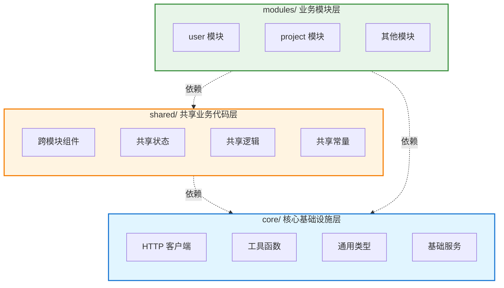
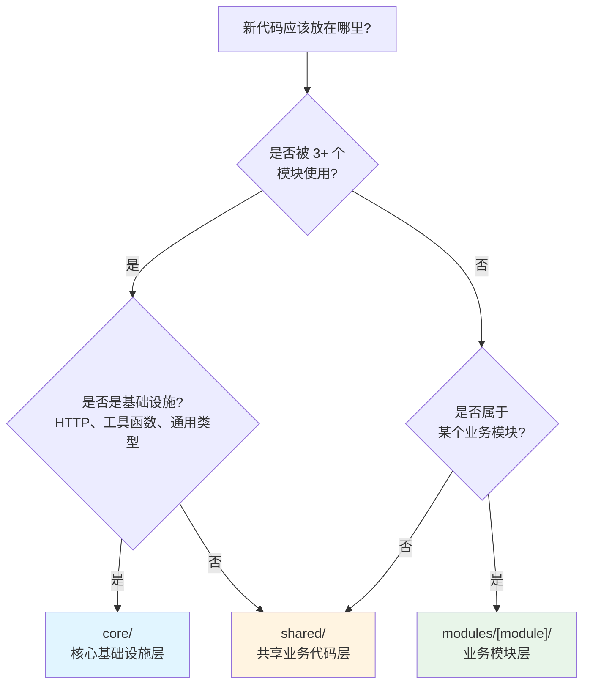
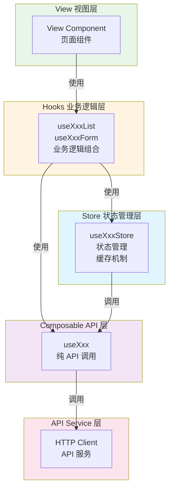

> 本文基于实际 Vue 3 项目经验，从工程化角度分析前端项目结构设计，提取通用的、解耦的架构模式，帮助开发者构建可维护、可扩展、可测试的前端项目。文档包含经过实战验证的 **Store + Composable + Hooks** 核心架构模式，通过清晰的职责划分实现代码的可维护性和可测试性。

## 一、工程化结构设计原则

### 1.1 核心设计理念

#### 关注点分离（Separation of Concerns）
将不同职责的代码分离到不同的目录和文件中，确保每个模块只关注自己的核心功能。

**实践要点：**
- API 调用逻辑独立于业务组件
- 类型定义集中管理，避免散落各处
- 样式、逻辑、模板分离（Vue SFC 内部也要保持清晰）

#### 单一职责原则（Single Responsibility Principle）
每个文件、每个目录都应该有明确的单一职责。

**示例：**
- `modules/user/composables/useUser.ts` 只负责用户相关的 API 调用
- `modules/user/stores/useUserStore.ts` 只管理用户相关的状态
- `modules/user/types/types.ts` 只定义用户相关的类型

#### 模块化与解耦
通过模块化设计降低代码间的耦合度，提高代码的可复用性和可测试性。

**关键实践：**
- 使用组合式函数（Composables）封装可复用逻辑
- 通过接口和类型定义实现模块间的契约
- 避免模块间的直接依赖，通过事件或状态管理通信

#### 可维护性与可扩展性
结构设计应该便于后续的维护和扩展。

**设计考虑：**
- 新功能应该能够轻松添加到现有结构中
- 修改某个模块不应该影响其他模块
- 代码结构清晰，新成员能够快速理解

#### 类型安全与开发体验
充分利用 TypeScript 的类型系统，提升开发效率和代码质量。

**实践建议：**
- 为所有 API 请求和响应定义类型
- 使用类型推导减少重复的类型定义
- 利用 IDE 的类型提示提升开发体验

### 1.2 混合模式架构（推荐标准）

混合模式是结合技术层次和功能领域的最佳实践，通过 `core/`、`shared/`、`modules/` 三层结构实现清晰的职责划分。

#### 为什么采用混合模式？

**第一性原理思考：**
1. **业务代码需要集中**：相关功能的代码应该放在一起，便于理解和维护
2. **基础设施需要共享**：HTTP 客户端、工具函数等应该被所有模块使用
3. **跨模块代码需要提取**：被多个模块使用的代码应该放在共享层，避免重复

**混合模式的优势：**
- ✅ **模块边界清晰**：相关代码集中，易于理解业务逻辑
- ✅ **支持并行协作**：不同模块可并行开发，减少冲突
- ✅ **便于模块拆分**：模块自包含，可独立部署
- ✅ **可扩展性强**：新模块按相同结构添加，结构清晰

#### 三层结构说明



**1. core/ - 核心基础设施层**
- **职责**：纯技术基础设施，不包含任何业务逻辑
- **内容**：HTTP 客户端、工具函数、通用类型、基础服务
- **特点**：被所有模块依赖，但不依赖任何业务模块
- **判断标准**：是否与业务无关，是否被所有模块使用

**2. shared/ - 共享业务代码层**
- **职责**：跨模块共享的业务代码
- **内容**：跨模块组件、共享状态、共享组合式函数、共享常量
- **特点**：包含业务逻辑，但被多个模块使用
- **判断标准**：是否被 3+ 个模块使用，是否包含业务逻辑

**3. modules/ - 业务模块层**
- **职责**：特定业务领域的完整实现
- **内容**：模块特定的 API、类型、状态、组件、视图
- **特点**：模块自包含，可独立开发和部署
- **判断标准**：是否只属于某个业务领域

#### 完整混合模式结构

```
src/
├── main.ts                 # 应用入口
├── App.vue                 # 根组件
├── vite-env.d.ts           # Vite 类型声明
│
├── core/                   # 核心基础设施层
│   ├── api/                # HTTP 客户端、拦截器
│   │   ├── client/
│   │   ├── interceptors/
│   │   └── services/
│   ├── utils/              # 纯工具函数（无业务逻辑）
│   │   ├── format.ts
│   │   ├── validation.ts
│   │   └── storage.ts
│   └── types/              # 通用类型定义
│       ├── common/
│       └── index.ts
│
├── shared/                 # 共享业务代码层
│   ├── components/         # 跨模块组件
│   │   ├── layout/
│   │   ├── form/
│   │   └── common/
│   ├── stores/             # 跨模块状态
│   │   └── useAuthStore.ts
│   ├── composables/        # 跨模块逻辑
│   │   ├── usePagination.ts
│   │   └── useForm.ts
│   ├── hooks/              # 跨模块业务逻辑
│   │   └── usePageHeader.ts
│   └── constants/          # 共享常量
│       └── api.ts
│
├── modules/                # 业务模块层
│   ├── user/               # 用户模块
│   │   ├── router.ts        # 模块路由配置
│   │   ├── index.ts         # 模块统一导出
│   │   ├── constants/       # 模块常量
│   │   ├── types/           # 模块类型
│   │   ├── composables/     # API 调用封装
│   │   ├── stores/          # 状态管理
│   │   ├── hooks/           # 业务逻辑层
│   │   ├── utils/           # 模块工具函数
│   │   ├── components/      # 模块组件
│   │   └── views/           # 模块视图
│   └── project/            # 项目模块
│       └── [相同结构]
│
├── router/                 # 路由（共享）
│   ├── index.ts
│   ├── guards.ts
│   └── modules/
│
├── styles/                 # 样式（共享）
│   ├── global.css
│   └── variables.css
│
├── locales/                # 国际化（共享）
│   ├── index.ts
│   └── modules/
│
├── plugins/                # 插件（共享）
│   └── i18n.ts
│
└── assets/                 # 资源（共享）
    ├── images/
    └── fonts/
```

#### 代码放置决策树



#### 划分标准详解

**core/ 的判断标准：**
- ✅ HTTP 客户端封装和拦截器
- ✅ 纯工具函数（格式化、验证、存储等）
- ✅ 通用类型定义（响应、分页等）
- ✅ 基础服务（认证服务等）
- ❌ 不包含任何业务逻辑
- ❌ 不依赖任何业务模块

**shared/ 的判断标准：**
- ✅ 被 3+ 个模块使用的组件
- ✅ 跨模块的状态管理
- ✅ 跨模块的组合式函数
- ✅ 共享的业务常量
- ❌ 只被 1-2 个模块使用的代码（应放在模块内）

**modules/ 的判断标准：**
- ✅ 只属于某个业务领域的代码
- ✅ 模块特定的 API、类型、组件
- ✅ 模块可能独立部署或复用
- ❌ 被多个模块使用的代码（应放在 shared/）

## 二、核心架构模式（Store + Composable + Hooks）

这是经过实战验证的最佳架构模式，通过清晰的职责划分实现代码的可维护性和可测试性。

### 2.1 为什么需要这种架构？

**第一性原理思考：**
1. **API 调用应该独立**：API 调用是纯函数，不应该管理状态，便于复用和测试
2. **状态需要集中管理**：跨组件共享的状态应该在 Store 中管理，避免数据不一致
3. **业务逻辑需要封装**：复杂的业务逻辑（搜索防抖、错误处理等）应该在 Hooks 中封装，避免在组件中重复

**架构优势：**
- ✅ **职责清晰**：每层都有明确的单一职责
- ✅ **易于测试**：各层可独立测试
- ✅ **易于维护**：修改某层不影响其他层
- ✅ **易于复用**：Composable 和 Store 可在多处复用
- ✅ **类型安全**：完整的 TypeScript 类型支持

### 2.2 架构层次说明



### 2.3 各层职责详解

#### 1. Composable 层（API 调用封装）

**职责**：纯 API 调用函数，不管理状态

**核心特点：**
- 不包含 `loading`、`error` 状态（这些在 Store 中管理）
- 每次调用都是独立的，无实例状态
- 只负责 HTTP 请求的封装

**示例：**
```typescript
// modules/project/composables/useProject.ts
import http from '@/core/api/client'
import type { ApiResponse, Page } from '@/core/types/common'
import { PROJECT_API_ENDPOINTS } from '../constants/api'
import type { Project, ProjectListParams } from '../types'

export function useProject() {
  async function getProjectList(
    params: ProjectListParams
  ): Promise<ApiResponse<Page<Project>>> {
    const response = await http.get<ApiResponse<Page<Project>>>(
      PROJECT_API_ENDPOINTS.LIST,
      { params }
    )
    return response.data
  }

  async function getProject(id: string): Promise<ApiResponse<Project>> {
    const response = await http.get<ApiResponse<Project>>(
      PROJECT_API_ENDPOINTS.DETAIL(id)
    )
    return response.data
  }

  async function deleteProject(id: string): Promise<ApiResponse<void>> {
    const response = await http.delete<ApiResponse<void>>(
      PROJECT_API_ENDPOINTS.DELETE(id)
    )
    return response.data
  }

  return { getProjectList, getProject, deleteProject }
}
```

#### 2. Store 层（状态管理）

**职责**：管理跨组件共享的状态

**核心特点：**
- 调用 Composable 获取数据
- 管理 `loading`、`error`、数据状态
- 提供缓存机制
- 状态持久化（如需要）

**示例：**
```typescript
// modules/project/stores/useProjectStore.ts
import { defineStore } from 'pinia'
import { ref } from 'vue'
import { useProject } from '../composables/useProject'
import type { Project, ProjectListParams } from '../types'

export const useProjectStore = defineStore('project', () => {
  // 状态
  const projects = ref<Project[]>([])
  const loading = ref(false)
  const error = ref<string | null>(null)

  // 筛选和分页状态
  const filters = ref({ searchQuery: '', status: 'all' })
  const pagination = ref({ page: 1, size: 50, total: 0, pages: 0 })

  // Store 调用 Composable
  const { getProjectList } = useProject()

  async function fetchList(overrides?: Partial<ProjectListParams>) {
    loading.value = true
    error.value = null
    try {
      const params = {
        page: pagination.value.page,
        size: pagination.value.size,
        ...filters.value,
        ...overrides,
      }
      const res = await getProjectList(params)
      const pageData = res.data

      projects.value = pageData.items
      pagination.value = {
        page: pageData.page,
        size: pageData.size,
        total: pageData.total,
        pages: pageData.pages,
      }
    } catch (err) {
      const msg = err instanceof Error ? err.message : '获取项目列表失败'
      error.value = msg
      throw err
    } finally {
      loading.value = false
    }
  }

  return {
    projects,
    loading,
    error,
    filters,
    pagination,
    fetchList,
  }
})
```

#### 3. Hooks 层（业务逻辑）

**职责**：组合 Store 和 Composable，封装业务逻辑

**核心特点：**
- 组合 Store 的状态和 Composable 的方法
- 处理业务逻辑（搜索防抖、错误处理、Toast 提示等）
- 提供便捷的业务方法给 View 使用

**示例：**
```typescript
// modules/project/hooks/useProjectList.ts
import { computed } from 'vue'
import { toast } from 'vue-sonner'
import { useDebounceFn } from '@vueuse/core'
import { useProjectStore } from '../stores/useProjectStore'
import { useProject } from '../composables/useProject'

export function useProjectList() {
  const store = useProjectStore()
  const { deleteProject } = useProject()

  // 搜索处理（带防抖）
  const handleSearch = useDebounceFn((query: string) => {
    store.filters.searchQuery = query
    store.pagination.page = 1
    store.fetchList()
  }, 300)

  // 删除处理
  async function handleDelete(id: string) {
    const toastId = toast.loading('正在删除项目...')
    try {
      await deleteProject(id)
      toast.success('删除成功', { id: toastId })
      store.fetchList()
    } catch (err) {
      toast.error('删除失败', { id: toastId })
      throw err
    }
  }

  return {
    // 状态（从 Store 获取）
    loading: computed(() => store.loading),
    projects: computed(() => store.projects),
    error: computed(() => store.error),
    filters: computed(() => store.filters),
    pagination: computed(() => store.pagination),
    // 方法
    fetchList: () => store.fetchList(),
    handleSearch,
    handleDelete,
  }
}
```

#### 4. View 层（页面视图）

**职责**：页面布局和组件组装

**核心特点：**
- 使用 Hooks 获取业务逻辑
- 最小化业务逻辑，保持简洁
- 只负责 UI 协调

**示例：**
```typescript
// modules/project/views/ProjectListView.vue
<template>
  <AppLayout>
    <ProjectToolbar
      :search-query="filters.searchQuery"
      @search="handleSearch"
    />
    <ProjectTable
      :projects="projects"
      :loading="loading"
      @delete="handleDelete"
    />
  </AppLayout>
</template>

<script setup lang="ts">
import { onMounted } from 'vue'
import { AppLayout } from '@/shared/components/layout'
import ProjectToolbar from '../components/ProjectToolbar.vue'
import ProjectTable from '../components/ProjectTable.vue'
import { useProjectList } from '../hooks/useProjectList'

const {
  loading,
  projects,
  filters,
  fetchList,
  handleSearch,
  handleDelete,
} = useProjectList()

onMounted(() => {
  fetchList()
})
</script>
```

### 2.4 数据流

```
View (ProjectListView)
  ↓ 使用
Hook (useProjectList)
  ↓ 使用
Store (useProjectStore) + Composable (useProject)
  ↓
API Service
```

### 2.5 何时使用 Hooks？

**需要使用 Hooks 的场景：**
- ✅ 复杂的业务逻辑（搜索防抖、表单验证、错误处理）
- ✅ 需要组合多个 Store 和 Composable
- ✅ 需要处理用户交互（Toast、确认对话框等）
- ✅ 需要封装页面级别的业务逻辑

**不需要 Hooks 的场景：**
- ❌ 纯展示页面（无复杂交互，可直接使用 Store）
- ❌ 工具函数（应放在 `utils/`）
- ❌ 简单的状态读取（可直接在组件中使用 Store）

**注意**：即使是简单的 CRUD 操作，也建议使用 Hooks 封装，保持架构一致性，便于后续扩展。

## 三、模块内部结构

### 3.1 标准模块结构

**目录结构：**
```
modules/user/
├── router.ts            # 模块路由配置（可选）
├── index.ts             # 模块统一导出
├── constants/           # 模块常量
│   ├── api.ts          # API 端点常量
│   ├── routes.ts       # 路由常量
│   └── index.ts        # 常量统一导出
├── types/              # 模块类型
│   ├── types.ts        # 实体类型
│   ├── requests.ts     # 请求类型
│   ├── responses.ts    # 响应类型
│   └── index.ts        # 类型统一导出
├── composables/        # API 调用封装（纯函数）
│   └── useUser.ts      # 用户相关 API 方法
├── stores/             # 状态管理（跨组件共享）
│   ├── useUserStore.ts # 用户状态管理
│   └── index.ts        # Store 统一导出
├── hooks/              # 业务逻辑层（组合 Store + Composable）
│   ├── useUserList.ts  # 用户列表业务逻辑
│   ├── useUserForm.ts  # 用户表单业务逻辑
│   └── index.ts        # Hooks 统一导出
├── utils/              # 模块工具函数（纯函数）
│   ├── userUtils.ts    # 用户相关工具函数
│   └── index.ts        # Utils 统一导出
├── components/         # 模块组件
│   ├── UserForm.vue
│   ├── UserFormDialog.vue
│   └── UserTable.vue
└── views/              # 模块视图
    ├── UserListView.vue
    └── UserDetailView.vue
```

**各层职责说明：**
- **constants/**：模块常量（API 端点、路由路径等）
- **types/**：模块类型定义（实体类型、请求/响应类型）
- **composables/**：纯 API 调用，不管理状态
- **stores/**：状态管理，调用 Composable 获取数据
- **hooks/**：业务逻辑，组合 Store 和 Composable
- **utils/**：纯工具函数，不依赖 Vue 和业务逻辑
- **components/**：UI 组件，最小业务逻辑
- **views/**：页面视图，组装组件和 Hooks
- **router.ts**：模块路由配置（可选，业务模块路由在模块内）

### 3.2 模块导出规范

**标准导出结构：**
```typescript
// modules/project/index.ts
// 组件导出（Vue 组件使用默认导出，在 index.ts 中重新导出为命名导出）
export { default as ProjectTable } from './components/ProjectTable.vue'
export { default as ProjectToolbar } from './components/ProjectToolbar.vue'
export { default as ProjectListView } from './views/ProjectListView.vue'

// Composables 导出
export * from './composables/useProject'

// Stores 导出
export * from './stores'

// Hooks 导出
export * from './hooks'

// Types 导出
export * from './types'

// Utils 导出
export * from './utils'

// Constants 导出
export * from './constants'
```

**子目录导出示例：**
```typescript
// modules/project/stores/index.ts
export { useProjectStore } from './useProjectStore'

// modules/project/hooks/index.ts
export { useProjectList } from './useProjectList'
export { useProjectForm } from './useProjectForm'

// modules/project/utils/index.ts
export * from './projectUtils'

// modules/project/types/index.ts
export * from './types'
export * from './requests'
export * from './responses'
```

**使用方式：**
```typescript
// 从模块入口导入
import { useProjectList, ProjectTable } from '@/modules/project'

// 或从具体路径导入（更精确）
import { useProjectList } from '@/modules/project/hooks'
import { ProjectTable } from '@/modules/project/components'
```

### 3.3 简化模块结构（可选）

对于小型模块（代码量 < 500 行），可以使用简化结构：

```
modules/user/
├── components/         # 模块组件
│   └── UserForm.vue
└── views/              # 模块视图
    └── UserListView.vue
```

**使用简化结构的条件：**
- 模块代码量 < 500 行
- 功能简单，主要是展示和基础交互
- 不需要复杂的状态管理和业务逻辑
- 共享代码较多，放在 `shared/` 或 `core/` 更合适

**注意**：如果模块后续可能扩展，建议直接使用标准结构，避免后续重构成本。

## 四、目录结构详解

### 4.1 core/ 核心基础设施层

**职责**：纯技术基础设施，不包含任何业务逻辑

**目录结构：**
```
core/
├── api/                # HTTP 客户端、拦截器
│   ├── client/         # HTTP 客户端封装
│   ├── interceptors/   # 请求/响应拦截器
│   └── services/       # 基础服务（认证等）
├── utils/              # 纯工具函数
│   ├── format.ts       # 日期、数字格式化
│   ├── validation.ts   # 验证工具
│   ├── storage.ts      # 本地存储
│   └── url.ts          # URL 处理
└── types/              # 通用类型
    ├── common/         # 通用类型（响应、分页等）
    └── index.ts
```

### 4.2 shared/ 共享业务代码层

**职责**：跨模块共享的业务代码

**目录结构：**
```
shared/
├── components/         # 跨模块组件
│   ├── layout/         # 布局组件
│   ├── form/           # 表单组件
│   └── common/         # 通用业务组件
├── stores/             # 跨模块状态
│   └── useAuthStore.ts
├── composables/        # 跨模块逻辑
│   ├── usePagination.ts
│   └── useForm.ts
├── hooks/              # 跨模块业务逻辑
│   └── usePageHeader.ts
└── constants/          # 共享常量
    └── api.ts
```

**shared/hooks/ 使用场景：**
- 跨模块的业务逻辑封装
- 页面级别的通用逻辑（如页面标题设置）
- 需要组合多个 shared stores 或 composables 的逻辑

### 4.3 modules/ 业务模块层

**职责**：特定业务领域的完整实现

**目录结构：**
```
modules/
└── user/               # 用户模块
    ├── router.ts        # 模块路由配置（可选）
    ├── index.ts         # 模块统一导出
    ├── constants/       # 模块常量
    │   ├── api.ts      # API 端点常量
    │   ├── routes.ts   # 路由常量
    │   └── index.ts    # 常量统一导出
    ├── types/           # 模块类型
    │   ├── types.ts    # 实体类型
    │   ├── requests.ts # 请求类型
    │   ├── responses.ts # 响应类型
    │   └── index.ts    # 类型统一导出
    ├── composables/     # API 调用封装
    ├── stores/          # 状态管理
    ├── hooks/           # 业务逻辑层
    ├── utils/           # 模块工具函数
    ├── components/      # 模块组件
    └── views/           # 模块视图
```

**模块路由配置（router.ts）：**
```typescript
// modules/user/router.ts
import type { RouteRecordRaw } from 'vue-router'
import { USER_ROUTES } from './constants/routes'

export const userRoutes: RouteRecordRaw[] = [
  {
    path: USER_ROUTES.LIST,
    name: 'UserList',
    component: () => import('./views/UserListView.vue'),
  },
  {
    path: USER_ROUTES.DETAIL,
    name: 'UserDetail',
    component: () => import('./views/UserDetailView.vue'),
  },
]
```

在 `router/modules/index.ts` 中导入：
```typescript
import { userRoutes } from '@/modules/user/router'
import { projectRoutes } from '@/modules/project/router'
// ... 其他模块路由

export const moduleRoutes = [
  ...userRoutes,
  ...projectRoutes,
  // ... 其他模块路由
]
```

### 4.4 模块常量说明

**constants/** 目录用于存放模块相关的常量：

```typescript
// modules/user/constants/api.ts
export const USER_API_ENDPOINTS = {
  LIST: '/users',
  DETAIL: (id: string) => `/users/${id}`,
  CREATE: '/users',
  UPDATE: (id: string) => `/users/${id}`,
  DELETE: (id: string) => `/users/${id}`,
} as const

// modules/user/constants/routes.ts
export const USER_ROUTES = {
  LIST: '/users',
  DETAIL: '/users/:id',
} as const
```

**设计要点：**
- 使用 `as const` 确保类型安全
- API 端点统一管理，便于维护
- 路由路径统一管理，避免硬编码

### 4.5 其他共享目录

**router/** - 路由配置
```
router/
├── index.ts            # 路由主入口
├── guards.ts           # 路由守卫
└── modules/            # 路由模块统一管理
    ├── index.ts        # 路由模块统一导出（从 modules/{module}/router.ts 导入）
    └── common.ts       # 通用路由（首页、404、403 等）
```

**路由配置说明：**
- 业务模块路由在模块内的 `router.ts` 中定义
- 在 `router/modules/index.ts` 中统一导入所有模块路由
- 通用路由（首页、404、403）放在 `router/modules/common.ts`

**styles/** - 样式
```
styles/
├── global.css          # 全局样式
└── variables.css       # CSS 变量
```

**locales/** - 国际化
```
locales/
├── index.ts            # i18n 配置入口
└── modules/            # 按模块组织的语言包
```

**plugins/** - 插件配置
```
plugins/
└── i18n.ts             # 国际化插件配置
```

## 五、命名规范与约定

### 5.1 文件命名规范

**Vue 组件：** PascalCase
- 示例：`UserFormDialog.vue`、`ProjectListView.vue`

**TypeScript 文件：**
- 工具函数：camelCase（`formatDate.ts`）
- 类型定义：PascalCase（`UserType.ts`）
- Store：camelCase，以 `Store.ts` 结尾（`useUserStore.ts`）
- Composable：camelCase，以 `use` 开头（`usePagination.ts`）

**常量文件：** camelCase 或 kebab-case
- 示例：`constants.ts`、`api-constants.ts`

### 5.2 目录命名规范

**推荐方式：**
- 小写字母 + 连字符：`user-management/`
- 纯小写字母：`utils/`、`stores/`

**不推荐：**
- 驼峰命名：`userManagement/`
- 下划线：`user_management/`
- 大写字母：`UserManagement/`

### 5.3 导出规范

**统一使用 index.ts**
- 每个目录都应该有一个 `index.ts` 作为入口文件
- 统一导出目录下的所有内容，简化导入路径

**命名导出优于默认导出**
- 推荐：使用命名导出（`export function`），便于按需导入和重命名
- 组件文件使用默认导出（Vue 组件的要求），在 `index.ts` 中重新导出为命名导出

## 六、工程化配置要点

### 6.1 路径别名配置

在 `vite.config.ts` 中设置路径别名：
```typescript
import { defineConfig } from 'vite'
import vue from '@vitejs/plugin-vue'
import path from 'path'

export default defineConfig({
  plugins: [vue()],
  resolve: {
    alias: {
      '@': path.resolve(__dirname, 'src'),
      '@core': path.resolve(__dirname, 'src/core'),
      '@shared': path.resolve(__dirname, 'src/shared'),
      '@modules': path.resolve(__dirname, 'src/modules'),
    }
  }
})
```

在 `tsconfig.json` 中配置对应的路径映射：
```json
{
  "compilerOptions": {
    "baseUrl": ".",
    "paths": {
      "@/*": ["src/*"],
      "@core/*": ["src/core/*"],
      "@shared/*": ["src/shared/*"],
      "@modules/*": ["src/modules/*"]
    }
  }
}
```

### 6.2 TypeScript 配置

**严格模式设置：**
- 启用 `strict` 模式，提升类型安全
- 配置未使用变量和参数的检查

**类型声明文件：**
- 在 `vite-env.d.ts` 中声明 Vite 相关的类型
- 声明环境变量的类型，确保类型安全

### 6.3 代码质量工具

**ESLint 配置：**
- 配置 Vue 3 和 TypeScript 的 ESLint 规则
- 集成到开发流程中，自动检查代码质量

**Prettier 配置：**
- 统一代码格式化规则
- 与 ESLint 配合使用，确保代码风格一致

## 七、最佳实践

### 7.1 目录深度控制

**建议不超过 4 层嵌套**
```
src/
└── modules/
    └── user/
        └── views/
            └── UserListView.vue  # 4 层
```

### 7.2 代码组织原则

**就近原则**：相关代码放在一起
```
modules/user/components/
├── UserForm.vue
├── UserFormDialog.vue
└── UserTable.vue
```

**单一数据源**：避免重复定义
- 在 `types/` 或 `constants/` 目录下统一定义
- 其他地方通过导入使用

**关注点分离**：
- API 调用逻辑 → `composables/`（纯 API 封装）
- 状态管理逻辑 → `stores/`（状态管理）
- 业务逻辑 → `hooks/`（组合 Store + Composable）
- UI 展示逻辑 → `components/` 和 `views/`
- 工具函数 → `utils/`（纯函数）

### 7.3 模块间依赖管理

**依赖方向规则：**
1. **core/** 不依赖任何其他层（最底层）
2. **shared/** 只能依赖 `core/`
3. **modules/** 可以依赖 `core/` 和 `shared/`，但不能依赖其他 `modules/`
4. **views** 不应该被其他层依赖（最顶层）
5. **hooks** 可以依赖同模块的 `stores` 和 `composables`，也可以依赖 `shared/` 的对应层
6. **stores** 调用同模块的 `composables`，不直接调用 API
7. **utils** 是纯函数，只依赖 `core/` 的工具函数

**避免循环依赖：**
- 将共同依赖的类型或工具提取到 `shared/` 目录
- 各模块从 `shared/` 导入，而不是相互导入

**模块间通信：**
- 通过 `shared/` 的状态管理：跨模块状态放在 `shared/stores/`
- 通过路由参数：通过 URL 传递数据
- 避免模块间直接导入和调用函数

### 7.4 常见问题解决

**循环依赖问题：**
- 提取共享代码到 `shared/`
- 使用依赖注入
- 重新设计模块边界

**类型定义重复：**
- 在 `modules/[module]/types/` 目录下统一定义
- 使用 TypeScript 的工具类型（Pick、Omit、Partial 等）避免重复

**模块边界模糊：**
- 为每个模块定义清晰的职责范围
- 使用文档说明模块的边界
- 定期审查和重构模块结构

## 八、总结

### 核心目标

1. **可维护性**：清晰的目录结构使代码易于理解和修改
2. **可扩展性**：模块化设计便于添加新功能
3. **可测试性**：良好的结构使单元测试和集成测试更容易
4. **团队协作**：统一的规范减少沟通成本，提高开发效率
5. **类型安全**：完善的类型定义提升代码质量和开发体验

### 关键设计原则

1. **关注点分离**：不同职责的代码分离到不同目录
2. **单一职责**：每个文件、每个目录都有明确的单一职责
3. **模块化与解耦**：通过模块化设计降低代码耦合度
4. **约定优于配置**：建立清晰的命名和结构约定
5. **一致性原则**：在整个项目中保持结构、命名的一致性
6. **Store + Composable + Hooks 架构模式**：通过清晰的职责划分实现代码的可维护性和可测试性

### 实践建议

1. **采用标准架构模式**：使用 Store + Composable + Hooks 架构模式，确保职责清晰
2. **明确划分标准**：建立清晰的"core/shared/modules"划分标准，减少决策成本
3. **团队共识**：确保团队成员理解并遵循结构规范
4. **定期审查**：定期审查目录结构，及时重构不符合规范的部分
5. **文档维护**：保持文档与代码同步，及时更新结构说明和划分标准

---

## 参考资源

### 官方文档
- [Vue 3 官方文档](https://vuejs.org/)
- [TypeScript 官方文档](https://www.typescriptlang.org/)
- [Vite 官方文档](https://vitejs.dev/)
- [Pinia 官方文档](https://pinia.vuejs.org/)
- [Vue Router 官方文档](https://router.vuejs.org/)
