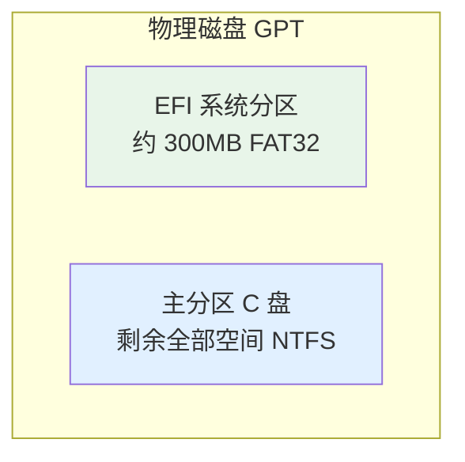

## 视频教程 📹

<div style="position: relative; padding-bottom: 56.25%; height: 0; overflow: hidden; margin: 1rem 0;">
  <iframe
    src="//player.bilibili.com/player.html?isOutside=true&aid=77344372&bvid=BV1DJ411D79y&cid=133667837&p=2"
    style="position: absolute; top: 0; left: 0; width: 100%; height: 100%; border: 0;"
    scrolling="no"
    frameborder="no"
    framespacing="0"
    allowfullscreen="true">
  </iframe>
</div>

> 参考文档
> 1. [微PE工具箱官网](https://www.wepe.com.cn/) / [下载页](https://www.wepe.com.cn/download.html)
> 2. [Microsoft - 下载 Windows 11](https://www.microsoft.com/zh-cn/software-download/windows11)
> 3. [华硕 TUF GAMING B650-PLUS WIFI 驱动下载](https://www.asus.com.cn/motherboards-components/motherboards/tuf-gaming/tuf-gaming-b650-plus-wifi/helpdesk_download?model2Name=TUF-GAMING-B650-PLUS-WIFI)
> 4. [NVIDIA 560.94 驱动（30 系推荐）](https://cn.download.nvidia.cn/Windows/560.94/560.94-desktop-win10-win11-64bit-international-dch-whql.exe)
> 5. [AMD 芯片组驱动](https://www.amd.com/zh-hans/support)
> 6. [Microsoft Activation Scripts](https://get.activated.win) / [massgrave.dev](https://massgrave.dev)

## 概述

本文以微 PE 工具箱制作 PE 启动盘，使用 Microsoft 官方镜像安装 Windows 11 专业版，并在安装后从主板厂商和显卡厂商官网安装对应驱动。文中以华硕 B650 主板 + AMD 锐龙 CPU + NVIDIA 30 系显卡为例，其他硬件可前往各自厂商官网查找对应型号驱动。

### 流程概览


---

## 一、事前准备

> 以下内容需在**进入 PE 之前**完成，建议在一台可正常上网的电脑上依次操作。

### 1.1 备份重要数据

重装会清除系统盘所有数据，请提前备份桌面、文档、浏览器书签、重要配置文件等。

### 1.2 准备 U 盘并制作微 PE 启动盘

| 准备项 | 说明 |
|--------|------|
| **U 盘** | 至少 16GB，建议 32GB，内容会被清空 |
| **微 PE** | [下载页](https://www.wepe.com.cn/download.html)（64 位选 V2.3，约 228MB；老机器可选 V1.3） |

1. 从上述链接下载微 PE 安装包，运行后选择 **「安装 PE 到 U 盘」**
2. 选择目标 U 盘（注意不要选错）
3. 分区表类型选 **UEFI**（新主板）
4. 点击 **「立即安装进 U 盘」**，等待完成

### 1.3 下载 Windows 11 ISO 并拷贝

1. 打开 [Microsoft 官方下载页](https://www.microsoft.com/zh-cn/software-download/windows11)
2. 选择 **「下载适用于 x64 设备的 Windows 11 磁盘映像 (ISO)」**
3. 语言选 **简体中文**，版本选 **多版本 ISO** 或 **专业中文版**
4. 下载后，将 ISO **拷贝到微 PE U 盘**，或放到另一块能访问的硬盘（如 D 盘）

> 下载链接 24 小时内有效。

### 1.4 （可选）提前下载驱动

进入 PE 后无网络，建议提前下载并保存到 U 盘或另一块盘：

| 驱动 | 来源 |
|------|------|
| **AMD 芯片组** | [AMD 官网](https://www.amd.com/zh-hans/support) 或主板厂商下载页 |
| **主板**（网卡、音频等） | 主板厂商「支持 / 下载」页，如 [华硕 TUF B650](https://www.asus.com.cn/motherboards-components/motherboards/tuf-gaming/tuf-gaming-b650-plus-wifi/helpdesk_download?model2Name=TUF-GAMING-B650-PLUS-WIFI) |
| **显卡**（30 系推荐 560.94） | [NVIDIA 560.94](https://cn.download.nvidia.cn/Windows/560.94/560.94-desktop-win10-win11-64bit-international-dch-whql.exe) 或 [NVIDIA 官网](https://www.nvidia.cn/Download/index.aspx?lang=cn) |

---

## 二、进入 PE

1. 关机后插入 U 盘，开机
2. 连续按 **Delete** 或 **F2** 进入 BIOS（华硕 TUF B650 一般为 Delete）
3. 设置 **U 盘为第一启动项**，或按 **F8** 打开启动菜单选择 U 盘
4. 保存并退出，进入微 PE 桌面

> U 盘无法识别时，可在 BIOS 中暂时关闭 **Secure Boot**。

---

## 三、DiskGenius 格式化硬盘

微 PE 内置 **DiskGenius**。进入 PE 后，在开始菜单或桌面打开 DiskGenius。

### 3.1 快速分区（推荐）

1. 左侧选中**物理磁盘**（最顶层）
2. 点击 **「快速分区」**
3. 设置：
   - **分区表类型**：**GUID (GPT)**
   - **分区数目**：**1**（单 C 盘，见下方说明）
   - 勾选 **「创建新 ESP 分区」**（约 300MB）
4. 点击 **「确定」** 执行

### 3.2 单盘分区结构



> **作者习惯**：不建议分区，仅保留一个 C 盘，可避免空间分配不均、C 盘爆红。资源放桌面，应用装 C 盘。

---

## 四、安装 Windows 11

1. 打开 **「此电脑」**，确认能识别目标硬盘及 ISO 所在位置
2. **双击 ISO 文件** 挂载为虚拟光驱，在虚拟光驱中双击 **`setup.exe`**
3. 按向导操作：
   - 「获取更新」选 **「不是现在」**
   - 接受许可条款
   - **「更改要保留的内容」** → **「不保留任何内容」**
   - 选中已格式化的主分区（C 盘），点击 **「下一步」**
4. 安装完成后会重启，**重启前拔掉 U 盘**，从硬盘启动进入首次设置

---

## 五、首次设置（不联网、本地账户、英文用户名）

> 作者习惯：不联网、不登录微软账户、不设密码，使用本地账户。**用户名务必用英文**，避免 `C:\Users\中文名` 路径导致软件乱码、开发工具报错。

### 5.1 不联网创建本地账户

1. 出现「让我们为你连接到网络」时，按 **Shift + F10** 打开命令提示符
2. 输入 `oobe\bypassnro` 回车，电脑会重启
3. 再次进入 OOBE 后，点击 **「我没有 Internet 连接」** → **「继续执行有限设置」**
4. 输入**英文用户名**（如 `User`、拼音），密码留空点 **「下一步」** 跳过

> 若仍要求联网，可先拔网线或关 Wi-Fi 再试；或再次 Shift+F10 输入 `oobe\bypassnro`。

### 5.2 后续

1. 完成隐私、Cortana 等选项
2. 进入桌面后**再连接网络**，执行 **Windows 更新**

---

## 六、驱动安装

进入桌面后，按以下顺序安装（若 1.4 已提前下载，直接从 U 盘或另一块盘运行即可）：


| 顺序 | 驱动 | 说明 |
|------|------|------|
| 1 | Windows 更新 | 先完成系统补丁 |
| 2 | AMD 芯片组 | 锐龙平台必装，电源管理、PCIe/USB 等 |
| 3 | 主板 | 芯片组、网卡、音频等，见 1.4 主板厂商下载页 |
| 4 | 显卡 | 30 系推荐 560.94，见 1.4 链接 |
| 5 | 其他外设 | 键盘、鼠标、打印机等 |

> 其他主板/显卡：到对应厂商官网「支持 / 下载」页，按型号选择 Windows 11 驱动。

---

## 七、Windows 激活

若无正版 license，可使用 **Microsoft Activation Scripts (MAS)** 开源脚本激活，项目托管于 [massgrave.dev](https://massgrave.dev/) / [get.activated.win](https://get.activated.win)。

### 7.1 在线激活（推荐）

1. **以管理员身份运行 PowerShell**：`Win + X` → 选择 **「终端（管理员）」** 或 **「Windows PowerShell（管理员）」**
2. 执行以下命令：

```powershell
irm https://get.activated.win | iex
```

3. 脚本运行后会显示菜单，输入 **`1`** 选择 **HWID 激活**（永久数字许可证，绑定硬件）
4. 等待完成，出现 **「Product activated successfully」** 即激活成功
5. 打开 **「设置 → 系统 → 激活」** 确认状态

### 7.2 常见问题

| 问题 | 解决方案 |
|------|----------|
| **ISP 拦截 / 连接失败** | 使用 DoH 绕过，见下方命令 |
| **TLS/SSL 错误** | 先运行：`[Net.ServicePointManager]::SecurityProtocol=[Net.SecurityProtocolType]::Tls12` |
| **防病毒误报** | 可暂时关闭实时保护或添加排除项，脚本开源可审计 |

ISP 拦截时，可改用：

```powershell
iex (curl.exe -s --doh-url https://1.1.1.1/dns-query https://get.activated.win | Out-String)
```

### 7.3 离线激活

无网络时可从 [GitHub](https://github.com/massgravel/Microsoft-Activation-Scripts) 下载 **MAS_AIO.zip**，解压后以管理员身份运行 **`MAS_AIO.cmd`**，按菜单选择 HWID 激活。

---

## 八、注意事项

- **激活**：有正版 license 时，进入桌面后「设置 → 系统 → 激活」输入密钥即可；无 license 可参考第七章
- **ISO 校验**：Microsoft 提供 SHA256，可用 PowerShell `Get-FileHash` 校验下载完整性
