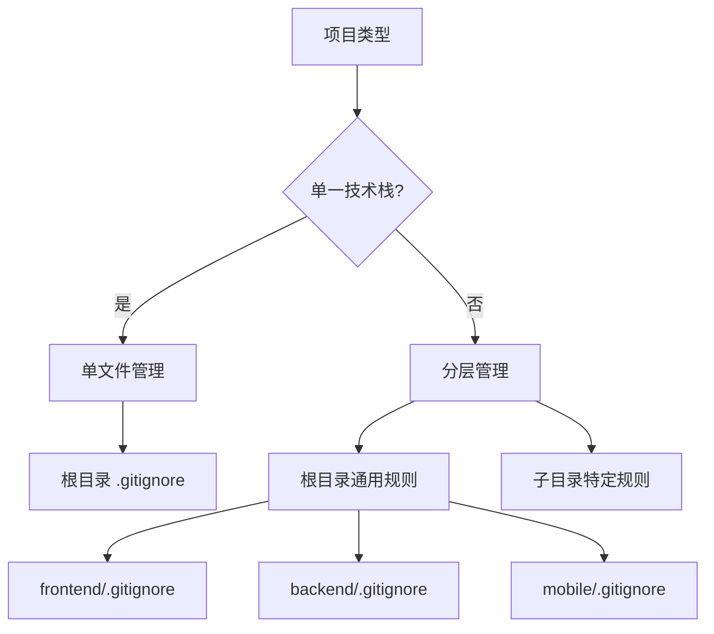

> 基于实际项目经验，总结通用的 `.gitignore` 配置原则和最佳实践，提供可复用的、标准化的配置方案，适用于各种类型的项目。

## 一、核心原则

### 1.1 为什么需要 .gitignore

`.gitignore` 用于告诉 Git 哪些文件或目录不应该被版本控制。核心原则：

- **不提交生成文件**：构建产物、编译文件等由工具生成，不应提交
- **不提交依赖目录**：依赖由包管理器管理，通过声明文件（如 `package.json`）管理版本
- **不提交敏感信息**：环境变量、密钥、密码等敏感信息不应提交
- **不提交个人配置**：IDE 配置、系统文件等个人偏好不应影响团队

### 1.2 配置策略

根据项目复杂度选择配置策略：

| 策略 | 适用场景 | 结构 |
|------|---------|------|
| **单文件管理** | 单一技术栈、小型项目 | 项目根目录一个 `.gitignore` |
| **分层管理** | 多技术栈、中大型项目 | 根目录通用规则 + 子目录特定规则 |



### 1.3 分类组织原则

按类别组织规则，使用注释清晰标注：

- **数据目录**：运行时数据（`data/`、`logs/`、`uploads/`）
- **配置文件**：环境变量、本地配置（`*.env`、`*.local`）
- **构建产物**：编译输出、打包文件（`dist/`、`build/`、`target/`）
- **依赖目录**：包管理器安装的依赖（`node_modules/`、`venv/`、`vendor/`）
- **测试覆盖率**：测试报告、覆盖率数据（`coverage/`、`.coverage`）
- **IDE 配置**：编辑器配置文件（`.vscode/`、`.idea/`）
- **系统文件**：操作系统生成的文件（`.DS_Store`、`Thumbs.db`）
- **日志和临时文件**：运行时日志、临时文件（`*.log`、`*.tmp`）

## 二、模板集合

### 2.1 通用项目模板

**位置：** `project-root/.gitignore`  
**适用场景：** 所有项目的通用规则

```text
# ============================================
# 数据目录（运行时数据，不提交到版本控制）
# ============================================
data/
logs/
uploads/
cache/
temp/
tmp/

# ============================================
# 配置文件（敏感信息，使用 .env.example 作为模板）
# ============================================
*.env
*.env.local
*.env.*.local
!.env.example
!.env.template
*.local
.local/
config.local.*
settings.local.*

# ============================================
# 构建产物（由构建工具生成，不应提交）
# ============================================
dist/
build/
out/
.output/
*.min.js
*.min.css
*.bundle.js

# ============================================
# 测试和覆盖率报告
# ============================================
coverage/
.nyc_output/
.coverage
htmlcov/
.pytest_cache/
.tox/
.hypothesis/
*.cover
*.lcov
test-results/
junit.xml

# ============================================
# IDE 和编辑器配置（可选，团队统一时可提交）
# ============================================
# VS Code
.vscode/
!.vscode/settings.json
!.vscode/tasks.json
!.vscode/launch.json
!.vscode/extensions.json

# IntelliJ IDEA / PyCharm / WebStorm
.idea/
*.iml
*.iws
*.ipr

# Eclipse
.classpath
.project
.settings/

# Vim / Emacs
*.swp
*.swo
*~
.vim/
\#*\#
.\#*

# Sublime Text
*.sublime-project
*.sublime-workspace

# ============================================
# 系统文件
# ============================================
# macOS
.DS_Store
.AppleDouble
.LSOverride
._*
.Spotlight-V100
.Trashes

# Windows
Thumbs.db
ehthumbs.db
Desktop.ini
$RECYCLE.BIN/
*.lnk

# Linux
.directory
.Trash-*

# ============================================
# 日志文件
# ============================================
*.log
logs/
*.log.*

# ============================================
# 临时文件
# ============================================
*.tmp
*.temp
*.bak
*.cache
*.backup
*.old
*.orig

# ============================================
# Docker 相关
# ============================================
docker-compose.override.yml
```

### 2.2 Node.js / JavaScript / TypeScript 项目

**完整模板：**

```text
# ============================================
# 依赖
# ============================================
node_modules/
npm-debug.log*
yarn-debug.log*
yarn-error.log*
pnpm-debug.log*
lerna-debug.log*
.pnpm-store/
.yarn/
.yarn/cache/
.yarn/unplugged/
.yarn/build-state.yml
.yarn/install-state.gz

# ============================================
# 构建产物
# ============================================
dist/
build/
out/
.next/
.nuxt/
.vite/
.output/
.cache/
.webpack/
.angular/

# ============================================
# 测试覆盖率
# ============================================
coverage/
.nyc_output/
.jest/

# ============================================
# 环境变量
# ============================================
.env
.env.local
.env.*.local

# ============================================
# 编辑器
# ============================================
.vscode/*
!.vscode/extensions.json
.idea/
*.suo
*.ntvs*
*.njsproj
*.sln
```

### 2.3 Python 项目

**完整模板：**

```text
# ============================================
# Python 编译文件
# ============================================
__pycache__/
*.py[cod]
*$py.class
*.so

# ============================================
# 分发和打包
# ============================================
.Python
build/
develop-eggs/
dist/
downloads/
eggs/
.eggs/
lib/
lib64/
parts/
sdist/
var/
wheels/
pip-wheel-metadata/
share/python-wheels/
*.egg-info/
.installed.cfg
*.egg
MANIFEST

# PyInstaller
*.manifest
*.spec

# ============================================
# 虚拟环境
# ============================================
.venv/
venv/
ENV/
env/
.conda/

# ============================================
# 测试覆盖率
# ============================================
htmlcov/
.tox/
.nox/
.coverage
.coverage.*
.cache
nosetests.xml
coverage.xml
*.cover
*.py,cover
.hypothesis/
.pytest_cache/

# ============================================
# Jupyter Notebook
# ============================================
.ipynb_checkpoints

# ============================================
# mypy
# ============================================
.mypy_cache/
.dmypy.json
dmypy.json

# ============================================
# pyenv
# ============================================
.python-version

# ============================================
# 环境变量
# ============================================
.env
.env.local
.env.*.local

# ============================================
# 数据库文件
# ============================================
*.db
*.sqlite
*.sqlite3
*.db-journal
```

### 2.4 Java 项目

**完整模板：**

```text
# ============================================
# 编译文件
# ============================================
*.class
*.jar
*.war
*.ear
*.nar

# ============================================
# 构建工具
# ============================================
# Maven
target/
.mvn/
mvnw
mvnw.cmd

# Gradle
.gradle/
build/
!gradle/wrapper/gradle-wrapper.jar
!**/src/main/**/build/
!**/src/test/**/build/

# ============================================
# IDE
# ============================================
.idea/
*.iml
*.iws
*.ipr
.classpath
.project
.settings/
```

### 2.5 Go 项目

**完整模板：**

```text
# ============================================
# 编译文件
# ============================================
*.exe
*.exe~
*.dll
*.so
*.dylib
*.test
*.out

# ============================================
# 依赖
# ============================================
vendor/
go.sum

# ============================================
# IDE
# ============================================
.idea/
*.swp
*.swo
```

### 2.6 Rust 项目

**完整模板：**

```text
# ============================================
# 编译文件
# ============================================
target/
Cargo.lock

# ============================================
# IDE
# ============================================
.idea/
*.swp
*.swo
```

### 2.7 移动端项目

#### iOS

```text
*.pbxuser
*.mode1v3
*.mode2v3
*.perspectivev3
*.xcuserstate
project.xcworkspace/
xcuserdata/
*.moved-aside
DerivedData/
*.hmap
*.ipa
*.dSYM.zip
*.dSYM
```

#### Android

```text
*.apk
*.ap_
*.aab
.gradle/
local.properties
*.iml
.idea/
*.dex
*.class
bin/
gen/
out/
```

### 2.8 分层配置示例

**场景：** Vue3 + FastAPI 全栈项目

**项目结构：**
```
project-root/
├── .gitignore           # 通用规则
├── frontend/
│   ├── .gitignore       # 前端特定规则
│   └── ...
└── backend/
    ├── .gitignore       # 后端特定规则
    └── ...
```

**根目录 `.gitignore`：**
```text
# 通用规则
data/
logs/
uploads/
*.env
*.env.local
!.env.example
.DS_Store
Thumbs.db
*.log
*.tmp
```

**`frontend/.gitignore`：**
```text
# 前端特定规则
node_modules/
.pnpm-store/
.yarn/
dist/
.vite/
.output/
coverage/
.env
.env.local
```

**`backend/.gitignore`：**
```text
# 后端特定规则
__pycache__/
*.pyc
*.pyo
.venv/
venv/
.pytest_cache/
.coverage
htmlcov/
*.db
*.sqlite
.env
.env.local
```

## 三、最佳实践

### 3.1 敏感信息管理

**环境变量文件：**

```text
# 忽略所有环境变量文件
*.env
*.env.local
*.env.*.local

# 但保留模板文件
!.env.example
!.env.template
```

**推荐做法：**
- ✅ 提交 `.env.example` 作为模板
- ❌ 不提交实际的 `.env` 文件
- ✅ 使用环境变量管理敏感信息
- ✅ 在 README 中说明如何配置

### 3.2 构建产物管理

**原则：**
- ❌ 不提交构建产物（由构建工具生成）
- ✅ 在 CI/CD 中构建，而不是提交构建后的文件
- ✅ 明确列出所有构建产物目录

**常见构建产物：**
- 前端：`dist/`、`build/`、`out/`、`.next/`、`.nuxt/`、`.vite/`
- 后端：`target/`、`build/`、`dist/`、`*.egg-info/`

### 3.3 依赖管理

**原则：**
- ❌ 不提交依赖目录（由包管理器管理）
- ✅ 提交依赖声明文件（`package.json`、`requirements.txt`、`Cargo.toml` 等）
- ✅ 在 README 中说明如何安装依赖

**常见依赖目录：**
- Node.js：`node_modules/`、`.pnpm-store/`
- Python：`venv/`、`.venv/`、`__pycache__/`
- Java：`target/`、`.gradle/`
- Go：`vendor/`
- Rust：`target/`（但 `Cargo.lock` 通常需要提交）

### 3.4 IDE 配置管理

**两种策略：**

**策略一：忽略所有 IDE 配置（个人项目）**
```text
.vscode/
.idea/
*.iml
```

**策略二：提交部分 IDE 配置（团队项目）**
```text
# 忽略个人配置
.vscode/*
.idea/

# 但保留团队共享配置
!.vscode/settings.json
!.vscode/tasks.json
!.vscode/launch.json
!.vscode/extensions.json
```

**选择建议：**
- 个人项目：忽略所有 IDE 配置
- 团队项目：提交共享配置，忽略个人配置

### 3.5 规则优先级

`.gitignore` 规则按顺序匹配，更具体的规则会覆盖更通用的规则：

```text
# 通用规则
*.log

# 特定规则（优先级更高）
!important.log

# 目录规则
logs/

# 但保留 .gitkeep
!logs/.gitkeep
```

**规则优先级：**
1. 更具体的规则优先于通用规则
2. 后面的规则可以覆盖前面的规则（使用 `!`）
3. 目录规则会忽略目录中的所有文件

## 四、常见问题处理

### 4.1 已提交的文件需要忽略

**问题：** 文件已经被 Git 跟踪，但需要添加到 `.gitignore`

**解决方案：**
```bash
# 从 Git 中移除但保留本地文件
git rm --cached <file>

# 对于目录
git rm -r --cached <directory>

# 提交更改
git commit -m "Remove tracked files from Git"
```

**批量处理：**
```bash
# 移除所有已跟踪的 .env 文件
git rm --cached **/*.env

# 移除所有已跟踪的 node_modules
find . -name node_modules -type d -exec git rm -r --cached {} +
```

### 4.2 忽略规则不生效

**检查步骤：**

1. **确认文件路径正确**
   - 使用相对路径（相对于 `.gitignore` 文件位置）
   - 使用 `/` 作为路径分隔符（跨平台）

2. **检查规则优先级**
   - 更具体的规则会覆盖更通用的规则
   - 使用 `!` 可以取消忽略

3. **确认文件未被 Git 跟踪**
   - 如果文件已被跟踪，需要先使用 `git rm --cached`

4. **检查 .gitignore 文件位置**
   - `.gitignore` 只影响其所在目录及子目录
   - 确保 `.gitignore` 在正确的位置

**调试技巧：**
```bash
# 检查文件是否被忽略
git check-ignore -v <file>

# 查看所有被忽略的文件
git status --ignored
```

### 4.3 需要忽略但保留目录结构

**问题：** 需要忽略目录中的文件，但保留目录结构（用于 Git 跟踪空目录）

**解决方案：** 使用 `.gitkeep` 文件

```bash
# 创建目录并添加 .gitkeep
mkdir -p data/logs/backend
touch data/logs/backend/.gitkeep

# .gitignore 中排除 .gitkeep
!**/.gitkeep
```

**配置示例：**
```text
# 忽略目录中的所有文件
data/logs/
data/uploads/

# 但保留 .gitkeep 文件
!**/.gitkeep
```

### 4.4 部分文件需要提交

**问题：** 某个模式的文件需要忽略，但其中某些文件需要提交

**解决方案：** 使用 `!` 取消忽略

```text
# 忽略所有 .env 文件
*.env

# 但提交 .env.example
!.env.example

# 忽略所有日志文件
*.log

# 但提交 changelog.log
!changelog.log
```

### 4.5 跨平台路径问题

**问题：** Windows 和 Linux/macOS 路径分隔符不同

**解决方案：** 使用 `/` 作为路径分隔符（Git 会自动处理）

```text
# ✅ 正确（跨平台）
data/logs/
config/*.env

# ❌ 错误（Windows 特定）
data\logs\
config\*.env
```

## 五、团队协作建议

### 5.1 统一配置

**原则：**
- 团队成员使用相同的 `.gitignore` 配置
- `.gitignore` 文件应该提交到版本控制
- 定期审查和更新 `.gitignore` 配置

**实践：**
1. 在项目初始化时创建 `.gitignore`
2. 使用模板或参考最佳实践
3. 在 README 中说明 `.gitignore` 的配置原则
4. 定期审查是否有遗漏的规则

### 5.2 文档说明

**建议在 README 中说明：**
- `.gitignore` 的配置原则
- 哪些文件/目录被忽略及原因
- 如何添加新的忽略规则
- 如何处理已提交的文件

**示例：**
```markdown
## .gitignore 配置说明

本项目采用分层管理的方式组织 `.gitignore`：
- 根目录：项目级通用规则
- 子目录：特定技术栈规则

被忽略的内容：
- 依赖目录（node_modules、venv 等）
- 构建产物（dist、build 等）
- 环境变量文件（*.env）
- 日志文件（*.log）
```

### 5.3 定期审查

**审查时机：**
- 项目初始化时
- 添加新技术栈时
- 发现意外提交的文件时
- 定期（如每季度）审查

**审查内容：**
1. 检查是否有遗漏的忽略规则
2. 检查是否有不必要的忽略规则
3. 检查配置是否清晰易懂
4. 检查是否符合团队规范

## 六、工具推荐

- **[gitignore.io](https://www.toptal.com/developers/gitignore)**：根据技术栈生成 `.gitignore`
- **[GitHub .gitignore 模板](https://github.com/github/gitignore)**：官方模板集合
- **Git 命令**：`git check-ignore -v <file>` 检查文件是否被忽略

## 参考资源

### 官方文档
- [Git 官方文档 - gitignore](https://git-scm.com/docs/gitignore)
- [GitHub .gitignore 模板](https://github.com/github/gitignore)

### 在线工具
- [gitignore.io](https://www.toptal.com/developers/gitignore) - 根据技术栈生成 .gitignore

### 相关指南
- [Git 最佳实践](https://git-scm.com/book)
- [GitHub 文档 - 忽略文件](https://docs.github.com/en/get-started/getting-started-with-git/ignoring-files)
