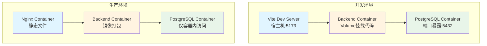

> 基于实际项目经验，设计前后端分离的全栈项目目录结构，支持开发模式（热重载）和生产模式（容器化部署），提供最小可维护的核心服务配置和可扩展的可选服务集成方案。

## 一、项目结构概览

```
project-root/
├── frontend/                      # Vue 3 前端项目
│   ├── src/                       # 源代码（混合模式：core/shared/modules）
│   ├── public/                    # 静态资源
│   ├── Dockerfile                 # 生产环境 Dockerfile
│   ├── nginx.conf                 # Nginx 配置
│   ├── .dockerignore
│   ├── package.json
│   ├── vite.config.ts
│   └── tsconfig.json
│
├── backend/                       # FastAPI 后端项目
│   ├── app/                       # 源代码（混合模式：core/shared/modules）
│   ├── Dockerfile                 # 生产环境 Dockerfile
│   ├── .dockerignore
│   ├── main.py
│   ├── pyproject.toml             # 项目配置和依赖（使用 uv 管理）
│   └── uv.lock                    # 锁定的依赖版本（使用 uv 生成）
│
├── docker/                        # Docker 配置目录
│   ├── docker-compose.dev.yml    # 开发环境编排
│   ├── docker-compose.prod.yml   # 生产环境编排
│   └── .env.example               # 环境变量示例
│
├── data/                          # 数据目录（统一管理，通过 volume 挂载）
│   ├── uploads/                  # 本地临时上传（如需要）
│   │   └── temp/
│   ├── logs/                      # 日志文件
│   │   ├── backend/              # 后端日志
│   │   ├── frontend/             # 前端日志（如需要）
│   │   └── nginx/                # Nginx 日志
│   └── database/                  # 数据库相关
│       ├── scripts/              # SQL 脚本（初始化、备份等）
│       └── backups/              # 数据库备份
│
├── config/                        # 配置文件目录
│   ├── development/              # 开发环境配置
│   │   ├── backend.env
│   │   └── frontend.env
│   ├── production/               # 生产环境配置
│   │   ├── backend.env
│   │   └── frontend.env
│   └── nginx/                    # Nginx 配置（全局）
│       └── default.conf
│
├── scripts/                       # 项目级脚本
│   ├── docker.sh                  # Docker 统一管理脚本
│   ├── dev/                      # 开发环境脚本
│   │   ├── start.sh             # 启动开发环境
│   │   ├── stop.sh              # 停止开发环境
│   │   ├── setup.sh             # 初始化环境
│   │   └── logs.sh               # 查看日志
│   ├── build/                    # 构建脚本
│   │   ├── build-frontend.sh
│   │   ├── build-backend.sh
│   │   └── build-all.sh
│   └── deploy/                   # 部署脚本
│       ├── deploy.sh             # 部署脚本
│       ├── deploy-docker.sh      # Docker 部署
│       └── rollback.sh           # 回滚脚本
│
├── docs/                          # 项目文档
│   ├── api/                      # API 文档
│   ├── deployment/               # 部署文档
│   └── development/             # 开发文档
│
├── tests/                         # 测试目录
│   ├── e2e/                      # 端到端测试
│   ├── integration/              # 集成测试
│   └── fixtures/                 # 测试数据
│
├── .github/                       # GitHub Actions
│   └── workflows/
│       ├── ci.yml                # CI 流程
│       └── deploy.yml            # 部署流程
│
├── .gitignore
├── .dockerignore                  # 全局 Docker 忽略文件
├── README.md
└── LICENSE
```

## 二、核心设计理念

### 2.1 设计原则

本目录结构采用**最小可维护性 + 可扩展性**的设计原则：

- **核心服务**：数据库（PostgreSQL）是必须的，所有项目都需要
- **可选服务**：文件存储、缓存、消息队列等服务根据项目需求按需添加
- **灵活扩展**：通过 Docker Compose 轻松添加新服务，不影响核心功能
- **环境分离**：开发和生产使用不同的配置策略，最大化开发效率和优化生产性能

### 2.2 开发模式 vs 生产模式



### 2.3 环境差异对比

| 维度 | 开发环境（Dev） | 生产环境（Prod） |
|------|----------------|-----------------|
| **前端运行方式** | Vite Dev Server（宿主机） | Nginx 容器（构建后静态文件） |
| **前端热重载** | ✅ 支持 | ❌ 不支持 |
| **后端代码挂载** | ✅ Volume 挂载源代码 | ❌ 代码打包到镜像 |
| **后端热重载** | ✅ Uvicorn `--reload` | ❌ 不支持 |
| **后端运行方式** | Uvicorn 单进程 | Uvicorn 多进程（`--workers 4`） |
| **数据库端口** | ✅ 暴露 5432（便于本地工具连接） | ❌ 不暴露（仅容器内访问） |
| **环境变量** | 硬编码（便于快速启动） | 环境变量（安全、灵活） |
| **重启策略** | 无（手动控制） | `restart: always`（自动恢复） |
| **启动速度** | 快（秒级，无需构建） | 较慢（需要构建镜像） |
| **调试能力** | ✅ 完整调试支持 | ⚠️ 通过日志调试 |

**设计思路：**
- **开发环境**：最大化开发效率，代码修改立即生效，支持完整调试，快速启动
- **生产环境**：优化性能和稳定性，代码打包，多进程运行，安全加固

## 三、详细目录结构

### 3.1 Frontend 目录结构

> 💡 **详细参考**：如需了解前端目录结构的详细设计原则、模块化方案、命名规范等，请参考 [Vue 3 项目工程化结构设计指南](https://blog.mapin.net/posts/Vue%203%20%E9%A1%B9%E7%9B%AE%E5%B7%A5%E7%A8%8B%E5%8C%96%E7%BB%93%E6%9E%84%E8%AE%BE%E8%AE%A1%E6%8C%87%E5%8D%97)。

```
frontend/
├── src/                           # 源代码（混合模式）
│   ├── core/                     # 核心基础设施
│   │   ├── api/                 # HTTP 客户端
│   │   ├── utils/               # 工具函数
│   │   └── types/               # 通用类型
│   ├── shared/                  # 共享业务代码
│   │   ├── components/          # 跨模块组件
│   │   ├── stores/              # 共享状态
│   │   └── composables/        # 共享逻辑
│   ├── modules/                 # 业务模块
│   │   ├── user/
│   │   ├── project/
│   │   └── ...
│   ├── router/                  # 路由配置
│   ├── styles/                  # 样式文件
│   ├── locales/                 # 国际化
│   ├── plugins/                 # 插件配置
│   ├── assets/                  # 资源文件
│   ├── main.ts                  # 应用入口
│   ├── App.vue                  # 根组件
│   └── vite-env.d.ts            # Vite 类型声明
│
├── public/                       # 静态资源（不参与构建）
│
├── Dockerfile                    # 生产环境 Dockerfile
├── nginx.conf                    # Nginx 配置
├── .dockerignore
├── .env.development              # 开发环境变量
├── .env.production               # 生产环境变量
├── .env.example                  # 环境变量示例
├── package.json
├── vite.config.ts
├── tsconfig.json
└── README.md
```

### 3.2 Backend 目录结构

> 💡 **详细参考**：如需了解后端目录结构的详细设计原则、分层架构、数据库设计、模块化方案等，请参考 [FastAPI 项目工程化结构设计指南](https://blog.mapin.net/posts/FastAPI%20%E9%A1%B9%E7%9B%AE%E5%B7%A5%E7%A8%8B%E5%8C%96%E7%BB%93%E6%9E%84%E8%AE%BE%E8%AE%A1%E6%8C%87%E5%8D%97)。

```
backend/
├── app/                          # 源代码（混合模式）
│   ├── core/                    # 核心基础设施
│   │   ├── config.py            # 配置管理
│   │   ├── exceptions/          # 异常定义
│   │   ├── response.py          # 响应模型
│   │   ├── security/            # 安全认证
│   │   └── middleware/          # 中间件
│   ├── db/                      # 数据库层
│   │   ├── base.py              # 基础模型
│   │   ├── connection.py        # 数据库连接
│   │   └── repositories/        # 基础仓储
│   ├── shared/                  # 共享服务
│   │   ├── storage/             # 存储服务（可选，根据需求选择方案）
│   │   │   └── [storage_service].py
│   │   ├── cache/               # 缓存服务（可选，如需要）
│   │   └── utils/               # 共享工具
│   ├── modules/                 # 业务模块
│   │   ├── user/
│   │   │   ├── models.py
│   │   │   ├── schemas.py
│   │   │   ├── repositories.py
│   │   │   ├── services.py
│   │   │   ├── routers.py
│   │   │   └── dependencies.py
│   │   └── ...
│   └── api/                     # API 统一注册
│       └── router.py
│
├── Dockerfile                    # 生产环境 Dockerfile
├── .dockerignore
├── .env.development              # 开发环境变量
├── .env.production               # 生产环境变量
├── .env.example                  # 环境变量示例
├── main.py                       # 应用入口
├── pyproject.toml                # 项目配置和依赖（使用 uv 管理）
├── uv.lock                       # 锁定的依赖版本（使用 uv 生成）
└── README.md
```

### 3.3 Data 和 Config 目录结构

```
data/
├── uploads/                      # 本地临时上传（如需要）
│   └── temp/                     # 临时文件（定期清理）
│
├── logs/                         # 日志文件
│   ├── backend/                 # 后端日志
│   ├── frontend/                # 前端日志（如需要）
│   └── nginx/                   # Nginx 日志
│
└── database/                     # 数据库相关
    ├── scripts/                 # SQL 脚本
    └── backups/                 # 数据库备份

config/
├── development/                  # 开发环境配置
│   ├── backend.env
│   └── frontend.env
│
├── production/                   # 生产环境配置
│   ├── backend.env
│   └── frontend.env
│
└── nginx/                        # Nginx 配置
    └── default.conf
```

**管理要点：**
- 所有运行时数据统一放在 `data/` 目录，通过 `.gitignore` 排除，通过 volume 挂载到容器
- 配置文件按环境分离，敏感信息使用环境变量管理

## 四、Docker 配置

### 4.1 配置组织方式

本项目采用**集中管理 + 脚本封装**的方式组织 Docker 配置：

- **配置集中**：所有 `docker-compose.*.yml` 文件放在 `docker/` 目录
- **脚本封装**：通过 `scripts/docker.sh` 统一管理，简化使用
- **环境分离**：开发和生产使用不同的 compose 文件

### 4.2 管理脚本

**scripts/docker.sh** - Docker Compose 统一管理脚本

```bash
#!/bin/bash
# scripts/docker.sh - Docker Compose 统一管理脚本

set -e

COMPOSE_DIR="docker"
DEV_FILE="${COMPOSE_DIR}/docker-compose.dev.yml"
PROD_FILE="${COMPOSE_DIR}/docker-compose.prod.yml"

check_file() {
    if [ ! -f "$1" ]; then
        echo "❌ 文件不存在: $1"
        exit 1
    fi
}

show_usage() {
    echo "Docker Compose 管理脚本"
    echo ""
    echo "用法: $0 {dev|prod} [docker-compose 命令]"
    echo ""
    echo "示例:"
    echo "  $0 dev up -d              # 启动开发环境"
    echo "  $0 dev logs -f backend    # 查看后端日志"
    echo "  $0 prod up -d --build     # 构建并启动生产环境"
}

case "$1" in
    dev)
        check_file "$DEV_FILE"
        shift
        docker-compose -f "$DEV_FILE" "$@"
        ;;
    prod)
        check_file "$PROD_FILE"
        shift
        docker-compose -f "$PROD_FILE" "$@"
        ;;
    *)
        show_usage
        exit 1
        ;;
esac
```

**使用前确保脚本有执行权限：**
```bash
chmod +x scripts/docker.sh
```

**Windows 用户**：可使用 Git Bash 运行脚本，或直接使用 `docker-compose -f docker/docker-compose.dev.yml` 命令。

### 4.3 开发环境配置

**docker/docker-compose.dev.yml**

```yaml
version: '3.8'

services:
  # 后端服务
  backend:
    image: python:3.11-slim
    container_name: app-backend-dev
    working_dir: /app
    volumes:
      # 挂载源代码，支持热重载
      - ../backend:/app
      # 挂载数据目录
      - ../data/logs/backend:/app/logs
      # 挂载配置文件
      - ../config/development/backend.env:/app/.env
    ports:
      - "8000:8000"  # FastAPI
    environment:
      - ENV=development
      - DEBUG=true
    command: >
      sh -c "uv sync &&
             uvicorn main:app --host 0.0.0.0 --port 8000 --reload"
    depends_on:
      - db
    networks:
      - app-network

  # 数据库（核心服务）
  db:
    image: postgres:15-alpine
    container_name: app-db-dev
    environment:
      - POSTGRES_DB=myapp_dev
      - POSTGRES_USER=dev_user
      - POSTGRES_PASSWORD=dev_password
    ports:
      - "5432:5432"
    volumes:
      - postgres_data:/var/lib/postgresql/data
    networks:
      - app-network

volumes:
  postgres_data:

networks:
  app-network:
    driver: bridge
```

**说明：**
- 前端不在此 compose 中，在宿主机运行 Vite Dev Server
- 后端代码通过 volume 挂载，修改后自动重载
- 数据库作为核心服务，必须配置

### 4.4 生产环境配置

**docker/docker-compose.prod.yml**

```yaml
version: '3.8'

services:
  # 前端服务（Nginx）
  frontend:
    build:
      context: ../frontend
      dockerfile: Dockerfile
    container_name: app-frontend-prod
    ports:
      - "80:80"
    volumes:
      - ../config/nginx/default.conf:/etc/nginx/conf.d/default.conf:ro
      - ../data/logs/nginx:/var/log/nginx
    depends_on:
      - backend
    networks:
      - app-network
    restart: always

  # 后端服务
  backend:
    build:
      context: ../backend
      dockerfile: Dockerfile
    container_name: app-backend-prod
    ports:
      - "8000:8000"
    volumes:
      - ../data/logs/backend:/app/logs
      - ../config/production/backend.env:/app/.env
    environment:
      - ENV=production
      - DEBUG=false
    command: uvicorn main:app --host 0.0.0.0 --port 8000 --workers 4
    depends_on:
      - db
    networks:
      - app-network
    restart: always

  # 数据库（核心服务）
  db:
    image: postgres:15-alpine
    container_name: app-db-prod
    environment:
      - POSTGRES_DB=${DB_NAME}
      - POSTGRES_USER=${DB_USER}
      - POSTGRES_PASSWORD=${DB_PASSWORD}
    volumes:
      - postgres_data:/var/lib/postgresql/data
      - ../data/database/backups:/backups
    networks:
      - app-network
    restart: always

volumes:
  postgres_data:

networks:
  app-network:
    driver: bridge
```

**注意：** 生产环境后端使用 `--workers 4`，建议根据 CPU 核心数调整（通常为 `CPU核心数 * 2 + 1`）。

## 五、快速开始

### 5.1 初始化项目

**1. 创建项目目录结构**
- 按照"一、项目结构概览"章节创建完整的目录结构

**2. 初始化前后端项目**
- **前端**：使用 Vue 3 官方模板或 Vite 创建项目，参考 [Vue 3 项目工程化结构设计指南](https://blog.mapin.net/posts/Vue%203%20%E9%A1%B9%E7%9B%AE%E5%B7%A5%E7%A8%8B%E5%8C%96%E7%BB%93%E6%9E%84%E8%AE%BE%E8%AE%A1%E6%8C%87%E5%8D%97)
- **后端**：创建 FastAPI 项目，参考 [FastAPI 项目工程化结构设计指南](https://blog.mapin.net/posts/FastAPI%20%E9%A1%B9%E7%9B%AE%E5%B7%A5%E7%A8%8B%E5%8C%96%E7%BB%93%E6%9E%84%E8%AE%BE%E8%AE%A1%E6%8C%87%E5%8D%97)

**3. 配置环境变量**
- 在 `config/development/` 和 `config/production/` 目录下创建环境变量文件
- 提供 `.env.example` 作为模板

**4. 创建 Docker 配置和管理脚本**
- 创建 `docker/docker-compose.dev.yml` 和 `docker/docker-compose.prod.yml`
- 创建 `scripts/docker.sh` 统一管理脚本
- 创建 `scripts/dev/start.sh` 和 `scripts/dev/stop.sh` 开发环境脚本
- 设置脚本执行权限：`chmod +x scripts/docker.sh scripts/dev/*.sh`

**5. 安装依赖并启动**
```bash
# 安装前端依赖
cd frontend && npm install && cd ..

# 安装后端依赖（使用 uv，需先安装 uv）
cd backend && uv sync && cd ..

# 启动开发环境
./scripts/dev/start.sh
```

### 5.2 开发流程

1. **启动开发环境**：`./scripts/dev/start.sh`
2. **前端开发**：修改 `frontend/src/` 中的代码，Vite 自动热重载
3. **后端开发**：修改 `backend/app/` 中的代码，Uvicorn 自动重载
4. **查看日志**：
   - 后端日志：`tail -f data/logs/backend/app.log`
   - Docker 日志：`./scripts/docker.sh dev logs -f backend`
5. **停止环境**：`./scripts/dev/stop.sh`

### 5.3 Docker 管理

**开发环境：**
```bash
./scripts/docker.sh dev up -d          # 启动
./scripts/docker.sh dev logs -f        # 查看日志
./scripts/docker.sh dev ps             # 查看状态
./scripts/docker.sh dev down           # 停止
./scripts/docker.sh dev restart backend  # 重启服务
```

**生产环境：**
```bash
./scripts/docker.sh prod up -d --build # 构建并启动
./scripts/docker.sh prod logs -f       # 查看日志
./scripts/docker.sh prod ps            # 查看状态
./scripts/docker.sh prod down          # 停止
```

### 5.4 开发启动脚本

**scripts/dev/start.sh**

```bash
#!/bin/bash
# scripts/dev/start.sh - 启动开发环境（前端 + 后端）

set -e

echo "🚀 启动开发环境..."

# 检查 Docker
if ! docker info > /dev/null 2>&1; then
    echo "❌ Docker 未运行，请先启动 Docker"
    exit 1
fi

# 启动后端服务
echo "📦 启动后端容器（PostgreSQL + Backend）..."
./scripts/docker.sh dev up -d db
sleep 5
./scripts/docker.sh dev up -d backend
sleep 3

# 启动前端开发服务器
echo "🎨 启动前端开发服务器..."
cd frontend

if [ ! -d "node_modules" ]; then
    echo "📦 安装前端依赖..."
    npm install
fi

echo "✅ 开发环境已启动！"
echo ""
echo "📋 服务地址："
echo "   - 前端: http://localhost:5173"
echo "   - 后端: http://localhost:8000"
echo "   - API 文档: http://localhost:8000/docs"
echo ""
echo "按 Ctrl+C 停止服务"

npm run dev &
FRONTEND_PID=$!

trap "echo '🛑 停止服务...'; kill $FRONTEND_PID 2>/dev/null; ./scripts/docker.sh dev down; exit" INT TERM

wait $FRONTEND_PID
```

**scripts/dev/stop.sh**

```bash
#!/bin/bash
# scripts/dev/stop.sh - 停止开发环境

echo "🛑 停止开发环境..."

# 停止前端
pkill -f "vite" || true

# 停止 Docker 服务
./scripts/docker.sh dev down

echo "✅ 开发环境已停止"
```

## 六、技术选型与扩展

### 6.1 设计原则

采用**最小可维护性 + 可扩展性**的设计原则：
- **核心服务**：数据库（PostgreSQL）是必须的
- **可选服务**：文件存储、缓存、消息队列等服务根据项目需求按需添加
- **灵活扩展**：通过 Docker Compose 轻松添加新服务，不影响核心功能

### 6.2 可选服务选型建议

| 服务类型 | 小型项目 | 中型项目 | 大型项目 |
|---------|---------|---------|---------|
| **文件存储** | 本地文件存储 | MinIO 自托管 | AWS S3 / 阿里云 OSS |
| **缓存** | 内存缓存 | Redis | Redis（集群） |
| **消息队列** | Redis Streams（如有 Redis） | RabbitMQ | Kafka |
| **监控** | 简单文件日志 | Prometheus + Grafana | Prometheus + Grafana + ELK |

### 6.3 添加服务的通用步骤

1. **在 Docker Compose 中添加服务配置**
   - 在 `docker/docker-compose.dev.yml` 和 `docker/docker-compose.prod.yml` 中添加服务定义
   - 配置网络、卷、环境变量等
   - 更新相关服务的 `depends_on` 依赖

2. **在后端代码中创建服务封装（如需要）**
   - 在 `backend/app/shared/` 下创建对应的服务目录
   - 封装服务客户端，提供统一的接口

3. **更新环境变量配置**
   - 在 `config/development/` 和 `config/production/` 中添加服务配置
   - 提供 `.env.example` 模板

4. **更新依赖文件**
   - 在 `backend/pyproject.toml` 中添加服务 SDK 依赖（使用 `uv add` 命令）
   - 运行 `uv lock` 更新 `uv.lock` 文件

**服务集成示例位置：**
```
backend/app/shared/
├── storage/              # 文件存储服务封装
├── cache/                # 缓存服务封装
├── messaging/            # 消息队列服务封装
└── monitoring/           # 监控服务封装
```

**选择原则：**
1. **按需添加**：不要一开始就添加所有服务，根据实际需求逐步添加
2. **考虑成本**：云服务按量付费，自托管需要维护成本
3. **保持简单**：优先选择简单方案，复杂方案只在必要时使用

## 七、.gitignore 配置

### 7.1 配置组织原则

`.gitignore` 配置采用**分层管理**的方式：
- **项目根目录**：管理项目级别的忽略规则（数据、配置、构建产物等）
- **前端目录**：管理前端特定的忽略规则（Node.js 依赖、构建产物等）
- **后端目录**：管理后端特定的忽略规则（Python 依赖、缓存等）

### 7.2 关键规则

**项目根目录 `.gitignore` 关键规则：**

```text
# 数据目录（运行时数据，不提交到版本控制）
data/uploads/
data/logs/
data/database/backups/

# 配置文件（敏感信息，使用 .env.example 作为模板）
config/development/*.env
config/production/*.env
*.env
!.env.example

# 构建产物
frontend/dist/
backend/dist/
backend/*.egg-info/

# 依赖目录
node_modules/
__pycache__/
.venv/
venv/
```

**前端目录 `.gitignore` 关键规则：**

```text
node_modules/
dist/
.env
.env.local
```

**后端目录 `.gitignore` 关键规则：**

```text
__pycache__/
*.pyc
.venv/
venv/
.env
.env.local
*.log
```

### 7.3 详细配置参考

> 💡 **详细配置**：如需了解完整的 `.gitignore` 配置规则、最佳实践、常见问题处理等，请参考 [gitignore 配置指南](https://blog.mapin.net/posts/gitignore%20%E9%85%8D%E7%BD%AE%E6%8C%87%E5%8D%97)。

## 八、参考资源

### 相关指南

- **[Vue 3 项目工程化结构设计指南](https://blog.mapin.net/posts/Vue%203%20%E9%A1%B9%E7%9B%AE%E5%B7%A5%E7%A8%8B%E5%8C%96%E7%BB%93%E6%9E%84%E8%AE%BE%E8%AE%A1%E6%8C%87%E5%8D%97)**：详细说明 Vue 3 前端项目的目录结构、模块化设计、命名规范等
- **[FastAPI 项目工程化结构设计指南](https://blog.mapin.net/posts/FastAPI%20%E9%A1%B9%E7%9B%AE%E5%B7%A5%E7%A8%8B%E5%8C%96%E7%BB%93%E6%9E%84%E8%AE%BE%E8%AE%A1%E6%8C%87%E5%8D%97)**：详细说明 FastAPI 后端项目的目录结构、分层架构、数据库设计等
- **[uv Python 包管理器使用指南](https://blog.mapin.net/posts/uv%20Python%20%E5%8C%85%E7%AE%A1%E7%90%86%E5%99%A8%E4%BD%BF%E7%94%A8%E6%8C%87%E5%8D%97)**：介绍 uv（由 Astral 开发的极快 Python 包管理器），比 pip 快 10-100 倍，可替代 pip、pip-tools、pipx、poetry、virtualenv 等多个工具
- **[gitignore 配置指南](https://blog.mapin.net/posts/gitignore%20%E9%85%8D%E7%BD%AE%E6%8C%87%E5%8D%97)**：完整的 `.gitignore` 配置规则、最佳实践、常见问题处理

### 官方文档

- [Vue 3 官方文档](https://vuejs.org/)
- [FastAPI 官方文档](https://fastapi.tiangolo.com/)
- [TypeScript 官方文档](https://www.typescriptlang.org/)
- [Vite 官方文档](https://vitejs.dev/)
- [Docker 官方文档](https://docs.docker.com/)

### 相关工具

- [Pinia 官方文档](https://pinia.vuejs.org/) - Vue 状态管理
- [Vue Router 官方文档](https://router.vuejs.org/) - Vue 路由
- [SQLAlchemy 官方文档](https://docs.sqlalchemy.org/) - Python ORM
- [Pydantic 官方文档](https://docs.pydantic.dev/) - 数据验证
