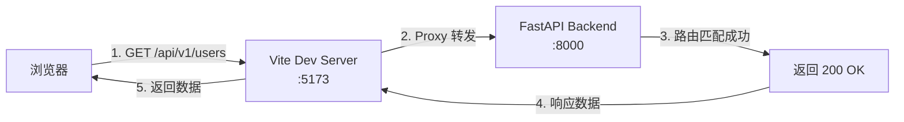
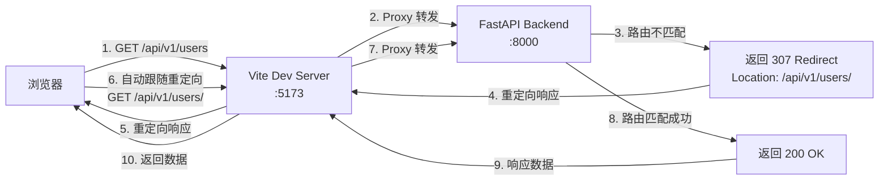

> 在使用 Vue + Vite 开发前端项目，配合 FastAPI 后端时，可能会遇到 API 请求执行两遍的问题。这是因为 Vite 的 proxy 配置将请求转发到后端（5173 → 8000），而后端路由定义与请求路径的末尾斜杠不匹配，导致返回 307 重定向，浏览器再次请求，造成每次 API 调用都执行两次。本文深入分析问题原因，提供完整的排查方法和解决方案。

## 一、问题现象

### 1.1 实际场景描述

**开发环境配置：**
- 前端：Vue 3 + Vite，运行在 `http://localhost:5173`
- 后端：FastAPI，运行在 `http://localhost:8000`
- Vite proxy 配置：将 `/api` 请求代理到 `http://localhost:8000`

**问题表现：**
1. 前端发起 API 请求：`GET http://localhost:5173/api/v1/users`
2. 在浏览器 Network 标签中观察到**每个请求都执行了两次**
3. 第一次请求返回 `307 Temporary Redirect`
4. 第二次请求才返回正常的 `200 OK` 响应

**实际观察到的现象：**

```
Network 标签显示：
1. GET /api/v1/users → 307 Temporary Redirect
   Location: http://localhost:8000/api/v1/users/
   
2. GET /api/v1/users/ → 200 OK
   [正常响应数据]
```

### 1.2 问题影响

**性能影响：**
- 每个 API 请求都执行两次，增加网络开销
- 响应时间翻倍，影响用户体验
- 增加服务器负载（后端处理两次请求）

**开发体验影响：**
- 调试困难，Network 标签中看到重复请求
- 可能影响某些依赖请求次数的功能（如请求去重、防抖等）
- 日志中看到重复的请求记录

### 1.3 问题识别方法

**在浏览器开发者工具中检查：**

1. **打开 Network 标签**
2. **发起一个 API 请求**（如获取用户列表）
3. **观察请求记录**：
   - ❌ **异常情况**：看到两个相同路径的请求，第一个返回 307，第二个返回 200
   - ✅ **正常情况**：只有一个请求，直接返回 200

**典型异常请求记录：**

```
Name              Status     Type     Size     Time
/api/v1/users     307        xhr      0 B      5 ms
/api/v1/users/    200        xhr      2.5 KB   15 ms
```

**检查响应头：**

在第一个请求的 Response Headers 中，如果看到：
```
HTTP/1.1 307 Temporary Redirect
Location: http://localhost:8000/api/v1/users/
```

说明存在重定向问题。

## 二、问题原因分析

### 2.1 完整请求流程

**正常情况下的请求流程：**



**异常情况下的请求流程（存在重定向）：**



### 2.2 Vite Proxy 配置的作用

**Vite 的 proxy 配置示例：**

```typescript
// vite.config.ts
export default defineConfig({
  server: {
    proxy: {
      '/api': {
        target: 'http://localhost:8000',
        changeOrigin: true,
        // rewrite: (path) => path.replace(/^\/api/, '')  // 可选：重写路径
      },
    },
  },
})
```

**Proxy 工作流程：**
1. 浏览器请求：`GET http://localhost:5173/api/v1/users`
2. Vite 拦截 `/api` 开头的请求
3. Vite 转发到：`GET http://localhost:8000/api/v1/users`
4. 后端处理请求并返回响应
5. Vite 将响应返回给浏览器

**关键点：**
- Vite proxy **只是转发请求**，不修改路径
- 如果后端返回 307 重定向，浏览器会**自动跟随重定向**
- 重定向后的请求**仍然会经过 Vite proxy**

### 2.3 FastAPI 路由匹配机制

FastAPI 基于 Starlette 的路由系统，使用**精确匹配**原则：

- 路由定义与请求路径必须**完全一致**（包括末尾斜杠）
- 匹配优先级：精确路径 > 路径参数 > 通配符

**路由定义示例：**

```python
# ❌ 错误：路由定义为 "/"，期望路径是 /api/v1/users/
router = APIRouter(prefix="/api/v1/users")
@router.get("/")  # 只匹配 /api/v1/users/
# 请求 /api/v1/users → 不匹配 → 307 重定向到 /api/v1/users/

# ✅ 正确：路由定义为 ""，期望路径是 /api/v1/users
router = APIRouter(prefix="/api/v1/users")
@router.get("")  # 匹配 /api/v1/users
# 请求 /api/v1/users → 直接匹配 → 200 OK
```

### 2.4 redirect_slashes 工作原理

FastAPI 默认启用 `redirect_slashes=True`，当路由定义和请求路径的末尾斜杠不一致时：

1. 首先尝试精确匹配
2. 如果精确匹配失败，检查是否存在"相反"路径（有/无末尾斜杠）
3. 如果存在，返回 307 重定向到匹配的路径
4. 如果不存在，返回 404

**匹配规则表**：

| 路由定义 | 请求路径 | 匹配结果 | 说明 |
|---------|---------|---------|------|
| `@router.get("/", ...)` | `/api/v1/users` | ❌ 不匹配 → 307 → `/api/v1/users/` | 路由期望有斜杠，请求无斜杠，触发重定向 |
| `@router.get("", ...)` | `/api/v1/users/` | ❌ 不匹配 → 307 → `/api/v1/users` | 路由期望无斜杠，请求有斜杠，触发重定向 |
| `@router.get("/", ...)` | `/api/v1/users/` | ✅ 直接匹配 | 路径完全一致，直接匹配成功 |
| `@router.get("", ...)` | `/api/v1/users` | ✅ 直接匹配 | 路径完全一致，直接匹配成功 |

### 2.5 问题产生的完整链路

**问题场景还原：**

1. **前端代码**：
```typescript
// 前端发起请求（无末尾斜杠）
const response = await axios.get('/api/v1/users')
```

2. **Vite Proxy 转发**：
```
浏览器 → Vite (5173) → FastAPI (8000)
GET /api/v1/users → GET http://localhost:8000/api/v1/users
```

3. **后端路由定义**（错误示例）：
```python
router = APIRouter(prefix="/api/v1/users")
@router.get("/")  # ❌ 错误：期望路径是 /api/v1/users/
```

4. **路由匹配失败**：
```
请求路径：/api/v1/users
路由期望：/api/v1/users/
结果：不匹配 → 返回 307 重定向
Location: http://localhost:8000/api/v1/users/
```

5. **浏览器自动跟随重定向**：
```
浏览器收到 307 → 自动发起新请求
GET /api/v1/users/ → Vite Proxy → GET http://localhost:8000/api/v1/users/
```

6. **第二次请求成功**：
```
请求路径：/api/v1/users/
路由期望：/api/v1/users/
结果：匹配成功 → 返回 200 OK
```

**结果：每个 API 请求都执行了两次！**

**实际场景示例**：

```python
# 场景 1：路由定义为 "/"，请求为 "/users"
router = APIRouter(prefix="/users")
@router.get("/")  # 期望路径：/users/
# 请求：GET /users
# 结果：307 → /users/（重定向）

# 场景 2：路由定义为 ""，请求为 "/users/"
router = APIRouter(prefix="/users")
@router.get("")  # 期望路径：/users
# 请求：GET /users/
# 结果：307 → /users（重定向）

# 场景 3：路由定义为 ""，请求为 "/users"
router = APIRouter(prefix="/users")
@router.get("")  # 期望路径：/users
# 请求：GET /users
# 结果：200 OK（直接匹配）
```

### 2.3 路由匹配流程

```mermaid
flowchart TD
    A[请求路径: /users] --> B{检查路由定义}
    B -->|路由定义为 "/"| C[期望路径: /users/]
    B -->|路由定义为 ""| D[期望路径: /users]
    
    C --> E{路径是否匹配?}
    D --> F{路径是否匹配?}
    
    E -->|不匹配| G[redirect_slashes=True?]
    F -->|不匹配| G
    
    E -->|匹配| H[返回 200]
    F -->|匹配| H
    
    G -->|是| I[检查相反路径是否存在]
    G -->|否| J[返回 404]
    
    I -->|存在| K[返回 307 重定向]
    I -->|不存在| J
```

## 三、排查方法

### 3.1 检查后端路由定义

**使用 grep 搜索问题路由：**

```bash
# 在项目根目录执行
# 搜索所有使用 "/" 作为根路径的路由（这是问题根源）
grep -r '@router\.get("/"' backend/
grep -r '@router\.post("/"' backend/
grep -r '@router\.put("/"' backend/
grep -r '@router\.delete("/"' backend/
grep -r '@router\.patch("/"' backend/
```

**如果找到类似这样的代码，就是问题所在：**

```python
# ❌ 问题代码
router = APIRouter(prefix="/api/v1/users")
@router.get("/")  # 这里使用了 "/"，导致只匹配 /api/v1/users/
```

### 3.2 检查前端请求路径

**检查前端 API 定义：**

```typescript
// 检查是否有添加末尾斜杠的情况
const API_BASE = '/api/v1/users'  // ✅ 正确：无末尾斜杠
const API_BASE = '/api/v1/users/' // ❌ 错误：有末尾斜杠
```

**在浏览器 Network 标签中检查：**
1. 查看请求 URL 是否包含末尾斜杠
2. 查看响应状态码是否为 307
3. 查看响应头中是否有 `Location` 字段

### 3.3 检查 Vite Proxy 配置

**确认 Vite 配置是否正确：**

```typescript
// vite.config.ts
export default defineConfig({
  server: {
    proxy: {
      '/api': {
        target: 'http://localhost:8000',
        changeOrigin: true,
        // 注意：不要在这里重写路径，保持原样转发
      },
    },
  },
})
```

**验证 Proxy 是否工作：**
1. 在浏览器 Network 标签中查看请求
2. 确认请求确实被转发到后端（查看请求详情）
3. 检查是否有路径被意外修改

## 四、解决方案

### 4.1 核心原则

**前后端路径格式必须完全一致**，遵循 RESTful API 规范：**不使用末尾斜杠**。

**关键点：**
- 后端路由定义：根路径使用空字符串 `""`，不使用 `"/"`
- 前端请求路径：统一使用无末尾斜杠的路径
- Vite proxy：保持原样转发，不修改路径

### 4.2 修复步骤

**步骤 1：修复后端路由定义**

找到所有使用 `"/"` 作为根路径的路由，改为空字符串 `""`：

```python
# ❌ 修复前（错误）
router = APIRouter(prefix="/api/v1/users")
@router.get("/")  # 只匹配 /api/v1/users/
@router.post("/")  # 只匹配 /api/v1/users/

# ✅ 修复后（正确）
router = APIRouter(prefix="/api/v1/users")
@router.get("")  # 匹配 /api/v1/users
@router.post("")  # 匹配 /api/v1/users
```

**步骤 2：检查前端路径**

确保前端所有 API 路径都没有末尾斜杠：

```typescript
// ✅ 正确：无末尾斜杠
const API_BASE = '/api/v1/users'
export const USER_API_ENDPOINTS = {
  LIST: API_BASE,  // /api/v1/users
  DETAIL: (id: number) => `${API_BASE}/${id}`,  // /api/v1/users/{id}
}

// ❌ 错误：有末尾斜杠
const API_BASE = '/api/v1/users/'  // 会导致重定向
```

**步骤 3：重启服务**

```bash
# 重启后端服务
# 重启前端开发服务器（Vite）
```

**步骤 4：验证修复**

在浏览器 Network 标签中检查：
- ✅ 每个 API 请求只执行一次
- ✅ 响应状态码直接是 200/201，不是 307
- ✅ 响应头中没有 `Location` 字段

### 4.3 后端路由定义规范

**核心规则：**
- ✅ 根路径使用空字符串 `""`
- ✅ 子路径使用前导斜杠 `"/{id}"`
- ❌ 根路径不使用 `"/"`
- ❌ 子路径不使用 `"{id}"`（缺少前导斜杠）

**完整示例：**

```python
from fastapi import APIRouter

router = APIRouter(prefix="/api/v1/users")

# ✅ 正确：根路径使用空字符串
@router.get("")           # GET /api/v1/users
@router.post("")          # POST /api/v1/users
@router.put("")           # PUT /api/v1/users
@router.delete("")        # DELETE /api/v1/users

# ✅ 正确：子路径使用前导斜杠
@router.get("/{id}")      # GET /api/v1/users/{id}
@router.get("/stats")     # GET /api/v1/users/stats
@router.get("/{id}/items") # GET /api/v1/users/{id}/items

# ❌ 错误：根路径使用 "/"
@router.get("/")          # 只匹配 /api/v1/users/，会导致重定向
@router.post("/")         # 只匹配 /api/v1/users/，会导致重定向

# ❌ 错误：子路径缺少前导斜杠
@router.get("{id}")       # 路由注册失败
```

### 4.4 前端 API 路径规范

**核心规则：**
- ✅ 统一使用无末尾斜杠的路径
- ✅ 使用常量定义 API 基础路径
- ❌ 不要添加末尾斜杠
- ❌ 不要在路径拼接时添加多余的斜杠

**完整示例：**

```typescript
// ✅ 正确：使用常量定义，无末尾斜杠
const API_BASE = '/api/v1/users'

export const USER_API_ENDPOINTS = {
  LIST: API_BASE,                              // /api/v1/users
  CREATE: API_BASE,                            // /api/v1/users
  DETAIL: (id: number) => `${API_BASE}/${id}`, // /api/v1/users/{id}
  STATS: `${API_BASE}/stats`,                  // /api/v1/users/stats
  ITEMS: (id: number) => `${API_BASE}/${id}/items`, // /api/v1/users/{id}/items
}

// ❌ 错误：添加末尾斜杠
const API_BASE = '/api/v1/users/'  // 会导致重定向
export const API_ENDPOINTS = {
  LIST: API_BASE,  // /api/v1/users/ - 会导致重定向
}
```

### 4.5 Vite Proxy 配置规范

**推荐配置：**

```typescript
// vite.config.ts
import { defineConfig } from 'vite'
import vue from '@vitejs/plugin-vue'

export default defineConfig({
  plugins: [vue()],
  server: {
    proxy: {
      '/api': {
        target: 'http://localhost:8000',
        changeOrigin: true,
        // 保持原样转发，不修改路径
        // 不要使用 rewrite，除非有特殊需求
      },
    },
  },
})
```

**注意事项：**
- `changeOrigin: true`：确保请求头中的 `Host` 正确
- 不要使用 `rewrite` 修改路径，除非有特殊需求
- 保持路径原样转发，让后端处理路由匹配

### 4.6 完整示例（Vue + Vite + FastAPI）

#### 后端路由定义

```python
from fastapi import APIRouter, Depends, HTTPException
from typing import List
from pydantic import BaseModel

class User(BaseModel):
    id: int
    name: str
    email: str

class UserCreate(BaseModel):
    name: str
    email: str

# 创建路由，使用 prefix 定义基础路径
router = APIRouter(prefix="/api/v1/users", tags=["用户管理"])

# ✅ 正确：根路径使用空字符串
@router.get("", response_model=List[User])
async def list_users():
    """获取用户列表"""
    return [
        {"id": 1, "name": "Alice", "email": "alice@example.com"},
        {"id": 2, "name": "Bob", "email": "bob@example.com"},
    ]

@router.post("", response_model=User, status_code=201)
async def create_user(user: UserCreate):
    """创建用户"""
    # 实际项目中应该保存到数据库
    return {"id": 1, **user.model_dump()}

# ✅ 正确：子路径使用前导斜杠
@router.get("/{id}", response_model=User)
async def get_user(id: int):
    """获取用户详情"""
    if id <= 0:
        raise HTTPException(status_code=404, detail="用户不存在")
    return {"id": id, "name": "Alice", "email": "alice@example.com"}

@router.put("/{id}", response_model=User)
async def update_user(id: int, user: UserCreate):
    """更新用户"""
    return {"id": id, **user.model_dump()}

@router.delete("/{id}", status_code=204)
async def delete_user(id: int):
    """删除用户"""
    return None

# ✅ 正确：嵌套路径也使用前导斜杠
@router.get("/{id}/posts", response_model=List[dict])
async def get_user_posts(id: int):
    """获取用户的文章列表"""
    return [{"id": 1, "title": "Post 1"}]
```

#### 前端 API 定义

```typescript
// ✅ 正确：使用常量定义，无末尾斜杠
const API_BASE = '/api/v1/users'

export const USER_API_ENDPOINTS = {
  LIST: API_BASE,                              // GET /api/v1/users
  CREATE: API_BASE,                            // POST /api/v1/users
  DETAIL: (id: number) => `${API_BASE}/${id}`, // GET /api/v1/users/{id}
  UPDATE: (id: number) => `${API_BASE}/${id}`, // PUT /api/v1/users/{id}
  DELETE: (id: number) => `${API_BASE}/${id}`, // DELETE /api/v1/users/{id}
  POSTS: (id: number) => `${API_BASE}/${id}/posts`, // GET /api/v1/users/{id}/posts
}

// 使用示例
import axios from 'axios'

// 获取用户列表
const users = await axios.get(USER_API_ENDPOINTS.LIST)

// 创建用户
const newUser = await axios.post(USER_API_ENDPOINTS.CREATE, {
  name: 'Alice',
  email: 'alice@example.com',
})

// 获取用户详情
const user = await axios.get(USER_API_ENDPOINTS.DETAIL(1))

// 获取用户的文章列表
const posts = await axios.get(USER_API_ENDPOINTS.POSTS(1))
```

**Vite 配置：**

```typescript
// vite.config.ts
import { defineConfig } from 'vite'
import vue from '@vitejs/plugin-vue'

export default defineConfig({
  plugins: [vue()],
  server: {
    proxy: {
      '/api': {
        target: 'http://localhost:8000',
        changeOrigin: true,
      },
    },
  },
})
```

**前端 API 封装：**

```typescript
// api/client.ts
import axios from 'axios'

// 注意：在开发环境中，baseURL 使用相对路径，让 Vite proxy 处理
// 在生产环境中，需要配置实际的 API 地址
const apiClient = axios.create({
  baseURL: import.meta.env.DEV ? '' : 'https://api.example.com',
  timeout: 10000,
})

// api/users.ts
const API_BASE = '/api/v1/users'  // ✅ 无末尾斜杠

export const userApi = {
  list: () => apiClient.get(API_BASE),
  create: (data: UserCreate) => apiClient.post(API_BASE, data),
  detail: (id: number) => apiClient.get(`${API_BASE}/${id}`),
  update: (id: number, data: UserUpdate) => apiClient.put(`${API_BASE}/${id}`, data),
  delete: (id: number) => apiClient.delete(`${API_BASE}/${id}`),
}
```

**Vue 组件中使用：**

```vue
<!-- UserList.vue -->
<template>
  <div>
    <ul>
      <li v-for="user in users" :key="user.id">
        {{ user.name }}
      </li>
    </ul>
  </div>
</template>

<script setup lang="ts">
import { ref, onMounted } from 'vue'
import { userApi } from '@/api/users'

const users = ref([])

const fetchUsers = async () => {
  try {
    // ✅ 正确：请求路径无末尾斜杠
    const response = await userApi.list()
    users.value = response.data
  } catch (error) {
    console.error('获取用户列表失败:', error)
  }
}

onMounted(() => {
  fetchUsers()
})
</script>
```

**请求流程（修复后）：**

```
1. 浏览器：GET http://localhost:5173/api/v1/users
2. Vite Proxy：转发到 http://localhost:8000/api/v1/users
3. FastAPI：路由匹配成功（@router.get("")）
4. FastAPI：返回 200 OK + 数据
5. Vite Proxy：返回响应给浏览器
6. 浏览器：收到数据，只执行了一次请求 ✅
```

## 五、验证方法

### 5.1 浏览器 Network 标签检查

**检查步骤：**

1. 打开浏览器开发者工具（F12）
2. 切换到 Network 标签
3. 发起一个 API 请求（如获取用户列表）
4. 观察请求记录

**正常情况：**
- ✅ 只有一个请求记录
- ✅ 状态码直接是 200/201
- ✅ 响应头中没有 `Location` 字段

**异常情况：**
- ❌ 有两个相同路径的请求
- ❌ 第一个请求状态码是 307
- ❌ 第一个请求的响应头中有 `Location` 字段

### 5.2 后端代码检查

**使用 grep 搜索问题路由：**

```bash
# 在项目根目录执行
# 搜索所有使用 "/" 作为根路径的路由
grep -r '@router\.get("/"' backend/
grep -r '@router\.post("/"' backend/
grep -r '@router\.put("/"' backend/
grep -r '@router\.delete("/"' backend/
grep -r '@router\.patch("/"' backend/
```

**如果找到匹配结果，说明存在问题的路由定义。**

### 5.3 使用 curl 直接测试后端

**使用 curl 测试（无末尾斜杠）**：

```bash
# 测试 GET 请求
curl -v http://localhost:8000/api/v1/users

# 测试 POST 请求
curl -v -X POST http://localhost:8000/api/v1/users \
  -H "Content-Type: application/json" \
  -d '{"name": "Alice", "email": "alice@example.com"}'

# 测试带路径参数的请求
curl -v http://localhost:8000/api/v1/users/1
```

**检查响应：**
- ✅ 正常：状态码应该是 200/201，不是 307
- ✅ 正常：响应头中不应该有 `Location` 字段
- ❌ 异常：如果看到 `Location` 头，说明有重定向

**预期输出（正常情况）**：

```bash
< HTTP/1.1 200 OK
< content-type: application/json
< content-length: 123
...
[{"id": 1, "name": "Alice", "email": "alice@example.com"}]
```

**异常输出（有重定向）**：

```bash
< HTTP/1.1 307 Temporary Redirect
< location: http://localhost:8000/api/v1/users/
< content-length: 0
...
```

### 5.4 自动化测试

**编写测试用例验证路由无重定向**：

```python
# tests/test_routes.py
import pytest
from fastapi.testclient import TestClient
from app.main import app

client = TestClient(app)

def test_list_users_no_redirect():
    """测试用户列表接口无重定向"""
    response = client.get("/api/v1/users", follow_redirects=False)
    # ✅ 应该直接返回 200，不是 307
    assert response.status_code == 200
    assert "location" not in response.headers

def test_create_user_no_redirect():
    """测试创建用户接口无重定向"""
    response = client.post(
        "/api/v1/users",
        json={"name": "Alice", "email": "alice@example.com"},
        follow_redirects=False,
    )
    # ✅ 应该直接返回 201，不是 307
    assert response.status_code == 201
    assert "location" not in response.headers

def test_get_user_no_redirect():
    """测试获取用户详情接口无重定向"""
    response = client.get("/api/v1/users/1", follow_redirects=False)
    # ✅ 应该直接返回 200，不是 307
    assert response.status_code == 200
    assert "location" not in response.headers
```

**使用 pytest 运行测试**：

```bash
# 运行所有路由测试
pytest tests/test_routes.py -v

# 运行特定测试
pytest tests/test_routes.py::test_list_users_no_redirect -v
```

## 六、常见问题

### 5.1 FAQ

**Q: 为什么子路径使用 "/{id}" 而不是 "{id}"？**

A: FastAPI 要求子路径必须以 `/` 开头。`"/{id}"` 是正确的，`"{id}"` 会导致路由注册失败。

**Q: 可以禁用 redirect_slashes 吗？**

A: 可以，但不推荐。设置 `redirect_slashes=False` 会导致路径不匹配时直接返回 404，而不是重定向，可能使问题更难发现。

**Q: 为什么 RESTful API 不使用末尾斜杠？**

A: 这是 RESTful API 的通用约定。大多数 API 设计（如 GitHub API、Twitter API）都不使用末尾斜杠，保持一致性有助于 API 的可预测性和可维护性。

**Q: 如果项目中已经有很多路由使用了 "/"，如何批量修复？**

A: 可以使用以下方法批量修复：

1. **使用 IDE 的查找替换功能**：
   - 搜索模式：`@router\.(get|post|put|delete|patch)\("/"`
   - 替换为：`@router.$1(""`
   - 注意：需要逐个检查，确保不会误替换子路径

2. **使用脚本批量替换**（谨慎使用）：
```python
import re

# 读取文件
with open('routers.py', 'r') as f:
    content = f.read()

# 替换根路径的 "/" 为空字符串（需要精确匹配）
# 注意：这需要根据实际情况调整正则表达式
pattern = r'@router\.(get|post|put|delete|patch)\("/"'
replacement = r'@router.\1(""'
content = re.sub(pattern, replacement, content)

# 写回文件
with open('routers.py', 'w') as f:
    f.write(content)
```

3. **手动逐个修复**（推荐）：
   - 使用 grep 查找所有使用 `"/"` 的路由
   - 逐个检查并修复，确保不会影响子路径

**Q: 为什么在 Vite 开发环境中会出现这个问题，生产环境可能不会？**

A: 在开发环境中，Vite 的 proxy 会将请求转发到后端，如果后端返回 307 重定向，浏览器会自动跟随重定向，导致请求执行两次。在生产环境中，如果前端直接请求后端 API（不经过 proxy），同样会出现这个问题。建议统一修复后端路由定义，确保开发和生产环境行为一致。

**Q: Vite proxy 配置中的 rewrite 选项会影响这个问题吗？**

A: 可能会。如果使用 `rewrite` 修改了路径，可能会导致路径不匹配。建议保持路径原样转发，让后端处理路由匹配。只有在特殊需求下才使用 `rewrite`。

**Q: 前端使用 axios 等库时，会自动跟随重定向吗？**

A: 是的。大多数 HTTP 客户端库（如 axios、fetch）会自动跟随 307/308 重定向，但这会增加请求延迟。在 Vite 开发环境中，重定向后的请求仍然会经过 proxy，导致请求执行两次。建议在前后端统一路径格式，避免重定向。

**Q: 如何检查项目中是否存在路由重定向问题？**

A: 可以使用以下方法：

1. **代码检查**：使用 grep 搜索所有使用 `"/"` 作为根路径的路由
2. **运行时检查**：在开发环境中测试所有 API 端点，观察 Network 标签
3. **自动化测试**：编写测试用例，验证所有 API 端点不返回 307 状态码

## 七、最佳实践总结

### 6.1 后端路由定义规范

**核心规则：**
- ✅ 根路径使用空字符串 `""`
- ✅ 子路径使用前导斜杠 `"/{id}"`
- ❌ 根路径不使用 `"/"`
- ❌ 子路径不使用 `"{id}"`（缺少前导斜杠）

**完整示例：**
```python
from fastapi import APIRouter

router = APIRouter(prefix="/api/v1/users")

# ✅ 正确：根路径使用空字符串
@router.get("")           # GET /api/v1/users
@router.post("")          # POST /api/v1/users
@router.put("")           # PUT /api/v1/users
@router.delete("")        # DELETE /api/v1/users

# ✅ 正确：子路径使用前导斜杠
@router.get("/{id}")      # GET /api/v1/users/{id}
@router.get("/stats")     # GET /api/v1/users/stats
@router.get("/{id}/items") # GET /api/v1/users/{id}/items

# ❌ 错误：根路径使用 "/"
@router.get("/")          # 只匹配 /api/v1/users/，会导致重定向
@router.post("/")         # 只匹配 /api/v1/users/，会导致重定向

# ❌ 错误：子路径缺少前导斜杠
@router.get("{id}")       # 路由注册失败
```

### 6.2 前端 API 路径规范

**核心规则：**
- ✅ 统一使用无末尾斜杠的路径
- ✅ 使用常量定义 API 基础路径
- ❌ 不要添加末尾斜杠
- ❌ 不要在路径拼接时添加多余的斜杠

**完整示例：**
```typescript
// ✅ 正确：使用常量定义，无末尾斜杠
const API_BASE = '/api/v1/users'

export const USER_API_ENDPOINTS = {
  LIST: API_BASE,                              // /api/v1/users
  CREATE: API_BASE,                            // /api/v1/users
  DETAIL: (id: string) => `${API_BASE}/${id}`, // /api/v1/users/{id}
  STATS: `${API_BASE}/stats`,                  // /api/v1/users/stats
  ITEMS: (id: string) => `${API_BASE}/${id}/items`, // /api/v1/users/{id}/items
}

// ❌ 错误：添加末尾斜杠
const API_BASE = '/api/v1/users/'  // 会导致重定向
export const API_ENDPOINTS = {
  LIST: API_BASE,  // /api/v1/users/ - 会导致重定向
}

// ❌ 错误：路径拼接时添加多余的斜杠
const API_BASE = '/api/v1/users'
const DETAIL = `${API_BASE}//${id}`  // 双斜杠，虽然不会出错但不规范
```

### 6.3 团队协作建议

1. **建立代码规范**：在项目文档中明确路由定义规范
2. **代码审查**：在 PR 中检查路由定义是否符合规范
3. **自动化检查**：使用 lint 工具或脚本检查路由定义
4. **统一前后端规范**：确保前后端使用相同的路径格式

## 八、相关资源

- [FastAPI 路由文档](https://fastapi.tiangolo.com/tutorial/bigger-applications/)
- [Starlette 路由文档](https://www.starlette.io/routing/)
- [RESTful API 设计规范](https://restfulapi.net/resource-naming/)

