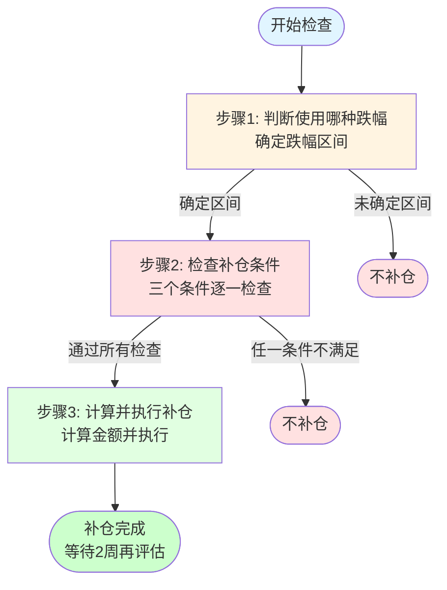
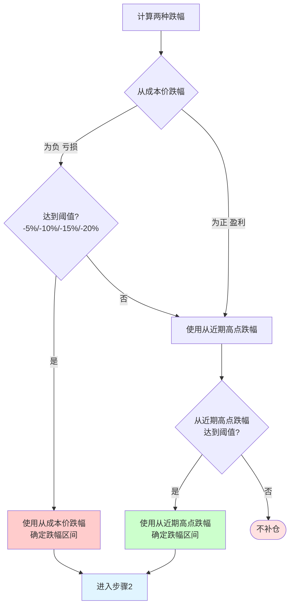
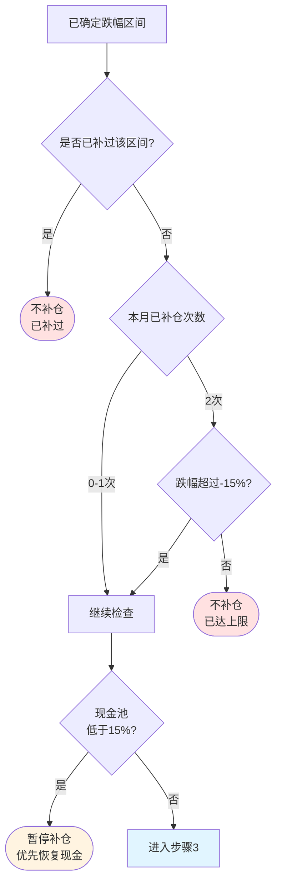
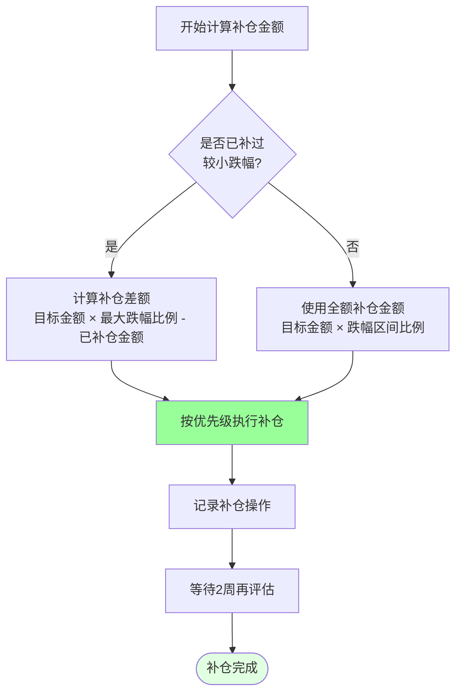

## 🎯 目标配置

**核心思路：内部均衡，整体分散**

| 资产类别        | ETF代码           | 目标比例 | 说明 |
| --------------- | ----------------- | -------- | ---- |
| 🇺🇸 美股成长核心 | 159941 纳指ETF    | 20%      | 全世界最有价值的公司，凭什么不敢买 |
| 🇺🇸 美股稳健底仓 | 513500 标普500ETF | 10%      | 美股稳健底仓，与纳指均衡配置 |
| 🇨🇳 科技成长     | 512480 半导体ETF   | 10%      | 国产替代，中国国策，长期看涨 |
| 🇨🇳 医药成长     | 159316 创新药ETF   | 10%      | 医药创新、估值修复 |
| 🇭🇰 港股互联网    | 513010 港股科技ETF | 15%      | 中国最有价值的一些基础设施互联网公司也就这几个了 |
| 🇨🇳 红利防御     | 520990 红利低波ETF | 10%      | 宇宙四大行/国家基础设施 |
| ₿ 虚拟资产       | BTC / ETH 定投     | 5%       | 链上金融的概念我很喜欢 |
| 💵 现金池        | —                 | 20%      | 预留补仓资金 + 心理安全垫（权益资产80%） |
| **合计**        | —                 | **100%** | 覆盖权益、红利、虚拟资产与现金 |

---

## 📅 定投策略

**执行时间：** 每月第三个周五，固定执行

**执行规则：**
- **金额**：根据月收入设定固定金额（建议月收入的30-50%）
- **分配方式**：按目标配置比例进行加权定投
- **原则**：无论市场涨跌，严格执行

**金额分配：**
- 纳指ETF：定投总额 × 20%
- 标普500ETF：定投总额 × 10%
- 半导体ETF：定投总额 × 10%
- 创新药ETF：定投总额 × 10%
- 港股科技ETF：定投总额 × 15%
- 红利低波ETF：定投总额 × 10%
- BTC/ETH：定投总额 × 5%

**说明：** 加权定投按目标配置比例分配，每次定投都向目标配置靠拢，长期定投后持仓比例会自动接近目标配置。

---

## 💰 补仓策略

### 检查频率

- **实时检查**：每天看盘时检查各持仓跌幅，达到阈值可立即补仓
- **固定检查**：每月第二、四个周五固定检查一次（补充检查）

### 触发条件

满足任一条件即可触发补仓：
1. **从成本价跌幅**：当前价格相对持仓成本价下跌达到阈值
2. **从近期高点跌幅**：当前价格相对最近3个月内的最高点下跌达到阈值

**时间维度说明：**
- **从成本价跌幅**：以持仓成本价为基准，无时间限制，反映整体盈亏情况
- **从近期高点跌幅**：以最近3个月内的最高价格为基准，每月更新一次，反映短期回调情况
- **优先使用"从成本价跌幅"**：更直观反映盈亏情况，作为主要判断依据
- **"从近期高点跌幅"作为补充**：当从成本价跌幅未达到阈值，但从近期高点跌幅达到阈值时，也可触发补仓

**时间维度控制规则：**
- **情况1：从成本价跌幅为负（亏损）**
  - 优先使用"从成本价跌幅"，更直观反映盈亏情况
  - 如果从成本价跌幅已达到-15%阈值，直接按-15%区间补仓（不考虑时间维度）
  - 如果从成本价跌幅未达到阈值，但从近期高点跌幅达到阈值，可按近期高点跌幅触发补仓
- **情况2：从成本价跌幅为正（盈利）**
  - 此时从成本价跌幅为正，无法触发补仓
  - **使用"从近期高点跌幅"作为补仓判断依据**
  - 如果从近期高点跌幅达到阈值（-5%、-10%、-15%、-20%），可以触发补仓
  - **核心逻辑**：即使整体盈利，但从高点回调时，仍可补仓降低成本
- **核心原则**：
  - 从成本价跌幅为负时，优先使用"从成本价跌幅"
  - 从成本价跌幅为正时，使用"从近期高点跌幅"
  - 两者都是负值时，取更有利于补仓的条件（跌幅更大的）

### 补仓规则

**目标金额 = 总资产 × 目标占比**

**补仓金额表：**

| 跌幅区间 | 补仓金额 | 说明 |
| -------- | -------- | ---- |
| -5% | 目标金额的5% | 一级补仓 |
| -10% | 目标金额的10% | 二级补仓 |
| -15% | 目标金额的15% | 三级补仓 |
| -20% | 目标金额的20% | 四级补仓 |

**跌幅区间判断与补仓金额：**

| 实际跌幅范围 | 判断区间 | 补仓金额（目标金额15万示例） | 说明 |
|------------|---------|---------------------------|------|
| 0% ~ -5% | 不补仓 | — | 未达到补仓阈值 |
| ≥ -5% 且 < -10% | -5%区间 | 7,500元（目标金额 × 5%） | 一级补仓 |
| ≥ -10% 且 < -15% | -10%区间 | 15,000元（目标金额 × 10%） | 二级补仓 |
| ≥ -15% 且 < -20% | -15%区间 | 22,500元（目标金额 × 15%） | 三级补仓 |
| ≥ -20% | -20%区间 | 30,000元（目标金额 × 20%） | 四级补仓 |

**补仓逻辑：**
- 跌幅区间采用**向下取整到最近阈值**的方式判断
- 每个跌幅区间（-5%、-10%、-15%、-20%）只补一次
- 如果已补过较小跌幅，跌到更大跌幅时，按差额补仓
- 补仓差额 = 目标金额 × 最大跌幅比例 - 已补仓金额
- **补仓时机**：达到或超过某个阈值时立即补仓，不等跌到下一个阈值

**补仓决策流程（三步法）：**

**流程总览：**
- **步骤1**：判断使用"从成本价跌幅"还是"从近期高点跌幅"，确定跌幅区间
- **步骤2**：检查三个补仓条件（是否已补过、补仓次数、现金池）
- **步骤3**：计算补仓金额并执行补仓操作

**步骤1：判断使用哪种跌幅**

**步骤2：检查补仓条件**

**步骤3：计算并执行补仓**

**完整决策链路说明：**

| 步骤 | 输入 | 关键判断 | 判断逻辑 | 输出 |
|------|------|---------|---------|------|
| **步骤1** | 当前价格、成本价、近期高点 | 使用哪种跌幅 | • 从成本价跌幅为负且达阈值 → 使用从成本价跌幅 • 从成本价跌幅为正 → 使用从近期高点跌幅 • 从成本价跌幅为负但未达阈值 → 检查从近期高点跌幅 | 确定跌幅区间（-5%/-10%/-15%/-20%）或结束 |
| **步骤2** | 已确定跌幅区间 | 是否满足补仓条件 | ① 是否已补过该区间？ ② 本月补仓次数是否超限？（0-1次允许，2次需跌幅>15%） ③ 现金池是否充足？（≥15%） | 通过所有检查或结束 |
| **步骤3** | 通过步骤2检查 | 计算并执行补仓 | ① 计算补仓金额（差额或全额） ② 按优先级执行补仓 ③ 记录操作并等待2周 | 补仓完成 |

**关键判断点说明：**

- **"是否已补过该区间"的判断**：
  - 需要维护补仓记录表，记录每个ETF在每个跌幅区间的补仓情况
  - 例如：纳指ETF在-5%区间已补仓 → 记录"纳指ETF -5%区间已补"
  - 如果再次跌到-7%（仍属于-5%区间），则不再补仓
  - 只有跌到-10%或更大跌幅时，才会触发新的补仓区间

- **"补仓差额"的计算**：
  - 如果之前在-5%区间补过5%（7,500元）
  - 现在跌到-10%区间，需要补到10%（15,000元）
  - 补仓差额 = 15,000 - 7,500 = 7,500元

**补仓示例（纳指ETF，目标金额15万元）：**

| 场景 | 实际跌幅 | 判断区间 | 已补仓金额 | 补仓金额 | 累计补仓 | 说明 |
|------|---------|---------|-----------|---------|---------|------|
| 场景1 | -5.0% | -5% | 0 | 15万 × 5% = 7,500元 | 7,500元 | 刚好达到-5%阈值 |
| 场景2 | -7.31% | -5% | 0 | 15万 × 5% = 7,500元 | 7,500元 | 超过-5%但未到-10%，按-5%区间补仓 |
| 场景3 | -10.0% | -10% | 7,500元 | 15万 × 10% - 7,500 = 7,500元 | 15,000元 | 达到-10%阈值，补齐到10%区间 |
| 场景4 | -12.5% | -10% | 7,500元 | 15万 × 10% - 7,500 = 7,500元 | 15,000元 | 超过-10%但未到-15%，补齐到10%区间 |
| 场景5 | -20.0% | -20% | 15,000元 | 15万 × 20% - 15,000 = 15,000元 | 30,000元 | 达到-20%阈值，补齐到20%区间 |

**关键说明：**
1. **场景2**：跌到-7.31%时，按-5%区间补仓5%（7,500元），不等跌到-10%再补
2. **场景3**：如果之前已在-7.31%时补过5%，现在跌到-10%，再补5%补齐到10%区间
3. **场景4**：如果之前已在-7.31%时补过5%，现在跌到-12.5%，再补5%补齐到10%区间（不是15%区间）
4. **场景5**：如果本月已补仓2次，但跌幅超过-15%，允许突破限制额外补仓1次

**盈利状态下的补仓示例（纳指ETF，目标金额15万元）：**
假设持仓成本价为1.0元/份，涨到1.5元后回调到1.2元：

| 场景 | 从成本价跌幅 | 从近期高点跌幅 | 判断区间 | 补仓金额 | 说明 |
|------|------------|--------------|---------|---------|------|
| 场景6 | +20%（盈利） | -20% | -20% | 15万 × 20% = 30,000元 | 虽然整体盈利20%，但从高点回调20%，按-20%区间补仓 |
| 场景7 | +15%（盈利） | -10% | -10% | 15万 × 10% = 15,000元 | 整体盈利15%，但从高点回调10%，按-10%区间补仓 |
| 场景8 | +10%（盈利） | -5% | -5% | 15万 × 5% = 7,500元 | 整体盈利10%，但从高点回调5%，按-5%区间补仓 |

**盈利状态下补仓的意义：**
- 即使整体盈利，但从高点回调时，仍可补仓进一步降低成本
- 通过补仓可以摊薄持仓成本，提高未来收益空间
- 这是"从近期高点跌幅"的核心应用场景

**盈利/亏损状态下的补仓逻辑：**
- **亏损状态**：优先使用"从成本价跌幅"，达到阈值则补仓；未达阈值则检查"从近期高点跌幅"
- **盈利状态**：使用"从近期高点跌幅"，达到阈值则补仓；未达阈值则不补仓

### 补仓优先级

1. **核心持仓**（纳指、标普、半导体）：优先补仓
2. **稳健持仓**（红利低波、创新药）：次优先
3. **成长持仓**（港股科技）：最后补仓

### 补仓纪律

- **频率限制**：正常情况下，单月单只ETF补仓不超过2次
- **极端情况突破**：跌幅超过-15%且本月已补仓2次，允许额外补仓1次
- **等待期**：补仓后需等待至少2周再评估
- **现金管理**：现金池低于15%时暂停补仓，优先恢复现金

---

## 🔄 再平衡策略

### 季度再平衡

**执行时间：** 每季度末（3月、6月、9月、12月最后一个交易日）

**检查规则：**
1. 计算各持仓的实际比例
2. 计算偏离目标比例的程度
3. 触发条件：偏离目标比例超过 ±5%

**再平衡方式：**
- 优先用新增资金买入偏离负方向的标的
- 不卖出已有持仓，只用新增资金调整

**示例：**
- 目标：纳指ETF 15%，实际 18%（偏离 +3%，未触发）
- 目标：纳指ETF 15%，实际 21%（偏离 +6%，触发）
- 操作：用新增资金优先买入其他偏离负方向的标的

### 年度评估

**执行时间：** 每年12月底

**评估内容：**
- 各ETF的年度表现
- 整体持仓结构是否合理

**调整原则：**
- 保持目标配置不变，除非有重大变化
- 如需调整，基于深入研究，而非短期热点

---

## 📋 执行清单

### 每月执行

- [ ] **每天看盘时**：检查各持仓跌幅，达到阈值可立即补仓
- [ ] 每月第二个周五：固定检查各持仓跌幅（补充检查）
- [ ] 每月第三个周五：执行基础定投
- [ ] 定投后：检查各持仓跌幅，判断是否需要补仓
- [ ] 每月第四个周五：固定检查各持仓跌幅（补充检查）
- [ ] 如需补仓：按优先级和规则执行补仓（遵守补仓纪律）
- [ ] 记录定投和补仓操作

### 每季度执行

- [ ] 季度末：检查各持仓比例
- [ ] 计算偏离目标比例的程度
- [ ] 如偏离超过±5%：用新增资金执行再平衡
- [ ] 记录再平衡操作

### 每年执行

- [ ] 12月底：全面评估持仓表现
- [ ] 检查目标配置是否需要调整
- [ ] 制定下一年度投资计划

---

## 🔧 关键计算公式

### 总资产计算

**总资产 = 权益资产 + 现金池**

- 权益资产：所有ETF持仓的市值总和
- 现金池：可用于补仓的现金

### 目标金额计算

**目标金额 = 总资产 × 目标占比**

**示例：**
- 总资产100万元
- 纳指ETF目标占比15% → 目标金额 = 100万 × 15% = 15万元

### 持仓成本价计算

**持仓成本价 = 累计买入金额 ÷ 累计买入份额**

- 累计买入金额：所有买入金额的总和
- 累计买入份额：所有买入份额的总和

### 近期高点判断

**近期高点 = 最近3个月内的最高价格**

- 记录每个ETF最近3个月内的最高价格
- 每月更新一次（每月第一个交易日更新）
- 用于计算"从近期高点跌幅"，作为补仓的辅助判断依据

### 跌幅计算

**从成本价跌幅 = (当前价格 - 持仓成本价) ÷ 持仓成本价 × 100%**

**从近期高点跌幅 = (当前价格 - 近期高点) ÷ 近期高点 × 100%**

**跌幅区间判断：**
- 实际跌幅向下取整到最近的阈值区间
- 阈值区间：-5%、-10%、-15%、-20%
- 示例：-7.31% → 按-5%区间处理；-12.5% → 按-10%区间处理

**时间维度控制：**
- **从成本价跌幅**：无时间限制，反映整体盈亏
  - 当为负值（亏损）时，优先使用
  - 当为正值（盈利）时，无法触发补仓，需使用"从近期高点跌幅"
- **从近期高点跌幅**：基于最近3个月高点，反映短期回调
  - 当从成本价跌幅为正（盈利）时，作为主要判断依据
  - 当从成本价跌幅为负但未达到阈值时，作为补充判断依据
- **补仓决策**：
  - 从成本价跌幅为负时，优先使用"从成本价跌幅"
  - 从成本价跌幅为正时，使用"从近期高点跌幅"
  - 两者都是负值时，取更有利于补仓的条件（跌幅更大的那个）

**时间维度示例：**
假设纳指ETF持仓成本价为100元，当前价格为85元：
- **从成本价跌幅** = (85 - 100) ÷ 100 × 100% = -15%
- **从近期高点跌幅**：假设最近3个月最高价为90元，则 = (85 - 90) ÷ 90 × 100% = -5.56%
- **补仓决策**：优先使用"从成本价跌幅"-15%，按-15%区间补仓（目标金额的15%）
- **说明**：即使最近1个月只跌了5.56%，但从成本价已跌15%，应按-15%区间补仓，不考虑时间维度

**另一种情况（从成本价未达到阈值）：**
假设纳指ETF持仓成本价为100元，当前价格为96元：
- **从成本价跌幅** = (96 - 100) ÷ 100 × 100% = -4%（未达到-5%阈值）
- **从近期高点跌幅**：假设最近3个月最高价为105元，则 = (96 - 105) ÷ 105 × 100% = -8.57%
- **补仓决策**：从成本价跌幅未达到阈值，但从近期高点跌幅达到-5%区间，可按-5%区间补仓
- **说明**：这种情况下，可以用"从近期高点跌幅"作为补充判断依据

**盈利状态下的补仓（关键场景）：**
假设纳指ETF持仓成本价为1.0元，涨到1.5元后回调到1.2元：
- **从成本价跌幅** = (1.2 - 1.0) ÷ 1.0 × 100% = +20%（盈利20%，无法触发补仓）
- **从近期高点跌幅**：假设1.5元是最近3个月最高价，则 = (1.2 - 1.5) ÷ 1.5 × 100% = -20%
- **补仓决策**：虽然整体盈利20%，但从高点回调了20%，按-20%区间补仓（目标金额的20%）
- **说明**：即使整体盈利，但从高点回调时，仍可补仓降低成本，这是"从近期高点跌幅"的核心应用场景
- **补仓意义**：通过补仓可以进一步降低持仓成本，提高未来收益空间

---

## 🔍 策略要点

### 核心原则

1. **纪律性**：严格执行基础定投，每月第三个周五固定执行
2. **简单性**：保持策略简单，减少执行成本
3. **长期性**：保持长期持有，避免频繁交易
4. **分散性**：地域分散（美股、A股、港股）、行业分散

### 量化指标

- **定投频率**：每月1次（每月第三个周五）
- **定投金额**：月收入的30-50%
- **补仓阈值**：-5%、-10%、-15%、-20%
- **补仓检查**：每天看盘时实时检查 + 每月第二、四个周五固定检查
- **再平衡阈值**：偏离目标比例 ±5%
- **现金池下限**：15%（低于此值暂停补仓）

### 风险控制

- **现金管理**：保持充足现金池（目标20%，最低15%）
- **分散投资**：地域分散（美股、A股、港股）、行业分散
- **纪律执行**：严格按照规则执行，避免情绪化操作

---

> **免责声明**：本文仅为个人投资思路分享，不构成任何投资建议。投资有风险，入市需谨慎。请根据自身情况，谨慎决策。
