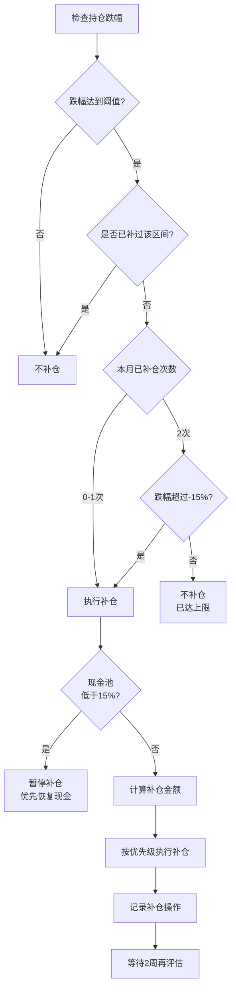

## 🎯 目标配置

**核心思路：内部均衡，整体分散**

| 资产类别        | ETF代码           | 目标比例 | 说明 |
| --------------- | ----------------- | -------- | ---- |
| 🇺🇸 美股成长核心 | 159941 纳指ETF    | 15%      | 全世界最有价值的公司，凭什么不敢买 |
| 🇺🇸 美股稳健底仓 | 513500 标普500ETF | 10%      | 美股稳健底仓，与纳指均衡配置 |
| 🇨🇳 科技成长     | 512480 半导体ETF   | 10%      | 国产替代，中国国策，长期看涨 |
| 🇨🇳 医药成长     | 159316 创新药ETF   | 10%      | 医药创新、估值修复 |
| 🇭🇰 港股互联网    | 513010 港股科技ETF | 5%       | 中国最有价值的一些基础设施互联网公司也就这几个了 |
| 🇭🇰 港股周期金融  | 513090 香港证券ETF | 5%       | 稳定币法案、券商周期反弹逻辑 |
| 🇭🇰 港股消费      | 159265 香港消费ETF | 5%       | 泡泡玛特/安踏 |
| 🇨🇳 红利防御     | 520990 红利低波ETF | 10%      | 宇宙四大行/国家基础设施 |
| ₿ 虚拟资产       | BTC / ETH 定投     | 5%       | 链上金融的概念我很喜欢 |
| 💵 现金池        | —                 | 25%      | 预留补仓资金 + 心理安全垫（权益资产75%） |
| **合计**        | —                 | **100%** | 覆盖权益、红利、虚拟资产与现金 |

---

## 📅 定投策略

**执行时间：** 每月第三个周五，固定执行

**执行规则：**
- **金额**：根据月收入设定固定金额（建议月收入的30-50%）
- **分配方式**：按目标配置比例进行加权定投
- **原则**：无论市场涨跌，严格执行

**金额分配：**
- 纳指ETF：定投总额 × 15%
- 标普500ETF：定投总额 × 10%
- 半导体ETF：定投总额 × 10%
- 创新药ETF：定投总额 × 10%
- 港股科技ETF：定投总额 × 5%
- 香港证券ETF：定投总额 × 5%
- 香港消费ETF：定投总额 × 5%
- 红利低波ETF：定投总额 × 10%
- BTC/ETH：定投总额 × 5%

**说明：** 加权定投按目标配置比例分配，每次定投都向目标配置靠拢，长期定投后持仓比例会自动接近目标配置。

---

## 💰 补仓策略

### 检查频率

- **实时检查**：每天看盘时检查各持仓跌幅，达到阈值可立即补仓
- **固定检查**：每月第二、四个周五固定检查一次（补充检查）

### 触发条件

满足任一条件即可触发补仓：
1. **从成本价跌幅**：当前价格相对持仓成本价下跌达到阈值
2. **从近期高点跌幅**：当前价格相对最近3个月内的最高点下跌达到阈值

**说明：** 优先使用"从成本价跌幅"，更直观反映盈亏情况。

### 补仓规则

**目标金额 = 总资产 × 目标占比**

**补仓金额表：**

| 跌幅区间 | 补仓金额 | 说明 |
| -------- | -------- | ---- |
| -5% | 目标金额的5% | 一级补仓 |
| -10% | 目标金额的10% | 二级补仓 |
| -15% | 目标金额的15% | 三级补仓 |
| -20% | 目标金额的20% | 四级补仓 |

**补仓逻辑：**
- 每个跌幅区间（-5%、-10%、-15%、-20%）只补一次
- 如果已补过较小跌幅，跌到更大跌幅时，按差额补仓
- 补仓差额 = 目标金额 × 最大跌幅比例 - 已补仓金额

**补仓决策流程：**

**补仓示例（纳指ETF，目标金额15万元）：**

| 场景 | 跌幅 | 已补仓金额 | 补仓金额 | 累计补仓 |
|------|------|-----------|---------|---------|
| 场景1 | -5% | 0 | 15万 × 5% = 7,500元 | 7,500元 |
| 场景2 | -10% | 7,500元 | 15万 × 10% - 7,500 = 7,500元 | 15,000元 |
| 场景3 | -20% | 15,000元 | 15万 × 20% - 15,000 = 15,000元 | 30,000元 |

**说明：** 场景3中，如果本月已补仓2次，但跌幅超过-15%，允许突破限制额外补仓1次。

### 补仓优先级

1. **核心持仓**（纳指、标普、半导体）：优先补仓
2. **稳健持仓**（红利低波、创新药）：次优先
3. **成长持仓**（港股科技、证券、消费）：最后补仓

### 补仓纪律

- **频率限制**：正常情况下，单月单只ETF补仓不超过2次
- **极端情况突破**：跌幅超过-15%且本月已补仓2次，允许额外补仓1次
- **等待期**：补仓后需等待至少2周再评估
- **现金管理**：现金池低于15%时暂停补仓，优先恢复现金

---

## 🔄 再平衡策略

### 季度再平衡

**执行时间：** 每季度末（3月、6月、9月、12月最后一个交易日）

**检查规则：**
1. 计算各持仓的实际比例
2. 计算偏离目标比例的程度
3. 触发条件：偏离目标比例超过 ±5%

**再平衡方式：**
- 优先用新增资金买入偏离负方向的标的
- 不卖出已有持仓，只用新增资金调整

**示例：**
- 目标：纳指ETF 15%，实际 18%（偏离 +3%，未触发）
- 目标：纳指ETF 15%，实际 21%（偏离 +6%，触发）
- 操作：用新增资金优先买入其他偏离负方向的标的

### 年度评估

**执行时间：** 每年12月底

**评估内容：**
- 各ETF的年度表现
- 整体持仓结构是否合理

**调整原则：**
- 保持目标配置不变，除非有重大变化
- 如需调整，基于深入研究，而非短期热点

---

## 📋 执行清单

### 每月执行

- [ ] **每天看盘时**：检查各持仓跌幅，达到阈值可立即补仓
- [ ] 每月第二个周五：固定检查各持仓跌幅（补充检查）
- [ ] 每月第三个周五：执行基础定投
- [ ] 定投后：检查各持仓跌幅，判断是否需要补仓
- [ ] 每月第四个周五：固定检查各持仓跌幅（补充检查）
- [ ] 如需补仓：按优先级和规则执行补仓（遵守补仓纪律）
- [ ] 记录定投和补仓操作

### 每季度执行

- [ ] 季度末：检查各持仓比例
- [ ] 计算偏离目标比例的程度
- [ ] 如偏离超过±5%：用新增资金执行再平衡
- [ ] 记录再平衡操作

### 每年执行

- [ ] 12月底：全面评估持仓表现
- [ ] 检查目标配置是否需要调整
- [ ] 制定下一年度投资计划

---

## 🔧 关键计算公式

### 总资产计算

**总资产 = 权益资产 + 现金池**

- 权益资产：所有ETF持仓的市值总和
- 现金池：可用于补仓的现金

### 目标金额计算

**目标金额 = 总资产 × 目标占比**

**示例：**
- 总资产100万元
- 纳指ETF目标占比15% → 目标金额 = 100万 × 15% = 15万元

### 持仓成本价计算

**持仓成本价 = 累计买入金额 ÷ 累计买入份额**

- 累计买入金额：所有买入金额的总和
- 累计买入份额：所有买入份额的总和

### 近期高点判断

**近期高点 = 最近3个月内的最高价格**

- 记录每个ETF最近3个月内的最高价格
- 每月更新一次

---

## 🔍 策略要点

### 核心原则

1. **纪律性**：严格执行基础定投，每月第三个周五固定执行
2. **简单性**：保持策略简单，减少执行成本
3. **长期性**：保持长期持有，避免频繁交易
4. **分散性**：地域分散（美股、A股、港股）、行业分散

### 量化指标

- **定投频率**：每月1次（每月第三个周五）
- **定投金额**：月收入的30-50%
- **补仓阈值**：-5%、-10%、-15%、-20%
- **补仓检查**：每天看盘时实时检查 + 每月第二、四个周五固定检查
- **再平衡阈值**：偏离目标比例 ±5%
- **现金池下限**：15%（低于此值暂停补仓）

### 风险控制

- **现金管理**：保持充足现金池（目标25%，最低15%）
- **分散投资**：地域分散（美股、A股、港股）、行业分散
- **纪律执行**：严格按照规则执行，避免情绪化操作

---

> **免责声明**：本文仅为个人投资思路分享，不构成任何投资建议。投资有风险，入市需谨慎。请根据自身情况，谨慎决策。
